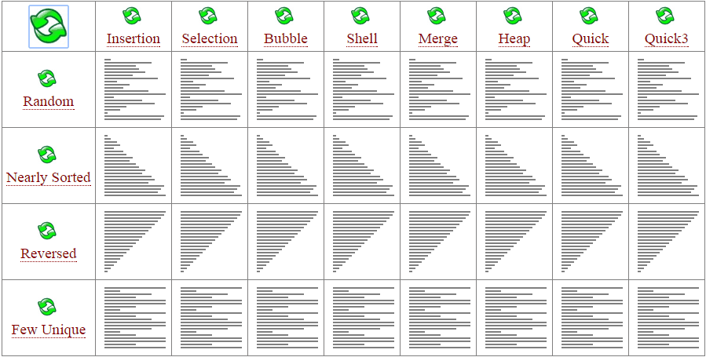
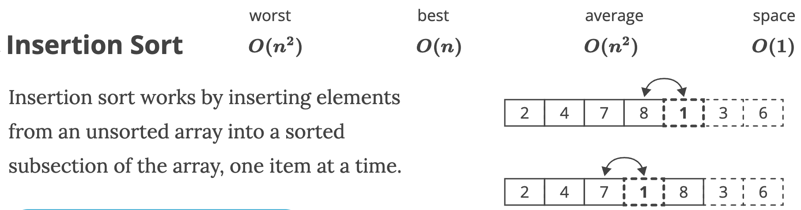
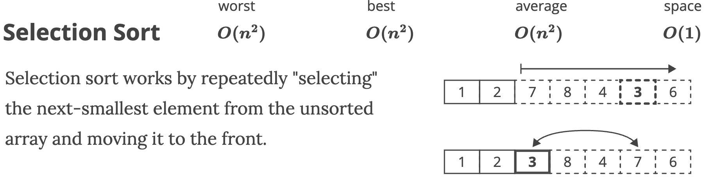
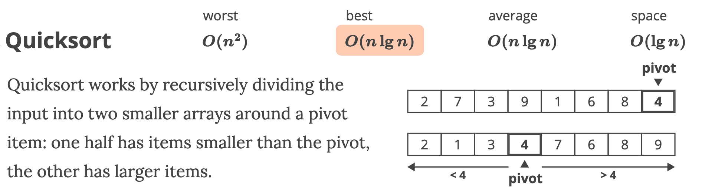
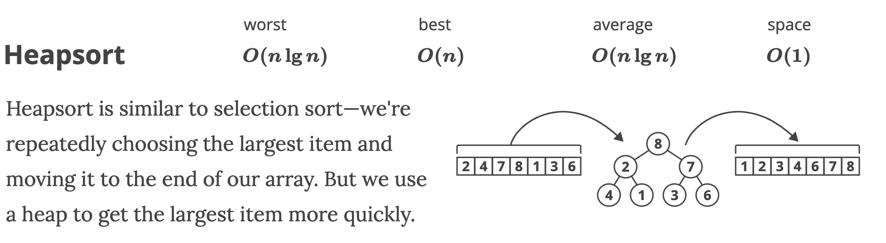
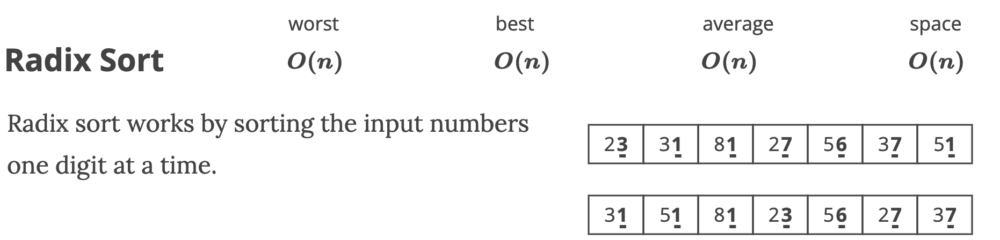
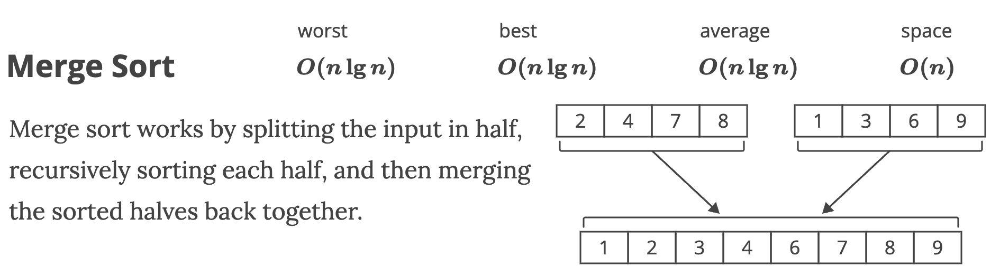

<style>
details > summary {
  padding: 4px;
  width: 100px;
  background-color: #3c3d3c;
  border: none;
  box-shadow: 1px 1px 2px #101010;
  cursor: pointer;
}
</style>


<br/>

# **💻 Data Structures and Algorithms in Python**
Blind 75 questions, coding patterns and in-depth solutions for FAANG coding interviews.
#### 📖 Author: `Ken Yew Piong`
#### 📆 Last Modified:  
<a href="https://github.com/KenYew">
  
</a>
<a href="https://gitlab.com/KenYew">
  
</a>

---
# <div id='toc'/> 📋 **Table of Contents** 
1. ### [⚡️ **Quick Notes**](#quicknotes)
1. ### [🎹 **Arrays**](#arrays)
1. ### [🔢 **Matrix**](#matrix)
1. ### [⏱ **Intervals**](#intervals)
1. ### [🔤 **Strings**](#strings)
1. ### [📝 **Linked Lists**](#linkedlists)
1. ### [📈 **Graphs**](#graphs) 
1. ### [🎄 **Trees**](#trees)
1. ### [🌲 **Binary Search Trees**](#bst)
1. ### [📚 **Sorting Algorithms**](#sort)
1. ### [🔎 **Search Algorithms**](#search)
1. ### [🧠 **Famous Algorithms**](#algorithms)
1. ### [🥞 **Stacks**](#stacks)
1. ### [🏔 **Heaps**](#heaps)
1. ### [📱 **Dynamic Programming**](#dp)
1. ### [♽ **Recursion**](#recursion)
1. ### [⚡️ **Binaries**](#binaries)

---
## 📱 [Coding Patterns](https://seanprashad.com/leetcode-patterns/)
#### 🎹 **If input array is sorted:**
- `Binary search`
- `Two pointers`

#### 🔢 **If asked for all permutations/subsets:**
- `Backtracking`

#### 🎄 **If given a tree:**
- `DFS`
- `BFS`

#### 📈 **If given a graph:**
- `DFS`
- `BFS`

#### 📝 **If given a linked list:**
- `Two pointers`

#### ♽ **If recursion is banned:**
- `Stack`

#### 🔎 **If must solve in-place:**
- `Swap corresponding values`
- `Store one or more different values in the same pointer`

#### 🎹 **If asked for maximum/minumum subarray/subset/options:**
- `Dynamic programming`

#### 📚 **If asked for top/least K items:**
- `Heap`

#### 🔤 **If asked for common strings:**
- `Map`
- `Trie`

#### 📱 **Else**
- `Map/Set for O(1) time & O(n) space`
- `Sort input for O(nlogn) time and O(1) space`

### 🔑 [Keywords to Algorithms](https://algo.monster/problems/keyword_to_algo)

---

# <div id='quicknotes'/> ⚡️ **Quick Notes**
#### [📋 **Back to Table of Contents**](#toc)
---
#### 📝 Linked List Traversal
##### To perform head to tail computations
```python
# 1: While currentNode pointer has not fully traversed to the None end of the linked list
while currentNode is not None:

# 2: Perform forwardtracking computations
doSomething()

# 3: Traverse to the next node of the linked list
currentNode = currentNode.next

# OR: Perform manipulation of node connections
currentNode.next = nextDistinctNode # Skipping a node
currentNode = nextDistinctNode

next = currentNode.next
currentNode.next = previousNode # Reversing a node
previousNode = currentNode
currentNode = next
```

#### ♽ Recursive DFS
##### To perform root to leaf computations
```python
# 1: Base edge case to break the depth first search when we have arrived None child nodes of the leaf node
if node is None:
    return

# 2: Perform forwardtracking computations
doSomething()

# 3: When reaching a leaf node
if node.left is None and node.right is None:
    returnLeafNodeAnswer

# 4: Recursive function call to traverse down the tree and passing computed values down
recursiveFunction(node.left, informationToPassDown, answer)
recursiveFunction(node.right, informationToPassDown, answer)
```
##### To perform leaf to root computations
```python
# 1: Base edge case to break the depth first search when we have arrived None child nodes of the leaf node
if node is None:
    return

# 2: Recursive function call to traverse down the tree
informationToPassDown, answer = recursiveFunction(node.left)
informationToPassDown, answer = recursiveFunction(node.right)

# 3: Perform backtracking computations
doSomething()

# 4: Return information to pass down during recursion
return (informationToPassDown, answer)
```
#### 📚 Stack DFS
##### To perform root to leaf computations
```python
# 1: Initialise a stack with root node
stack = [root]

# 2: Iterate all elements of the stack in LIFO order
while len(stack) > 0: 
    node = stack.pop() # Pop the top-most element 

# 3: Base edge case to break the depth first search when we have arrived None child nodes of the leaf node
if node is None:
    return

# 4: Perform forwardtracking computations
doSomething()

# 5: Push child nodes to stack to traverse down the tree
stack.append(node.left)
stack.append(node.right)
```

#### 🌲 Queue BFS

##### To perform root to leaf computations
```python
# 1: Initialise a queue with root node
queue = [root]

# 2: Iterate all elements of the queue in FIFO order
while len(queue) > 0: 
    node = queue.pop(0) # Pop the bottom-most element 

# 3: Base edge case to break the depth first search when we have arrived None child nodes of the leaf node
if node is None:
    return

# 4: Perform forwardtracking computations
doSomething()

# 5: Push child nodes to queue to traverse down the tree
queue.append(node.left)
queue.append(node.right)
```

---
# <div id='arrays'/> 🎹 **Arrays**

#### Blind 75
- ✅ Two Sum - https://leetcode.com/problems/two-sum/
- ✅ Best Time to Buy and Sell Stock - https://leetcode.com/problems/best-time-to-buy-and-sell-stock/
- ✅ Contains Duplicate - https://leetcode.com/problems/contains-duplicate/
- ✅ Product of Array Except Self - https://leetcode.com/problems/product-of-array-except-self/
- ✅ Maximum Subarray - https://leetcode.com/problems/maximum-subarray/
- Maximum Product Subarray - https://leetcode.com/problems/maximum-product-subarray/
- Find Minimum in Rotated Sorted Array - https://leetcode.com/problems/find-minimum-in-rotated-sorted-array/
- Search in Rotated Sorted Array - https://leetcode.com/problems/search-in-rotated-sorted-array/
- ✅ 3Sum - https://leetcode.com/problems/3sum/
- Container With Most Water - https://leetcode.com/problems/container-with-most-water/

#### LeetCode Patterns
- `217` Contains Duplicate - https://leetcode.com/problems/contains-duplicate/
- `268` Missing Number - https://leetcode.com/problems/missing-number/
- `448` Find All Numbers Disappeared in an Array - https://leetcode.com/problems/find-all-numbers-disappeared-in-an-array/
- `136` Single Number - https://leetcode.com/problems/single-number/
- `2022` Convert 1D Array Into 2D Array - https://leetcode.com/problems/convert-1d-array-into-2d-array/
- ✅ `238` Product of Array Except Self - https://leetcode.com/problems/product-of-array-except-self/
- `287` Find the Duplicate Number - https://leetcode.com/problems/find-the-duplicate-number/
- `442` Find All Duplicates in an Array - https://leetcode.com/problems/find-all-duplicates-in-an-array/
- `73` Set Matrix Zeroes - https://leetcode.com/problems/set-matrix-zeroes/
- `54` Spiral Matrix - https://leetcode.com/problems/spiral-matrix/
- `48` Rotate Image - https://leetcode.com/problems/rotate-image/
- `128` Longest Consecutive Sequence - https://leetcode.com/problems/longest-consecutive-sequence/
- `41` First Missing Positive - https://leetcode.com/problems/first-missing-positive/
#### [📋 **Back to Table of Contents**](#toc)

---
## [🟩 Two Sum](https://leetcode.com/problems/two-sum/)
> Given an array of integers nums and an integer target, return indices of the two numbers such that they add up to target.
- [x] Input: `nums = [2, 7, 11, 15], target = 9`
- [x] Output: `[0, 1]`
- [x] Explanation: `Because nums[0] + nums[1] == 9, we return [0, 1].`
<details><summary><b>Solution</b></summary>
<p>

### **Brute Force**
```python
# O(n^2) Time | O(1) Space
def TwoSums(array, target):
    for i in range(len(array) - 1): 
        firstNum = array[i]
        for j in range(i + 1, len(array)):
            secondNum = array[j]
            if firstNum + secondNum == targetSum:
                return [firstNum, secondNum]
    return []
```

### **Hash Table**
```python
# O(n) time | O(n) space
def twoNumberSum(array, target): 
	nums = {}
	for num in array: 
		potentialMatch = target - num
		if potentialMatch in nums: 
			return [potentialMatch, num]
		else:
			nums[num] = True
	return []
```
</p>
</details>

✅ **HASH TABLE:** _Use hash table to instantly check for difference value, map will add index of last occurrence of a num, don’t use same element twice_

<details><summary><b>Solution</b></summary>
<p>

### **Two Pointers**
```python
# O(nlogn) Time | O(1) Space
def TwoSums(array, target):
    left = 0
    right = len(array) - 1
    array.sort()
    while (left < right):
        sum = array[left] + array[right]
        if sum > target:
            right -= 1
        elif sum < target:
            left += 1
        elif sum == target:
            return [array[left], array[right]]
    return -1 
```
</p>
</details>

✅ **TWO POINTERS:** _Sort the array, use two pointers on each end of the array and move pointers based on comparison between sum and targetNum_


---
## [🟩 Maximum Subarray](https://leetcode.com/problems/maximum-subarray/)
>* Given an integer array nums, find the contiguous subarray (containing at least one number) which has the largest sum and return its sum.
>* A subarray is a contiguous part of an array.

- [x] Input: `nums = [-2,1,-3,4,-1,2,1,-5,4]`
- [x] Output: `6`
- [x] Explanation: `[4,-1,2,1] has the largest sum = 6.`
<details><summary><b>Solution</b></summary>
<p>

### **Kadane's Algorithm** 
```python
# O(n) Time | O(1) Space
def maximumSubarraySum(self, arr):
    # 1: Initialise maxSum and currentSum
    maxSum = float("-inf")
    currentSum = 0

    # 2: Traverse through each value in the input array
    for val in arr:
        # 3: Add the new value of the current element to our currentSum
        currentSum = currentSum + val
        # 4: If currentSum is bigger than maxSum, update maxSum with the new bigger number from currentSum
        if currentSum > maxSum:
            maxSum = currentSum
        # 5: If currentSum is less than zero, update currentSum to zero
        if currentSum < 0:
            currentSum = 0
    return maxSum
```
</p>
</details>

---
## [🟩 Best Time to Buy and Sell Stock](https://leetcode.com/problems/best-time-to-buy-and-sell-stock/)
>* You are given an array prices where `prices[i]` is the price of a given stock on the ith day.
>* You want to maximize your profit by choosing a single day to buy one stock and choosing a different day in the future to sell that stock.
>* Return the maximum profit you can achieve from this transaction. If you cannot achieve any profit, return 0.

- [x] Input: `prices = [7,1,5,3,6,4]`
- [x] Output: `5`
- [x] Explanation: 
  - `Buy on day 2 (price = 1) and sell on day 5 (price = 6), profit = 6-1 = 5.`
  - `Note that buying on day 2 and selling on day 1 is not allowed because you must buy before you sell.`

<br/>
The points of interest are the peaks and valleys in the given graph. We need to find the largest peak following the smallest valley. We can maintain two variables - minprice and maxprofit corresponding to the smallest valley and maximum profit (maximum difference between selling price and minprice) obtained so far respectively.
<details><summary><b>Solution</b></summary>
<p>

### **Kadane's Algorithm**
```python
# O(n) Time | O(1) Space
def maxProfit(prices):
    minPrice = float("inf")
    maxProfit = 0
    
    for price in prices: 
        if price < minPrice:
            minPrice = price
        elif price - minPrice > maxProfit:
            maxProfit = price - minPrice
    return maxProfit

# Kadane's Algorithm
# O(n) Time | O(1) Space
def maxProfit(prices):
    if len(prices) < 1:
        return 0
    
    minPrice = prices[0]
    maxProfit = 0
    for price in prices:
        minPrice = min(minPrice, price)
        profit = price - minPrice
        maxProfit = max(maxProfit, profit)
    return maxProfit
```
</p>
</details>

---
## [🟩 Contains Duplicate](https://leetcode.com/problems/contains-duplicate/)
> Given an integer array `nums`, return `true` if any value appears **at least twice** in the array, and return `false` if every element is distinct.
- [x] Input: `nums = [1,2,3,1]`
- [x] Output: `true`
<details><summary><b>Solution</b></summary>
<p>

### **Brute Force**
```python
# O(n^2) Time | O(1) Space - where n is the length of the input
def containsDuplicate(nums):
    for i in range(len(nums)):
        currentValue = nums[i]
        for j in range(i + 1, len(nums)):
            valueToCompare = nums[j]
            if currentValue == valueToCompare:
                return True
    return False
```
### **Hash Set**
```python
# O(n) Time | O(n) Space - where n is the length of the input
def containsDuplicate(nums):
    seen = set() # create a set which is an unordered collection of UNIQUE items
    for num in nums: # for every num in nums, we add to the set
        if num in seen: # but if we already find that num in the set, then we have a duplicate!
            return True
        seen.add(num)
    return False
```

### **Space Optimized**
```python
# O(n) Time | O(1) Space - where n is the length of the input
def containsDuplicate(nums):
    for num in nums: 
        absNum = abs(num)
        if nums[absNum - 1] < 0:
            return absNum
        nums[absNum - 1] *= -1
    return -1
```
### **One-Liner**
```python
# One-liner solution
def containsDuplicate(self, nums):
    return len(nums) > len(set(nums))
```
</p>
</details>

✅ **HASH SET:** _Use hash set to add and keep track of unique values in array, if value is seen in hash set, we found our duplicate_

---
## [🟩 Sorted Squared Array](https://www.algoexpert.io/questions/Sorted%20Squared%20Array)
>* Write a function that takes in a non-empty array of integers that are sorted in ascending order.
>* Return a new array of the same length with the squares of the original integers also sorted in ascending order.
- [x] Input: `array = [1, 2, 3, 5, 6, 8, 9]`
- [x] Output: `[1, 4, 9, 25, 36, 64, 81]`
<details><summary><b>Solution</b></summary>
<p>

### **Two Pointers**
```python
# O(n) Time | O(n) Space - where n is the length of the input array
def sortedSquaredArray(array):
    # 1: Initialise output array of size input array with dummy values
    ans = [0 for _ in array]
    # 2: Initialise two pointers on each end of the array
    left, right = 0, len(array) - 1
    # 3: Traversing idx pointer from end to beginning of the array because we want to write the largest to the smallest values
    for idx in reversed(range(len(array))): 
        # 4: If abs(left-most value) is > abs(right-most value) e.g.: [-4, 1, 2]
        if abs(array[left]) > abs(array[right]):
            # 5: Insert the square of the largest value at the current iteration idx (from n-th to 0)
            ans[idx] = array[left] * array[left]
            # 6: Then, increment the left pointer
            left += 1
        # 7: Else if abs(right-most value) is >= abs(left-most value) e.g.: [1, 2, 3]
        else: 
            # 8: Insert the square of the largest value at the current iteration idx (from n-th to 0)
            ans[idx] = array[right] * array[right]
            # 9: Then, decrement the right pointer
            right -= 1
    # 10: Finally, return the sorted squared array
    return ans
```
</p>
</details>

✅ **TWO POINTERS:** _Initialise output array with 0's, and left and right pointers on each end of array. Traverse idx from end to beginning of the array, if abs(leftVal) > abs(rightVal), write the ans[idx] = leftVal ** 2 and increment left, else abs(rightVal) >= abs(leftVal), write the ans[idx] = rightVal **2 and decrement right._

---
## [🟨 Validate Subsequence](https://www.algoexpert.io/questions/Validate%20Subsequence)
>* Given two non-empty arrays of integers, write a function that determines whether the second array is a subsequence of the first one.
>* A subsequence of an array is a set of numbers that aren't necessarily adjacent in the array but that are in the same order as they appear in the array. 
>* For instance, the numbers `[1, 3, 4]` form a subsequence of the array `[1, 2, 3, 4]`, and so do
the numbers `[2, 4]`. 
>* Note that a single number in an array and the array itself are both valid subsequences of the array.
- [x] Input: `array = [5, 1, 22, 25, 6, -1, 8, 10], sequence = [1, 6, -1, 10]`
- [x] Output: `true`
<details><summary><b>Solution</b></summary>
<p>

### **Two Pointers**
```python
# O(n) Time | O(1) Space - where n is the length of the array
def isValidSubsequence(array, sequence):
    # 1: Initialise pointers for both the input array and input sequence
    arrIdx = 0
    seqIdx = 0
    
    # 2: While we have not finished traversing both the input array and input sequence,
    while arrIdx < len(array) and seqIdx < len(sequence):
        
        # 3: If the current values in both array and seq match, increment the seqIdx to look for the next pair of equal numbers
        if array[arrIdx] == sequence[seqIdx]:
            seqIdx += 1

        # 4: Otherwise, increment arrIdx and keep traversing the array to look for next pair of equal numbers
        arrIdx += 1

    # 5: Once we have incremented seqIdx enough times, return the Boolean answer of whether the sequence is valid (only if seqIdx == len(sequence))
    return seqIdx == len(sequence)
```
</p>
</details>

✅ **TWO POINTERS:** _Initialise pointer for both input arrays (arr, seq). While both pointers have not fully traversed their arrays, if values from both array match, increment seqIdx, otherwise keep incrementing arrIdx. Return Boolean logic seqIdx == len(sequence)_

---
## [🟨 Array Of Products](https://www.algoexpert.io/questions/Array%20Of%20Products)
>* Write a function that takes in a non-empty array of integers and returns an array of the same length, where each element in the output array is equal to the product of every other number in the input array.
>* In other words, the value at `output [i]` is equal to the product of every number in the input array other than `input[i]`.
>* Note that you're expected to solve this problem without using division.
- [x] Input: `array = [5, 1, 4, 2]`
- [x] Output: `[8, 40, 10, 20]`
- [x] Explanation:
```python
8 is equal to 1 x 4 x 2
40 is equal to 5 x 4 x 2
10 is equal to 5 x 1 x 2
20 is equal to 5 x 1 x 4
```
<details><summary><b>Solution</b></summary>
<p>

### **Brute Force**
```python
# O(n^2) Time | O(n) Space - where n is the length of the input array
def arrayOfProducts(array):
    result = []
    for i in range(len(array)):
        product = 1
        for j in range(len(array)):
            if i != j: 
                product *= array[j] 
        result.append(product)
    return result
```
### **Two Pointers - Less Optimised**
```python
# O(n) Time | O(n) Space - where n is the length of the input array
def arrayOfProducts(array):
    """
     *---L---->
    [5, 1, 4, 2]
    leftProducts = [1, 5, 5, 20]
     <---R----*
    [5, 1, 4, 2]
    rightProducts = [8, 8, 2, 1]
    products = [8, 40, 10, 20]
    """
    # 1: Initialise products arrays with 1s and size equals to input array
    products = [1 for _ in range(len(array))]
    leftProducts = [1 for _ in range(len(array))]
    rightProducts = [1 for _ in range(len(array))]
    
    # 2: Initialise leftRunningProduct = 1 to enable multiplication of running products from left to right
    leftRunningProduct = 1
    # 3: Loop through each element from left to right,
    for idx in range(len(array)): 
        # 4: Set the values of the leftProducts array with the leftRunningProduct value
        leftProducts[idx] = leftRunningProduct
        # 5: Multiplying up each element from left to right in a leftRunningProduct variable
        leftRunningProduct *= array[idx]

    # 6: Initialise rightRunningProduct = 1 to enable multiplication of running products from right to left
    rightRunningProduct = 1
    # 7: Loop through each element from right to left,
    for idx in reversed(range(len(array))): 
        # 8: Set the values of the rightProducts array with the rightRunningProduct value
        rightProducts[idx] = rightRunningProduct
        # 9: Multiplying up each element from right to left in a rightRunningProduct variable
        rightRunningProduct *= array[idx]
        
    # 10: Loop through each element from left to right,
    for idx in range(len(array)): 
        # 11: Multiply the elements of both leftProducts and rightProducts arrays
        products[idx] = leftProducts[idx] * rightProducts[idx]

    return products
```
### **Two Pointers - Optimised**
```python
# O(n) Time | O(n) Space - where n is the length of the input array
def arrayOfProducts(array):
    """
     *---L---->
    [5, 1, 4, 2]
    products = [1, 5, 5, 20]
     <---R----*
    [5, 1, 4, 2]
    products = [8, 40, 10, 20]
    """
    # 1: Initialise products array with 1s and size equals to input array
    products = [1 for _ in range(len(array))]
    
    # 2: Initialise leftRunningProduct = 1 to enable multiplication of running products from left to right
    leftRunningProduct = 1
    # 3: Loop through each element from left to right,
    for idx in range(len(array)):
        # 4: Set the values of each element in the answer array with the leftRunningProduct value
        products[idx] = leftRunningProduct
        # 5: Multiplying up each element from left to right in a leftRunningProduct variable
        leftRunningProduct *= array[idx]
        
    # 6: Initialise rightRunningProduct = 1 to enable multiplication of running products from right to left
    rightRunningProduct = 1
    # 7: Loop through each element from right to left,
    for idx in reversed(range(len(array))): 
        # 8: Set the values of each element in the answer array with the rightRunningProduct value
        products[idx] *= rightRunningProduct
        # 9: Multiplying up each element from right to left in a rightRunningProduct variable
        rightRunningProduct *= array[idx]
        
    return products
```
</p>
</details>

✅ **TWO POINTERS:** 
- Initialise the result array with 1s and equal to the size of the input array. 
- Starting with leftRunningProduct = 1, loop through each element of the input array from left to right, setting each element of the result array with leftRunningProduct as leftRunningProduct multiplies up each element from left to right. 
- Starting with rightRunningProduct = 1, loop through each element of the input array from right to left, multiplying each element of the result array with rightRunningProduct as rightRunningProduct multiplies up each element from right to left. 
- Return the result array.

---
## [🟨 Smallest Difference](https://www.algoexpert.io/questions/Smallest%20Difference)
>* Write a function that takes in two non-empty arrays of integers, finds the pair of numbers (one from each array) whose absolute difference is closest to zero, and returns an array containing these two numbers, with the number from the first array in the first position.
>* Note that the absolute difference of two integers is the distance between them on the real number line. For example, the absolute difference of -5 and 5 is 10, and the absolute difference of -5 and -4 is 1.
>* You can assume that there will only be one pair of numbers with the smallest difference.
- [x] Input: `arrayOne = [-1, 5, 10, 20, 28, 3], arrayTwo = [26, 134, 135, 15, 17]`
- [x] Output: `[28, 26]`
<details><summary><b>Solution</b></summary>
<p>

### **Two Pointers**
```python
# O(nlog(n) + mlog(m)) time | O(1) space
def smallestDifference(arrayOne, arrayTwo):
    # 1: Sort both input arrays first required for two pointer traversal
    arrayOne.sort() # O(nlog(n))
    arrayTwo.sort() # O(mlog(m))
    # 2: Initialise pointers, ans list and set MAX placeholders for smallestNum variable to be replaced by currentNum
    idxOne = idxTwo = currentNum = 0
    currentNum = smallestNum = float("inf")
    smallestPair = []
    
    ## EXAMPLE INPUT: 
    # sortedArrayOne = [-1, 3, 5, 10, 20, 28]
    #                    * <-- idxOne pointer
    # sortedArrayTwo = [15, 17, 26, 134, 135]
    #                    * <-- idxTwo pointer
    # Iteration #1: -1 < 15 so idxOne += 1 to bring the gap closer for min difference
    
    # 3: While both idx1 and idx2 pointers have not fully traversed the end of the list,
    while idxOne < len(arrayOne) and idxTwo < len(arrayTwo):
        firstNum, secondNum = arrayOne[idxOne], arrayTwo[idxTwo]

        # 4: if num1 in array1 < num2 in array2, calculate the difference and increment idx1 (to close the gap and move closer to the smallest difference between both nums)
        if firstNum < secondNum: 
            currentNum = secondNum - firstNum
            idxOne += 1
        # 5: elif num2 in array2 < num1 in array1, calculate the difference and increment idx2 (to close the gap and move closer to the smallest difference between both nums)
        elif secondNum < firstNum:
            currentNum = firstNum - secondNum 
            idxTwo += 1
        else: 
            # 6: else if we're lucky to get two exactly same num1 and num2 values, this is the best answer possible with smallest difference = 0
            return [firstNum, secondNum]
        
        # 7: To keep track on the smallest difference, we keep updating the smallestNum if currentNum < smallestNum in this iteration,
        if currentNum < smallestNum: 
            smallestNum = currentNum # update smallestNum if currentNum < smallestNum in this iteration
            smallestPair = [firstNum, secondNum] # store also the smallest pair of nums in this iteration
    return smallestPair
```
</p>
</details>

✅ **TWO POINTERS:** 
1. Sort both input array1 and array2. 
2. While idx1 and idx2 pointers have not fully traversed their arrays,
3. If num1 < num2, calculate the difference and increment idx1, elif num2 < num1, calculate the difference and increment idx2, else return [num1, num2]. 
4. Incrementing idx1 or idx2 pointers will close the gap between two array values and move closer to the smallest difference
5. Keep track of smallestNum and smallestPair if currentNum < smallestNum.

---
## [🟨 Move Element To End](https://www.algoexpert.io/questions/Move%20Element%20To%20End)
>* You're given an array of integers and an integer. Write a function that moves all instances of that integer in the array to the end of the array and returns the array.
>* The function should perform this in place (i.e., it should mutate the input array) and doesn't need to maintain the order of the other integers.
- [x] Input: `array = [2, 1, 2, 2, 2, 3, 4, 2], toMove = 2`
- [x] Output: `[4, 1, 3, 2, 2, 2, 2, 2]` or `[1, 3, 4, 2, 2, 2, 2, 2]`
### **Two Pointers**
<details><summary><b>Solution</b></summary>
<p>

```python
# O(n) Time | O(1) Space - where n is the length of the input array
def moveElementToEnd(array, toMove):
    # 1: Initialise both left and right pointers of each end of the array
    left = 0
    right = len(array) - 1
    # 2: While both pointers have not fully traverse the array and pass each other,
    while left < right: 
        # 3: If the right pointer is on the value == toMoveNum, we keep decrementing the right pointer until it points to a number != toMoveNum
        while array[right] == toMove and left < right: # EDGE: left < right to ensure we don't keep decrementing the right pointer pass the left pointer and perform an accidental swap below
            right -= 1
        
        # 5: Finally, if left points to a value == toMoveNum (right would've pointed to a value != toMoveNum at this point), perform a swap
        if array[left] == toMove:
            array[left], array[right] = array[right], array[left]
        
        # 4: Then, keep moving the left pointer inward until value == toMoveNum
        left += 1
    return array
```
</p>
</details>

✅ **TWO POINTERS:** _Initialise two pointers (left & right) on each end. While left < right, nested while rightVal == toMoveNum, decrement right to ensure rightVal points to a swappable num != toMoveNum. Keep incrementing left. If leftVal == toMoveNum, perform swap._

### **Two Pointers - Order Preserved**
<details><summary><b>Solution</b></summary>
<p>

```python
# O(n) Time | O(1) Space - where n is the length of the input array
def moveElementToEnd(array, toMove):
    readIdx, writeIdx = 0, 0
    while readIdx < len(array): 
        if array[readIdx] != toMove: 
            array[readIdx], array[writeIdx] = array[writeIdx], array[readIdx]
            writeIdx += 1
        readIdx += 1
    return array

def moveElementToEnd(array, toMove):
    writeIdx = 0
    for readIdx in range(len(array)): 
        if array[readIdx] != toMove: 
            array[readIdx], array[writeIdx] = array[writeIdx], array[readIdx]
            writeIdx += 1
    return array

Working through an example, say we have an array [1, 0, 2, 0, 3] and toMove = 0.
When read = 0, write = 0 and write += 1.
When read = 1, then array[read] == 0 and write = 1.
When read = 2, then we swap array[2] (read) and array[1] (write). The array is now [1, 2, 0, 0, 3] and write = 2.
When read = 3, array[read] == 0 and we skip.
When read = 4, then we swap array[4] (read) and array[2] (write). The final array is [1, 2, 3, 0, 0].
```
</p>
</details>

✅ **TWO POINTERS:** _Initialise two pointers (readIdx & writeIdx) at 0. Iterate through the array with readIdx, if `array[readIdx] != toMove`, swap `array[readIdx], array[writeIdx] = array[writeIdx], array[readIdx]` and increment `writeIdx += 1`, keep traversing array with `readIdx`, return mutated array_

---
## [🟨 Longest Peak](https://www.algoexpert.io/questions/Longest%20Peak)
>* Write a function that takes in an array of integers and returns the length of the longest
peak in the array.
>* A peak is defined as adjacent integers in the array that are strictly increasing until they reach a tip (the highest value in the peak), at which point they become strictly decreasing. At least three integers are required to form a peak.
>* For example, the integers `1, 4, 10, 2` form a peak, but the integers `4, 0, 10` don't and neither do the integers `1, 2, 2, 0`. Similarly, the integers `1, 2, 3` don't form a peak because there aren't any strictly decreasing integers after the `3`.
- [x] Input: `array = [1, 2, 3, 3, 4, 0, 10, 6, 5, -1, -3, 2, 3]`
- [x] Output: `6`
- [x] Explanation: `0, 10, 6, 5, -1 -3` form the longest peak
<details><summary><b>Solution</b></summary>
<p>

### **Two Pointers**
```python
# O(n) time | O(1) space  - where n is the length of the input array
def longestPeak(array):
    # 1: Initialise peakIdx pointer to be 1 (since we need at least one value to the left to evaluate a potential peak)
    longestPeakLength = 0
    peakIdx = 1

    # 2: While peakIdx has not fully traversed the array,
    while peakIdx < len(array) - 1: 

        # 3: Check previous and next values to see if current peakIdxValue forms a peak
        isPeak = array[peakIdx] > array[peakIdx - 1] and array[peakIdx] > array[peakIdx + 1]

        # 4: If they don't form a peak, keep incrementing peakIdx and skip current iteration
        if not isPeak: 
            peakIdx += 1
            continue

        # 5: Else if current peakIdxValue does form a peak, let's evaluate how long is the peak.

        # 6: For the left side of the peak, set the leftIdx to point to the subsequent previous value (peakIdx - 2) and then perform a while loop that keeps decrementing the leftIdx if the previous values are consecutively decreasing
        leftIdx = peakIdx - 2
        while leftIdx >= 0 and array[leftIdx + 1] > array[leftIdx]: # traverse until leftIdx = 0
            leftIdx -= 1

        # 7: For the right side of the peak, set the rightIdx to point to the subsequent next value (peakIdx + 2) and then perform a while loop that keeps incrementing the rightIdx if the next values are consecutively increasing
        rightIdx = peakIdx + 2
        while rightIdx < len(array) and array[rightIdx - 1] > array[rightIdx]: # traverse until rightIdx = len(array) - 1
            rightIdx += 1
            
        # 8: Evaluate the total length of the peak by using the difference between the two pointers (accounting for zero-indexing)
        currentPeakLength = rightIdx - leftIdx - 1

        # 9: Evaluate only the MAX between the longestPeakLength (from previous iteration) and currentPeakLength (current iteration)
        longestPeakLength = max(longestPeakLength, currentPeakLength) 

        # 10: Update the peakIdx to be the right-most index. This is will be the new starting point to look for the next peak as we keep traversing the array.
        peakIdx = rightIdx
        
    return longestPeakLength
```
</p>
</details>

✅ **TWO POINTERS:** 
1. Intialise peakIdx to traverse the array and find a potential peak.
2. If peak is found, set leftIdx and rightIdx to be peakIdx - 2 and peakIdx + 2 to. 
3. Decrement leftIdx in a while loop if previous values are consecutively decreasing.
4. Increment rightIdx in a while loop if next values are consecutively increasing. 
5. Evaluate currentPeakLength by calculating the difference between leftIdx and rightIdx. 
6. Update peakIdx to be rightIdx to find the next potential longest peak. 
7. Return max(longestPeakLength, currentPeakLength)

---
## [🟨 3Sum](https://leetcode.com/problems/3sum/)
> Given an integer array nums, return all the triplets `[nums[i], nums[j], nums[k]` such that `i != j`, `i != k`, and `j != k`, and `nums[i] + nums[j] + nums[k] == 0`.
- [x] Input: `nums = [-1,0,1,2,-1,-4]`
- [x] Output: `[[-1,-1,2],[-1,0,1]]`

- [x] Input: `nums = []` or `nums = [0]`
- [x] Output: `[]`
<details><summary><b>Solution</b></summary>
<p>

### [**Two Pointers**](https://leetcode.com/problems/two-sum/discuss/737092/Sum-MegaPost-Python3-Solution-with-a-detailed-explanation)
```python
# O(n^2) Time | O(n) Space
def threeSum(nums: List[int]) -> List[List[int]]:
    # 1: Sort the input array
    nums.sort()
    ans = []
    
    # 2: Perform a single pass of the input array with idx as the pointer
    for idx, val in enumerate(nums): 
        # EDGE 1: If there are two adjacent elements of the same value for indices after idx = 0, skip iteration to prevent checking for duplicates
        if idx > 0 and nums[idx] == nums[idx - 1]:
            continue

        # 3: With the idx pointer taking care of the 1st valueToSum, intialise left (next to idx) and right pointers
        left = idx + 1 # Left pointer (2nd pointer) needs to be next to the idx pointer (1st pointer)
        right = len(nums) - 1 # Right pointer (3rd pointer) is at the end of the array

        # 4: Perform 2Sum algorithm, while both pointers haven't traversed the entire array yet,
        while left < right: 
            # 5: Compute threeSum with idx, left and right pointers
            threeSum = nums[idx] + nums[left] + nums[right] 
            # 6: If threeSum < 0, threeSum is too small, so left pointer is incremented to increase value of threeSum
            if threeSum < 0: 
                left += 1
            # 7: If threeSum > 0, threeSum is too big, so right pointer is decremented to decrease value of threeSum
            elif threeSum > 0:  
                right -= 1
            # 8: Else, we have found the threeSum that equates to 0, so we append the answer
            else: 
                ans.append([nums[idx], nums[left], nums[right]])

                # EDGE CASE TO SKIP DUPLICATES
                #  [-3 -2, -2, 0, 0, 2, 2]
                # [ IDX L               R]
                # EDGE 2: If two adjacent elements have the same value while the left and right pointers haven't finished traversing the entire array yet, keep moving the pointers to prevent checking for duiplicates
                while left < right and nums[left] == nums[left + 1]:
                    left += 1
                while left < right and nums[right] == nums[right - 1]:
                    right -= 1

                # 9: Move left and right pointers inwards once to continue traversing the array for next potential threeSum
                left += 1 
                right -= 1
    return ans
```
</p>
</details>

✅ **TWO POINTERS:** 
- `ThreeSum: A + B + C = 0` 
- _Sort input array, perform a FOR loop for A, then set Two Pointers (L & R) for B and C. Increment L if sum is too small and decrement R if sum is too big._
- _To prevent duplicates, if A == prevA, skip FOR loop iteration. If B == prevB, increment L in the TwoPointer WHILE loop_
<details><summary><b>Solution</b></summary>
<p>

### **TargetSum Variant**
```python
# O(n^2) time | O(n) space
def threeNumberSum(array, targetSum):
    # 1: Sort the input array for two pointer traversal
    array.sort()
    ans = []

    # 2: idx pointer loops through all values from index 0 to "n - 2" for the 1st value of the sum
    for idx in range(len(array) - 2): # since we're looking for a triplet, in the n-th iteration of the for loop, the idxPointer will always be 3rd from last of the array to allow for leftPointer and rightPointer to fit in the triplet

        # 3: Initialise left and right pointers for the 2nd and 3rd value of the sum
        left = idx + 1
        right = len(array) - 1 # since we're dealing with pointers, we must account for Python's zero indexing
        # POINTERS VISUALIZATION
        # [  -3  -2   -2  0  0  2  2]
        # [ IDX LEFT             RIGHT]
        # FORLOOP ^---TWO POINTER---^

        # 4: While left and right pointers have not traverse the entire list and pass each other,
        while left < right:

            # 5: Evaluate the currentSum of the current iteration
            currentSum = array[idx] + array[left] + array[right] 

            # 6: If currentSum of the current iteration < targetSum, increment left to increase value
            if currentSum < targetSum:
                left += 1
            # 7: If currentSum of the current iteration > targetSum, decrement right to decrease value
            elif currentSum > targetSum:
                right -= 1

            # 8: If we found the right combination to equal targetSum, append the 3 values of currentSum
            elif currentSum == targetSum:
                ans.append([array[idx], array[left], array[right]])

                # 9: and move both left and right pointers inwards to look for more potential sums
                left += 1
                right -= 1
    return ans
```
</p>
</details>

✅ **TWO POINTERS:** 
- `ThreeSum: A + B + C = 0` 
- _Sort input array, perform a FOR loop for A, then set Two Pointers (L & R) for B and C. Increment L if sum is too small and decrement R if sum is too big. When targetSum is found, find the next targetSum by traversing both L & R inwards._

---
# <div id='matrix'/> 🔢 **Matrix**

- Set Matrix Zeroes - https://leetcode.com/problems/set-matrix-zeroes/
- ✅ Spiral Matrix - https://leetcode.com/problems/spiral-matrix/
- Rotate Image - https://leetcode.com/problems/rotate-image/
- Word Search - https://leetcode.com/problems/word-search/
#### [📋 **Back to Table of Contents**](#toc)
---
## [🟨 Spiral Matrix](https://leetcode.com/problems/spiral-matrix/)
>* Given an m x n matrix, return all elements of the matrix in spiral order.

- [x] Input: `matrix = [[1,2,3],[4,5,6],[7,8,9]]`
- [x] Output: `[1,2,3,6,9,8,7,4,5]`
<details><summary><b>Solution</b></summary>
<p>

<br/>
<br/>

### **Two Pointers**
```python
# O(n) Time | O(n) Space
def spiralTraverse(array):
    # 1: Initialise row pointers and col pointers on all 4 ends of the 2-D matrix.
    startRow, endRow = 0, len(array) - 1 # Iteration 1: 0, 3
    startCol, endCol = 0, len(array[0]) - 1 # Iteration 1: 0, 3
    ans = []
    
    # 2: While the row and col pointers have not traversed until the other ends,
    while startRow <= endRow and startCol <= endCol: 

        # 3: Append col values from "left" to "right" columns
        for col in range(startCol, endCol + 1): # Iteration 1: 0, 4 (0 -> 3) Iteration 2: 1, 3 (1 -> 2)
            ans.append(array[startRow][col])
        # 4: Append row values from "top + 1" to "bottom" rows
        for row in range(startRow + 1, endRow + 1): # Iteration 1: 1, 4 (1 -> 3) Iteration 2: 2, 3 (2)
            ans.append(array[row][endCol])
        # 5: Append col values from "right - 1" to "left" columns
        for col in reversed(range(startCol, endCol)): # Iteration 1: 3, 0 (2 -> 0) Iteration 2: 2, 1 (1)
            # EDGE 1: Break iteration if there is only 1 row left in the centre of matrix (to avoid double counting)
            if startRow == endRow:
                break
            ans.append(array[endRow][col])
        # 6: Append row values from "bottom - 1" to "top + 1" rows
        for row in reversed(range(startRow + 1, endRow)): # Iteration 1: 3, 1 (2 -> 1) Iteration 2:  2, 2 (BREAK)
            # EDGE 2: Break iteration if there is only 1 column left in the centre of matrix (to avoid double counting)
            if startCol == endCol:
                break
            ans.append(array[row][startCol])

        # 7: Update all 4 edge pointers to move inwards and evaluate layer by layer
        startRow += 1 # Value Updated: 1
        endRow -= 1 # Value Updated: 2
        startCol += 1 # Value Updated: 1
        endCol -= 1 # Value Updated: 2
    
    return ans
```
</p>
</details>

✅ **TWO POINTERS:** _Keep track of visited cells; keep track of boundaries, layer-by-layer_

---
# <div id='intervals'/> ⏱ **Intervals**

- Insert Interval - https://leetcode.com/problems/insert-interval/
- ✅ Merge Intervals - https://leetcode.com/problems/merge-intervals/
- Non-overlapping Intervals - https://leetcode.com/problems/non-overlapping-intervals/
- Meeting Rooms (Leetcode Premium) - https://leetcode.com/problems/meeting-rooms/
- Meeting Rooms II (Leetcode Premium) - https://leetcode.com/problems/meeting-rooms-ii/
#### [📋 **Back to Table of Contents**](#toc)
---
## [🟨 Merge Intervals](https://leetcode.com/problems/merge-intervals/)
> Given an array of intervals where `intervals[i] = [starti, endi]`, merge all overlapping intervals, and return an array of the non-overlapping intervals that cover all the intervals in the input.

- [x] Input: `intervals = [[1,3],[2,6],[8,10],[15,18]]`
- [x] Output: `[[1,6],[8,10],[15,18]]`
- [x] Explanation: `Since intervals [1,3] and [2,6] overlaps, merge them into [1,6].`
<details><summary><b>Solution</b></summary>
<p>

### **Sort, Check and Mutate**
```python
# O(nlogn) Time | O(n) Space
def mergeOverlappingIntervals(intervals):
    # 1: Sort the input array of intervals based on the 1st elements of each interval
    sortedIntervals = sorted(intervals, key=lambda x: x[0])
    
    # 2: Initialise currentInterval with the 1st sorted interval and append it to the answer mergedIntervals since we need at least 1 interval to compare with
    mergedIntervals = []
    currentInterval = sortedIntervals[0] 
    mergedIntervals.append(currentInterval) 
    
    # 3: Loop through each interval in the sortedIntervals array,
    for nextInterval in sortedIntervals:
        # 4: Decompose currentInterval into 2 variables (e.g.: currentInterval = [1, 2] gives _ = 1 and currentIntervalEnd = 2)
        _, currentIntervalEnd = currentInterval 
        # 5: Decompose nextInterval into 2 variables (e.g.: nextInterval = [3, 5] gives nextIntervalStart = 3 and nextIntervalEnd = 5)
        nextIntervalStart, nextIntervalEnd = nextInterval 
        
        # 6: Check if two intervals are overlapping by comparing the intervalEnd value of the current interval is bigger or equal than the intervalStart value of the next interval
        if currentIntervalEnd >= nextIntervalStart:
            # 7: Mutate the currentIntervalEnd to be the highest number between the intervalEnd values of the currentInterval and nextInterval
            currentInterval[1] = max(currentIntervalEnd, nextIntervalEnd)
        else: 
            # 8: Else if there are no overlapping, update currentInterval with new interval and immediately append to the answer
            currentInterval = nextInterval
            mergedIntervals.append(currentInterval)
            
    return mergedIntervals
```
</p>
</details>

✅ **SORT, CHECK AND MUTATE:** _Sort intervals by start values, compare end value and start value of adjacent intervals to check for overlap, mutate end value of answer interval to encapsulate merges, iterate checks for all intervals_

---
# <div id='strings'/> 🔤 **Strings**

- ✅ Longest Substring Without Repeating Characters - https://leetcode.com/problems/longest-substring-without-repeating-characters/
- Longest Repeating Character Replacement - https://leetcode.com/problems/longest-repeating-character-replacement/
- Minimum Window Substring - https://leetcode.com/problems/minimum-window-substring/
- Valid Anagram - https://leetcode.com/problems/valid-anagram/
- ✅ Group Anagrams - https://leetcode.com/problems/group-anagrams/
- ✅ Valid Parentheses - https://leetcode.com/problems/valid-parentheses/
- ✅ Valid Palindrome - https://leetcode.com/problems/valid-palindrome/
- ✅ Longest Palindromic Substring - https://leetcode.com/problems/longest-palindromic-substring/
- ✅ Palindromic Substrings - https://leetcode.com/problems/palindromic-substrings/
- Encode and Decode Strings (Leetcode Premium) - https://leetcode.com/problems/encode-and-decode-strings/
#### [📋 **Back to Table of Contents**](#toc)

---
## [🟩 Caesar Cipher Encryptor](https://www.algoexpert.io/questions/Caesar%20Cipher%20Encryptor)
>* Given a non-empty string of lowercase letters and a non-negative integer representing
a key, write a function that returns a new string obtained by shifting every letter in the
input string by k positions in the alphabet, where k is the key.
>* Note that letters should "wrap" around the alphabet; in other words, the letter `z` shifted by one returns the letter `a`

- [x] Input: `string = xyz, key = 2`
- [x] Output: `zab`
<details><summary><b>Solution</b></summary>
<p>

### **ORD/CHR String Manipulation with Modulo Wrapping**
```python
# O(n) Time | O(n) Space
def caesarCipherEncryptor(string, key):
	newLetters = []
	newKey = key % 26 # ensures that keys larger than 26 are reseted back to 0 (to preserve key range of 0-26)
	
	for letter in string:
		newLetters.append(getNewLetter(letter, newKey))
	return "".join(newLetters) # converts array of convertedLetters into a continuous string
	
def getNewLetter(letter, key):
	newLetterCode = ord(letter) + key
	if newLetterCode <= 122:
		return chr(newLetterCode)
	else:
		return chr(96 + newLetterCode % 122)
```
</p>
</details>

✅ **ORD/CHR AND MODULO:** 
- `ASCII: A = 96, Z = 122`
- _Loop each letter, convert letter into ASCII + KEY using ORD, then re-convert using CHR while handling for Z->A wrapping using MODULO 122_

---
## [🟩 First Non-Repeating Character](https://www.algoexpert.io/questions/First%20Non-Repeating%20Character)
>* Write a function that takes in a string of lowercase English-alphabet letters and returns the index of the string's first non-repeating character.
>* The first non-repeating character is the first character in a string that occurs only once.
>* If the input string doesn't have any non-repeating characters, your function should return `-1`

- [x] Input: `string = "abcdcaf"`
- [x] Output: `1`
- [x] Explanation: `The first non-repeating character is "b" and is found at index 1`
<details><summary><b>Solution</b></summary>
<p>

### **Dictionaries**
```python
# O(n) Time | O(1) Space - where n is the length of the input string
# O(1) Space because input string only has lowercase English-alphabet letters hence the hash table will never have more than 26 character frequencies.
def firstNonRepeatingCharacter(string):
    # 1: Initialise a dictionary to keep track of the frequencies of each character of the input string
    charFrequencies = {}
    # 2: Loop through each character of the input string
    for char in string:
        # 3: Create a key-value pair - where the key is the currentChar and value is the frequency of that char.
        charFrequencies[char] = charFrequencies.get(char, 0) + 1
        # 4: During traversal, if currentChar is found again in the charFrequencies dictionary, the frequency value will be incremented by 1. This keeps track of the character's frequency when iterating through the input string.
        """
        # dict.get() method: 
        # param (1): key to be searched in the dictionary
        # param (2): default value to be returned if key is not found
        """
        
    # 3: Once we have built our charFrequencies hash table, iterate through the input string again
    for idx in range(len(string)): 
        # 4: Extract the currentChar from currentIdx
        char = string[idx] 
        # 5: If currentChar has a frequency of 1 based on the hash table,
        if charFrequencies[char] == 1:
            # 6: Return the idx immediately as this will be the first non repeating (unique) character
            return idx 
    # 7: Otherwise, there are no unique characters, so return -1
    return -1
```
</p>
</details>

✅ **DICTIONARIES:** _Loop through each char and store the frequencies of each char using `charFrequencies[char] = charFrequencies.get(char, 0) + 1`. Then, loop through each char again and `if charFrequencies[char] == 1`, return `idx` else return `-1`_

---
## [🟨 Group Anagrams](https://leetcode.com/problems/group-anagrams/)
>* Given an array of strings `strs`, group the **anagrams** together. You can return the answer in **any order**.
>* An **Anagram** is a word or phrase formed by rearranging the letters of a different word or phrase, typically using all the original letters exactly once.

- [x] Input: `strs = ["eat","tea","tan","ate","nat","bat"]`
- [x] Output: `[["bat"],["nat","tan"],["ate","eat","tea"]]`
<details><summary><b>Solution</b></summary>
<p>

### **Hash Table**
```python
# O(w * nlog(n)) time | O(w * n) space
# w - the number of words
# n - the length of the longest word
def groupAnagrams(words):
    anagrams = {}
    for word in words: 
        sortedWord = "".join(sorted(word))
        if sortedWord in anagrams:
            anagrams[sortedWord].append(word)
        else:
            anagrams[sortedWord] = [word]
    return list(anagrams.values())
```
</p>
</details>

✅ **HASH TABLE:** _Loop and sort each word, append `sortedWord/List[word]` key/value pairs in `anagrams_dict`, if sortedWord is in `anagrams_dict`, set `anagrams_dict[sortedWord].append(word)`, else set anagrams[sortedWord] = [word]. Return `anagram_dict.values()`_

---
## [🟨 Balanced Brackets](https://www.algoexpert.io/questions/Balanced%20Brackets)
>* Write a function that takes in a string made up of brackets (`(`, `[`, `{`, `)`, `]`, and `}`) and other optional characters. 
>* The function should return a boolean representing whether the string is balanced with regards to brackets.
>* A string is said to be balanced if it has as many opening brackets of a certain types as it has closing brackets of that type and if no bracket is unmatched. 
>* Note that an opening bracket can't match a corresponding closing bracket that comes before it, and similarly, a closing bracket can't match a corresponding opening bracket that comes after it. 
>* Also, brackets can't overlap each other as in `[(])`

- [x] Input: `string = "([])(){}(())()()"`
- [x] Output: `true`
<details><summary><b>Solution</b></summary>
<p>

### **Dictionaries and Stacks**
```python
def isValidParentheses(string):
    # 1: Initialise a mapping of parentheses (where left brackets are keys and right brackets are values)
    dict = {'(':')', '{':'}','[':']'}
    stack = []
    
    # 2: Loop through every character of the input string
    for char in string:
        # 3: If the character is a left bracket (, {, [, it is a valid key in dict, so we append it to the stack
        if char in dict: 
            stack.append(char)
        # 4: Else if it's a right bracket ), }, ], check if stack is empty or check if the brackets are matching 
        elif len(stack) == 0 or dict[stack.pop()] != char: 
            return False
    # 5: Finally, check if the stack still contains any unmatched left bracket
    return len(stack) == 0
```

### **Dictionaries and Stacks (Optimized)**
```python
# O(n) Time | O(n) Space
def balancedBrackets(string):
    # 1: Initialise variables and dictionaries of brackets
    openingBrackets = "([{"
    closingBrackets = ")]}"
    matchingBrackets = {")": "(", "]": "[", "}": "{"}
    stack = []
    
    # 2: Loop through every character of the input string
    for char in string: 
        # 3: If currentChar is any of the openingBrackets, append it to the stack
        if char in openingBrackets:
            stack.append(char)
        # 4: Else if currentChar is any of the closingBrackets, perform a series of checks
        elif char in closingBrackets: 
            # 5: If the stack is empty (while our 1st char was a closing bracket), this string is not a balanced bracket, return False
            if len(stack) == 0:
                return False
            # 6: If opening bracket at the final element of the stack is equal to the closing bracket of currentChar, pop the stack.
            # When looking up the dictionary using currentChar (being a closing bracket in this case) as the key, we obtain its equivalent openingBracket value. But if the final element of the stack is also equal to this openingBracket value, we cancel out these balanced brackets by popping the stack.
            if stack[-1] == matchingBrackets[char]:
                stack.pop()

            # 7: Else if the final element of the stack is not equals to any matching brackets from currentChar, this string is not a balanced bracket, return False
            else:
                return False

    # 8: Else finally, return the Boolean based on whether the stack is empty or not. 
    return len(stack) == 0
```
</p>
</details>

✅ **DICTIONARIES AND STACKS:** _Initialise dictionary of matching brackets. Loop through each character of input string. If char is openingBrackets, append to stack. If char is closingBrackets, do a series of checks. If stack is empty, return False. If opening bracket at the final element of stack matches with the closing bracket of currentChar, pop the stack, else return False. Else finally, return len(stack) == 0_

---
## [🟨 Valid IP Addresses](https://www.algoexpert.io/questions/Valid%20IP%20Addresses)
>* You're given a string of length 12 or smaller, containing only digits. Write a function that returns all the possible IP addresses that can be created by inserting three `.`s in the string.
>* An IP address is a sequence of four positive integers that are separated by `.`s, where each individual integer is within the range `0 - 255`, inclusive.
>* An IP address isn't valid if any of the individual integers contains leading `0`s. 
>* For example, `"192.168.0.1"` is a valid IP address, but `"192.168.00.1"` and `"192.168.0.01"` aren't, because they contain `00` and `01`, respectively.
>* Another example of a valid IP address is `"99.1.1.10"`; conversely, `"991.1.1.0"` isn't valid, because `"991"` is greater than 255.
>* Your function should return the IP addresses in string format and in no particular order. If no valid IP addresses can be created from the string, your function should return an empty list.

- [x] Input: `string = "1921680"`
- [x] Output: `['1.9.216.80', '1.92.16.80', '1.92.168.0', '19.2.16.80', '19.2.168.0', '19.21.6.80', '19.21.68.0', '19.216.8.0', '192.1.6.80', '192.1.68.0', '192.16.8.0']`
<details><summary><b>Solution</b></summary>
<p>

### **Three Pointers**
```python
# O(1) Time | O(1) Space
# Time Complexity: Since an IP address is a 32 bit integer (e.g.: 0-255.0-255.0-255.0-255), you will only need to compute at most at a constant 2^32 numbers hence O(2^32) which can be reduced to O(1). The size of the input, n is independent and 2^32 is the absolute constant upper bound.
# Space Complexity: Since you can only generate a list that is at most 2^32 IP addresses in it (2^32 being the absolute constant upper bound), the space complexity is O(2^32) which can be reduced to O(1).

def validIPAddresses(string):
    ipAddressesFound = []
    # [192 . 1 . 68 . 0]
    # [    i   j    k  ] # i, j, k pointers represent the dots in the IP adddresses
    
    # For the 1st octet, you can only place the dot at positions 1 - 3. The pointer i gives a range to slice the string for the first IP octet.
    for i in range(1, min(len(string), 4)): # We start at range 1 so that we will never have an empty string
        currentIPAddressParts = ['', '', '', ''] 
        currentIPAddressParts[0] = string[:i] # slice the input string until pointer i for the 1st IP octet
        if not isValidPart(currentIPAddressParts[0]): # then check of this sliced string is a valid IP (0-255) with not leading zeroes (e.g.: 01)
            continue # skip if 1st IP octet is invalid
        
        # For the 2nd octet, we select a range (for j) after pointer i and spanning at most 3 digits (to honour the valid IP range of 0-255)
        for j in range(i + 1, i + min(len(string) - i, 4)): 
            currentIPAddressParts[1] = string[i:j] # slice the input string starting from index i to j for 2nd IP octet
            if not isValidPart(currentIPAddressParts[1]):
                continue # skip if 2nd IP octet is invalid
            
            # For the 3rd octet, we select a range (for k) after pointer j and spanning at most 3 digits (to honour the valid IP range of 0-255)
            for k in range(j + 1, j + min(len(string) - j, 4)):
                currentIPAddressParts[2] = string[j:k] # slice the input string starting from index j to k for 3rd IP octet
                currentIPAddressParts[3] = string[k:] # slice the rest of the input string starting index k onwards for 4th IP octet
                # if 3rd and 4th IP octets are valid, then we found the right combinations of IP dot pointers that make a valid IP address,
                if isValidPart(currentIPAddressParts[2]) and isValidPart(currentIPAddressParts[3]):
                    ipAddressesFound.append('.'.join(currentIPAddressParts)) # Add the answer and delimiting all IP address octets with '.'
    
    return ipAddressesFound
        
def isValidPart(string):
    stringAsInt = int(string) # Converting str to int helps remove any leading zeroes in string (e.g.: 00 -> 0 and 01 -> 1)
    if stringAsInt > 255: 
        return False
    return len(string) == len(str(stringAsInt)) # Checks if there are any leading 0's
```
</p>
</details>

✅ **THREE POINTERS**: _Set 3 pointers i, j, k for each IP dots, create 3 FOR loops for each pointer to slice string into 4 possible IP octets and check if the octets are valid (0-255) using a helper function. If all 4 octets are valid, then join the valid octets with '.' and append to answers array._

---
## [🟨 Longest Palindromic Substring](https://www.algoexpert.io/questions/Longest%20Palindromic%20Substring)
>* Write a function that, given a string, returns its longest palindromic substring.
>* A palindrome is defined as a string that's written the same forward and backward. Note that single-character strings are palindromes.
>* You can assume that there will only be one longest palindromic substring.

- [x] Input: `string = "abaxyzzyxyf"`
- [x] Output: `xyzzyx`
<details><summary><b>Solution</b></summary>
<p>

### **Brute Force**
```python
# O(n^3) Time | O(n) Space
def longestPalindromicSubstring(string): # O(n^2) Time
    longestString = ""
    for i in range(len(string)): 
        for j in range(i, len(string)): 
            substring = string[i : j + 1]
            if len(substring) > len(longestString) and isPalindrome(substring):
                longestString = substring
    return longestString

def isPalindrome(string): # O(n) Time
    left, right = 0, len(string) - 1
    while left < right: 
        if string[left] != string[right]:
            return False
        left += 1
        right -= 1
    return True

def isPalindrome(string): # Pythonic
    if string == string[::-1]:
        return True
    return False
```
</p>
</details>

✅ **BRUTE FORCE:** _Use two FOR loops to get startIdx and endIdx of palindromic substring, check if `len(substring) > len(longestString) and isPalindrome(substring)` and keep updating longestString._

<details><summary><b>Solution</b></summary>
<p>

### **String Index Manipulation**
```python
# O(n^2) Time | O(n) Space
def longestPalindromicSubstring(string): # O(n) Time
    # 1: Initialising an array of startIdx and endIdx of the current longest palindromic substring
    # [0, 1] yields string[0:1]. This slices the string at index zero which only contains the first letter which is the smallest possible palindromic substring.
    currentLongest = [0, 1] # NOTE: In Python, the endIdx letter of sliced string is not INCLUSIVE.
    
    # 2: Traversing the idx pointer from 1 to len(string). We start at 1 because the first letter is always palindromic
    for idx in range(1, len(string)): 
        # 3: Get odd-length palindrome where the center is the letter between previousLetter and nextLetter
        # e.g.: cab(a)bac
        odd = getLongestPalindromeFrom(string, idx - 1, idx + 1)
        
        # 4: Get even-length palindrome where the center is in between previousLetter and currentLetter
        # e.g.: cab|bac
        even = getLongestPalindromeFrom(string, idx - 1, idx)
        
        # 5: Get the longest palindromic substring of current iteration based on the length between x[1] and x[0]
        # e.g.: odd = [0, 3] even = [0, 6], oddLength = 3 - 0 = 3, evenLength = 6 - 0 = 6, hence: longest = 6
        longest = max(odd, even, key = lambda x: x[1] - x[0])
        
        # 6: Get the longest palindromic substring of all iterations based on the length between x[1] and x[0]
        currentLongest = max(longest, currentLongest, key = lambda x: x[1] - x[0])
    
    # 7: Return the sliced input string using the startIdx and endIdx of currentLongest
    return string[currentLongest[0] : currentLongest[1] + 1] # NOTE: In Python, the endIdx letter of sliced string is not INCLUSIVE so we add 1 to include the final letter at endIdx.

def getLongestPalindromeFrom(string, left, right): # O(n) Time 
    # 1: Starting from the middle of the palindrome, we spread out the left and right pointers until the ends during traversal
    while left >= 0 and right < len(string): 
        # 2: If both pointers are on different letters, this is not a contiguous palindrome so break at this point
        if string[left] != string[right]: 
            break
        # 3: Else both pointers are on the same letters, keep spreading the pointers outwards until the start and end of palindromic substring
        left -= 1
        right += 1
    # 4: Return the startIdx and endIdx of the palindromic substring
    return [left + 1, right - 1] 
    # NOTE: When left and right pointers have moved all the way outwards to the start and end of the palindromic substring and they finally break the while loop condition of left >= 0 and right < len(string), the left and right pointers would have been positioned one step too far to the left and right at left - 1 and right + 1 in order to break the while loop condition. So we return [left + 1, right - 1] to account for this offset.
```
</p>
</details>

✅ **STRING INDEX MANIPULATION:** _For each index of string, obtain the startIdx and endIdx of both odd-length and even-length palindromic substrings using `getLongestPalindromeFrom` helper function, keep updating longestPalindromicSubstring using max functions._

---
## [🟥 Longest Substring Without Duplication](https://www.algoexpert.io/questions/Longest%20Substring%20Without%20Duplication)
>* Write a function that takes in a string and return its longest substring without duplicate characters.
>* You can assume that there will only be one longest substring without duplication.

- [x] Input: `string = "clementisacap"`
- [x] Output: `mentisac`
<details><summary><b>Solution</b></summary>
<p>

### **Dictionaries and Max Computations**
```python
# O(n) Time | O(min(n, a)) Space
# where n is the length of the input string and a is the length of unique letters (set) in the input string
def longestSubstringWithoutDuplication(string): 
    # 1: Initialise lastSeen dictionary that stores char:idxLastSeenOfChar
    lastSeen = {}
    # 2: Initialise List[startIdx, endIdx] of the longest substring without duplication (LSWD)
    # [0, 1] yields string[0:1]. This slices the string at index zero which only contains the first letter which is the smallest possible substring without duplication.
    longest = [0, 1] # NOTE: In Python, the endIdx letter of sliced string is not INCLUSIVE.
    startIdx = 0
    
    # 3: Looping through each character of the input string
    for idx, char in enumerate(string):
        # 4: If currentChar is seen before in our lastSeen dictionary, there is a duplication so,
        if char in lastSeen: 
            # 5: Update the startIdx of the next potential LSWD using the below max function
            startIdx = max(startIdx, lastSeen[char] + 1) # lastSeen[char] + 1 so that we don't include the duplicated character in our LSWD
        # 6: Keep track of the longest LSWD by comparing the length of current iteration's SWD and that of previously stored LSWD
        if longest[1] - longest[0] < (idx + 1 - startIdx):
            # 7: Update the new and longer LSWD with new startIdx and endIdx
            longest = [startIdx, idx + 1]
        # 8: Else, store currentChar:currentIdx into the dictionary
        lastSeen[char] = idx
    # 9: Return the sliced input string using the startIdx and endIdx of LSWD
    return string[longest[0] : longest[1]] 
```
</p>
</details>

✅ **DICTIONARIES AND MAX COMPUTATIONS:** _Loop through each char of input string, if char is seen in dictionary, update the startIdx of the new LSWD using max computations `startIdx = max(startIdx, lastSeen[char] + 1)`, if `longest[1] - longest[0] < (idx + 1 - startIdx)`, keep track of the startIdx and endIdx of LSWD so far, else store each char and its last seen index in the dictionary, finally return sliced input string using the startIdx and endIdx of LSWD._

---
# <div id='linkedlists'/> 📝 **Linked Lists**

- ✅ Reverse a Linked List - https://leetcode.com/problems/reverse-linked-list/
- Detect Cycle in a Linked List - https://leetcode.com/problems/linked-list-cycle/
- ✅ Merge Two Sorted Lists - https://leetcode.com/problems/merge-two-sorted-lists/
- Merge K Sorted Lists - https://leetcode.com/problems/merge-k-sorted-lists/
- ✅ Remove Nth Node From End Of List - https://leetcode.com/problems/remove-nth-node-from-end-of-list/
- Reorder List - https://leetcode.com/problems/reorder-list/
#### [📋 **Back to Table of Contents**](#toc)
---
## [🟩 Remove Duplicates From Linked List](https://www.algoexpert.io/questions/Remove%20Duplicates%20From%20Linked%20List)
>* You're given the head of a Singly Linked List whose nodes are in sorted order with respect to their values. 
>* Write a function that returns a modified version of the Linked List that doesn't contain any nodes with duplicate values. 
>* The Linked List should be modified in place (i.e., you shouldn't create a brand new list), and the modified Linked List should still have its nodes sorted with respect to their values.
>* Each `LinkedList` node has an integer `value` as well as a `next` node pointing to the next node in the list or to `None` if it's the tail of the list.

- [x] Input: `linkedList = 1 -> 1 -> 3 -> 4 -> 4 -> 4 -> 5 -> 6 -> 6`
- [x] Output: `1 -> 3 -> 4 -> 5 -> 6`
<details><summary><b>Solution</b></summary>
<p>

### **Iteratively In-Place**
```python
class LinkedList:
    def __init__(self, value):
        self.value = value
        self.next = None

# O(n) Time | O(1) Space - where n is the number of nodes in the linked list
def removeDuplicatesFromLinkedList(head):
    # 1: Set currentNode to be the head of the linkedList 
    currentNode = head
    
    # 2: While we haven't traversed until the end of the linkedList,
    while currentNode is not None: 
        # 3: Set nextDistinctNode to be the next node after currentNode
        nextDistinctNode = currentNode.next
        # 4: While nextDistinctNode is not at the None end of the linkedList and checking if nextNode.value == currentNode.value
        while nextDistinctNode is not None and nextDistinctNode.value == currentNode.value:
            # 5: If their values are the same, update nextDistinctNode to move to the next node until we find a distinct value
            nextDistinctNode = nextDistinctNode.next 
        """
        Key: p1 - currentNode, p2 - nextDistinctNode
        Step 3:
        p1   p2
        1 -> 1 -> 3 -> 4 -> 4 -> 4 -> 5 -> 6 -> 6
        Step 4:
        p1        p2
        1 -> 1 -> 3 -> 4 -> 4 -> 4 -> 5 -> 6 -> 6
        Step 5:
        p1        p2
        1 ---X--> 3 -> 4 -> 4 -> 4 -> 5 -> 6 -> 6
        Step 6:
                  p1
        1 ---X--> 3 -> 4 -> 4 -> 4 -> 5 -> 6 -> 6
        """
        # 6: Once nextDistinctNode is positioned at a distinct value, connect the currentNode.next to point to nextDistinctNode (bypassing all the equal value nodes)
        currentNode.next = nextDistinctNode
        # 7: Update currentNode to be the nextDistinctNode for the next iteration
        currentNode = nextDistinctNode
    # 8: Return the head of the mutated linkedList    
    return head     
```
</p>
</details>

✅ **ITERATIVELY IN-PLACE:** 
- Initialise currentNode = head, iterate through the linkedList while keeping track of nextDistinctNode = currentNode.next
- While nextDistinctNode.value == currentNode.value, keep moving nextDistinctNode = nextDistinctNode.next until nextDistinctNode is positioned on a distinct value not equal to currentNode.value. 
- Then, connect currentNode.next to point to nextDistinctNode and update currentNode to be nextDistinctNode (this bypasses all the equal value nodes).

---
## [🟨 Merge Two Sorted Linked Lists](https://leetcode.com/problems/merge-two-sorted-lists/)
>* You are given the heads of two sorted linked lists `list1` and `list2`.
>* Merge the two lists in a one **sorted** list. The list should be made by splicing together the nodes of the first two lists.
>* Return the **head of the merged linked list**.

- [x] Input:
```python
linkedListOne = 1 -> 2 -> 4
linkedListTwo = 1 -> 3 -> 4
```
- [x] Output: 
```python
1 -> 1 -> 2 -> 3 -> 4 -> 4
```

<details><summary><b>Solution</b></summary>
<p>


### **Iteratively In-Place**
```python
class LinkedList: 
    def __init__(self, value): 
        self.value = value 
        self.next = None 
        
# O(n + m) Time where n is the length of the 1st linked list and m is the length of the 2nd linked list
# O(1) Space - we mutated the linked lists in place
def mergeLinkedLists(headOne, headTwo): 
    # 1: Initialise p1 and p2 to be the input heads of LinkedList1 and LinkedList2 respectively
    p1, p2 = headOne, headTwo
    p1Prev = None # Initialise p1Prev to be None. This is used to temporarily store nodes.  
    
    # 2: While we have not finished traversing both the linkedLists,
    while p1 is not None and p2 is not None: 
        # 3: If p2.value > p1.value, traverse both the p1Prev and p1 pointers onto the next subsequent nodes in LinkedList1
        if p2.value > p1.value: 
            p1Prev = p1 
            p1 = p1.next
        # 4: If p1.value >= p2.value, perform a series of pointer mutations to satisfy this case.
        else: 
            # 5: If p1Prev has been updated to be non-None, set p1Prev.next = p2
            if p1Prev is not None: 
                p1Prev.next = p2
            # 6: Traverse both the p1Prev and p2 pointers onto the next subsequent nodes in LinkedList2
            p1Prev = p2
            p2 = p2.next
            # 7: Connect p1Prev.next to p1
            p1Prev.next = p1
        
        # 8: Edge case - if we have already reached at the None end of LinkedList 1 but still have nodes to traverse in LinkedList2,
        if p1 is None:
            # 9: Immediately connect the end of LinkedList1 to the remainder nodes of LinkedList2 (p1Prev would be at the tail of LL1 and p2 would be at the head of LL2)
            p1Prev.next = p2
        
    # 10: Return the correct head of the mutated and merged linkedlist by selecting the smaller head
    return headOne if headOne.value < headTwo.value else headTwo
```
</p>
</details>

✅ **ITERATIVELY IN-PLACE:** 
1. Create 3 pointers (p1Prev = `None`, p1 = `input headOne`, p2 = `input headTwo`)
2. If p2.value > p1.value, keep moving p1Prev and p1 to the next subsequent nodes of LL1.
3. If p1.value >= p2.value, keep moving p1Prev and p2 to the next subsequent nodes of LL2. Connect p1Prev.next to p1.
4. Note: if p1Prev is not None, connect p1Prev.next to p2 first before executing Step 3!
5. Note: if p1 is None, immediately connect p1Prev.next to p2 because p1 being None means we have reached the end of LL1 already but need to connect to the remainder of LL2. 
6. Return the smaller head of the mutated and merged linkedList.

---

## [🟨 Sum of Linked Lists](https://www.algoexpert.io/questions/Sum%20of%20Linked%20Lists)
>* You're given two Linked Lists of potentially unequal length. Each Linked List represents a non-negative integer, where each node in the Linked List is a digit of that integer, and the first node in each Linked List always represents the least significant digit of the integer. 
>* Write a function that returns the head of a new Linked List that represents the sum of the integers represented by the two input Linked Lists.
>* Each `LinkedList` node has an integer `value` as well as a `next` node pointing to the next node in the list or to `None` if it's the tail of the list. 
>* The `value` of each `LinkedList` node is always in the range of `0 - 9`
>* Note: your function must create and return a new Linked List, and you're not allowed to modify either of the input Linked Lists.

- [x] Input:
```python
linkedListOne = 2 -> 4 -> 7 -> 1
linkedListTwo = 9 -> 4 -> 5
```
- [x] Output: 
```python
1 -> 9 -> 2 -> 2
# linkedListOne represents 1742
# linkedListTwo represents 549
# Hence, 1742 + 549 = 2291
```
<details><summary><b>Solution</b></summary>
<p>

### **Iterative Arithmetics**
```python
class LinkedList:
    def __init__(self, value):
        self.value = value
        self.next = None

# O(max(m, n)) Time | O(max(m, n)) Space
# where m is the length of linkedListOne
# where n is the length of linkedListTwo
def sumOfLinkedLists(linkedListOne, linkedListTwo):
    # 1: Initialise a new placeholder node with value 0
    newLinkedListHeadPointer = LinkedList(0)
    currentNode = newLinkedListHeadPointer # Initially set currentNode to be the placeholder node (will be updated)
    carry = 0
    
    # 2: Renaming input nodes for readability 
    nodeOne = linkedListOne
    nodeTwo = linkedListTwo
    
    # 3: While we haven't reached the each of the linked list,
    while nodeOne is not None or nodeTwo is not None or carry != 0:

        # 4: Unpack the value of the node (or set it to 0 if it is a node with None) 
        valueOne = nodeOne.value if nodeOne is not None else 0
        valueTwo = nodeTwo.value if nodeTwo is not None else 0

        """
        Visual Example of Algorithm
        # For Step 5 and 6, 
        LL1: 2 -> 4 -> 7 -> 1
             +    +    +    + 
        LL2: 9 -> 4 -> 5
        ______________________
             11   8    12   1
        ______________________ 
        CAR: +0   +1   +0   +1 
        SUM: 11   9    12   2  (sumOfValues = valueOne + valueTwo + carry)
            %10  %10  %10  %10  
        OUT: 1    9    2    2  (newValue = sumOfValues % 10)

        # For Step 7,
        SUM: 11   9    12   2  (sumOfValues = valueOne + valueTwo + carry)
            //10 //10 //10 //10  
        CAR: +0   +1   +0   +1 (carry = sumOfValues // 10)
        """
        ## ARITHMETICS
        # 5: Compute the sum of nodeOneValue, nodeTwoValue and carryOverValue (from previous sum)
        sumOfValues = valueOne + valueTwo + carry
        # 6: Compute value of the newNode which will be pointer as next
        newValue = sumOfValues % 10
        # 7: Compute the carry over value using sumOfValues // 10
        carry = sumOfValues // 10

        ## UPDATE LINKED LISTS
        # 8: Create a newNode using newValue
        newNode = LinkedList(newValue)
        # 9: Connect currentNode to newNode by setting the next pointer of currentNode to point to newNode
        currentNode.next = newNode
        # 10: Update the currentNode to the next newNode
        currentNode = newNode
        
        ## TRAVERSE LINKED LISTS
        # 11: Iterate to the next nodes of the linked lists
        nodeOne = nodeOne.next if nodeOne is not None else None
        nodeTwo = nodeTwo.next if nodeTwo is not None else None
        
    # 12: Return the head of the new linked list (since newLinkedListHeadPointer is just a placeholder node with value 0, we only care about the next node which is the head of the new linked list)
    return newLinkedListHeadPointer.next 
```
</p>
</details>

✅ **ITERATIVE ARITHMETICS:** _Initialise dummy head node, traverse both linked lists, compute sumOfValues = LL1 + LL2 + carry, use %10 to compute new values of the new nodes to link, use //10 to compute carry over value for next iteration, return head of the newly created linked list (dummy.next)_

---

## [🟨 Remove Kth Node From End](https://www.algoexpert.io/questions/Remove%20Kth%20Node%20From%20End)
>* Write a function that takes in the head of a Singly Linked List and an integer `k` and removes the kth node from the end of the list.
>* The removal should be done in place, meaning that the original data structure should be mutated (no new structure should be created).
>* Furthermore, the input head of the linked list should remain the head of the linked list after the removal is done, even if the head is the node that's supposed to be removed.
>* In other words, if the head is the node that's supposed to be removed, your function should simply mutate its `value` and `next` pointer.
>* Note that your function doesn't need to return anything.
>* You can assume that the input Linked List will always have at least two nodes and, more specifically, at least k nodes.
>* Each `LinkedList` node has an integer `value` as well as a `next` node pointing to the next node in the list or to `None` if it's the tail of the list.

- [x] Input:
```python
head = 0 -> 1 -> 2 -> 3 -> 4 -> 5 -> 6 -> 7 -> 8 -> 9
k = 4
```
- [x] Output: 
```python
0 -> 1 -> 2 -> 3 -> 4 -> 5 -> 7 -> 8 -> 9
# The input linked lists is mutated in-place where the 4th node from the end (node value 6) has been removed
```
<details><summary><b>Solution</b></summary>
<p>

### **Two Pointers**
```python
class LinkedList:
    def __init__(self, value):
        self.value = value
        self.next = None

# O(n) Time | O(1) Space
def removeKthNodeFromEnd(head, k):
    # 1: Intialise two pointers for the linked list
    counter = 1
    first = head
    second = head
    
    """ 
    Step 2: Move second pointer k = 4 times
    F                   S
    0 -> 1 -> 2 -> 3 -> 4 -> 5 -> 6 -> 7 -> 8 -> 9
    Step 3: Then, move both first and second pointers at equal pace until second pointer is positioned at None end
                                  F                   S
    0 -> 1 -> 2 -> 3 -> 4 -> 5 -> 6 -> 7 -> 8 -> 9 -> None
    Step 4: Perform first.next = first.next.next to delete the k-th node from the end
                                  F                   S
    0 -> 1 -> 2 -> 3 -> 4 -> 5 ---X--> 7 -> 8 -> 9 -> None
    """
    # 2: Move the second pointer down the linked list k-times
    while counter <= k: 
        second = second.next
        counter += 1
        
    # 5: Edge case - If k value is high enough to move the second pointer to the end of the linked lists already,
    if second is None:
        """ 
        Step 5: If k = 4 and S is already at None end,
        F                   S
        0 -> 1 -> 2 -> 3 -> None
        Step 6: Then, immediately delete the head because the head is the k-th node from the end
        F                   S
        X -> 1 -> 2 -> 3 -> None
        """
        # 6: Immediately, perform linked list mutation to delete the head of the linked list as our answer
        head.value = head.next.value
        head.next = head.next.next
        return
    
    # 3: Move both the first and second pointers at the same pace (.next) until the second pointer reaches the None end of the linked list
    while second.next is not None: 
        second = second.next
        first = first.next # This is ensure the first pointer will naturally point at the k-th node from the end
        
    # 4: Perform linked list mutation to delete the k-th node from the end by changing the next pointer to skip the k-th node
    first.next = first.next.next 
```
</p>
</details>

✅ **TWO POINTERS:** _Initially set two pointers (F & S), move the S pointer k number of times, if S points to None already, delete the head immediately, otherwise move F & S pointers at the same pace until S points at None so that F natrually points to the k-th node from end, delete the k-th node by mutating F.next = F.next.next_

---

## [🟥 Reverse Linked List](https://www.algoexpert.io/questions/Reverse%20Linked%20List)
>* Write a function that takes in the head of a $\pgly Linked List, reverses the list in place (i.e., doesn't create a brand new list), and returns its new head.
>* Each `LinkedList` node has an integer `value` as well as a `next` node pointing to the next node in the list or to None / null if it's the tail of the list.
>* You can assume that the input Linked List will always have at least one node; in other words, the head will never be `None`

- [x] Input:
```python
head = 0 -> 1 -> 2 -> 3 -> 4 -> 5 # The head node with value 0
```
- [x] Output: 
```python
5 -> 4 -> 3 -> 2 -> 1 -> 0 # The new head node with value 5
```
<details><summary><b>Solution</b></summary>
<p>

### **Iterative Mutation**
```python
class LinkedList:
    def __init__(self, value):
        self.value = value
        self.next = None
"""
Key: p1 - previousNode, p2 - currentNode, p3 - currentNode.next
Step 1:
p1      p2   p3
None -> 0 -> 1 -> 2 -> 3 -> 4 -> 5 -> None
Step 4 - 7:
        p1   p2   p3
None -> 0 <- 1 -> 2 -> 3 -> 4 -> 5 -> None
Step 8:
                                 p1   p2   p3
None -> 0 <- 1 <- 2 <- 3 <- 4 <- 5 -> None
"""
# O(n) Time | O(1) Space - where n is the number of nodes in the linked list
def reverseLinkedList(head):
    # 1: Initialise previousNode and currentNode with None and input head respectively
    previousNode, currentNode = None, head
    # 2: While currentNode has not reached None yet (end of the linkedlist),
    while currentNode is not None: 
        # 3: Store the next node of currentNode in a temporary next variable (p3)
        next = currentNode.next
        # 4: Connect currentNode.next to the previousNode so that we create a reversal
        currentNode.next = previousNode
        # 5: To prepare for the next iteration, we need to shift the previousNode and currentNode forward so that we can reverse the next node
        # 6: Update previousNode to be currentNode
        previousNode = currentNode
        # 7: Update currentNode to be the temporary next variable (p3) we stored earlier
        currentNode = next
    # 8: Return the new head of the reversed linked list
    return previousNode
```
</p>
</details>

✅ **ITERATIVE MUTATION:** _Iterate through the linked list while maintaining currentNode and previousNode, iteratively reverse, return new head of list_


---

## [⬛️ LRU Cache](https://www.algoexpert.io/questions/LRU%20Cache)
> Implement an `LRUCache` class for a Least Recently Used (LRU) cache. The class should support:
    >* Inserting key-value pairs with the `insertKeyValuePair` method.
    >* Retrieving a key's value with the `getValueFromkey` method.
    >* Retrieving the most recently used (the most recently inserted or retrieved) key with the `getMostRecentkey` method.
    >* `Note:` Each of these methods should run in constant time.

> Additionally, the `LRUCache` class should store a `maxSize` property set to the size of the cache, which is passed in as an argument during instantiation. This size represents the maximum number of key-value pairs that the cache can store at once. If a key-value pair is inserted in the cache when it has reached maximum capacity, the least recently used key-value pair should be evicted from the cache and no longer retrievable; the newly added key-value pair should effectively replace it.

> `Note:` Inserting a key-value pair with an already existing key should simply replace the key's value in the cache with the new value and shouldn't evict a key-value pair if the cache is full. Lastly, attempting to retrieve a value from a key that isn't in the cache should return `None`

- [x] Sample Usage:
```python
# All operations below are performed sequentially:
LRUCache(3): - # Instantiate an LRUCache object of size 3
insertKeyValuePair("b", 2): -
insertKeyValuePair("a", 1): -
insertKeyValuePair("c", 3): -

getMostRecentKey(): "c" # "c" was the most recently inserted key
getValueFromKey("a"): 1
getMostRecentKey(): "a" # "a" was the most recently retrieved key

insertKeyValuePair("d", 4): - # The cache had 3 entries; the least recently used one is evicted
getValueFromKey("b"): None # "b" was evicted in the previous operation

insertKeyValuePair("a", 5): - # "a" already exists in the cache so its value just gets replaced
getValueFromKey("a"): 5
```
### **Doubly Linked List Class**
<details><summary><b>Solution</b></summary>
<p>

```python
class DoublyLinkedList: 
    def __init__(self):
        self.head = None
        self.tail = None
        
    def setHeadTo(self, node):
        if self.head == node: 
            return
        elif self.head is None: 
            self.head = node 
            self.tail = node
        elif self.head == self.tail: 
            self.tail.prev = node
            self.head = node
            self.head.next = self.tail
        else: 
            if self.tail == node:
                self.removeTail()
            node.removeBindings()
            self.head.prev = node
            node.next = self.head
            self.head = node
    
    def removeTail(self): 
        if self.tail is None:
            return
        if self.tail == self.head: 
            self.head = None
            self.tail = None
            return
        self.tail = self.tail.prev
        self.tail.next = None
```
</p>
</details>

✅ **ITERATIVE MUTATION:** _Iterate through the linked list while maintaining currentNode and previousNode, iteratively reverse, return new head of list_

### **Doubly Linked List Node Class**
<details><summary><b>Solution</b></summary>
<p>

```python
class DoublyLinkedListNode:
    def __init__(self, key, value):
        self.key = key
        self.value = value
        self.next = None
        self.prev = None
        
    def removeBindings(self): 
        if self.prev is not None: 
            self.prev.next = self.next
        if self.next is not None: 
            self.next.prev = self.prev
        self.prev = None
        self.next = None
```
</p>
</details>

✅ **ITERATIVE MUTATION:** _Iterate through the linked list while maintaining currentNode and previousNode, iteratively reverse, return new head of list_

### **LRU Cache - Hash Table with Doubly Linked List**
<details><summary><b>Solution</b></summary>
<p>

```python
class LRUCache: 
    def __init__(self, maxSize): 
        self.cache = {}
        self.maxSize = maxSize or 1
        self.currentSize = 0
        self.listOfMostRecent = DoublyLinkedList()
    
    # O(1) Time | O(1) Space    
    def insertKeyValuePair(self, key, value):
        if key not in self.cache:
            if self.currentSize == self.maxSize: 
                self.evictLeastRecent()
            else: 
                self.currentSize += 1
            self.cache[key] = DoublyLinkedListNode(key, value)
        else: 
            self.replaceKey(key, value)
        self.updateMostRecent(self.cache[key])
        
    # O(1) Time | O(1) Space
    def getValueFromKey(self, key):
        if key not in self.cache:
            return None
        self.updateMostRecent(self.cache[key])
        return self.cache[key].value
    
    # O(1) Time | O(1) Space
    def getMostRecentKey(self):
        if self.listOfMostRecent.head is None: 
            return None
        return self.listOfMostRecent.head.key
    
    def evictLeastRecent(self): 
        keyToRemove = self.listOfMostRecent.tail.key
        self.listOfMostRecent.removeTail()
        del self.cache[keyToRemove]
        
    def updateMostRecent(self, node): 
        self.listOfMostRecent.setHeadTo(node)
    
    def replaceKey(self, key, value): 
        if key not in self.cache: 
            raise Exception("The provided key is not in the cache.")
        self.cache[key].value = value
```
</p>
</details>

✅ **HASH TABLE WITH DOUBLY LINKED LIST:** _Iterate through the linked list while maintaining currentNode and previousNode, iteratively reverse, return new head of list_

---
# <div id='graphs'/> 📈 **Graphs**

- Clone Graph - https://leetcode.com/problems/clone-graph/
- Course Schedule - https://leetcode.com/problems/course-schedule/
- Pacific Atlantic Water Flow - https://leetcode.com/problems/pacific-atlantic-water-flow/
- ✅ Number of Islands - https://leetcode.com/problems/number-of-islands/
- Longest Consecutive Sequence - https://leetcode.com/problems/longest-consecutive-sequence/
- Alien Dictionary (Leetcode Premium) - https://leetcode.com/problems/alien-dictionary/
- Graph Valid Tree (Leetcode Premium) - https://leetcode.com/problems/graph-valid-tree/
- Number of Connected Components in an Undirected Graph (Leetcode Premium) - https://leetcode.com/problems/number-of-connected-components-in-an-undirected-graph/
#### [📋 **Back to Table of Contents**](#toc)

---

## [🟨 Single Cycle Check](https://www.algoexpert.io/questions/Single%20Cycle%20Check)
>* You're given an array of integers where each integer represents a jump of its value in the array. 
>* For instance, the integer `2` represents a jump of two indices forward in the array; the integer `-3` represents a jump of three indices backward in the array.
>* If a jump spills past the array's bounds, it wraps over to the other side. For instance, a jump of `-1` at index `0` brings us to the last index in the array. 
>* Similarly, a jump of `1` at the last index in the array brings us to index `0`
>* Write a function that returns a boolean representing whether the jumps in the array form a single cycle. 
>* A single cycle occurs if, starting at any index in the array and following the jumps, every element in the array is visited exactly once before landing back on the starting index.

- [x] Input: `array = [2, 3, 1, -4, -4, 2]`
- [x] Output: `true`
<details><summary><b>Solution</b></summary>
<p>

### **Depth First Search (Recursive)**
```python
# O(n) Time | O(1) Space
def hasSingleCycle(array):
    # 1: Initialise currentIdx pointer to traverse array
    numElementsVisited = 0
    currentIdx = 0 
    # 2: While we still have elements to visit (counted by length of array),
    while numElementsVisited < len(array): 

        # 3: Check if we still have elements to traverse and we already found ourselves back at the index 0, return False as we have multiple cycles!
        if numElementsVisited > 0 and currentIdx == 0:
            return False
        
        # 4: Otherwise, we keep traversing the array by incrementing the numElementsVisited
        numElementsVisited += 1
        
        # 5: Update the currentIdx using a helper function to get the next index
        currentIdx = getNextIdx(currentIdx, array)

    # 9: Once we have visited all elements, check if the currentIdx has looped back to the beginning index (which verifies a single cycle) and return the corresponding Boolean
    return currentIdx == 0 

def getNextIdx(currentIdx, array):
    # 6: Get the jump value based on the current value of the input array. 
    # This is used to determine the next index to jump to.
    jump = array[currentIdx]
    # 7: Set the nextIdx to jump by adding currentIdx + jumpValue. 
    # Use %len(array) to wrap back around the array when jump goes out of bounds of the array.
    nextIdx = (currentIdx + jump) % len(array)
    # 8: Return the next index to jump only if nextIdx is positive, otherwise, return nextIdx + len(array) instead. 
    return nextIdx if nextIdx >= 0 else nextIdx + len(array) 
    # We want to prevent returning problematic -ve indices so we return nextIdx + len(array) to convert -ve indices to +ve indices which wraps around the arrays when jump value is too large of a -ve value.
```
</p>
</details>

✅ **DEPTH FIRST SEARCH (RECURSIVE):** _Traverse the array with numElementsVisited == len(array) counter, if we currentIdx == 0 while we're still traversing, return False. Otherwise, keep incrementing numElementsVisited. Update currentIdx with nextIdx = (currentIdx + array[currentIdx]) % len(array). Return currentIdx == 0 after visiting all elements._

---

## [🟨 Cycle In Graph](https://www.algoexpert.io/questions/Cycle%20In%20Graph)
>* You're given a list of edges representing an unweighted, directed graph with at least one node. Write a function that returns a boolean representing whether the given graph contains a cycle.
>* For the purpose of this question, a cycle is defined as any number of vertices, including just one vertex, that are connected in a closed chain. A cycle can also be defined as a chain of at least one vertex in which the first vertex is the same as the last.
>* The given list is what's called an adjacency list, and it represents a graph. The number of vertices in the graph is equal to the length of `edges`, where each index `i` in `edges` contains vertex `i`'s outbound edges, in no particular order. 
>* Each individual edge is represented by a positive integer that denotes an index (a destination vertex) in the list that this vertex is connected to. 
>* Note that these edges are directed, meaning that you can only travel from a particular vertex to its destination, not the other way around (unless the destination vertex itself has an outbound edge to the original vertex).
>* Also note that this graph may contain self-loops. A self-loop is an edge that has the same destination and origin; in other words, it's an edge that connects a vertex to itself. For the purpose of this question, a self-loop is considered a cycle.

- [x] Input: 
```python
edges = [
    [1, 3],
    [2, 3, 4],
    [0],
    [],
    [2, 5],
    [],
]
```
- [x] Output: 
```python
true
# There are multiple cycles in this graph:
# 1: 0 -> 1 -> 2 -> 0
# 2: 0 -> 1 -> 4 -> 2 -> 0
# 3: 1 -> 2 -> 0 -> 1
# These are just 3 examples; there are more.
```
<details><summary><b>Solution</b></summary>
<p>

### **Depth First Search (Recursive)**
```python
# O(v + e) Time | O(v) Space
# where v is the number of vertices and e is the nunmber of edges in the graph
def cycleInGraph(edges):
    numberOfNodes = len(edges)
    visited = [False for _ in range(numberOfNodes)]
    currentlyInStack = [False for _ in range(numberOfNodes)]
    
    for node in range(numberOfNodes):
        if visited[node]:
            continue
        
        containsCycle = isNodeInCycle(node, edges, visited, currentlyInStack)
        if containsCycle:
            return True
        
    return False

def isNodeInCycle(node, edges, visited, currentlyInStack):
    visited[node] = True
    currentlyInStack[node] = True
    
    neighbours = edges[node]
    for neighbour in neighbours:
        if not visited[neighbour]:
            containsCycle = isNodeInCycle(neighbour, edges, visited, currentlyInStack)
            if containsCycle:
                return True
        elif currentlyInStack[neighbour]:
            return True
        
    currentlyInStack[node] = False
    return False
```
</p>
</details>

✅ **DEPTH FIRST SEARCH (RECURSIVE):** 

---
## [🟨 Youngest Common Ancestor](https://www.algoexpert.io/questions/Youngest%20Common%20Ancestor)
>* You're given three inputs, all of which are instances of an `AncestralTree` class that have an `ancestor` property pointing to their youngest ancestor. 
>* The first input is the top ancestor in an ancestral tree (i.e., the only instance that has no ancestor--its
`ancestor` property points to `None`, and the other two inputs are descendants in the ancestral tree.
>* Write a function that returns the youngest common ancestor to the two descendants.
>* Note that a descendant is considered its own ancestor. So in the simple ancestral tree below, the youngest common ancestor to nodes A and B is node A.

```python
# The youngest common ancestor to nodes A and B is node A.
      A
    /    
  B        
```

- [x] Input: 
```python
# The nodes are from the ancestral tree below.
topAncestor = node A
descendantOne = node E
descendantTwo = node I
           A
        /    \
      B        C
     /  \     /  \
   D     E   F    G 
  / \    
 H   I  
```
- [x] Output: `node B`
<details><summary><b>Solution</b></summary>
<p>

### **DFS Iterative**
```python
class AncestralTree:
    def __init__(self, name):
        self.name = name
        self.ancestor = None

# O(d) Time | O(1) Space - where d is the depth of descendants
# O(d) Time because we only need to traverse the number of depths of the lowest descendant node at most
# O(1) Space because we are not using any recursion stack or storing any extra memory in arrays, we are computing the AncestralTree in-place
def getYoungestCommonAncestor(topAncestor, descendantOne, descendantTwo):
    # 1: Calculate how deep the descendant nodes are located in the AncestralTree using a helper function
    depthOne = getDescendantDepth(descendantOne, topAncestor)
    depthTwo = getDescendantDepth(descendantTwo, topAncestor)
    
    # 5: If depth of descendantOne is deeper than that of descendantTwo,
    if depthOne > depthTwo: 
        # 6: Pass the lowerDescendant node, higherDescendant node and their difference in depths to helper function
        return backtrackAncestralTree(descendantOne, descendantTwo, depthOne - depthTwo)
    else: # 7: Else if depthTwo >= depthOne, pass the higherDescendant node, lowerDescendant node and their difference in depths to helper function
        return backtrackAncestralTree(descendantTwo, descendantOne, depthTwo - depthOne)
    
def getDescendantDepth(descendant, topAncestor): 
    depth = 0
    # 2: While we have not traversed all the way up to the top-most ancestor from the descendant node,
    while descendant != topAncestor: 
        # 3: Increment the depth (bottom-up) and update descendant to be the next top ancestor node
        depth += 1 
        descendant = descendant.ancestor 
    # 4: Return total depth between descendant node and top-most ancestor node
    return depth

def backtrackAncestralTree(lowerDescendant, higherDescendant, diff):
    # 8: While their difference in depths are greater than zero,
    while diff > 0: 
        # 9: Traverse the lowerDescendant node up the Ancestral tree by calling the ancestor property
        lowerDescendant = lowerDescendant.ancestor
        # 10: Decrement diff to iterate the traversal of the lowerDescendant node up the AncestralTree until difference in depths is zero (or in other words, both nodes are now at the same level of the AncestralTree)
        diff -= 1
        
    # 11: Now that both descendant nodes are at the same level, determine the next youngest common ancestor (YCA) of both nodes.
    # 12: While both descendant nodes are not equal to each other (YCA not determined yet), 
    while lowerDescendant != higherDescendant: 
        # 13: Keep traversing both nodes at the same time until they both reached the youngest common ancestor
        lowerDescendant = lowerDescendant.ancestor
        higherDescendant = higherDescendant.ancestor
    # 14: At this point, lowerDescendant = higherDescendant = YoungestCommonAncestor, so just return any descendant node
    return lowerDescendant # return higherDescendant is also fine
```
</p>
</details>

✅ **DEPTH FIRST SEARCH (ITERATIVE):** 
1. Calculate both the depth of descendantOne and descendantTwo nodes from the topAncestor using a while loop and a depth += 1 incrementor. 
2. Pass the descendantOne, descendantTwo and differenceInDepths into backtrackAncestralTree helper function. 
3. In this helper function, while differenceInDepths > 0, move the lowerDescendant up (by calling the ancestor property) until both nodes are at the same level of AncestralTree. 
4. Finally, determine the youngest common ancestor of both nodes by moving both nodes up at the same time while lowerDescendant != higherDescendant. 
5. Return any descendant node once both descendant nodes have reached their youngest common ancestor node.

<details><summary><b>Solution</b></summary>
<p>

### **DFS Recursive**
```python
class BinaryTree:
    def __init__(self, value):
        self.value = value
        self.left = None
        self.right = None
         
# O(n) Time | O(h) Space - where n is the number of nodes and h is the height of the binary tree
def getYoungestCommonAncestor(root, descendantOne, descendantTwo): 
    # 1: Base Case: If the root also happens to be either descendantOne or descendantTwo node, return root as the YCA
    # Since we perform DFS from the root down to its children, if current root == descendantOne or root == descendantTwo, then the current root must be their YCA.
    if root is None or root == descendantOne or root == descendantTwo: 
        return root
    
    # 2: Recursively call function on the left and right child nodes to traverse down the tree
    leftNode = getYoungestCommonAncestor(root.left, descendantOne, descendantTwo)
    rightNode = getYoungestCommonAncestor(root.right, descendantOne, descendantTwo)
    
    # 3: If leftNode from left subtree and rightNode from right subtree are both returning actual values (non-null), root is the YCA.
    # If left subtree contains one of descendant (descendantOne or descendantTwo) and right subtree contains the remaining descendant (descendantTwo or descendantOne) then the root is their YCA.
    if leftNode is not None and rightNode is not None:
        return root
    
    # 4: If leftNode from left subtree is returning an actual value but that from right is returning None, leftNode is the YCA.
    # If left subtree contains both descendantOne and descendantTwo then return left as their YCA.
    if leftNode is not None: 
        return leftNode
    # 5: If rightNode from right subtree is returning an actual value but that from left is returning None, rightNode is the YCA.
    # If right subtree contains both descendantOne and descendantTwo then return right as their YCA.
    else:
        return rightNode
```
</p>
</details>

✅ **DEPTH FIRST SEARCH (RECURSIVE):** 
1. Perform DFS from root down to every single children nodes by recursively calling itself while passing in node.left, node.right, descendantOne and descendantTwo nodes.
2. If root is None or root == descendantOne or root == descendantTwo, return root.
3. If leftNode is not None and rightNode is not None, return root.
4. If leftNode is not None, return leftNode
5. Else if right node is not None, return rightNode 

---
## [🟨 River Sizes](https://www.algoexpert.io/questions/River%20Sizes)
>* You're given a two-dimensional array (a matrix) of potentially unequal height and width containing only `0`'s and `1`'s. Each `0` represents land, and each `1` represents part of a river. A river consists of any number of `1`'s that are either horizontally or vertically adjacent (but not diagonally adjacent). The number of adjacent 1s forming a river determine its size.
>* Note that a river can twist. In other words, it doesn't have to be a straight vertical line or
a straight horizontal line; it can be L-shaped, for example.
>* Write a function that returns an array of the sizes of all rivers represented if the input
matrix. The sizes don't need to be in any particular order.

```yaml
Input: matrix = [
    [1, 0, 0, 1, 0],
    [1, 0, 1, 0, 0],
    [0, 0, 1, 0, 1],
    [1, 0, 1, 0, 1],
    [1, 0, 1, 1, 0]
  ]
Output: [1, 2, 2, 2, 5] # The numbers could be ordered differently
Explanation: matrix = [ # The rivers can be clearly seen here:
    [1,  ,  , 1,  ],
    [1,  , 1,  ,  ],
    [ ,  , 1,  , 1],
    [1,  , 1,  , 1],
    [1,  , 1, 1,  ]
  ]
```
<details><summary><b>Solution</b></summary>
<p>

### **Depth First Search (Iterative Stack)**
```python
# O(n) Time - we only need to traverse all of the elements in the matrix once
# O(n) Space - we are using an auxiliary matrix of size n to keep track of visited nodes
# n - the number of elements in the matrix
def riverSizes(matrix):
    sizes = [] # River Sizes answer array
    # 1: Initialise an auxiliary matrix to keep track of nodes already visited
    visited = [[False for value in row] for row in matrix] 
    # 2: Loop through every element in each row and column,
    for i in range(len(matrix)):
        for j in range(len(matrix[i])):
            # 3: Skip nodes that are already marked as visited in the auxiliary matrix
            if visited[i][j]:
                continue
            # 4: Otherwise if unvisited, call the traverseNode helper function to traverse node at position (i, j) in the current interation
            traverseNode(i, j, matrix, visited, sizes) 
    return sizes

def traverseNode(i, j, matrix, visited, sizes): 
    currentRiverSize = 0 
    # ====================================
    # Depth First Search (Iterative Stack)
    # ====================================
    # 5: Initialise a stack of nodes to explore (for DFS implementation in LIFO order)
    nodesToExplore = [[i, j]]

    # STEP 1: EXPLORE NODES, USE STACK AND ITERATE DFS ON POPPED NODES THAT ARE RIVERS (1's)
    # 6: While we still have nodes to explore, 
    while len(nodesToExplore):
        currentNode = nodesToExplore.pop()
        # 7: Unpack the current node's positions i and j
        i, j = currentNode[0], currentNode[1]
        
        # STEP 2: SKIP IF ALREADY VISITED OR LAND
        # 8: If currentNode has already been visited, skip current iteration
        if visited[i][j]: 
            continue
        # 9: Else if not visited, mark the currentNode as visited in the auxiliary matrix to keep track
        visited[i][j] = True 
        # 10: If currentNode is a piece of land, skip current iteration
        if matrix[i][j] == 0:
            continue

        # STEP 3: OTHERWISE, WE FOUND A RIVER!
        # 11: Increment the currentRiverSize every time currentNode is determined to be a river
        currentRiverSize += 1

        # STEP 4: NOW, CHECK ADJACENT NEIGHBOURS AND ITERATE DFS ON NEWLY APPENDED NEIGHBOUR NODES THAT ARE RIVERS
        # 12: Use a helper function to obtain an array of unvisited neighbours around the currentNode and push it to nodesToExplore stack
        unvisitedNeighbours = getUnvisitedNeighbours(i, j, matrix, visited) 
        
        # 23: For each unvisited neighbour node in unvisitedNeighbours array,
        for neighbour in unvisitedNeighbours:
            nodesToExplore.append(neighbour) # 24: Append new unvisited neighbour nodes to explore in the stack

    # STEP 5: AFTER A FULL DFS ON A RIVER, APPEND ANSWER TO OUR RIVER SIZES ARRAY
    # 25: If currentRiverSize was incremented and we have an actual river, append to the sizes answer array
    if currentRiverSize > 0: 
        sizes.append(currentRiverSize)
    
def getUnvisitedNeighbours(i, j, matrix, visited):
    unvisitedNeighbours = []
    # 13: Check if 4 adjacent neighbours surrounding our currentNode are valid neighbours first (condition: unvisited and within the matrix boundary)
    # ==========================================
    # ROWS CHECK FOR NEIGHBOURS ABOVE AND BELOW
    # ==========================================
    # 14: Check if currentNode is not located at the top-most row and then check if neighbour node above is unvisited 
    if i > 0 and not visited[i - 1][j]: 
        unvisitedNeighbours.append([i - 1, j]) # 15: Append the unvisited neighbour node above (with their indices)
    # 16: Check if currentNode is not located at the bottom-most row and then check if neighbour node below is unvisited
    if i < len(matrix) - 1 and not visited[i + 1][j]: 
        unvisitedNeighbours.append([i + 1, j]) # 17: Append the unvisited neighbour node below (with their indices)
    
    # ============================================
    # COLUMNS CHECK FOR NEIGHBOURS LEFT AND RIGHT
    # ============================================
    # 18: Check if currentNode is not located at the left-most column and then check if neighbour node to the left is unvisited,
    if j > 0 and not visited[i][j - 1]: 
        unvisitedNeighbours.append([i, j - 1]) # 19: Append the unvisited neighbour node to the left (with their indices)
    # 20: Check if currentNode is not located at the right-most column and then check if neighbour node to the left is unvisited,
    if j < len(matrix[0]) - 1 and not visited[i][j + 1]: 
        unvisitedNeighbours.append([i, j + 1]) # 21: Append the unvisited neighbour node to the right (with their indices)
    return unvisitedNeighbours # 22: Finally, return the array containing all the unvisited adjacent neighbour nodes
```
</p>
</details>

✅ **DEPTH FIRST SEARCH (ITERATIVE STACK)**: _for each cell, if cell is 1 and unvisited, run dfs, increment count and mark each contiguous 1's as visited in auxiliary matrix_

---
## [🟨 Remove Islands](https://www.algoexpert.io/questions/Remove%20Islands)
>* You're given a two-dimensional array (a matrix) of potentially unequal height and width containing only `0`s and `1`s.
>* The matrix represents a two-toned image, where each `1` represents black and each `0` represents white. 
>* An island is defined as any number of `1`s that are horizontally or vertically adjacent (but not diagonally adjacent) and that don't touch the border of the image. 
>* In other words, a group of horizontally or vertically adjacent `1`s isn't an island if any of those `1`s are in the first row, last row, first column, or last column of the input matrix.
>* Note that an island can twist. In other words, it doesn't have to be a straight vertical line or a straight horizontal line; it can be L-shaped, for example.
>* You can think of islands as patches of black that don't touch the border of the two-toned image.
>* Write a function that returns a modified version of the input matrix, where all of the islands are removed. You remove an island by replacing it with `0`s. Naturally, you're allowed to mutate the input matrix.

- [x] Input: 
```python
matrix = 
[
    [1, 0, 0, 0, 0, 0],
    [0, 1, 0, 1, 1, 1],
    [0, 0, 1, 0, 1, 0],
    [1, 1, 0, 0, 1, 0],
    [1, 0, 1, 1, 0, 0],
    [1, 0, 0, 0, 0, 1],
]
```

- [x] Output: 
```python
matrix = 
[
    [1, 0, 0, 0, 0, 0],
    [0, 0, 0, 1, 1, 1],
    [0, 0, 0, 0, 1, 0],
    [1, 1, 0, 0, 1, 0],
    [1, 0, 0, 0, 0, 0],
    [1, 0, 0, 0, 0, 1],
]
```
<details><summary><b>Solution</b></summary>
<p>

### **Depth First Search (Iterative Stack)**
```python
# O(w.h) Time | O(w.h) Space where w and are the width and height of the input matrix
def removeIslands(matrix):
    for row in range(len(matrix)):
        for col in range(len(matrix[row])):
            """
            [x, x, x, x] rowIsBorder: row == 0
            [x, 0, 0, x]
            [x, 0, 0, x]
            [x, x, x, x] rowIsBorder: row == len(matrix) - 1
            colIsBorder:
            col == 0  len(matrix[row]) - 1
            """
            # 1: Evaluate the Booleans below if current element (row, col) constitutes as a border island
            rowIsBorder = (row == 0 or row == len(matrix) - 1)
            colIsBorder = (col == 0 or col == len(matrix[row]) - 1)
            isBorder = (rowIsBorder or colIsBorder)
            
            # 2: Skip iteration if current element is not located at a border
            if not isBorder:
                continue
            
            # 3: Skip iteration if current element is not an island (1)
            if matrix[row][col] != 1:
                continue
            
            # 4: Otherwise, current element is a border island that we need to traverse via iterative DFS
            changeOnesConnectedToBorderToTwos(matrix, row, col)
            
    # 15: After iterative DFS, all islands (1) have been mutated to 2 and we loop through the matrix,
    for row in range(len(matrix)):
        for col in range(len(matrix[row])):
            color = matrix[row][col]
            # 16: Convert any 1s into 0s as they constitute islands not connected to a border
            if color == 1:
                matrix[row][col] = 0
            # 17: Convert any 2s into 1s as they constitute border islands
            elif color == 2:
                matrix[row][col] = 1
    # 18: Finally, output the mutated matrix in place as the answer
    return matrix

def changeOnesConnectedToBorderToTwos(matrix, startRow, startCol):
    # 5: Initialise a stack of tuples to keep track of all islands to traverse
    stack = [(startRow, startCol)]
    
    # 6: While we haven't finish traversing, pop the stack to evaluate current island
    while len(stack) > 0: 
        currentPosition = stack.pop()
        
        # 7: Unpack the tuple into currentRow and currentCol
        currentRow, currentCol = currentPosition
        
        # 8: Mutate the island value of the matrix in-place from 1 to 2 
        matrix[currentRow][currentCol] = 2
        
        # 9: Then, check neighboring elements for any potential islands
        neighbors = getNeighbors(matrix, currentRow, currentCol)
        
        # 12: Once we've collected a list of valid neighbors to explore, loop through each neighbor 
        for neighbor in neighbors:
            row, col = neighbor # Unpack the (row, col) tuple of current neighbor
            
            # 13: If neighbor is not an island (0), skip iteration
            if matrix[row][col] != 1:
                continue
            
            # 14: Otherwise neighbor is an island (1) and append its tuple (row, col) into the stack 
            # The stack enables LIFO order to perform DFS on all islands
            stack.append(neighbor)
            
def getNeighbors(matrix, row, col):
    # 10: Initialise a list of potential neighbors, depth and width of matrix
    neighbors = []
    numRows = len(matrix)
    numCols = len(matrix[row])
    
    # 11: Append all the (row, col) tuples of valid neighbors into List
    if row - 1 >= 0: # ABOVE
        neighbors.append((row - 1, col))
    if row + 1 < numRows: # BELOW
        neighbors.append((row + 1, col))
    if col - 1 >= 0: # LEFT
        neighbors.append((row, col - 1))
    if col + 1 < numCols: # RIGHT
        neighbors.append((row, col + 1))
        
    return neighbors

```
</p>
</details>

✅ **DEPTH FIRST SEARCH (ITERATIVE STACK)**: _Loop through only cells at the border, if cell is 1, run iterative dfs using a stack, mutate 1s into 2s, check for neighbours for any 1s to push to stack for next dfs iteration. Then, loop through all cells again and mutate 1s to 0s and 2s to 1s and return the mutated matrix in place._

---
## [🟨 Number of Islands](https://leetcode.com/problems/number-of-islands/)
>* Given an `m x n` 2D binary grid `grid` which represents a map of `'1'`s (land) and `'0'`s (water), return the number of islands.
>* An island is surrounded by water and is formed by connecting adjacent lands horizontally or vertically. You may assume all four edges of the grid are all surrounded by water.

```yaml
# Example 1:
Input: grid = [
  ["1","1","1","1","0"],
  ["1","1","0","1","0"],
  ["1","1","0","0","0"],
  ["0","0","0","0","0"]
]
Output: 1
# Example 2:
Input: grid = [
  ["1","1","0","0","0"],
  ["1","1","0","0","0"],
  ["0","0","1","0","0"],
  ["0","0","0","1","1"]
]
Output: 3
```
<details><summary><b>Solution</b></summary>
<p>

### **Depth First Search (Recursive)**
```python
def numIslands(grid: List[List[str]]) -> int:
    if not grid: return 0
    r, c = len(grid), len(grid[0])
    visited = [[False for _ in range(c)] for _ in range(r)]

    def dfs(i, j):
        if i < 0 or i >= r or j < 0 or j >= c or grid[i][j] == '0' or visited[i][j]:
            return
        visited[i][j] = True
        dfs(i + 1, j)
        dfs(i - 1, j)
        dfs(i, j + 1)
        dfs(i, j - 1)

    count = 0
    for i in range(r):
        for j in range(c):
            if not visited[i][j] and grid[i][j] == '1':
                dfs(i, j)
                count += 1
    return count
```
</p>
</details>

✅ **DEPTH FIRST SEARCH (RECURSIVE)**: _for each cell, if cell is 1 and unvisited, run dfs, increment count and mark each contiguous 1's as visited in auxiliary matrix_

---
## [🟨 Max Area of Island](https://leetcode.com/problems/max-area-of-island/)
>* You are given an `m x n` binary matrix `grid`. An island is a group of `1`'s (representing land) connected **4-directionally** (horizontal or vertical.) You may assume all four edges of the grid are surrounded by water.
>* The **area** of an island is the number of cells with a value `1` in the island.
>* Return the maximum **area** of an island in `grid`. If there is no island, return `0`.

<br/>

```yaml
Input: grid = [
    [0,0,1,0,0,0,0,1,0,0,0,0,0],
    [0,0,0,0,0,0,0,1,1,1,0,0,0],
    [0,1,1,0,1,0,0,0,0,0,0,0,0],
    [0,1,0,0,1,1,0,0,1,0,1,0,0],
    [0,1,0,0,1,1,0,0,1,1,1,0,0],
    [0,0,0,0,0,0,0,0,0,0,1,0,0],
    [0,0,0,0,0,0,0,1,1,1,0,0,0],
    [0,0,0,0,0,0,0,1,1,0,0,0,0]
]
Output: 6
Explanation: The answer is not 11, because the island must be connected 4-directionally.
```
<details><summary><b>Solution</b></summary>
<p>

### [**Depth First Search (Iterative Stack)**](https://leetcode.com/problems/max-area-of-island/solution/)
```python
def maxAreaOfIsland(self, grid):
    seen = set()
    ans = 0
    for r0, row in enumerate(grid):
        for c0, val in enumerate(row):
            if val and (r0, c0) not in seen:
                shape = 0
                stack = [(r0, c0)]
                seen.add((r0, c0))
                while stack:
                    r, c = stack.pop()
                    shape += 1
                    for nr, nc in ((r-1, c), (r+1, c), (r, c-1), (r, c+1)):
                        if (0 <= nr < len(grid) and 0 <= nc < len(grid[0])
                                and grid[nr][nc] and (nr, nc) not in seen):
                            stack.append((nr, nc))
                            seen.add((nr, nc))
                ans = max(ans, shape)
    return ans
```
```python
def riverSizes(matrix):
    visited = [[False for value in row] for row in matrix]
    sizes = []
    
    for i in range(len(matrix)):
        for j in range(len(matrix[i])):
            if visited[i][j]:
                continue
            traverseNode(i, j, matrix, visited, sizes)
    return max(sizes) if len(sizes) > 0 else 0
    
def traverseNode(i, j, matrix, visited, sizes): 
    currentRiverSize = 0 
    nodesToExplore = [[i, j]]
    
    while len(nodesToExplore) > 0: 
        currentNode = nodesToExplore.pop()
        i, j = currentNode[0], currentNode[1]
        
        if visited[i][j]:
            continue
        visited[i][j] = True
        if matrix[i][j] == 0:
            continue

        currentRiverSize += 1
        
        unvisitedNeighbours = getUnvisitedNeighbours(i, j, matrix, visited)
        for neighbour in unvisitedNeighbours:
            nodesToExplore.append(neighbour)
            
    if currentRiverSize > 0: 
        sizes.append(currentRiverSize)
        
def getUnvisitedNeighbours(i, j, matrix, visited): 
    unvisitedNeighbours = []
    
    if i > 0 and not visited[i - 1][j]:
        unvisitedNeighbours.append([i - 1, j])
    if i < len(matrix) - 1 and not visited[i + 1][j]:
        unvisitedNeighbours.append([i + 1, j])
    if j > 0 and not visited[i][j - 1]:
        unvisitedNeighbours.append([i, j - 1])
    if j < len(matrix[0]) - 1 and not visited[i][j + 1]:
        unvisitedNeighbours.append([i, j + 1])
    
    return unvisitedNeighbours    
```
</p>
</details>

✅ **DEPTH FIRST SEARCH (ITERATIVE STACK)**: _for each cell, if cell is 1 and unvisited, run dfs, increment count and mark each contiguous 1's as visited in auxiliary matrix_

---
# <div id='trees'/> 🎄 **Trees**

- ✅ Maximum Depth of Binary Tree - https://leetcode.com/problems/maximum-depth-of-binary-tree/
- Same Tree - https://leetcode.com/problems/same-tree/
- ✅ Invert/Flip Binary Tree - https://leetcode.com/problems/invert-binary-tree/
- ✅ Binary Tree Maximum Path Sum - https://leetcode.com/problems/binary-tree-maximum-path-sum/
- Binary Tree Level Order Traversal - https://leetcode.com/problems/binary-tree-level-order-traversal/
- Serialize and Deserialize Binary Tree - https://leetcode.com/problems/serialize-and-deserialize-binary-tree/
- Subtree of Another Tree - https://leetcode.com/problems/subtree-of-another-tree/
- Construct Binary Tree from Preorder and Inorder Traversal - https://leetcode.com/problems/construct-binary-tree-from-preorder-and-inorder-traversal/
- Validate Binary Search Tree - https://leetcode.com/problems/validate-binary-search-tree/
- Kth Smallest Element in a BST - https://leetcode.com/problems/kth-smallest-element-in-a-bst/
- Lowest Common Ancestor of BST - https://leetcode.com/problems/lowest-common-ancestor-of-a-binary-search-tree/
- Implement Trie (Prefix Tree) - https://leetcode.com/problems/implement-trie-prefix-tree/
- Add and Search Word - https://leetcode.com/problems/add-and-search-word-data-structure-design/
- Word Search II - https://leetcode.com/problems/word-search-ii/
#### [📋 **Back to Table of Contents**](#toc)

---
## [🟩 Branch Sums](https://www.algoexpert.io/questions/Branch%20Sums)
>* Write a function that takes in a Binary Tree and returns a list of its branch sums
ordered from leftmost branch sum to rightmost branch sum.
>* A branch sum is the sum of all values in a Binary Tree branch. A Binary Tree branch is a
path of nodes in a tree that starts at the root node and ends at any leaf node.
>* Each `BinaryTree` node has an integer `value`, a `left` child node, and a `right`
child node. Children nodes can either be BinaryTree nodes themselves or `None`/`null`.

- [x] Input: 
```python
           1
        /    \
      2        3
     /  \     /  \
   4     5   6    7 
  / \    /
 8   9  10
```
- [x] Output: 
```python
Output: [15, 16, 18, 10, 11]
15 == 1 + 2 + 4 + 8
16 == 1 + 2 + 4 + 9
18 == 1 + 2 + 5 + 10
10 == 1 + 3 + 6
11 == 1 + 3 + 7
```
<details><summary><b>Solution</b></summary>
<p>

### **Depth First Search (Recursive)**
```python

# O(n) Time | O(n) Space
# Time: traversing all of each node at least once with constant time operations
# Space: returning a list of branch sums with the length of the number of leaf nodes in the input BT
class BinaryTree:
    def __init__(self, value):
        self.value = value
        self.left = None
        self.right = None
            
def branchSums(root):
    sums = []
    # 1: Initialise the recursion function call with initial parameters
    calculateBranchSums(root, 0, sums)

def calculateBranchSums(node, runningSum, sums):
    
    # EDGE: Skip function call if node is None, which can occur when parent node has only 1 child
    if node is None: 
        return

    # 2: Compute the newRunningSum of the current node being traversed
    newRunningSum = runningSum + node.value
    
    # 4: If we have reached a leaf node in this function call, append the final newRunningSum answer
    if node.left is None and node.right is None: 
        sums.append(newRunningSum)
        return

    # 3: Traverse down the tree in DFS order by recursively calling the function itself with new inputs
    calculateBranchSums(node.left, newRunningSum, sums)
    calculateBranchSums(node.right, newRunningSum, sums)
```
</p>
</details>

✅ **DFS RECURSION:** _Recursively call the calculateBranchSums helper function to traverse down the branch (both left and right), summing up nodes and append the totalSum when a leaf node is reached (node.left and node.right are None)_

---
## [🟩 Node Depths](https://www.algoexpert.io/questions/Node%20Depths)
>* The distance between a node in a Binary Tree and the tree's root is called the node's depth.
>* Write a function that takes in a Binary Tree and returns the sum of its node/s depths.
>* Each `BinaryTree` node has an integer `value`, a `left` child node, and a `right` child node. Children nodes can either be `BinaryTree` nodes themselves or `None`

- [x] Input: 
```python
           1
        /    \
      2        3      Depth = 1
     /  \     /  \   
   4     5   6    7   Depth = 2
  / \    
 8   9                Depth = 3
```
- [x] Output: 16
- [x] Explanation: 
  - The depth of the node with value 2 is 1.
  - The depth of the node with value 3 is 1.
  - The depth of the node with value 4 is 2.
  - The depth of the node with value 5 is 2.
  - etc...
  - Summing all of these depths yields 16.
<details><summary><b>Solution</b></summary>
<p>

### **Depth First Search (Iterative Stack)**
```python

class BinaryTree:
    def __init__(self, value):
        self.value = value
        self.left = None
        self.right = None

# Average case: When the tree is balanced
# O(n) Time | O(h) Space - where n is the number of nodes in BT and h is the height of BT
def nodeDepths(root):
    sumofDepths = 0
    # 1: Initialise a stack of dicts to keep track of node objects and depth value
    stack = [{"node": root, "depth": 0}]

    # 2: While we still have nodes to evaluate their depths (stack is not empty yet),
    while len(stack) > 0: 
        nodeInfo = stack.pop() # 3: Pop out the dict from the stack to evaluate
        node = nodeInfo["node"] # 4: Extract the dict's node object 
        depth = nodeInfo["depth"] # 5: Extract the dict's depth

        # EDGE: If we reached a branch end of the BT, skip the below code and iteration
        if node is None: 
            continue

        # 6: Aggregate and sum up the depth value of the node to get sumOfDepth
        sumofDepths += depth 

        # 7: Then, continue traversing left and right nodes while incrementing their depth values
        stack.append({"node": node.left, "depth": depth + 1})
        stack.append({"node": node.right, "depth": depth + 1})

    return sumofDepths # 8: Return total sum of depths after all dictionaries are popped from stack
```
</p>
</details>

✅ **DFS STACK:** _Use stack of nodeDicts to keep track each node object and their depth (stored as key-value pairs). Pop the stack and aggregate sumOfDepths value. To traverse down the BT, push in new nodeDicts (left and right) into Stack and increment depth value. Return sumOfDepths when all nodes are popped from stack._

---
## [🟨 Invert Binary Tree](https://www.algoexpert.io/questions/Invert%20Binary%20Tree)
>* Write a function that takes in a Binary Tree and inverts it. In other words, the function should swap every left node in the tree for its corresponding right node.
>* Each `BinaryTree` node has an integer `value`, a `left` child node, and a `right` child node. Children nodes can elther be `BinaryTree` nodes themselves or `None`.

- [x] Input: 
```python
         1
      /    \
     2      3      
    /  \   /  \   
  4     5 6    7  
 / \    
8   9      
```
- [x] Output:
```python
      1
    /    \
   3      2      
 /  \    /  \   
7    6  5    4  
            / \    
           9   8    
```
<details><summary><b>Solution</b></summary>
<p>

### **BFS Queue**
```python
class BinaryTree:
    def __init__(self, value):
        self.value = value
        self.left = None
        self.right = None

# O(n) Time | O(n) Space
def invertBinaryTree(tree):
    # 1: Initialise a queue of nodes to keep track of nodes in FIFO order for BFS
    queue = [tree] 
    while len(queue):
        # 2: Pop the first-in element of the queue (FIFO order)
        node = queue.pop(0)
        
        # EDGE: If we reach a branch end of the BT, skip the below code and iteration
        if node is None: 
            continue

        # 3: Call helper function to swap the node.left and node.right objects of the current node
        swapLeftAndRight(node)

        # 4: To traverse down the BT, we keep appending the available nodes (to the left and right) down the tree
        queue.append(node.left) 
        queue.append(node.right)
    return tree # return the mutated BT after all nodes are popped from the queue
        
def swapLeftAndRight(tree): # helper function to swap node.left and node.right objects of the current node
    tree.left, tree.right = tree.right, tree.left
```
</p>
</details>

✅ **BFS QUEUE:** _Use queue of BT nodes to keep track of nodes in FIFO order. Pop the currentNode from the queue and execute a helper function to swap its node.left and node.right childs. To traverse down the BT, push in new node.left and node.right of currentNode into queue. Return root of the mutated BT when all nodes are popped from queue._

---
## [🟨 Binary Tree Diameter](https://www.algoexpert.io/questions/Binary%20Tree%20Diameter)
>* Write a function that takes in a Binary Tree and returns its diameter. The diameter of a binary tree is defined as the length of its longest path, even if that path doesn't pass through the root of the tree.
>* A path is a collection of connected nodes in a tree, where no node is connected to more than two other nodes. The length of a path is the number of edges between the path's first node and its last node.
>* Each `BinaryTree` node has an integer `value`, a `left` child node, and a `right` child node. Children nodes can either be `BinaryTree` nodes themselves or `None`

- [x] Input: 
```python
            1
         /    \
        3      2      
       /  \     
      7    4   
     /      \
    8        5  
   /          \
  9            6
```
- [x] Output: 6
- [x] Explanation: 9 -> 8 -> 7 -> 3 -> 4 -> 5 -> 6. There are 6 edges between the first node and the last node of this tree's longest path.  
<details><summary><b>Solution</b></summary>
<p>

### **DFS Recursion with Backtracking Max Computations**
```python
class BinaryTree:
    def __init__(self, value):
        self.value = value
        self.left = None
        self.right = None

# 1: Create a new class TreeInfo for a more elegant output with object.attribute format rather than using a tuple
class TreeInfo:
    def __init__(self, diameter, height):
        self.diameter = diameter
        self.height = height

# Average case: When the tree is balanced
# O(n) Time | O(h) Space - where n is the number of nodes in the BT and h is the height of the BT
def binaryTreeDiameter(tree):
    maxDiameter, _ = findDiameter(tree)
    return maxDiameter

def findDiameter(tree): 
    # 1: Set the base case for when we reach the branch end of the binary tree with None child nodes
    if tree is None:
        return (0, 0)

    # 2: Recursively call findDiameter helper function passing in tree.left and tree.right to DFS traverse down until branch end before computations in Step 3
    leftTreeDiameter, leftTreeHeight = findDiameter(tree.left)
    rightTreeDiameter, rightTreeHeight = findDiameter(tree.right)
    
    # 3: From the branch end, backtrack with the following max computations:
    # Set currentDiameter to whichever value is larger for 3 cases
    currentDiameter = max(leftTreeHeight + rightTreeHeight, leftTreeDiameter, rightTreeDiameter)
    # Set currentHeight that increments by 1 plus whichever value is larger for 2 cases 
    currentHeight = 1 + max(leftTreeHeight, rightTreeHeight) # Value 1 enables the edges to be aggregated as we backtrack
    
    # 4: Return a tuple of currentDiameter and currentHeight integers
    return (currentDiameter, currentHeight)
```
</p>
</details>

✅ **DFS RECURSION WITH BACKTRACKING MAX COMPUTATIONS:** _Recursively call findDiameter to perform DFS on all child nodes until the leaf node. Then, backtrack and compute diameter and height values using max functions. Return tuple with the final diameter and height values after all recursive calls._
- `currentDiameter` = max(leftTreeHeight + rightTreeHeight, leftTreeDiameter, rightTreeDiameter)
- `currentHeight` = 1 + max(leftTreeHeight, rightTreeHeight)

---
## [🟨 Height Balanced Binary Tree](https://www.algoexpert.io/questions/Height%20Balanced%20Binary%20Tree)
>* You're given the root node of a Binary Tree. Write a function that returns `true` if this Binary Tree is height balanced and `false` if it isn't.
>* A Binary Tree is height balanced if for each node in the tree, the difference between the height of its left subtree and the height of its right subtree is at most `1`
>* Each `BinaryTree` node has an integer `value`, a `left` child node, and a `right` child node.
>* Children nodes can either be `BinaryTree` nodes themselves or `None`

- [x] Input: 
```python
tree = 
         1
      /    \
     2      3      
    /  \     \   
  4     5     6  
       / \    
      7   8      
```
- [x] Output: `true`
<details><summary><b>Solution</b></summary>
<p>

```python
class BinaryTree:
    def __init__(self, value): 
        self.value = value
        self.left = None
        self.right = None
        
# O(n) Time | O(h) Space - where n is the number of nodes and h is the height of the binary tree
def heightBalancedBinaryTree(tree):
    isBalanced, _ = checkBalanced(tree)
    return isBalanced

def checkBalanced(tree): 
    # 1: Set the base case for when we reach the branch end of the binary tree with None child nodes
    if tree is None:
        return (True, -1)
    
    # 2: Recursively call checkBalanced helper function passing in tree.left and tree.right to DFS traverse down until branch end before computations in Step 3
    isLeftTreeBalanced, leftTreeHeight = checkBalanced(tree.left)
    isRightTreeBalanced, rightTreeHeight = checkBalanced(tree.right) 

    # 3: From the branch end, backtrack with the following logical and max computations:
    # The tree is only balanced if left tree is balanced, right tree is balanced and the difference between the height of its left subtree and the height of its right subtree is at most 1
    isBalanced = isLeftTreeBalanced and isRightTreeBalanced and (abs(leftTreeHeight - rightTreeHeight) <= 1)
    # Set height to whichever value is larger between left or right subtree 
    height = 1 + max(leftTreeHeight, rightTreeHeight) # Add 1 to keep track of total height after n recursive calls
    
    # 4: Return a tuple of isBalanced Boolean and height integer
    return (isBalanced, height)
```
</p>
</details>

✅ **DFS RECURSION WITH BACKTRACKING MAX COMPUTATIONS:** _Recursively call checkBalanced to perform DFS on all child nodes until the leaf node. Then, backtrack and compute isBalanced `Boolean` and height `int` using logical and max functions respectively. Return tuple with isBalanced `Boolean` and height `int` after all recursive calls._
- `isBalanced` = isLeftTreeBalanced and isRightTreeBalanced and (abs(leftTreeHeight - rightTreeHeight) <= 1)
- `height` = 1 + max(leftTreeHeight, rightTreeHeight)
  
---
## [🟥 Binary Tree Maximum Path Sum](https://leetcode.com/problems/binary-tree-maximum-path-sum/)
>* Write a function that takes in a Binary Tree and returns its max path sum.
>* A path is a collection of connected nodes in a tree, where no node is connected to more than two other nodes; a path sum is the sum of the values of the nodes in a particular path.
>* Each `BinaryTree` node has an integer `value`, a `left` child node, and a `right` child node. Children nodes can either be `BinaryTree` nodes themselves or `None`.

- [x] Input
```python
         1
      /    \
     2      3      
    /  \   /  \   
  4     5 6    7  
```
- [x] Output: 18
- [x] Explanation: The optimal path is 5 -> 2 -> 1 -> 3 -> 7 with a path sum of 5 + 2 + 1 + 3 + 7 = 18
<details><summary><b>Solution</b></summary>
<p>

### [**DFS Recursion with Backtracking Max Computations**](https://leetcode.com/problems/binary-tree-maximum-path-sum/discuss/603423/Python-Recursion-stack-thinking-process-diagram)
```python
class BinaryTree:
    def __init__(self, value):
        self.value = value
        self.left = None
        self.right = None
        
def maxPathSum(tree):
    _, maxSum = findMaxSum(tree)
    return maxSum
    
def findMaxSum(node): 
    if node is None: 
        return (0, float("-inf"))
    
    # ====================================================
    # STEP 1: RECURSIVE DFS CALLS TO REACH LEAF NODE FIRST
    # ====================================================
    # 1: Recursively call the function itself while passing in tree.left and tree.right as inputs 
    # The recursive function calls of child nodes will traverse down until the branch end (DFS) before executing the below code
    leftBranchSum, leftPathSum = findMaxSum(node.left)
    rightBranchSum, rightPathSum = findMaxSum(node.right)
    
    value = node.value
    
    # ===================================================================
    # STEP 2: BACKTRACK USING MAX COMPUTATIONS FROM LEAF BACK TO THE ROOT
    # ===================================================================
    # 2: Once recursive DFS until the branch end is complete, backtrack with the following max computations:
    maxChildSum = max(leftBranchSum, rightBranchSum)
    maxBranchSum = max(maxChildSum + value, value)
    maxRootSum = max(leftBranchSum + value + rightBranchSum, maxBranchSum)
    maxPathSum = max(leftPathSum, rightPathSum, maxRootSum)
    
    # 3: Return tuple with maxBranchSum, maxPathSum values
    return (maxBranchSum, maxPathSum)
```
</p>
</details>

✅ **DFS RECURSION WITH BACKTRACKING MAX COMPUTATIONS:** _Recursively call findMaxSum to perform DFS on all child nodes until the leaf node. Then, backtrack and compute maxChildSum, maxBranchSum, maxRootSum and maxPathSum using max functions. Return tuple with maxBranchSum and maxPathSum values after all recursive calls._
- `maxChildSum` = max(leftBranchSum, rightBranchSum)
- `maxBranchSum` = max(`maxChildSum` + value, value)
- `maxRootSum` = max(leftBranchSum + value + rightBranchSum, `maxBranchSum`)
- `maxPathSum` = max(leftPathSum, rightPathSum, `maxRootSum`)
    
---
# <div id='bst'/> 🌲 **Binary Search Trees**
#### [📋 **Back to Table of Contents**](#toc)
---
## [🟩 Find Closest Value in BST](https://www.algoexpert.io/questions/Find%20Closest%20Value%20In%20BST)
>* Write a function that takes in a Binary Search Tree (BST) and a target integer value and returns the closest value to that target value contained in the BST.
>* You can assume that there will only be one glosest value.
>* Each `BST` node has an integer `value`, a `left` child node, and a `right` child node. 
>* A node is said to be a valid `BST` node if and only if it satisfies the BST property: 
>   - its `value` is strictly greater than the values of every node to its left; 
>   - its `value` is less than or equal to the values of every node to its right; 
>   - and its children nodes are either valid `BST` nodes themselves or `None`

- [x] Input: 
```python
tree =
          10
        /    \
      5        15      
     /  \     /  \   
   2     5   13   22   
  /           \    
 1             14
target = 12      
```
- [x] Output: 13
<details><summary><b>Solution</b></summary>
<p>

### **Binary Search Tree**
```python
def findClosestValueInBst(tree, target):
    return helper(tree, target, tree.value)

def helper(tree, target, closest):
    if tree is None:
        return closest
    if abs(target - closest) > abs(target - tree.value): 
        closest = tree.value
        
    if target < tree.value: 
        return helper(tree.left, target, closest)
    elif target > tree.value: 
        return helper(tree.right, target, closest)
    else:
        return closest

class BST:
    def __init__(self, value):
        self.value = value
        self.left = None
        self.right = None
```
</p>
</details>

---
## [🟨 BST Construction](https://www.algoexpert.io/questions/BST%20Construction)
>* Write a BST class for a Binary Search Tree. The class should support:
>   - Inserting values with the `insert` method.
>   - Removing values with the `remove` method; this method should only remove the first instance of a given value.
>   - Searching for values with the `contains` method.
>* Note that you can't remove values from a single-node tree. In other words, calling the remove method on a single-node tree should simply not do anything.
>* Each `BST` node has an integer `value`, a `left` child node, and a `right` child node. 
>* A node is said to be a valid `BST` node if and only if it satisfies the BST property:
>   - its `value` is strictly greater than the values of every node to its left
>   - its `value` is less than or equal to the values of every node to its right
>   - and its children nodes are either valid `BST` nodes themselves or `None`

- [x] Sample Usage: 
```python
          10
        /    \
      5        15      
     /  \     /  \   
   2     5   13   22   
  /           \    
 1             14
insert(12):
          10
        /    \
      5        15      
     /  \     /  \   
   2     5   13   22   
  /         /  \    
 1         12   14
remove(10):
          12
        /    \
      5        15      
     /  \     /  \   
   2     5   13   22   
  /           \    
 1             14
contains(15): true
```
<details><summary><b>Solution</b></summary>
<p>

### **Binary Search Tree**
```python
class BST:
    def __init__(self, value):
        self.value = value
        self.left = None
        self.right = None

    # Avg: O(log(n)) Time | O(log(n)) Space
    # Worst: O(n) Time | O(n) Space
    def insert(self, value):
        if value < self.value:
            if self.left is None:
                self.left = BST(value)
            else:
                self.left.insert(value)
        else:
            if self.right is None: 
                self.right = BST(value)
            else:
                self.right.insert(value)
        return self

    # Avg: O(log(n)) Time | O(log(n)) Space
    # Worst: O(n) Time | O(n) Space
    def contains(self, value):
        if value < self.value: 
            if self.left is None: 
                return False
            else: 
                return self.left.contains(value)
        elif value > self.value:
            if self.right is None: 
                return False
            else: 
                return self.right.contains(value)
        else: 
            return True
   
    # Avg: O(log(n)) Time | O(log(n)) Space
    # Worst: O(n) Time | O(n) Space         
    def remove(self, value, parent=None):
        if value < self.value:
            if self.left is not None:
                self.left.remove(value, self)
        elif value > self.value: 
            if self.right is not None: 
                self.right.remove(value, self)
        else: 
            if self.left is not None and self.right is not None: 
                self.value = self.right.getMinValue()
                self.right.remove(self.value, self)
            elif parent is None: 
                if self.left is not None: 
                    self.value = self.left.value
                    self.right = self.left.right
                    self.left = self.left.left
                elif self.right is not None:
                    self.value = self.right.value
                    self.left = self.right.left
                    self.right = self.right.right
                else:
                    # This is a single-node tree; do nothing.
                    pass
            elif parent.left == self:
                parent.left = self.left if self.left is not None else self.right
            elif parent.right == self:
                parent.right = self.left if self.left is not None else self.right
        return self
    
    def getMinValue(self):
        if self.left is None:
            return self.value
        else: 
            return self.left.getMinValue()
```
</p>
</details>

---
# <div id='sort'/> 📚 **Sorting Algorithms**

- ✅ Bubble Sort - https://www.algoexpert.io/questions/Bubble%20Sort
- Insertion Sort - https://www.algoexpert.io/questions/Insertion%20Sort
- Selection Sort - https://www.algoexpert.io/questions/Selection%20Sort
- Three Number Sort - https://www.algoexpert.io/questions/Three%20Number%20Sort
- Quick Sort - https://www.algoexpert.io/questions/Quick%20Sort
- Heap Sort - https://www.algoexpert.io/questions/Heap%20Sort
- Radix Sort - https://www.algoexpert.io/questions/Radix%20Sort
- Merge Sort - https://www.algoexpert.io/questions/Merge%20Sort

<br/>

#### [📋 **Back to Table of Contents**](#toc)

---
## [🟩 Bubble Sort](https://www.algoexpert.io/questions/Bubble%20Sort)
> Write a function that takes in an array of integers and returns a sorted version of that array. Use the Bubble Sort algorithm to sort the array.

<br/>

- [x] Input: `array = [8, 5, 2, 9, 5, 6, 3]`
- [x] Output: `[2, 3, 5, 5, 6, 8, 9]`
<details><summary><b>Solution</b></summary>
<p>

### **Single Pointer Iteration**
```python
# BEST: O(n) Time | O(1) Space
# AVG: O(n^2) Time | O(1) Space
# WORST: O(n^2) Time | O(1) Space
def bubbleSort(array):
    # 1: Keep track on whether the array is sorted or not using the isSorted Boolean
    isSorted = False
    counter = 0
    # 2: While we haven't sort the array yet,
    while not isSorted: 
        # 3: Set the isSorted to True for now,
        isSorted = True
        # 4: Loop through all elements with a range that decrements with every sorted element (using a counter)
        for idx in range(len(array) - 1 - counter):
            # 5: If array[idx] > array[idx + 1], swap their values
            if array[idx] > array[idx + 1]:
                swap(idx, idx + 1, array)
                # 6: Reset the isSorted Boolean to False so that we keep entering the while loop
                isSorted = False
        # 7: Increment the counter with each successful sorted element (so that we don't include it in the next iteration of sorting)
        counter += 1
    return array

def swap(left, right, array):
	array[left], array[right] = array[right], array[left]
```
</p>
</details>

✅ **Single Pointer Iteration:** 
1. Loop through the array and perform a swap if `array[idx] > array[idx + 1]`. 
2. Maintain  `isSorted boolean` that finally gets set to `True` if swap condition above is not met
3. Maintain `counter int` that increments by 1 after every for loop to ensure we ignore sorted elements in the next for loop.

---
## [🟩 Insertion Sort](https://www.algoexpert.io/questions/Insertion%20Sort)
>* Write a function that takes in an array of integers and returns a sorted version of that array. Use the Insertion Sort algorithm to sort the array.
>* Insertion sort algorithm is the fastest for a nearly sorted array. 

<br/>

- [x] Input: `array = [8, 5, 2, 9, 5, 6, 3]`
- [x] Output: `[2, 3, 5, 5, 6, 8, 9]`
<details><summary><b>Solution</b></summary>
<p>

### **Single Pointer Iteration**
```python
# BEST: O(n) Time | O(1) Space
# AVG: O(n^2) Time | O(1) Space
# WORST: O(n^2) Time | O(1) Space
def insertionSort(array):
    # 1: Loop through all elements
    for i in range(1, len(array)):
        # 2: Set pointer j to equal to pointer i 
        j = i
        # 3: While pointer j is still positive and current element is smaller than previous element, swap their values
        while j > 0 and array[j] < array[j - 1]:
            swap(j, j - 1, array)
            # 4: Decrement the pointer j
            j -= 1
    return array

def swap(left, right, array):
	array[left], array[right] = array[right], array[left]
```
</p>
</details>

✅ **Single Pointer Iteration:** 
1. Loop through the array and set pointer j to current iteration index, i
2. While pointer j is still positive and array[j] < array[j - 1], perform a swap
3. Decrement the pointer j

---
## [🟩 Selection Sort](https://www.algoexpert.io/questions/Selection%20Sort)
> Write a function that takes in an array of integers and returns a sorted version of that array. Use the Selection Sort algorithm to sort the array.

<br/>

- [x] Input: `array = [8, 5, 2, 9, 5, 6, 3]`
- [x] Output: `[2, 3, 5, 5, 6, 8, 9]`
<details><summary><b>Solution</b></summary>
<p>

### **Single Pointer Iteration**
```python
# BEST: O(n^2) Time | O(1) Space
# AVG: O(n^2) Time | O(1) Space
# WORST: O(n^2) Time | O(1) Space
def selectionSort(array):
	currentIdx = 0 
	while currentIdx < len(array) - 1: 
		smallestIdx = currentIdx
		for i in range(currentIdx + 1, len(array)):
			if array[smallestIdx] > array[i]:
				smallestIdx = i
		swap(currentIdx, smallestIdx, array)
		currentIdx += 1
	return array 

def swap(left, right, array):
	array[left], array[right] = array[right], array[left]
```
</p>
</details>

✅ **Single Pointer Iteration:** 

---
## [🟥 Quick Sort](https://www.algoexpert.io/questions/Quick%20Sort)
> Write a function that takes in an array of integers and returns a sorted version of that array. Use the Quick Sort algorithm to sort the array.

<br/>

- [x] Input: `array = [8, 5, 2, 9, 5, 6, 3]`
- [x] Output: `[2, 3, 5, 5, 6, 8, 9]`
<details><summary><b>Solution</b></summary>
<p>

### **Single Pointer Iteration**
```python
# Best: O(nlog(n)) Time | O(nlog(n)) Space
# Avg: O(nlog(n)) Time | O(nlog(n)) Space
# Worst: O(n^2) Time | O(log(n)) Space 
def quickSort(array):
    quickSortHelper(array, 0, len(array) - 1)
    return array
    
def quickSortHelper(array, start, end):
    if end <= start: 
        return

    pivot, left, right = start, start + 1, end
    
    while left <= right:
        if array[left] > array[pivot] and array[right] < array[pivot]:
            swap(left, right, array)
        if array[left] <= array[pivot]:
            left += 1
        if array[right] >= array[pivot]:
            right -= 1
    swap(pivot, right, array)
    
    leftSubarrayIsSmaller = right - 1 - start < end - (right + 1)
    if leftSubarrayIsSmaller:
        quickSortHelper(array, start, right - 1)
        quickSortHelper(array, right + 1, end)
    else:
        quickSortHelper(array, right + 1, end)
        quickSortHelper(array, start, right - 1)
        
def swap(i, j, array):
    array[i], array[j] = array[j], array[i]
    
def quickSortHelper(array, start, end):
    if end <= start:
        return
    
    left = start + 1
    right = end
    pivot = (start + end) // 2
    
    array[start], array[pivot] = array[pivot], array[start]

    while left <= right:
        while left <= right and array[left] <= array[start]:
            left += 1
        while left <= right and array[right] >= array[start]:
            right -= 1
        if left < right:
            array[left], array[right] = array[right], array[left]     
               
    array[start], array[right] = array[right], array[start]
    quickSortHelper(array, start, right - 1)
    quickSortHelper(array, right + 1, end)
```
</p>
</details>

✅ **Single Pointer Iteration:** 

---
## [🟥 Heap Sort](https://www.algoexpert.io/questions/Heap%20Sort)
> Write a function that takes in an array of integers and returns a sorted version of that array. Use the Heap Sort algorithm to sort the array.

<br/>

- [x] Input: `array = [8, 5, 2, 9, 5, 6, 3]`
- [x] Output: `[2, 3, 5, 5, 6, 8, 9]`
<details><summary><b>Solution</b></summary>
<p>

### **Single Pointer Iteration**
```python
# BEST: O(n^2) Time | O(1) Space
# AVG: O(n^2) Time | O(1) Space
# WORST: O(n^2) Time | O(1) Space

def swap(left, right, array):
	array[left], array[right] = array[right], array[left]
```
</p>
</details>

✅ **Single Pointer Iteration:** 

---
## [🟥 Radix Sort](https://www.algoexpert.io/questions/Radix%20Sort)
> Write a function that takes in an array of integers and returns a sorted version of that array. Use the Radix Sort algorithm to sort the array.

<br/>

- [x] Input: `array = [8, 5, 2, 9, 5, 6, 3]`
- [x] Output: `[2, 3, 5, 5, 6, 8, 9]`
<details><summary><b>Solution</b></summary>
<p>

### **Single Pointer Iteration**
```python
# BEST: O(n^2) Time | O(1) Space
# AVG: O(n^2) Time | O(1) Space
# WORST: O(n^2) Time | O(1) Space

def swap(left, right, array):
	array[left], array[right] = array[right], array[left]
```
</p>
</details>

✅ **Single Pointer Iteration:** 

---
## [⬛️ Merge Sort](https://www.algoexpert.io/questions/Merge%20Sort)
> Write a function that takes in an array of integers and returns a sorted version of that array. Use the Merge Sort algorithm to sort the array.

<br/>

- [x] Input: `array = [8, 5, 2, 9, 5, 6, 3]`
- [x] Output: `[2, 3, 5, 5, 6, 8, 9]`
<details><summary><b>Solution</b></summary>
<p>

### **Single Pointer Iteration**
```python
# BEST: O(n^2) Time | O(1) Space
# AVG: O(n^2) Time | O(1) Space
# WORST: O(n^2) Time | O(1) Space

def swap(left, right, array):
	array[left], array[right] = array[right], array[left]
```
</p>
</details>

✅ **Single Pointer Iteration:** 

---

# <div id='search'/> 🔎 **Search Algorithms**

- ✅ Binary Search - https://www.algoexpert.io/questions/Binary%20Search
- Find Three Largest Numbers - https://www.algoexpert.io/questions/Find%20Three%20Largest%20Numbers
- Search In Sorted Matrix - https://www.algoexpert.io/questions/Search%20In%20Sorted%20Matrix
#### [📋 **Back to Table of Contents**](#toc)

---
## [🟩 Binary Search](https://leetcode.com/problems/binary-search/)
> Given an array of integers `nums` which is sorted in ascending order, and an integer `target`, write a function to search `target` in `nums`. If `target` exists, then return its index. Otherwise, return `-1`.

<br/>

- [x] Input: `nums = [-1,0,3,5,9,12], target = 9`
- [x] Output: `4`
<details><summary><b>Solution</b></summary>
<p>

### **Two Pointers**
```python
# O(nlogn) time | O(1) space 
# array is searched in place - not introducing any new data structure
def binarySearch(array, target):
    # 1: Initialise two pointers for each side of the array
    left, right = 0, len(array) - 1
	
    # 2: While both pointers have not cross each other,
    while (left <= right): # EDGE: <= is used for the edge case where array has only 1 element.  
        # 3: Evaluate the midpoint pointer by calculating (left + right) // 2
        mid = (left + right) // 2
        # 4: Return the midpoint index if array[mid] == target
        if array[mid] == target:
            return mid
        else:
            # 5: Else, if array[mid] is already smaller than the target, then we should discard everything on the left and update the new lower boundary: left = mid + 1 
            if (array[mid] < target):
                left = mid + 1
            # 6: Otherwise, we discard everything on the right and update the new upper boundary: right = mid - 1
            else: 
                right = mid - 1
    # 7: Return -1 by default if we cannot find our target number in the array
    return -1
```
</p>
</details>

✅ **Two Pointers:** 
1. while (left <= right), evaluate mid = (left + right) // 2
2. if array[mid] == target, return mid
3. else, if array[mid] < target, update the lower boundary to be left = mid + 1
4. else, if array[mid] > target, update the right boundary to be right = mid - 1
---

# <div id='algorithms'/> 🧠 **Famous Algorithms**

- Kadane's Algorithm - https://www.algoexpert.io/questions/Kadane's%20Algorithm
- Dijkstra's Algortihm - https://www.algoexpert.io/questions/Dijkstra's%20Algorithm
- Topological Sort - https://www.algoexpert.io/questions/Topological%20Sort
#### [📋 **Back to Table of Contents**](#toc)
---
# <div id='heaps'/> 🏔 **Heaps**

- Merge K Sorted Lists - https://leetcode.com/problems/merge-k-sorted-lists/
- Top K Frequent Elements - https://leetcode.com/problems/top-k-frequent-elements/
- Find Median from Data Stream - https://leetcode.com/problems/find-median-from-data-stream/
#### [📋 **Back to Table of Contents**](#toc)

---
# <div id='dp'/> 📱 **Dynamic Programming**

- Climbing Stairs - https://leetcode.com/problems/climbing-stairs/
- Coin Change - https://leetcode.com/problems/coin-change/
- Longest Increasing Subsequence - https://leetcode.com/problems/longest-increasing-subsequence/
- Longest Common Subsequence - https://leetcode.com/problems/longest-common-subsequence/
- Word Break Problem - https://leetcode.com/problems/word-break/
- Combination Sum - https://leetcode.com/problems/combination-sum-iv/
- House Robber - https://leetcode.com/problems/house-robber/
- House Robber II - https://leetcode.com/problems/house-robber-ii/
- Decode Ways - https://leetcode.com/problems/decode-ways/
- Unique Paths - https://leetcode.com/problems/unique-paths/
- Jump Game - https://leetcode.com/problems/jump-game/
#### [📋 **Back to Table of Contents**](#toc)

---
## [🟥 Longest Common Subsequence](https://www.algoexpert.io/questions/Longest%20Common%20Subsequence)
>* Write a function that takes in two strings and returns their longest common subsequence.
>* A subsequence of a string is a set of characters that aren't necessarily adjacent in the string but that are in the same order as they appear in the string. For instance, the characters `["a", "c"', "d"]` form a subsequence of the string `"abcd"`, and so do the characters `["b", "d"]`. 
>* Note that a single character in a string and the string itself are both valid subsequences of the string.
>* You can assume that there will only be one longest common subsequence.

- [x] Input: `str1 = "ZXVVYZW", str2 = "XKYKZPW"`
- [x] Output: `["X", "Y", "Z", "W"]`
<details><summary><b>Solution</b></summary>
<p>

### [**Recursion**](https://leetcode.com/problems/longest-common-subsequence/discuss/436719/Python-very-detailed-solution-with-explanation-and-walkthrough-step-by-step.)
```python
"""
                          lcs("AXYT", "AYZX")
                           /              \
             lcs("AXY", "AYZX")            lcs("AXYT", "AYZ")
             /        \                      /              \ 
    lcs("AX", "AYZX") lcs("AXY", "AYZ")   lcs("AXY", "AYZ") lcs("AXYT", "AY")
"""
def longestCommonSubsequence(self, s1: str, s2: str) -> int:
    return self.helper(s1, s2, 0, 0)
    
def helper(self, s1, s2, i, j):
    if i == len(s1) or j == len(s2):
        return 0
    if s1[i] == s2[j]:
        return 1 + self.helper(s1, s2, i + 1, j + 1)
    else:
```
</p>
</details>

✅ **RECURSION:** _if first chars are equal find lcs of remaining of each, else max of: lcs of first and remain of 2nd and lcs of 2nd remain of first, cache result; nested forloop to compute the cache without recursion_ 
<details><summary><b>Solution</b></summary>
<p>

### [**Bottom Up Dynamic Programming**](https://leetcode.com/problems/longest-common-subsequence/discuss/436719/Python-very-detailed-solution-with-explanation-and-walkthrough-step-by-step.)
```python
# O(mn * min(m,n)) Time | O(mn * min(m,n)) Space
# Use a nested loop that visits the array systematically. The only thing we have to worry about is that when we fill in a cell L[i,j], we need to already know the values it depends on, namely in this case L[i+1,j], L[i,j+1], and L[i+1,j+1]. For this reason we'll traverse the array backwards, from the last row working up to the first and from the last column working up to the first.
def longestCommonSubsequence(s1: str, s2: str) -> int:
    m = len(s1)
    n = len(s2)
    LCS = [[0 for _ in range(n + 1)] for _ in range(m + 1)]

    for row in range(1, m + 1):
        for col in range(1, n + 1):
            if s1[row - 1] == s2[col - 1]:
                LCS[row][col] = 1 + LCS[row - 1][col - 1]
            else:
                LCS[row][col] = max(LCS[row][col - 1], LCS[row - 1][col])

    return LCS[m][n] # LCS[-1][-1] to return List[str] instead
```

</p>
</details>

---
# <div id='binaries'/> ⚡️ **Binaries**

- Sum of Two Integers - https://leetcode.com/problems/sum-of-two-integers/
- Number of 1 Bits - https://leetcode.com/problems/number-of-1-bits/
- Counting Bits - https://leetcode.com/problems/counting-bits/
- Missing Number - https://leetcode.com/problems/missing-number/
- Reverse Bits - https://leetcode.com/problems/reverse-bits/
#### [📋 **Back to Table of Contents**](#toc)
---