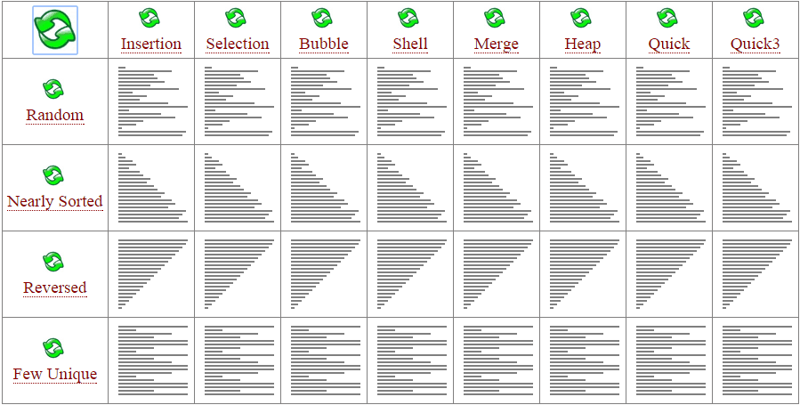
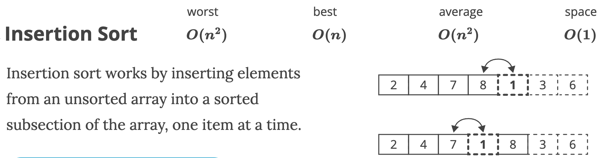
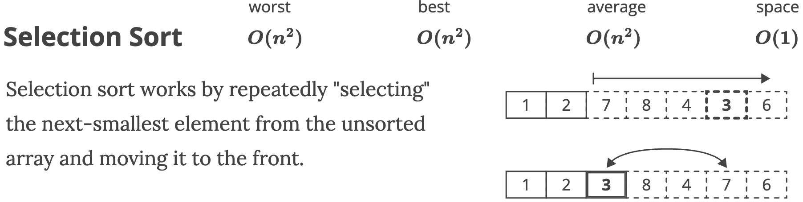
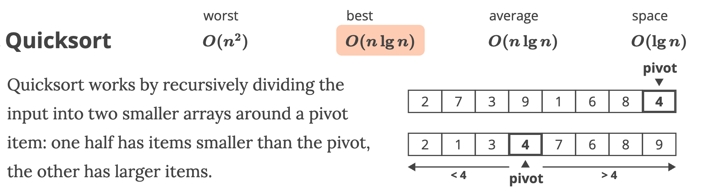
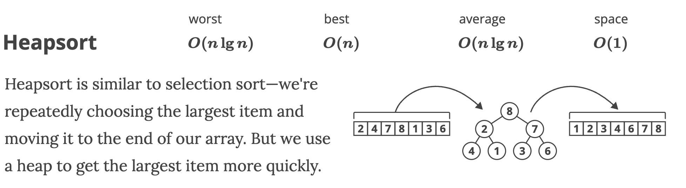
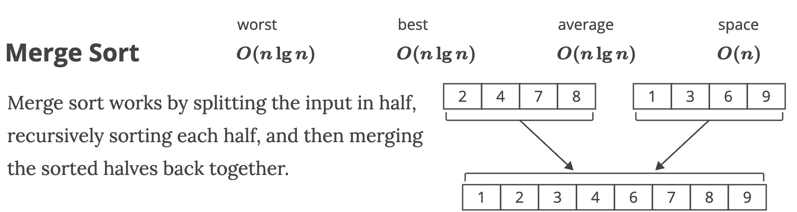
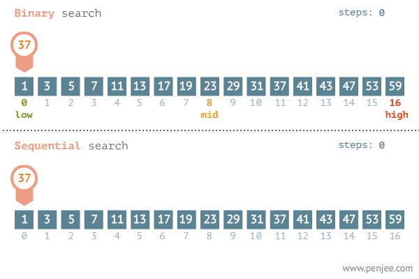
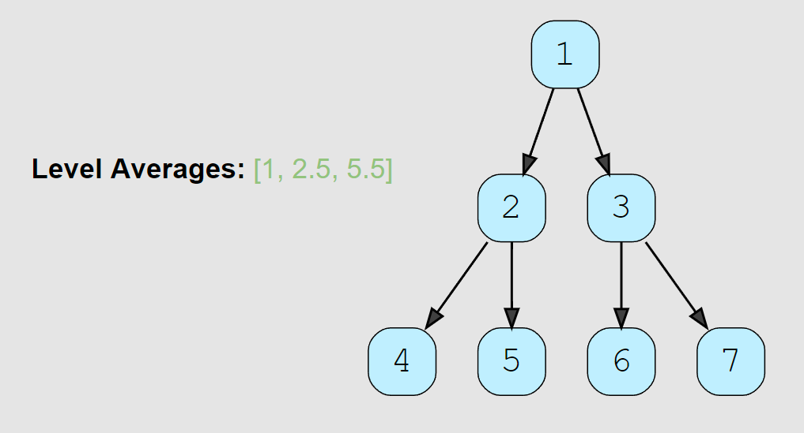

<br/>

# **💻 Data Structures and Algorithms in Python**
Blind 75 questions, coding patterns and in-depth solutions for FAANG coding interviews.
#### 📖 Author: `Ken Yew Piong`
#### 📆 Last Modified:  
<a href="https://github.com/KenYew">
  
</a>
<a href="https://gitlab.com/KenYew">
  
</a>

---
# <div id='toc'/> 📋 **Table of Contents** 
1. ### [⚡️ **Quick Notes**](#quicknotes)
1. ### [🎹 **Arrays**](#arrays)
1. ### [🔢 **Matrix**](#matrix)
1. ### [⏱ **Intervals**](#intervals)
1. ### [🔤 **Strings**](#strings)
1. ### [📝 **Linked Lists**](#linkedlists)
1. ### [📈 **Graphs**](#graphs) 
1. ### [🌲 **Trees**](#trees)
1. ### [🎄 **Binary Search Trees**](#bst)
1. ### [📚 **Sorting Algorithms**](#sort)
1. ### [🔎 **Search Algorithms**](#search)
1. ### [🧠 **Famous Algorithms**](#algorithms)
1. ### [🏔 **Heaps**](#heaps)
1. ### [📱 **Dynamic Programming**](#dp)
1. ### [⚡️ **Binaries**](#binaries)
1. ### [⚙️ **Data Structures Implementation**](#ds)

---
## 📱 [Coding Patterns](https://seanprashad.com/leetcode-patterns/)

1. ### [🪟 **Sliding Window**](#window)
1. ### [✌️ **Two Pointers**](#twopointers)
1. ### [🔎 **Binary Search**](#binary-search)
1. ### [🔗 **Linked List Reversal**](#linked-list-reversal)
1. ### [🌲 **Depth First Search**](#dfs)
1. ### [🌳 **Breadth First Search**](#bfs)

---
# <div id='quicknotes'/> ⚡️ **Quick Notes**
#### [📋 **Back to Table of Contents**](#toc)

---
### 📓 [Data Structures and Algorithms Cheat Sheet](https://seanprashad.com/leetcode-patterns/)


#### 🎹 **If input array is sorted:**
- `Binary search`
- `Two pointers`

#### 🔢 **If asked for all permutations/subsets:**
- `Backtracking`

#### 🎄 **If given a tree:**
- `DFS`
- `BFS`

#### 📈 **If given a graph:**
- `DFS`
- `BFS`

#### 📝 **If given a linked list:**
- `Two pointers`

#### ♽ **If recursion is banned:**
- `Stack`

#### 🔎 **If must solve in-place:**
- `Swap corresponding values`
- `Store one or more different values in the same pointer`

#### 🎹 **If asked for maximum/minumum subarray/subset/options:**
- `Dynamic programming`

#### 📚 **If asked for top/least K items:**
- `Heap`

#### 🔤 **If asked for common strings:**
- `Map`
- `Trie`

#### 📱 **Else**
- `Map/Set for O(1) time & O(n) space`
- `Sort input for O(nlogn) time and O(1) space`

---
### 🔑 [Keywords to Algorithms](https://algo.monster/problems/keyword_to_algo)

| No. | Keywords | Data Structures and Algorithms | 
|:--|:--|:--|
| 1. | "Top k"| Heap: K closest points |
| 2. | "How many ways.." | <li> DFS: Decode ways <li> DP: Robot paths
| 3. | "Substring" | Sliding window: Longest substring without repeating characters
| 4. | "Palindrome" | <li> Two pointers: Valid Palindrome <li> DFS: Palindrome Partitioning <li> DP: Palindrome Partitioning 2
| 5. | "Tree" | <li> shortest, level-order - BFS: Binary tree level-order traversal <li> else: DFS: Max Depth
| 6. | "Parentheses" | Stack: Valid Parentheses
| 7. | "Subarray" | <li> Prefix sum: Subarray sum <li> Hashmap: Continuous subarray sum
| 8. | "X Sum" |Two pointer: Two sum
| 9. | "Max/longest sequence" | <li> Dynamic programming, DFS: Longest increasing subsequence <li> mono deque: Sliding window maximum
| 10. | "Minimum/Shortest" | <li> Dynamic programming, DFS: Minimal path sum <li> BFS: Shortest path
| 11. | "Partition/split ... array/string" | DFS: Decode ways
| 12. | "Subsequence" | <li> Dynamic programming, DFS: Longest increasing subsequence <li> Sliding window: Longest increasing subsequence
| 13. | "Matrix" | <li> BFS, DFS: Flood fill, Islands <li> Dynamic programming: Maximal square
| 14. | "Jump" | Greedy/DP: Jump game
| 15. | "Game" | Dynamic programming: Divisor game, Stone game
| 16. | "Connected component", "Cut/remove" "Regions/groups/connections" | Union Find: Number of connected components, Redundant connections
| 17. | "Transitive relationship" | If the items are related to one another and the relationship is transitive, then chances are we can build a graph and use BFS or Union Find. <li> string converting to another, BFS: Word Ladder <li> string converting to another, BFS, Union Find: Sentence Similarity <li> numbers having divisional relationship, BFS, Union Find: Evaluate Division
| 18. | "Interval" | Greedy: sort by start/end time and then go through sorted intervals Interval Pattern


---
### 📱 Coding Pattern Templates
#### 🪟 Sliding Window
To perform beginning to end computations of an array in O(n) time complexity
```python
windowSum, windowStart = 0, 0
# 1: Increment the windowEnd pointer to start creating the sliding window
for windowEnd in range(len(array)): 
    
    # 2: Sliding the window, add elements going in
    windowSum += array[windowEnd]

    # 3: Set conditions required to start sliding the window
    if condition():
        
        # 4: Perform computations on elements in window
        result.append(doSomethingToWindow())

        # 5: Sliding the window, subtract the element going out
        windowSum -= array[windowStart]

        # 6: Move the sliding window one element at a time for the next iteration
        windowStart += 1
return result
```
#### ✌️ Two Pointers
To traverse and compute all elements of an array
```python
# 1: Initialise two pointers on each end of the array
left, right = 0, len(array) - 1

# 2: While pointers have not traversed and crossed each other,
while left < right: 
    
    # 3: Perform some computation
    computeSomething()

    # 4: Set a condition that requires *left to increment and move to the right
    if condition1(): 
        left += 1

    # 5: Set a condition that requires *right to decrement and move to the left
    elif condition2():
        right -= 1
    
    baseCase()
return result
```

#### 🔎 Binary Search
To search for an element of an array in `O(log(n))`
```python
def binarySearch(array, target):
  # 1: Initialise two pointers for each side of the array
  left, right = 0, len(array) - 1

  # 2: While both pointers have not cross each other,
  while (left <= right): # EDGE: <= is used for the edge case where array has only 1 element.  
    # 3: Evaluate the midpoint pointer by calculating (left + right) // 2
    mid = (left + right) // 2
    # 4: Return the midpoint index if array[mid] == target
    if array[mid] == target:
      return mid
    else:
      # 5: Else, if array[mid] is already smaller than the target, then we should discard everything on the left and update the new lower boundary: left = mid + 1 
      if (array[mid] < target):
        left = mid + 1
      # 6: Otherwise, we discard everything on the right and update the new upper boundary: right = mid - 1
      else: 
        right = mid - 1
  # 7: Return -1 by default if we cannot find our target number in the array
  return -1
```

#### 🔗 Linked List Traversal
To perform head to tail computations
```python
def traverseLinkedList(head): 
  # 0: Initialise previous*, current* and next* pointers
  previous, current, next = None, head, None
# 1: While current pointer has not fully traversed to the None end of the linked list,
while current is not None:

  # 2: Perform forwardtracking computations
  doSomething()

  # 3: Traverse to the next node of the linked list
  current = current.next

  # 4: Perform manipulation of node connections
  current.next = nextDistinctNode # Skip a node
  current = nextDistinctNode

# O(n) Time since we need to traverse all n nodes at least once
# O(1) Space since we perform the LinkedList traversal in-place
```

To perform head to tail reversal 
```python
def reverseLinkedList(head): 
  # 0: Initialise previous*, current* and next* pointers
  previous, current, next = None, head, None

  # 1: While we have not reached the end of the LinkedList (tail == None),
  while current is not None: 
    next = current.next # 2: PLACEHOLDER - store currentNode.next in next
    current.next = previous # 3: REVERSE - set currentNode.next to point to previous
    previous = current # 4: UPDATE new head - move previous by 1 step 
    current = next # 5: UPDATE new node iteration - move current by 1 step
  return previous # 6: Return new head of the reversed LinkedList

# O(n) Time since we need to traverse all n nodes at least once
# O(1) Space since we perform the LinkedList reversal in-place
```

#### ♽ Recursive DFS
To perform root to leaf computations
```python
def recursiveFunction(currentNode): 
  # 0: Define your input and return types!
  # :currentNodetype: TreeNode object
  # :rtype: int

  # 1: Base case for NULL child nodes before backtracking in the recursive stack
  if currentNode is None:
    return  # return 0, (0,0), False

  # 2: Perform forwardtracking computations
  informationToPassDown = doSomething()

  # 3: Perform leaf node computations
  if currentNode.left is None and currentNode.right is None: 
    answer = doSomething() # return answer

  # 4: Recursive function calls to perform DFS on tree while passing down new forwardtracking computations
  recursiveFunction(currentNode.left, informationToPassDown, answer)
  recursiveFunction(currentNode.right, informationToPassDown, answer)

  # 5: You may need to cleanup recent currentNode.value if backtacking is needed to find the answer elsewhere
  del currentPath[-1]

# O(n) Time - where n is the number of nodes in the tree. We traverse each and every node once. 
# O(n) Space worst case - where n is the total number of nodes in the tree that will be stored in the recursion stack
# Worst case is when the given tree is a linked list where every node has only one child
```

To perform leaf to root computations
```python
def recursiveFunction(currentNode): 
  # 0: Define your input and return types!
  # :currentNodetype: TreeNode object
  # :rtype: int

  # 1: Base case for NULL child nodes before backtracking in the recursive stack
  if currentNode is None:
      return

  # 2: Recursive function calls to perform DFS on tree while passing down new backtracking computations
  informationToPassDown, answer = recursiveFunction(currentNode.left)
  informationToPassDown, answer = recursiveFunction(currentNode.right)

  # 3: Perform backtracking computations
  informationToPassDown = doSomething()

  # 4: Return information to pass down during recursion
  return (informationToPassDown, answer)

# O(n) Time - where n is the number of nodes in the tree. We traverse each and every node once. 
# O(n) Space worst case - where n is the total number of nodes in the tree that will be stored in the recursion stack
# Worst case is when the given tree is a linked list where every node has only one child
```

#### 📚 Stack DFS
To perform root to leaf computations
```python
def iterativeFunction(root): 
  # 0: Define your input and return types!
  # :roottype: TreeNode object
  # :rtype: TreeNode object

  # 1: Initialise a stack with root node
  stack = [root]

  # 2: Iterate all elements of the stack in LIFO order for DFS
  while len(stack) > 0: 
      currentNode = stack.pop() # Pop the top-most element 

  # 3: Base case for NULL child nodes to skip iteration 
  if currentNode is None:
    continue

  # 4: Perform forwardtracking computations
  doSomething()

  # 5: Push child nodes to stack to traverse down the tree
  stack.append(currentNode.left)
  stack.append(currentNode.right)

  # 6: You may need to return the computed answer
  return answer # return root 

# O(n) Time - where n is the number of nodes in the tree. We traverse each and every node once. 
# O(n) Space worst case - where n is the total number of nodes in the tree. We also need O(n) for the stack.
```

#### 🌲 Queue BFS
To perform root to leaf computations
```python
# 0: Import double ended queue class from collections library
from collections import deque

def iterativeFunction(root): 
  # 1: Define your input and return types!
  # :roottype: TreeNode object
  # :rtype: list

  # 2: Base case for NULL child nodes to skip iteration 
  if node is None:
    continue

  # 3: Instantiate deque() object and append root node
  queue = deque()
  queue.append(root)

  # 4: Iterate all elements of the queue in FIFO order for BFS
  while len(queue) > 0: 
    currentLevelSize = len(queue)
    for _ in range(currentLevelSize):
        # 5: Pop the bottom-most element 
        currentNode = queue.popleft() 
        currentLevel.append(currentNode.value) 

        # 6: Perform forwardtracking computations
        doSomething()

        # 7: Push child nodes to queue to traverse down the tree
        queue.append(currentNode.left)
        queue.append(currentNode.right)

  # 8: You may need to return the computed answer
  return answer # return root 

# O(n) Time - where n is the number of nodes in the tree. We traverse each and every node once.  
# O(n) Space worst case - where n is the total number of nodes in the tree
# We also need O(n) for the queue. We can have a max of n/2 nodes at any level (at the lowest level of BT)
```

#### ♻ Regular Expressions
To extract information patterns and rank them
```python
# 0: Import regular expressions library
import re

def extractInformation(log): 
  # 1: Define your input and return types
  # :logtype: string
  # :rtype: string

  # 2: Initialise hashmap and result array
  hashMap = {}
  result = []

  # 3: Define your regular expression
  regex = r'(?P<number>\d+),(?P<name>\w+),/(?P<directory>\w+),(?P<latency>\d+)ms\s'

  # 4: Extract pattern information into a list of tuples
  tuples = re.findall(regex, log)

  # 5: Iterate through list of tuples and extract information from each tuple
  for tuple in tuples:
      (number, name, directory, latency) = tuple
      # 6: Store desired information into hashmap (e.g.: latency:name key-value pair)
      if name not in hashMap: 
          hashMap[latency] = name

  # 7: Sort desired information by hashMap.keys() (e.g.: latency)
  sortedLatencies = sorted(hashMap.keys())

  # 8: Append sorted information into result
  for latency in sortedLatencies:
      result.append(f'{hashMap[latency]} {latency}')
  # 9: Print out result separated by newline
  print('\n'.join(result))
```
#### 🧪 Unit Tests
To run unit tests using the built-in unittest Python library

```python
import unittest

class UnitTest(unittest.TestCase): 
  def testCase(self):
    input1 = [1, 2, 3]
    input2 = 2
    actual = myFunction(input1, input2)
    expected = [1, 3, 2]
    self.assertEqual(actual, expected)

if __name__ == '__main__':
  unittest.main()
  unittest.main(argv=[''], exit=False, verbosity=2) # For Jupyter
```

---
# <div id='arrays'/> 🎹 **Arrays**

- ✅ Two Sum - https://leetcode.com/problems/two-sum/
- ✅ Best Time to Buy and Sell Stock - https://leetcode.com/problems/best-time-to-buy-and-sell-stock/
- ✅ Contains Duplicate - https://leetcode.com/problems/contains-duplicate/
- ✅ Product of Array Except Self - https://leetcode.com/problems/product-of-array-except-self/
- ✅ Maximum Subarray - https://leetcode.com/problems/maximum-subarray/
- ✅ Maximum Product Subarray - https://leetcode.com/problems/maximum-product-subarray/
- Find Minimum in Rotated Sorted Array - https://leetcode.com/problems/find-minimum-in-rotated-sorted-array/
- ✅ Search in Rotated Sorted Array - https://leetcode.com/problems/search-in-rotated-sorted-array/
- ✅ 3Sum - https://leetcode.com/problems/3sum/
- Container With Most Water - https://leetcode.com/problems/container-with-most-water/
#### [📋 **Back to Table of Contents**](#toc)

---
## [🟩 Two Sum](https://leetcode.com/problems/two-sum/)
> Given an array of integers nums and an integer target, return indices of the two numbers such that they add up to target.
- [x] Input: `nums = [2, 7, 11, 15], target = 9`
- [x] Output: `[0, 1]`
- [x] Explanation: `Because nums[0] + nums[1] == 9, we return [0, 1].`

### **Brute Force**
```python
# O(n^2) Time | O(1) Space
def TwoSums(array, target):
    for i in range(len(array) - 1): 
        firstNum = array[i]
        for j in range(i + 1, len(array)):
            secondNum = array[j]
            if firstNum + secondNum == targetSum:
                return [firstNum, secondNum]
    return []
```

### **Hash Table**
```python
# O(n) time | O(n) space
def twoNumberSum(array, target): 
	nums = {}
	for num in array: 
		potentialMatch = target - num
		if potentialMatch in nums: 
			return [potentialMatch, num]
		else:
			nums[num] = True
	return []
```

✅ **HASH TABLE:** _Use hash table to instantly check for difference value, map will add index of last occurrence of a num, don’t use same element twice_


### **Two Pointers**
```python
# O(nlogn) Time | O(1) Space
def TwoSums(array, target):
    left = 0
    right = len(array) - 1
    array.sort()
    while (left < right):
        sum = array[left] + array[right]
        if sum > target:
            right -= 1
        elif sum < target:
            left += 1
        elif sum == target:
            return [array[left], array[right]]
    return -1 
```

✅ **TWO POINTERS:** _Sort the array, use two pointers on each end of the array and move pointers based on comparison between sum and targetNum_

---
## [🟩 Contains Duplicate](https://leetcode.com/problems/contains-duplicate/)
> Given an integer array `nums`, return `true` if any value appears **at least twice** in the array, and return `false` if every element is distinct.
- [x] Input: `nums = [1,2,3,1]`
- [x] Output: `true`

### **Brute Force**
```python
# O(n^2) Time | O(1) Space - where n is the length of the input
def containsDuplicate(nums):
    for i in range(len(nums)):
        currentValue = nums[i]
        for j in range(i + 1, len(nums)):
            valueToCompare = nums[j]
            if currentValue == valueToCompare:
                return True
    return False
```
### **Hash Set**
```python
# O(n) Time | O(n) Space - where n is the length of the input
def containsDuplicate(nums):
    seen = set() # create a set which is an unordered collection of UNIQUE items
    for num in nums: # for every num in nums, we add to the set
        if num in seen: # but if we already find that num in the set, then we have a duplicate!
            return True
        seen.add(num)
    return False
```

### **Space Optimized**
```python
# O(n) Time | O(1) Space - where n is the length of the input
def containsDuplicate(nums):
    for num in nums: 
        absNum = abs(num)
        if nums[absNum - 1] < 0:
            return absNum
        nums[absNum - 1] *= -1
    return -1
```
### **One-Liner**
```python
# One-liner solution
def containsDuplicate(self, nums):
    return len(nums) > len(set(nums))
```

✅ **HASH SET:** _Use hash set to add and keep track of unique values in array, if value is seen in hash set, we found our duplicate_

---
## [🟩 Sorted Squared Array](https://www.algoexpert.io/questions/Sorted%20Squared%20Array)
>* Write a function that takes in a non-empty array of integers that are sorted in ascending order.
>* Return a new array of the same length with the squares of the original integers also sorted in ascending order.
- [x] Input: `array = [1, 2, 3, 5, 6, 8, 9]`
- [x] Output: `[1, 4, 9, 25, 36, 64, 81]`

### **Two Pointers**
```python
# O(n) Time | O(n) Space - where n is the length of the input array
def sortedSquaredArray(array):
    # 1: Initialise output array of size input array with dummy values
    ans = [0 for _ in array]
    # 2: Initialise two pointers on each end of the array
    left, right = 0, len(array) - 1
    # 3: Traversing idx pointer from end to beginning of the array because we want to write the largest to the smallest values
    for idx in reversed(range(len(array))): 
        # 4: If abs(left-most value) is > abs(right-most value) e.g.: [-4, 1, 2]
        if abs(array[left]) > abs(array[right]):
            # 5: Insert the square of the largest value at the current iteration idx (from n-th to 0)
            ans[idx] = array[left] * array[left]
            # 6: Then, increment the left pointer
            left += 1
        # 7: Else if abs(right-most value) is >= abs(left-most value) e.g.: [1, 2, 3]
        else: 
            # 8: Insert the square of the largest value at the current iteration idx (from n-th to 0)
            ans[idx] = array[right] * array[right]
            # 9: Then, decrement the right pointer
            right -= 1
    # 10: Finally, return the sorted squared array
    return ans
```


✅ **TWO POINTERS:** _Initialise output array with 0's, and left and right pointers on each end of array. Traverse idx from end to beginning of the array, if abs(leftVal) > abs(rightVal), write the ans[idx] = leftVal ** 2 and increment left, else abs(rightVal) >= abs(leftVal), write the ans[idx] = rightVal **2 and decrement right._

---
## 🟩 [Missing Number](https://leetcode.com/problems/missing-number/)
> Given an array nums containing `n` distinct numbers in the range `[0, n]`, return the only number in the range that is missing from the array.

Example 1:
- [x] Input: nums = `[3,0,1]`
- [x] Output: 2
- [x] Explanation: `n = 3` since there are 3 numbers, so all numbers are in the range `[0,3]`. 2 is the missing number in the range since it does not appear in nums.

Example 2:
- [x] Input: nums = `[0,1]`
- [x] Output: 2
- [x] Explanation: `n = 2` since there are 2 numbers, so all numbers are in the range `[0,2]`. 2 is the missing number in the range since it does not appear in nums.

Example 3:
- [x] Input: nums = `[9,6,4,2,3,5,7,0,1]`
- [x] Output: 8
- [x] Explanation: `n = 9` since there are 9 numbers, so all numbers are in the range `[0,9]`. 8 is the missing number in the range since it does not appear in nums.


### [**Two Pointers**](./arrays/missing-number.py)
```python
# Say for input array = [9,6,4,2,3,5,7,0,1], we have a range of [0, 9]
# sum(range(len(array))) = 0 + 1 + 2 + 3 + 4 + 5 + 6 + 7 + 8 + 9 = 45
# sum(array) = 9 + 6 + 4 + 2 + 3 + 5 + 7 + 0 + 1 = 37
# result = sum(range(len(array))) - sum(array) = 45 - 37 = 8

# O(n) Time - we are iterating and maintaining two arrays of size n: sum(range(len(array))) and sum(array) 
# so O(2n) asymptotically converges to O(n)
# O(1) Space - no extra auxiliary memory is used
def missingNumber(array): 
  # Since in Python, `for idx in range(len(array))` will only add idx values from 0 to n - 1, 
  # so we will initially include the final value n in the result to account for this
  result = len(array)
  # 1: idx* represents numbers that will be summed from range(len(array))
  for idx in range(len(array)): 
    # 2: Since result = sum(range(len(array))) - sum(array[idx]),
    result += (idx - array[idx])
  return result # alternatively, 1-liner solution: return sum(range(len(array) + 1)) - sum(array)
```


---
## [🟨 Validate Subsequence](https://www.algoexpert.io/questions/Validate%20Subsequence)
>* Given two non-empty arrays of integers, write a function that determines whether the second array is a subsequence of the first one.
>* A subsequence of an array is a set of numbers that aren't necessarily adjacent in the array but that are in the same order as they appear in the array. 
>* For instance, the numbers `[1, 3, 4]` form a subsequence of the array `[1, 2, 3, 4]`, and so do
the numbers `[2, 4]`. 
>* Note that a single number in an array and the array itself are both valid subsequences of the array.
- [x] Input: `array = [5, 1, 22, 25, 6, -1, 8, 10], sequence = [1, 6, -1, 10]`
- [x] Output: `true`

### **Two Pointers**
```python
# O(n) Time | O(1) Space - where n is the length of the array
def isValidSubsequence(array, sequence):
    # 1: Initialise pointers for both the input array and input sequence
    arrIdx = 0
    seqIdx = 0
    
    # 2: While we have not finished traversing both the input array and input sequence,
    while arrIdx < len(array) and seqIdx < len(sequence):
        
        # 3: If the current values in both array and seq match, increment the seqIdx to look for the next pair of equal numbers
        if array[arrIdx] == sequence[seqIdx]:
            seqIdx += 1

        # 4: Otherwise, increment arrIdx and keep traversing the array to look for next pair of equal numbers
        arrIdx += 1

    # 5: Once we have incremented seqIdx enough times, return the Boolean answer of whether the sequence is valid (only if seqIdx == len(sequence))
    return seqIdx == len(sequence)
```

✅ **TWO POINTERS:** _Initialise pointer for both input arrays (arr, seq). While both pointers have not fully traversed their arrays, if values from both array match, increment seqIdx, otherwise keep incrementing arrIdx. Return Boolean logic seqIdx == len(sequence)_

---
## [🟨 Array Of Products](https://www.algoexpert.io/questions/Array%20Of%20Products)
>* Write a function that takes in a non-empty array of integers and returns an array of the same length, where each element in the output array is equal to the product of every other number in the input array.
>* In other words, the value at `output [i]` is equal to the product of every number in the input array other than `input[i]`.
>* Note that you're expected to solve this problem without using division.
- [x] Input: `array = [5, 1, 4, 2]`
- [x] Output: `[8, 40, 10, 20]`
- [x] Explanation:
```python
8 is equal to 1 x 4 x 2
40 is equal to 5 x 4 x 2
10 is equal to 5 x 1 x 2
20 is equal to 5 x 1 x 4
```

### **Brute Force**
```python
# O(n^2) Time | O(n) Space - where n is the length of the input array
def arrayOfProducts(array):
    result = []
    for i in range(len(array)):
        product = 1
        for j in range(len(array)):
            if i != j: 
                product *= array[j] 
        result.append(product)
    return result
```
### **Two Pointers - Less Optimised**
```python
# O(n) Time | O(n) Space - where n is the length of the input array
def arrayOfProducts(array):
    """
     *---L---->
    [5, 1, 4, 2]
    leftProducts = [1, 5, 5, 20]
     <---R----*
    [5, 1, 4, 2]
    rightProducts = [8, 8, 2, 1]
    products = [8, 40, 10, 20]
    """
    # 1: Initialise products arrays with 1s and size equals to input array
    products = [1 for _ in range(len(array))]
    leftProducts = [1 for _ in range(len(array))]
    rightProducts = [1 for _ in range(len(array))]
    
    # 2: Initialise leftRunningProduct = 1 to enable multiplication of running products from left to right
    leftRunningProduct = 1
    # 3: Loop through each element from left to right,
    for idx in range(len(array)): 
        # 4: Set the values of the leftProducts array with the leftRunningProduct value
        leftProducts[idx] = leftRunningProduct
        # 5: Multiplying up each element from left to right in a leftRunningProduct variable
        leftRunningProduct *= array[idx]

    # 6: Initialise rightRunningProduct = 1 to enable multiplication of running products from right to left
    rightRunningProduct = 1
    # 7: Loop through each element from right to left,
    for idx in reversed(range(len(array))): 
        # 8: Set the values of the rightProducts array with the rightRunningProduct value
        rightProducts[idx] = rightRunningProduct
        # 9: Multiplying up each element from right to left in a rightRunningProduct variable
        rightRunningProduct *= array[idx]
        
    # 10: Loop through each element from left to right,
    for idx in range(len(array)): 
        # 11: Multiply the elements of both leftProducts and rightProducts arrays
        products[idx] = leftProducts[idx] * rightProducts[idx]

    return products
```
### **Two Pointers - Optimised**
```python
# O(n) Time | O(n) Space - where n is the length of the input array
def arrayOfProducts(array):
    """
     *---L---->
    [5, 1, 4, 2]
    products = [1, 5, 5, 20]
     <---R----*
    [5, 1, 4, 2]
    products = [8, 40, 10, 20]
    """
    # 1: Initialise products array with 1s and size equals to input array
    products = [1 for _ in range(len(array))]
    
    # 2: Initialise leftRunningProduct = 1 to enable multiplication of running products from left to right
    leftRunningProduct = 1
    # 3: Loop through each element from left to right,
    for idx in range(len(array)):
        # 4: Set the values of each element in the answer array with the leftRunningProduct value
        products[idx] = leftRunningProduct
        # 5: Multiplying up each element from left to right in a leftRunningProduct variable
        leftRunningProduct *= array[idx]
        
    # 6: Initialise rightRunningProduct = 1 to enable multiplication of running products from right to left
    rightRunningProduct = 1
    # 7: Loop through each element from right to left,
    for idx in reversed(range(len(array))): 
        # 8: Set the values of each element in the answer array with the rightRunningProduct value
        products[idx] *= rightRunningProduct
        # 9: Multiplying up each element from right to left in a rightRunningProduct variable
        rightRunningProduct *= array[idx]
        
    return products
```

✅ **TWO POINTERS:** 
- Initialise the result array with 1s and equal to the size of the input array. 
- Starting with leftRunningProduct = 1, loop through each element of the input array from left to right, setting each element of the result array with leftRunningProduct as leftRunningProduct multiplies up each element from left to right. 
- Starting with rightRunningProduct = 1, loop through each element of the input array from right to left, multiplying each element of the result array with rightRunningProduct as rightRunningProduct multiplies up each element from right to left. 
- Return the result array.

---
## [🟨 Smallest Difference](https://www.algoexpert.io/questions/Smallest%20Difference)
>* Write a function that takes in two non-empty arrays of integers, finds the pair of numbers (one from each array) whose absolute difference is closest to zero, and returns an array containing these two numbers, with the number from the first array in the first position.
>* Note that the absolute difference of two integers is the distance between them on the real number line. For example, the absolute difference of -5 and 5 is 10, and the absolute difference of -5 and -4 is 1.
>* You can assume that there will only be one pair of numbers with the smallest difference.
- [x] Input: `arrayOne = [-1, 5, 10, 20, 28, 3], arrayTwo = [26, 134, 135, 15, 17]`
- [x] Output: `[28, 26]`

### **Two Pointers**
```python
# O(nlog(n) + mlog(m)) time | O(1) space
def smallestDifference(arrayOne, arrayTwo):
    # 1: Sort both input arrays first required for two pointer traversal
    arrayOne.sort() # O(nlog(n))
    arrayTwo.sort() # O(mlog(m))
    # 2: Initialise pointers, ans list and set MAX placeholders for smallestNum variable to be replaced by currentNum
    idxOne = idxTwo = currentNum = 0
    currentNum = smallestNum = float("inf")
    smallestPair = []
    
    ## EXAMPLE INPUT: 
    # sortedArrayOne = [-1, 3, 5, 10, 20, 28]
    #                    * <-- idxOne pointer
    # sortedArrayTwo = [15, 17, 26, 134, 135]
    #                    * <-- idxTwo pointer
    # Iteration #1: -1 < 15 so idxOne += 1 to bring the gap closer for min difference
    
    # 3: While both idx1 and idx2 pointers have not fully traversed the end of the list,
    while idxOne < len(arrayOne) and idxTwo < len(arrayTwo):
        firstNum, secondNum = arrayOne[idxOne], arrayTwo[idxTwo]

        # 4: if num1 in array1 < num2 in array2, calculate the difference and increment idx1 (to close the gap and move closer to the smallest difference between both nums)
        if firstNum < secondNum: 
            currentNum = secondNum - firstNum
            idxOne += 1
        # 5: elif num2 in array2 < num1 in array1, calculate the difference and increment idx2 (to close the gap and move closer to the smallest difference between both nums)
        elif secondNum < firstNum:
            currentNum = firstNum - secondNum 
            idxTwo += 1
        else: 
            # 6: else if we're lucky to get two exactly same num1 and num2 values, this is the best answer possible with smallest difference = 0
            return [firstNum, secondNum]
        
        # 7: To keep track on the smallest difference, we keep updating the smallestNum if currentNum < smallestNum in this iteration,
        if currentNum < smallestNum: 
            smallestNum = currentNum # update smallestNum if currentNum < smallestNum in this iteration
            smallestPair = [firstNum, secondNum] # store also the smallest pair of nums in this iteration
    return smallestPair
```

✅ **TWO POINTERS:** 
1. Sort both input array1 and array2. 
2. While idx1 and idx2 pointers have not fully traversed their arrays,
3. If num1 < num2, calculate the difference and increment idx1, elif num2 < num1, calculate the difference and increment idx2, else return [num1, num2]. 
4. Incrementing idx1 or idx2 pointers will close the gap between two array values and move closer to the smallest difference
5. Keep track of smallestNum and smallestPair if currentNum < smallestNum.

---
## [🟨 Move Element To End](https://www.algoexpert.io/questions/Move%20Element%20To%20End)
>* You're given an array of integers and an integer. Write a function that moves all instances of that integer in the array to the end of the array and returns the array.
>* The function should perform this in place (i.e., it should mutate the input array) and doesn't need to maintain the order of the other integers.
- [x] Input: `array = [2, 1, 2, 2, 2, 3, 4, 2], toMove = 2`
- [x] Output: `[4, 1, 3, 2, 2, 2, 2, 2]` or `[1, 3, 4, 2, 2, 2, 2, 2]`
### **Two Pointers**

```python
# O(n) Time | O(1) Space - where n is the length of the input array
def moveElementToEnd(array, toMove):
    # 1: Initialise both left and right pointers of each end of the array
    left = 0
    right = len(array) - 1
    # 2: While both pointers have not fully traverse the array and pass each other,
    while left < right: 
        # 3: If the right pointer is on the value == toMoveNum, we keep decrementing the right pointer until it points to a number != toMoveNum
        while array[right] == toMove and left < right: # EDGE: left < right to ensure we don't keep decrementing the right pointer pass the left pointer and perform an accidental swap below
            right -= 1
        
        # 5: Finally, if left points to a value == toMoveNum (right would've pointed to a value != toMoveNum at this point), perform a swap
        if array[left] == toMove:
            array[left], array[right] = array[right], array[left]
        
        # 4: Then, keep moving the left pointer inward until value == toMoveNum
        left += 1
    return array
```

✅ **TWO POINTERS:** _Initialise two pointers (left & right) on each end. While left < right, nested while rightVal == toMoveNum, decrement right to ensure rightVal points to a swappable num != toMoveNum. Keep incrementing left. If leftVal == toMoveNum, perform swap._

### **Two Pointers - Order Preserved**

```python
# O(n) Time | O(1) Space - where n is the length of the input array
def moveElementToEnd(array, toMove):
  writeIdx = 0
  for readIdx in range(len(array)): 
    if array[readIdx] != toMove: 
      array[readIdx], array[writeIdx] = array[writeIdx], array[readIdx]
      writeIdx += 1
  return array

Working through an example, say we have an array [1, 0, 2, 0, 3] and toMove = 0.
When read = 0, write = 0 and write += 1.
When read = 1, then array[read] == 0 and write = 1.
When read = 2, then we swap array[2] (read) and array[1] (write). The array is now [1, 2, 0, 0, 3] and write = 2.
When read = 3, array[read] == 0 and we skip.
When read = 4, then we swap array[4] (read) and array[2] (write). The final array is [1, 2, 3, 0, 0].

def moveElementToBeginning(array, toMove): 
  writeIdx = len(array) - 1
  for readIdx in reversed(range(len(array))):
    if array[readIdx] != toMove: 
      array[readIdx], array[writeIdx] = array[writeIdx], array[readIdx]
      writeIdx -= 1
  return array
```

✅ **TWO POINTERS:** _Initialise two pointers (readIdx & writeIdx) at 0. Iterate through the array with readIdx, if `array[readIdx] != toMove`, swap `array[readIdx], array[writeIdx] = array[writeIdx], array[readIdx]` and increment `writeIdx += 1`, keep traversing array with `readIdx`, return mutated array_

---
## [🟨 Longest Peak](https://www.algoexpert.io/questions/Longest%20Peak)
>* Write a function that takes in an array of integers and returns the length of the longest
peak in the array.
>* A peak is defined as adjacent integers in the array that are strictly increasing until they reach a tip (the highest value in the peak), at which point they become strictly decreasing. At least three integers are required to form a peak.
>* For example, the integers `1, 4, 10, 2` form a peak, but the integers `4, 0, 10` don't and neither do the integers `1, 2, 2, 0`. Similarly, the integers `1, 2, 3` don't form a peak because there aren't any strictly decreasing integers after the `3`.
- [x] Input: `array = [1, 2, 3, 3, 4, 0, 10, 6, 5, -1, -3, 2, 3]`
- [x] Output: `6`
- [x] Explanation: `0, 10, 6, 5, -1 -3` form the longest peak

### **Two Pointers**
```python
# O(n) time | O(1) space  - where n is the length of the input array
def longestPeak(array):
    # 1: Initialise peakIdx pointer to be 1 (since we need at least one value to the left to evaluate a potential peak)
    longestPeakLength = 0
    peakIdx = 1

    # 2: While peakIdx has not fully traversed the array,
    while peakIdx < len(array) - 1: 

        # 3: Check previous and next values to see if current peakIdxValue forms a peak
        isPeak = array[peakIdx] > array[peakIdx - 1] and array[peakIdx] > array[peakIdx + 1]

        # 4: If they don't form a peak, keep incrementing peakIdx and skip current iteration
        if not isPeak: 
            peakIdx += 1
            continue

        # 5: Else if current peakIdxValue does form a peak, let's evaluate how long is the peak.

        # 6: For the left side of the peak, set the leftIdx to point to the subsequent previous value (peakIdx - 2) and then perform a while loop that keeps decrementing the leftIdx if the previous values are consecutively decreasing
        leftIdx = peakIdx - 2
        while leftIdx >= 0 and array[leftIdx + 1] > array[leftIdx]: # traverse until leftIdx = 0
            leftIdx -= 1

        # 7: For the right side of the peak, set the rightIdx to point to the subsequent next value (peakIdx + 2) and then perform a while loop that keeps incrementing the rightIdx if the next values are consecutively increasing
        rightIdx = peakIdx + 2
        while rightIdx < len(array) and array[rightIdx - 1] > array[rightIdx]: # traverse until rightIdx = len(array) - 1
            rightIdx += 1
            
        # 8: Evaluate the total length of the peak by using the difference between the two pointers (accounting for zero-indexing)
        currentPeakLength = rightIdx - leftIdx - 1

        # 9: Evaluate only the MAX between the longestPeakLength (from previous iteration) and currentPeakLength (current iteration)
        longestPeakLength = max(longestPeakLength, currentPeakLength) 

        # 10: Update the peakIdx to be the right-most index. This is will be the new starting point to look for the next peak as we keep traversing the array.
        peakIdx = rightIdx
        
    return longestPeakLength
```

✅ **TWO POINTERS:** 
1. Intialise peakIdx to traverse the array and find a potential peak.
2. If peak is found, set leftIdx and rightIdx to be peakIdx - 2 and peakIdx + 2 to. 
3. Decrement leftIdx in a while loop if previous values are consecutively decreasing.
4. Increment rightIdx in a while loop if next values are consecutively increasing. 
5. Evaluate currentPeakLength by calculating the difference between leftIdx and rightIdx. 
6. Update peakIdx to be rightIdx to find the next potential longest peak. 
7. Return max(longestPeakLength, currentPeakLength)

---
## 🟨 [Subarray Sum Equals K](https://leetcode.com/problems/subarray-sum-equals-k/discuss/190674/Python-O(n)-Based-on-%22running_sum%22-concept-of-%22Cracking-the-coding-interview%22-book)
> Given an array of integers nums and an integer k, return the total number of subarrays whose sum equals to k.

Example 1:
- [x] Input: nums = `[1,1,1]`, k = 2
- [x] Output: 2

Example 2:
- [x] Input: nums = `[1,2,3]`, k = 3
- [x] Output: 2

Constraints:
- `1 <= nums.length <= 2 * 104`
- `-1000 <= nums[i] <= 1000`
- `-107 <= k <= 107`


### [**Prefix Sum**](./arrays/subarray-sum-equals-k.py)
```python
# O(n) Time - we iterate each element in the input at most once and for each element we spend a constant amount of time.
# O(n) Space - in the worst case, we could store at most n elements in the dictionary
def subarraySum(array, targetSum):
  runningSum, totalSum = 0, 0
  # EDGE: Add initial prefixSum value of 0 with 1 occurrence
  prefixSums = { 0:1 } # prefixSum : frequency
  
  #  <----------runningSum------------->
  #  <-prefixSum-> <-----targetSum----->
  # s             x                     y
  for value in array: 
    # 1: Keep summing up elements into the runningSum
    runningSum += value
    prefixSum = runningSum - targetSum # 2: Simultaneously, calculate the prefixSum in each iteration
    # 3: Add prefixSum value (frequency) into totalSum if prefixSum key is found in dictionary, 
    # otherwise create a new key-value pair prefixSum : 0 by default if not found
    totalSum += prefixSums.get(prefixSum, 0) 
    prefixSums[runningSum] = 1 + prefixSums.get(runningSum, 0) # 4: If runningSum key is found in dictionary, increment its value
  return totalSum
```

---
## [🟨 3Sum](https://leetcode.com/problems/3sum/)
> Given an integer array nums, return all the triplets `[nums[i], nums[j], nums[k]` such that `i != j`, `i != k`, and `j != k`, and `nums[i] + nums[j] + nums[k] == 0`.
- [x] Input: `nums = [-1,0,1,2,-1,-4]`
- [x] Output: `[[-1,-1,2],[-1,0,1]]`

- [x] Input: `nums = []` or `nums = [0]`
- [x] Output: `[]`

### [**Two Pointers**](https://leetcode.com/problems/two-sum/discuss/737092/Sum-MegaPost-Python3-Solution-with-a-detailed-explanation)
```python
# O(n^2) Time | O(n) Space
def threeSum(nums: List[int]) -> List[List[int]]:
    # 1: Sort the input array
    nums.sort()
    ans = []
    
    # 2: Perform a single pass of the input array with idx as the pointer
    for idx, val in enumerate(nums): 
        # EDGE 1: If there are two adjacent elements of the same value for indices after idx = 0, skip iteration to prevent checking for duplicates
        if idx > 0 and nums[idx] == nums[idx - 1]:
            continue

        # 3: With the idx pointer taking care of the 1st valueToSum, intialise left (next to idx) and right pointers
        left = idx + 1 # Left pointer (2nd pointer) needs to be next to the idx pointer (1st pointer)
        right = len(nums) - 1 # Right pointer (3rd pointer) is at the end of the array

        # 4: Perform 2Sum algorithm, while both pointers haven't traversed the entire array yet,
        while left < right: 
            # 5: Compute threeSum with idx, left and right pointers
            threeSum = nums[idx] + nums[left] + nums[right] 
            # 6: If threeSum < 0, threeSum is too small, so left pointer is incremented to increase value of threeSum
            if threeSum < 0: 
                left += 1
            # 7: If threeSum > 0, threeSum is too big, so right pointer is decremented to decrease value of threeSum
            elif threeSum > 0:  
                right -= 1
            # 8: Else, we have found the threeSum that equates to 0, so we append the answer
            else: 
                ans.append([nums[idx], nums[left], nums[right]])

                # EDGE CASE TO SKIP DUPLICATES
                #  [-3 -2, -2, 0, 0, 2, 2]
                # [ IDX L               R]
                # EDGE 2: If two adjacent elements have the same value while the left and right pointers haven't finished traversing the entire array yet, keep moving the pointers to prevent checking for duplicates
                while left < right and nums[left] == nums[left + 1]:
                    left += 1
                while left < right and nums[right] == nums[right - 1]:
                    right -= 1

                # 9: Move left and right pointers inwards once to continue traversing the array for next potential threeSum
                left += 1 
                right -= 1
    return ans
```

✅ **TWO POINTERS:** 
- `ThreeSum: A + B + C = 0` 
- _Sort input array, perform a FOR loop for A, then set Two Pointers (L & R) for B and C. Increment L if sum is too small and decrement R if sum is too big._
- _To prevent duplicates, if A == prevA, skip FOR loop iteration. If B == prevB, increment L in the TwoPointer WHILE loop_

### **TargetSum Variant**
```python
# O(n^2) time | O(n) space
def threeNumberSum(array, targetSum):
    # 1: Sort the input array for two pointer traversal
    array.sort()
    ans = []

    # 2: idx pointer loops through all values from index 0 to "n - 2" for the 1st value of the sum
    for idx in range(len(array) - 2): # since we're looking for a triplet, in the n-th iteration of the for loop, the idxPointer will always be 3rd from last of the array to allow for leftPointer and rightPointer to fit in the triplet
       
        # EDGE 1: If there are two adjacent elements of the same value for indices after idx = 0, skip iteration to prevent checking for duplicates
        if idx > 0 and nums[idx] == nums[idx - 1]:
            continue

        # 3: Initialise left and right pointers for the 2nd and 3rd value of the sum
        left = idx + 1
        right = len(array) - 1 # since we're dealing with pointers, we must account for Python's zero indexing
        # POINTERS VISUALIZATION
        # [  -3  -2   -2  0  0  2  2]
        # [ IDX LEFT             RIGHT]
        # FORLOOP ^---TWO POINTER---^

        # 4: While left and right pointers have not traverse the entire list and pass each other,
        while left < right:

            # 5: Evaluate the currentSum of the current iteration
            currentSum = array[idx] + array[left] + array[right] 

            # 6: If currentSum of the current iteration < targetSum, increment left to increase value
            if currentSum < targetSum:
                left += 1
            # 7: If currentSum of the current iteration > targetSum, decrement right to decrease value
            elif currentSum > targetSum:
                right -= 1

            # 8: If we found the right combination to equal targetSum, append the 3 values of currentSum
            elif currentSum == targetSum:
                ans.append([array[idx], array[left], array[right]])

                # EDGE CASE TO SKIP DUPLICATES
                #  [-3 -2, -2, 0, 0, 2, 2]
                # [ IDX L               R]
                # EDGE 2: If two adjacent elements have the same value while the left and right pointers haven't finished traversing the entire array yet, keep moving the pointers to prevent checking for duplicates
                while left < right and nums[left] == nums[left + 1]:
                    left += 1
                while left < right and nums[right] == nums[right - 1]:
                    right -= 1

                # 9: and move both left and right pointers inwards to look for more potential sums
                left += 1
                right -= 1
    return ans
```

✅ **TWO POINTERS:** 
- `ThreeSum: A + B + C = 0` 
- _Sort input array, perform a FOR loop for A, then set Two Pointers (L & R) for B and C. Increment L if sum is too small and decrement R if sum is too big. When targetSum is found, find the next targetSum by traversing both L & R inwards._

---
## 🟨 [4Sum](https://www.educative.io/courses/grokking-the-coding-interview/B6XOq8KlkWo)
> Given an array of unsorted numbers and a target number, find all unique quadruplets in it, whose sum is equal to the target number.

Example 1
- [x] Input: `[4, 1, 2, -1, 1, -3]`, target=`1`
- [x] Output: `[-3, -1, 1, 4], [-3, 1, 1, 2]`
- [x] Explanation: Both the quadruplets add up to the target.

Example 2
- [x] Input: `[2, 0, -1, 1, -2, 2]`, target=`2`
- [x] Output: `[-2, 0, 2, 2], [-1, 0, 1, 2]`
- [x] Explanation: Both the quadruplets add up to the target.


### [**Two Pointers**](./arrays/four-sum.py)
```python
# O(n^3) Time - O(nlogn) to sort the array + O(n^2) from the nested for loops which is asymptotically equivalent to O(n^3) Time
# O(n) Space
def searchQuadruplets(array, targetSum): 
    array.sort()
    quadruplets = []
    
    # *idx to find A [X, X, X, X, B, C, D] where X are elements that *idx will iterate
    for idx in range(len(array) - 3): 
        if idx > 0 and array[idx] == array[idx - 1]: 
            continue
        # *jdx to find B [A, X, X, X, X, C, D] where X are elements that *jdx will iterate
        for jdx in range(idx + 1, len(array) - 2): 
            if jdx > idx + 1 and array[jdx] == array[jdx - 1]:
                continue
            searchPairs(array, targetSum, idx, jdx, quadruplets)
    return quadruplets

# *left and *right to find C and D [A, B, X, X, X, X, X] where X are elements that *left and *right will iterate
def searchPairs(array, targetSum, first, second, quadruplets):
    left = second + 1
    right = len(array) - 1
    while left < right: 
        _sum = array[first] + array[second] + array[left] + array[right]
        if _sum == targetSum:
            quadruplets.append([array[first], array[second], array[left], array[right]])
            left += 1
            right -= 1
            while left < right and array[left] == array[left - 1]:
                left += 1
            while left < right and array[right] == array[right + 1]:
                right -= 1
        elif _sum < targetSum: 
            left += 1
        else: 
            right -= 1
```

---
# 🧠 Kadane's Algorithm Pattern
## [🟩 Maximum Subarray](https://leetcode.com/problems/maximum-subarray/)
>* Given an integer array nums, find the contiguous subarray (containing at least one number) which has the largest sum and return its sum.
>* A subarray is a contiguous part of an array.

- [x] Input: `nums = [-2,1,-3,4,-1,2,1,-5,4]`
- [x] Output: `6`
- [x] Explanation: `[4,-1,2,1] has the largest sum = 6.`

### **Kadane's Algorithm** 
```python
# O(n) Time | O(1) Space - where n is the length of the input array
def maxSubArray(nums):
    # 1: Initialise maxSumEndingHere pointer at the beginning of array and maxSoFar to keep track of max sum so far
    maxSumEndingHere, maxSoFar = 0, float("-inf")
    # 2: Traverse the array and compute for each element
    for currentNum in nums:
        # 3: Using Kadane's algorithm, calculate maxSumEndingHere and maxSoFar with max functions for each element traversed so far
        maxSumEndingHere = max(currentNum, maxSumEndingHere + currentNum)
        maxSoFar = max(maxSoFar, maxSumEndingHere)
    return maxSoFar
```

✅ **Kadane's Algorithm:** 
1. Traverse the array once and compute each element using Kadane's algorithm
2. maxSumEndingHere = max(currentNum, maxSumEndingHere)
3. maxSoFar = max(maxSoFar, maxSumEndingHere)

---
## [🟨 Maximum Product Subarray](https://leetcode.com/problems/maximum-product-subarray/)
>* Given an integer array nums, find a contiguous non-empty subarray within the array that has the largest product, and return the product.
>* The test cases are generated so that the answer will fit in a 32-bit integer.
>* A subarray is a contiguous subsequence of the array.

Example 1:
- [x] Input: `nums = [2, 3, -2, 4]`
- [x] Output: `6`
- [x] Explanation: `[2, 3] has the largest product = 6.`

Example 2: 
- [x] Input: `nums = [-2, 0, -1]`
- [x] Output: `0`
- [x] Explanation: `The result cannot be 2, because [-2, -1] is not a subarray.`


### [**Kadane's Algorithm**](https://leetcode.com/problems/maximum-product-subarray/discuss/48276/Python-solution-with-detailed-explanation) 
```python
# O(n) Time | O(1) Space - where n is the length of the input array
def maxProduct(nums):
    maxProduct, minProduct, result = nums[0], nums[0], nums[0]
    for i in range(1, len(nums)):
        postiveProduct = max(nums[i], maxProduct*nums[i], minProduct*nums[i])
        negativeProduct = min(nums[i], maxProduct*nums[i], minProduct*nums[i])            
        maxProduct, minProduct = postiveProduct, negativeProduct
        result = max(maxProduct, result)
    return result
```

✅ **Kadane's Algorithm:** 
1. Traverse the array once and compute each element using Kadane's algorithm
2. postiveProduct = `max(nums[i], maxProduct*nums[i], minProduct*nums[i])`
3. negativeProduct = `min(nums[i], maxProduct*nums[i], minProduct*nums[i])`
4. maxProduct, minProduct = postiveProduct, negativeProduct
5. result = `max(maxProduct, result)`
   
---
## [🟩 Best Time to Buy and Sell Stock](https://leetcode.com/problems/best-time-to-buy-and-sell-stock/)
>* You are given an array prices where `prices[i]` is the price of a given stock on the ith day.
>* You want to maximize your profit by choosing a single day to buy one stock and choosing a different day in the future to sell that stock.
>* Return the maximum profit you can achieve from this transaction. If you cannot achieve any profit, return 0.

- [x] Input: `prices = [7,1,5,3,6,4]`
- [x] Output: `5`
- [x] Explanation: 
  - `Buy on day 2 (price = 1) and sell on day 5 (price = 6), profit = 6-1 = 5.`
  - `Note that buying on day 2 and selling on day 1 is not allowed because you must buy before you sell.`

<br/>
The points of interest are the peaks and valleys in the given graph. We need to find the largest peak following the smallest valley. We can maintain two variables - minprice and maxprofit corresponding to the smallest valley and maximum profit (maximum difference between selling price and minprice) obtained so far respectively.

### **Kadane's Algorithm**
```python
# Solution using Kadane's Algorithm
# O(n) Time | O(1) Space - where n is the length of the input array
def maxProfit(prices):
    # EDGE: If input array is empty, return 0
    if len(prices) < 1:
        return 0
    # 1: Initialise minBuyPriceEndingHere pointer at the beginning of array and maxProfit value to keep track of max profits so far
    minBuyPriceEndingHere = prices[0] # Minimum value of elements traversed so far
    maxProfitSoFar = 0 # Maximum value of profit calculated so far (profit = currentPrice - minBuyPriceEndingHere)
    # 2: Traverse the array and compute for each value
    for currentPrice in prices:
        # 3: Using Kadane's algorithm, calculate minBuyPriceEndingHere and maxProfitSoFar with min and max functions for each element traversed so far
        minBuyPriceEndingHere = min(minBuyPriceEndingHere, currentPrice)
        profit = currentPrice - minBuyPriceEndingHere # Calculate current profit using currentPrice
        maxProfitSoFar = max(maxProfitSoFar, profit)
    return maxProfitSoFar

# Kadane's Algorithm Concept
# O(n) Time | O(1) Space - where n is the length of the input array
def kadane(array): 
    # 1: Initialise maxSumEndingHere pointer at the beginning of array and maxSoFar to keep track of max sum so far
    maxSumEndingHere = array[0] # Summation of all adjacent elements up to this point
    maxSoFar = array[0] # Maximum value of summations calculated so far 
    # 2: Traverse the array and compute for each element
    for idx in range(1, len(array)): 
        currentNum = array[idx]
        # 3: Using Kadane's algorithm, calculate maxSumEndingHere and maxSoFar with max functions for each element traversed so far
        maxSumEndingHere = max(currentNum, maxSumEndingHere + currentNum)
        maxSoFar = max(maxSoFar, maxSumEndingHere)
    return maxSoFar
```

✅ **Kadane's Algorithm**:
1. Traverse the array once and compute for each element using Kadane's algorithm
2. minBuyPriceEndingHere = min(minBuyPriceEndingHere, currentPrice)
3. profit = currentPrice - minBuyPriceEndingHere
4. maxProfitSoFar = max(maxProfitSoFar, profit)

---
# <div id='matrix'/> 🔢 **Matrix**

- Set Matrix Zeroes - https://leetcode.com/problems/set-matrix-zeroes/
- ✅ Spiral Matrix - https://leetcode.com/problems/spiral-matrix/
- Rotate Image - https://leetcode.com/problems/rotate-image/
- Word Search - https://leetcode.com/problems/word-search/
#### [📋 **Back to Table of Contents**](#toc)
---
## [🟨 Spiral Matrix](https://leetcode.com/problems/spiral-matrix/)
>* Given an m x n matrix, return all elements of the matrix in spiral order.

- [x] Input: `matrix = [[1,2,3],[4,5,6],[7,8,9]]`
- [x] Output: `[1,2,3,6,9,8,7,4,5]`

<br/>
<br/>

### **Two Pointers**
```python
# O(n) Time | O(n) Space
def spiralTraverse(array):
    # 1: Initialise row pointers and col pointers on all 4 ends of the 2-D matrix.
    startRow, endRow = 0, len(array) - 1 # Iteration 1: 0, 3
    startCol, endCol = 0, len(array[0]) - 1 # Iteration 1: 0, 3
    ans = []
    
    # 2: While the row and col pointers have not traversed until the other ends,
    while startRow <= endRow and startCol <= endCol: 

        # 3: Append col values from "left" to "right" columns
        for col in range(startCol, endCol + 1): # Iteration 1: 0, 4 (0 -> 3) Iteration 2: 1, 3 (1 -> 2)
            ans.append(array[startRow][col])
        # 4: Append row values from "top + 1" to "bottom" rows
        for row in range(startRow + 1, endRow + 1): # Iteration 1: 1, 4 (1 -> 3) Iteration 2: 2, 3 (2)
            ans.append(array[row][endCol])
        # 5: Append col values from "right - 1" to "left" columns
        for col in reversed(range(startCol, endCol)): # Iteration 1: 3, 0 (2 -> 0) Iteration 2: 2, 1 (1)
            # EDGE 1: Break iteration if there is only 1 row left in the centre of matrix (to avoid double counting)
            if startRow == endRow:
                break
            ans.append(array[endRow][col])
        # 6: Append row values from "bottom - 1" to "top + 1" rows
        for row in reversed(range(startRow + 1, endRow)): # Iteration 1: 3, 1 (2 -> 1) Iteration 2:  2, 2 (BREAK)
            # EDGE 2: Break iteration if there is only 1 column left in the centre of matrix (to avoid double counting)
            if startCol == endCol:
                break
            ans.append(array[row][startCol])

        # 7: Update all 4 edge pointers to move inwards and evaluate layer by layer
        startRow += 1 # Value Updated: 1
        endRow -= 1 # Value Updated: 2
        startCol += 1 # Value Updated: 1
        endCol -= 1 # Value Updated: 2
    
    return ans
```

✅ **TWO POINTERS:** _Keep track of visited cells; keep track of boundaries, layer-by-layer_

---
# <div id='intervals'/> ⏱ **Intervals**

- Insert Interval - https://leetcode.com/problems/insert-interval/
- ✅ Merge Intervals - https://leetcode.com/problems/merge-intervals/
- Non-overlapping Intervals - https://leetcode.com/problems/non-overlapping-intervals/
- Meeting Rooms (Leetcode Premium) - https://leetcode.com/problems/meeting-rooms/
- Meeting Rooms II (Leetcode Premium) - https://leetcode.com/problems/meeting-rooms-ii/
#### [📋 **Back to Table of Contents**](#toc)
---
## [🟨 Merge Intervals](https://leetcode.com/problems/merge-intervals/)
> Given an array of intervals where `intervals[i] = [starti, endi]`, merge all overlapping intervals, and return an array of the non-overlapping intervals that cover all the intervals in the input.

- [x] Input: `intervals = [[1,3],[2,6],[8,10],[15,18]]`
- [x] Output: `[[1,6],[8,10],[15,18]]`
- [x] Explanation: `Since intervals [1,3] and [2,6] overlaps, merge them into [1,6].`

### **Sort, Check and Mutate**
```python
# O(nlogn) Time | O(n) Space
def mergeOverlappingIntervals(intervals):
    # 1: Sort the input array of intervals based on the 1st elements of each interval
    sortedIntervals = sorted(intervals, key=lambda x: x[0])
    
    # 2: Initialise currentInterval with the 1st sorted interval and append it to the answer mergedIntervals since we need at least 1 interval to compare with
    mergedIntervals = []
    currentInterval = sortedIntervals[0] 
    mergedIntervals.append(currentInterval) 
    
    # 3: Loop through each interval in the sortedIntervals array,
    for nextInterval in sortedIntervals:
        # 4: Decompose currentInterval into 2 variables (e.g.: currentInterval = [1, 2] gives _ = 1 and currentIntervalEnd = 2)
        _, currentIntervalEnd = currentInterval 
        # 5: Decompose nextInterval into 2 variables (e.g.: nextInterval = [3, 5] gives nextIntervalStart = 3 and nextIntervalEnd = 5)
        nextIntervalStart, nextIntervalEnd = nextInterval 
        
        # 6: Check if two intervals are overlapping by comparing the intervalEnd value of the current interval is bigger or equal than the intervalStart value of the next interval
        if currentIntervalEnd >= nextIntervalStart:
            # 7: Mutate the currentIntervalEnd to be the highest number between the intervalEnd values of the currentInterval and nextInterval
            currentInterval[1] = max(currentIntervalEnd, nextIntervalEnd)
        else: 
            # 8: Else if there are no overlapping, update currentInterval with new interval and immediately append to the answer
            currentInterval = nextInterval
            mergedIntervals.append(currentInterval)
            
    return mergedIntervals
```

✅ **SORT, CHECK AND MUTATE:** _Sort intervals by start values, compare end value and start value of adjacent intervals to check for overlap, mutate end value of answer interval to encapsulate merges, iterate checks for all intervals_

---
# <div id='strings'/> 🔤 **Strings**

- ✅ Longest Substring Without Repeating Characters - https://leetcode.com/problems/longest-substring-without-repeating-characters/
- Longest Repeating Character Replacement - https://leetcode.com/problems/longest-repeating-character-replacement/
- ✅ Minimum Window Substring - https://leetcode.com/problems/minimum-window-substring/
- Valid Anagram - https://leetcode.com/problems/valid-anagram/
- ✅ Group Anagrams - https://leetcode.com/problems/group-anagrams/
- ✅ Valid Parentheses - https://leetcode.com/problems/valid-parentheses/
- ✅ Valid Palindrome - https://leetcode.com/problems/valid-palindrome/
- ✅ Longest Palindromic Substring - https://leetcode.com/problems/longest-palindromic-substring/
- ✅ Palindromic Substrings - https://leetcode.com/problems/palindromic-substrings/
- Encode and Decode Strings (Leetcode Premium) - https://leetcode.com/problems/encode-and-decode-strings/
#### [📋 **Back to Table of Contents**](#toc)

---
## [🟩 Fizz Buzz](https://leetcode.com/problems/fizz-buzz/)
> Given an integer n, return a string array answer (1-indexed) where:
>* `answer[i] == "FizzBuzz"` if i is divisible by 3 and 5.
>* `answer[i] == "Fizz"` if i is divisible by 3.
>* `answer[i] == "Buzz"` if i is divisible by 5.
>* `answer[i] == i` (as a string) if none of the above conditions are true.

Example 1:
- [x] Input: `n = 3`
- [x] Output: `["1","2","Fizz"]`

Example 2:
- [x] Input: `n = 5`
- [x] Output: `["1","2","Fizz","4","Buzz"]`

Example 3:
- [x] Input: `n = 15`
- [x] Output: `["1","2","Fizz","4","Buzz","Fizz","7","8","Fizz","Buzz","11","Fizz","13","14","FizzBuzz"]`


### [**String Concatenation**](./strings/fizzbuzz.py)
```python
# O(n) Time | O(1) Space
def fizzBuzz(n):
  result = []
  for idx in range(1, n + 1): 
      currentString = ""
      if idx % 3 == 0: 
          currentString += "Fizz"
      if idx % 5 == 0:
          currentString += "Buzz"
      if not currentString:
          result.append(str(idx))
      else:
          result.append(currentString)
  return result
```

---
## [🟩 Caesar Cipher Encryptor](https://www.algoexpert.io/questions/Caesar%20Cipher%20Encryptor)
>* Given a non-empty string of lowercase letters and a non-negative integer representing
a key, write a function that returns a new string obtained by shifting every letter in the
input string by k positions in the alphabet, where k is the key.
>* Note that letters should "wrap" around the alphabet; in other words, the letter `z` shifted by one returns the letter `a`

- [x] Input: `string = xyz, key = 2`
- [x] Output: `zab`

### **ORD/CHR String Manipulation with Modulo Wrapping**
```python
# O(n) Time | O(n) Space
def caesarCipherEncryptor(string, key):
	newLetters = []
	newKey = key % 26 # ensures that keys larger than 26 are reseted back to 0 (to preserve key range of 0-26)
	
	for letter in string:
		newLetters.append(getNewLetter(letter, newKey))
	return "".join(newLetters) # converts array of convertedLetters into a continuous string
	
def getNewLetter(letter, key):
	newLetterCode = ord(letter) + key
	if newLetterCode <= 122:
		return chr(newLetterCode)
	else:
		return chr(96 + newLetterCode % 122)
```

✅ **ORD/CHR AND MODULO:** 
- `ASCII: A = 96, Z = 122`
- _Loop each letter, convert letter into ASCII + KEY using ORD, then re-convert using CHR while handling for Z->A wrapping using MODULO 122_

---
## [🟩 First Non-Repeating Character](https://www.algoexpert.io/questions/First%20Non-Repeating%20Character)
>* Write a function that takes in a string of lowercase English-alphabet letters and returns the index of the string's first non-repeating character.
>* The first non-repeating character is the first character in a string that occurs only once.
>* If the input string doesn't have any non-repeating characters, your function should return `-1`

- [x] Input: `string = "abcdcaf"`
- [x] Output: `1`
- [x] Explanation: `The first non-repeating character is "b" and is found at index 1`

### **Dictionaries**
```python
# O(n) Time | O(1) Space - where n is the length of the input string
# O(1) Space because input string only has lowercase English-alphabet letters hence the hash table will never have more than 26 character frequencies.
def firstNonRepeatingCharacter(string):
    # 1: Initialise a dictionary to keep track of the frequencies of each character of the input string
    charFrequencies = {}
    # 2: Loop through each character of the input string
    for char in string:
        # 3: Create a key-value pair - where the key is the currentChar and value is the frequency of that char.
        charFrequencies[char] = charFrequencies.get(char, 0) + 1
        # 4: During traversal, if currentChar is found again in the charFrequencies dictionary, the frequency value will be incremented by 1. This keeps track of the character's frequency when iterating through the input string.
        """
        # dict.get() method: 
        # param (1): key to be searched in the dictionary
        # param (2): default value to be returned if key is not found
        """
        
    # 3: Once we have built our charFrequencies hash table, iterate through the input string again
    for idx in range(len(string)): 
        # 4: Extract the currentChar from currentIdx
        char = string[idx] 
        # 5: If currentChar has a frequency of 1 based on the hash table,
        if charFrequencies[char] == 1:
            # 6: Return the idx immediately as this will be the first non repeating (unique) character
            return idx 
    # 7: Otherwise, there are no unique characters, so return -1
    return -1
```

✅ **DICTIONARIES:** _Loop through each char and store the frequencies of each char using `charFrequencies[char] = charFrequencies.get(char, 0) + 1`. Then, loop through each char again and `if charFrequencies[char] == 1`, return `idx` else return `-1`_

---
## 🟩 [Most Common Word](https://leetcode.com/problems/most-common-word/)
>* Given a string paragraph and a string array of the banned words banned, return the most frequent word that is not banned. 
>* It is guaranteed there is at least one word that is not banned, and that the answer is unique.
>* The words in paragraph are case-insensitive and the answer should be returned in lowercase.

Example 1:
- [x] Input: paragraph = `"Bob hit a ball, the hit BALL flew far after it was hit."`, banned = `["hit"]`
- [x] Output: `"ball"`
- [x] Explanation: 
    * `"hit"` occurs 3 times, but it is a banned word.
    * `"ball"` occurs twice (and no other word does), so it is the most frequent non-banned word in the paragraph. 
    * Note that words in the paragraph are not case sensitive, that punctuation is ignored (even if adjacent to words, such as `"ball,"`), and that `"hit"` isn't the answer even though it occurs more because it is banned.

Example 2:
- [x] Input: paragraph = `"a."`, banned = `[]`
- [x] Output: `"a"`
 
Constraints:
* `1 <= paragraph.length <= 1000`
* paragraph consists of English letters, `space ' '`, or one of the symbols: `"!?',;.".`
* `0 <= banned.length <= 100`
* `1 <= banned[i].length <= 10`
* `banned[i]` consists of only lowercase English letters.


### [**Regular Expressions and Dictionaries**](./strings/most-common-word.py)
```python
# O(n) Time | O(1) Space - where n is the length of the input string
# O(1) Space because input string only has lowercase English-alphabet letters hence the hash table will never have more than 26 character frequencies.
import re 
def mostCommonWord(string, banned): 
  # 1: Convert string into list of lowercase words
  words = re.findall(r'\w+', string.lower())
  legalWords = []
  # 2: Append only allowed words into legalWords[]
  for word in words: 
    if word not in set(banned): 
      legalWords.append(word)
  # 3: Create a hashmap of word:frequency
  wordFrequency = {}
  for word in legalWords:
    if word not in wordFrequency: 
      wordFrequency[word] = 0
    wordFrequency[word] += 1
  # 4: Return the word with the highest frequency
  return max(wordFrequency, key=wordFrequency.get)
```

---
## 🟩 [Generate Document](https://www.algoexpert.io/questions/Generate%20Document)
>* You're given a string of available characters and a string representing a document that you
need to generate. 
>* Write a function that determines if you can generate the document using the available characters. 
>* If you can generate the document, your function should return
`true`; otherwise, it should return `false`
>* You're only able to generate the document if the frequency of unique characters in the
characters string is greater than or equal to the frequency of unique characters iSthe
document string. 
>* For example, if you're given characters = `"abcabc"` and
document =
`"aabbccc"` you **cannot** generate the document because you're missing one `c`.
>* The document that you need to create may contain any characters, including special
characters, capital letters, numbers, and spaces.
>* Note: You can always generate the empty string `""`

- [x] Input: characters = `"Bste!hetsi ogEAxpelrt x "`
  document = `"AlgoExpert is the Best!"`
- [x] Output: `true`


### [**Frequency Counters**](./strings/generate-document.py)
```python
# O(m * (n + m)) Time | O(1) Space 
# where n is the number of characters
# where m is the length of the document
def generateDocument(chars, doc): 
  # 1: For each character in doc, calculate frequency of that char in chars and doc input strings
  for currentChar in doc: 
    docFrequency = countCharFrequency(currentChar, doc)
    charsFrequency = countCharFrequency(currentChar, chars)

    # 2: At any point, if frequency of currentChar is not the same for both input strings (chars and doc),
    if docFrequency > charsFrequency:
      return False # 3: Return False as mismatch in character frequencies means chars and doc are not the same
  return True # 4: Else docFrequency == charsFrequency, so return True as both chars and doc are the same

# 1: Helper function to calculate the number of targetchar occurrences in inputString
def countCharFrequency(targetChar, inputString): 
  frequency = 0 
  # 2: For each char in inputString,
  for char in inputString: 
    if char == targetChar: # 3: If currentChar == targetChar, increment the frequency by 1
      frequency += 1
  return frequency
```

---
## 🟩 [Run-Length Encoding](https://www.algoexpert.io/questions/Run-Length%20Encoding)
>* Write a function that takes in a non-empty string and returns its run-length encoding.
>* From Wikipedia, "run-length encoding is a form of lossless data compression in which runs of
data are stored as a single data value and count, rather than as the original run." 
>* For this
problem, a run of data is any sequence of consecutive, identical characters. 
>* So the run
"AAA" would be run-length-encoded as "3A"
>* To make things more complicated, however, the input string can contain all sorts of special
characters, including numbers. And since encoded data must be decodable, this means that
we can't naively run-length-encode long runs. 
>* For example, the run "AAAAAAAAAAAA" (12`A`s), can't naively be encoded as "12A" , since this string can be decoded as either
"AAAAAAAAAAAA" Or "1AA". 
>* Thus, long runs (runs of 10 or more characters) should be
encoded in a split fashion; the aforementioned run should be encoded as "9A3A"

Example 1
- [x] Input: string = `"AAAAAAAAAAAAABBCCCCDD"`
- [x] Output: `"9A4A2B4C2D"`


### [**String Manipulation**](./strings/run-length-encoding.py)
```python
# O(n) Time | O(n) Space - where n is the length of the input string
def runLengthEncoding(string): 
  encodedString = []
  currentLength = 1 # Since input string is always non-empty, first run will be of at least length 1

  # 1: Loop through each char of string except the first char
  for idx in range(1, len(string)):
    # 2: Set currentChar at idx* and previousChar at idx* - 1  
    currentChar = string[idx] 
    previousChar = string[idx - 1]

    # 4: If adjacent characters do not match or currentLength has reached 9,
    if currentChar != previousChar or currentLength == 9:
      # 5: Append the length of repeating chars followed by that repeating char
      encodedString.append(str(currentLength))
      encodedString.append(previousChar)
      currentLength = 0 # 5: Reset currentLength to 0
    
    # 3: If adjacent characters are matching, keep incrementing the running currentLength to keep track of the number of repetitions
    currentLength += 1

  # 6: Handle the last running characters since if currentChar != previousChar check was skipped
  encodedString.append(str(currentLength))
  encodedString.append(string[len(string) - 1])

  return "".join(encodedString) # 7: Convert list to string
```

✅ **String Manipulation**
1. Loop through each char of string
1. If two adjacent chars do not match, keep incrementing currentLength* to track length of repeating chars
1. If two adjacent chars match, append str(currentLength) and previousChar into answer
1. Handle the last running characters by appending str(currentLength) and lastChar

---
## 🟩 [Roman To Integer](https://leetcode.com/problems/roman-to-integer/)

| Symbol | Value |
|:--|:--|
|I|1|
|V|5|
|X|10|
|L|50|
|C|100|
|D|500|
|M|1000|

>* Roman numerals are represented by seven different symbols: `I, V, X, L, C, D and M.`
>* For example, 2 is written as `II` in Roman numeral, just two one's added together. 12 is written as `XII`, which is simply `X + II`. The number 27 is written as `XXVII`, which is `XX + V + II`.
>* Roman numerals are usually written largest to smallest from left to right. 
>* However, the numeral for four is not `IIII`. Instead, the number four is written as `IV`. Because the one is before the five we subtract it making four. The same principle applies to the number nine, which is written as `IX`.

There are six instances where subtraction is used:
>* I can be placed before V (5) and X (10) to make 4 and 9. 
>* X can be placed before L (50) and C (100) to make 40 and 90. 
>* C can be placed before D (500) and M (1000) to make 400 and 900.

>Given a roman numeral, convert it to an integer.

Example 1:
- [x] Input: s = `"III"`
- [x] Output: 3
- [x] Explanation: III = 3

Example 2:
- [x] Input: s = `"LVIII"`
- [x] Output: 58
- [x] Explanation: `L = 50, V= 5, III = 3`

Example 3:
- [x] Input: s = `"MCMXCIV"`
- [x] Output: 1994
- [x] Explanation: `M = 1000, CM = 900, XC = 90 and IV = 4`

Constraints:
- `1 <= s.length <= 15`
- s contains only the characters `('I', 'V', 'X', 'L', 'C', 'D', 'M')`
- It is guaranteed that s is a valid roman numeral in the range `[1, 3999]`


### [**Hash Table**](./strings/roman-to-integer.py)
```python
# O(n) Time - we iterate each element in the input at most once and for each element we spend a constant amount of time.
# O(1) Space - we have used only constant space to store the hash table and the result.
# O(7) Hash Table and O(1) result array asymptotically converges to O(1) Space
def romanToInteger(string): 
  # 1: Initiate hash map that maps roman numerals to integers
  table = { 
      "I": 1, 
      "V": 5,
      "X": 10, 
      "L": 50, 
      "C": 100,
      "D": 500,
      "M": 1000
  }
  result = 0

  # Explanation:
  # IV - If string[idx] < string[idx + 1], 
  # I will be a negative number and V will be a positive number so -= string[idx]
  # VI - If string[idx] > string[idx + 1], 
  # V will be a positive number and I will be a negative number so += string[idx]

  # 2: Iterate through each character of string,
  for idx in range(len(string)): 
    # 3: if idx* is not out-of-bounds and roman at idx is smaller than roman at idx + 1,
    if idx < len(string) - 1 and table[string[idx]] < table[string[idx + 1]]: 
      result -= table[string[idx]] # 4: roman at idx is a negative number so subtract from result
    else: # 5: if roman at idx is bigger than roman at idx + 1,
      result += table[string[idx]] # 6: roman at idx is a positive number so add from result
  return result
```

---
## 🟨 [Integer to Roman](https://leetcode.com/problems/integer-to-roman/)

|Symbol  |     Value
|:--|:--
|I      |       1
|V     |        5
|X    |         10
|L   |          50
|C  |           100
|D |            500
|M|             1000

>* Roman numerals are represented by seven different symbols: `I, V, X, L, C, D and M.`
>* For example, 2 is written as `II` in Roman numeral, just two one's added together. 12 is written as `XII`, which is simply `X + II`. The number 27 is written as `XXVII`, which is `XX + V + II`.
>* Roman numerals are usually written largest to smallest from left to right. 
>* However, the numeral for four is not `IIII`. Instead, the number four is written as `IV`. Because the one is before the five we subtract it making four. The same principle applies to the number nine, which is written as `IX`. 

There are six instances where subtraction is used:
>* I can be placed before V (5) and X (10) to make 4 (IV) and 9 (IX).
>* X can be placed before L (50) and C (100) to make 40 (XL) and 90 (XC). 
>* C can be placed before D (500) and M (1000) to make 400 (CD) and 900 (CM). 

> Given an integer, convert it to a roman numeral.

Example 1:
- [x] Input: num = 3
- [x] Output: `"III"`
- [x] Explanation: 3 is represented as 3 ones.

Example 2:
- [x] Input: num = 58
- [x] Output: `"LVIII"`
- [x] Explanation: L = 50, V = 5, III = 3.

Example 3:
- [x] Input: num = 1994
- [x] Output: `"MCMXCIV"`
- [x] Explanation: M = 1000, CM = 900, XC = 90 and IV = 4.
 
Constraints:

`1 <= num <= 3999`


### [**Hash Table**](./strings/integer-to-roman.py)
```python
# O(n) Time where n is the number of elements in the array
# O(1) Space - No extra auxiliary memory is used
def integerToRoman(num): 
  table = {
      1000: 'M', 
      900: 'CM', 
      500: 'D', 
      400: 'CD', 
      100: 'C', 
      90: 'XC', 
      50: 'L', 
      40: 'XL', 
      10: 'X', 
      9: 'IX', 
      5: 'V', 
      4: 'IV', 
      1: 'I'
  }

  # Explanation:
  # Say our input is 2500. From the hash table, we start with the 1000:M k-v pair, 
  # we compute num // key = 2500 // 1000 = 2, so need to insert roman M twice 
  # Hence, result += 2 * M = MM 
  # Then, we move on to the next bit so num = 2500 % 1000 = 500
  # We then repeat the above steps using the next decreasing k-v pair which is 900:CM

  result = ""
  for key in table: 
    # EDGE: If the input integer is 0 or negative, break the function
    if num <= 0: 
      break

    # 1: Compute how many Roman characters will be appended to the result string using round down operation
    result += (num // key) * table[key]
    num %= key # 2: Eliminate left-most bit and move on to the next integer to compute 
  return result
```

---
## 🟨 [String to Integer](https://leetcode.com/problems/string-to-integer-atoi/)

> Implement the myAtoi(string s) function, which converts a string to a 32-bit signed integer (similar to C/C++'s atoi function).

> The algorithm for myAtoi(string s) is as follows:
1. Read in and ignore any leading whitespace.
1. Check if the next character (if not already at the end of the string) is '-' or '+'. Read this character in if it is either. 
    * This determines if the final result is negative or positive respectively. Assume the result is positive if neither is present.
1. Read in next the characters until the next non-digit character or the end of the input is reached. 
    * The rest of the string is ignored.
1. Convert these digits into an integer (i.e. `"123" -> 123`, `"0032" -> 32`). 
    * If no digits were read, then the integer is 0. Change the sign as necessary (from step 2).
    * If the integer is out of the 32-bit signed integer range [-231, 231 - 1], then clamp the integer so that it remains in the range. 
    * Specifically, integers less than -231 should be clamped to -231, and integers greater than 231 - 1 should be clamped to 231 - 1.
1. Return the integer as the final result.

> Note: Only the space character `' '` is considered a whitespace character. Do not ignore any characters other than the leading whitespace or the rest of the string after the digits.

Example 1:
- [X] Input: s = `"42"`
- [X] Output: 42
- [X] Explanation: The underlined characters are what is read in, the caret is the current reader position.
    * Step 1: "42" (no characters read because there is no leading whitespace)
    * Step 2: "42" (no characters read because there is neither a '-' nor '+')
    * Step 3: "42" ("42" is read in)
    * The parsed integer is 42. Since 42 is in the range `[-231, 231 - 1]`, the final result is 42.

Example 2:
- [X] Input: s = `"   -42"`
- [X] Output: -42
- [X] Explanation:
    * Step 1: "   -42" (leading whitespace is read and ignored)
    * Step 2: "   -42" ('-' is read, so the result should be negative)
    * Step 3: "   -42" ("42" is read in)
    * The parsed integer is -42. Since -42 is in the range `[-231, 231 - 1]`, the final result is -42.

Example 3:
- [X] Input: s = `"4193 with words"`
- [X] Output: 4193
- [X] Explanation:
    * Step 1: "4193 with words" (no characters read because there is no leading whitespace)
    * Step 2: "4193 with words" (no characters read because there is neither a '-' nor '+')
    * Step 3: "4193 with words" ("4193" is read in; reading stops because the next character is a non-digit)
    * The parsed integer is 4193. Since 4193 is in the range `[-231, 231 - 1]`, the final result is 4193.
 
Constraints:

- `0 <= s.length <= 200`
- s consists of English letters (lower-case and upper-case), digits `(0-9)`, `' '`, `'+'`, `'-'`, and `'.'`.


### [**Arrays and Arithmetics**](./strings/string-to-integer.py)
```python
# O(n) Time - we visit each character in the input at most once and for each character we spend a constant amount of time.
# O(1) Space - we have used only constant space to store the sign and the result.
def stringToInteger(string: str) -> int:
    sign, idx, result = 1, 0, 0
    
    # 1: Set the min/max values for a 32-bit system.
    MAX_INT = 2 ** 31 - 1 
    MIN_INT = -2 ** 31
    
    # Note: while idx < len(string): idx += 1 means while we're not in the end of string, keep iterating

    # 2: Skip all whitespaces from the beginning of the input string.
    while idx < len(string) and string[idx] == ' ':
        idx += 1
    
    # 3: Set sign = +1, if it's positive number, otherwise sign = -1. 
    if idx < len(string) and string[idx] == '+':
        sign = 1
        idx += 1
    elif idx < len(string) and string[idx] == '-':
        sign = -1
        idx += 1
    
    # 4: Keep traversing digits of input and stop if it is not a digit. 
    # The end of the string also counts as a non-digit character.
    while idx < len(string) and string[idx].isdigit():
        digit = int(string[idx]) # Convert current string[idx] to integer
        
        # 5: Append current digit to the result.
        result = 10 * result + digit 
        idx += 1
        # Say for input string 123,
        # Iteration 1: result = 0, digit = 1 so result = 10 * 0 + 1 = 1
        # Iteration 2: result = 1, digit = 2 so result = 10 * 1 + 2 = 12
        # Iteration 3: result = 12, digit = 3 so result = 10 * 12 + 3 = 123

    # 6: Multiply result with its sign.
    result = sign * result 
    if result < 0: # 7: If result is negative, 
      return max(result, MIN_INT) # default to return MIN_INT if result < MIN_INT
    return min(result, MAX_INT) # 8: Elif result is positive, default to return MAX_INT if result > MAX_INT
```

---
## 🟨 [Reverse Words in String](https://www.algoexpert.io/questions/Reverse%20Words%20In%20String)
>* Write a function that takes in a string of words separated by one or more whitespaces and
returns a string that has these words in reverse order. 
>* For example, given the string
`"tim is great"` , your function should return `"great is tim"`
>* For this problem, a word can contain special characters, punctuation, and numbers. The words
in the string will be separated by one or more whitespaces, and the reversed string must
contain the same whitespaces as the original string. 
>* For example, given the still
`"whitespaces    4"` you would be expected to return `"4    whitespaces"`.
>* Note that you're not allowed to to use any built-in `split` or `reverse` methods/functions.
>* However, you are allowed to use a built-in join method/function.
>* Also note that the input string isn't guaranteed to always contain words.

- [x] Input: string = `"AlgoExpert is the best!"`
- [x] Output: `"best! the is AlgoExpert"`


### [**Two Pointers**](./strings/reverse-words-in-string.py)
```python
# METHOD 1
# O(n) Time | O(n) Space - where n is the length of the string
def reverseWordsInString(string): 
  words = []
  start = 0

  # split() method implementation
  for idx, char in enumerate(string): # 1: Loop through each char of string
    # 2: If char is a whitespace, append spliced string (consisting of all chars between start* and idx* before that whitespace) to result
    if char == " ":
      words.append(string[start:idx])
      start = idx # 3: Reset start pointer to next idx
    # 4: If start pointer is still pointing at a whitespace, append whitespace character to result
    elif string[start] == " ": 
      words.append(" ")
      start = idx # 5: Reset start pointer to next idx

  # 6: Handle the last word of the string 
  # start* will still point at the start of the last word
  words.append(string[start:]) 
  reverseList(words) # 7: Call the reverse list helper function to reverse all words in list
  return "".join(words) # 8: Convert list to string

# reverse() method implementation
def reverseList(list): 
  # Use two pointers that move inwards while swapping elements
  start, end = 0, len(list) - 1
  while start < end: 
    list[start], list[end] = list[end], list[start]
    start += 1
    end -= 1

# METHOD 2
def reverseWordsInString(string): 
  chars = [char for char in string] # Pre-allocate space for chars list
  reverseListRange(chars, 0, len(chars) - 1)

  start = 0
  while start < len(chars): 
    end = start
    while end < len(chars) and chars[end] != " ":
      end += 1
    
    reverseListRange(chars, start, end - 1)
    start = end + 1
  return "".join(chars)

def reverseListRange(list, start, end): 
  while start < end: 
    list[start], list[end] = list[end], list[start]
    start += 1
    end -= 1
```

---
## [🟨 Group Anagrams](https://leetcode.com/problems/group-anagrams/)
>* Given an array of strings `strs`, group the **anagrams** together. You can return the answer in **any order**.
>* An **Anagram** is a word or phrase formed by rearranging the letters of a different word or phrase, typically using all the original letters exactly once.

- [x] Input: `strs = ["eat","tea","tan","ate","nat","bat"]`
- [x] Output: `[["bat"],["nat","tan"],["ate","eat","tea"]]`

### **Hash Table**
```python
# O(w * nlog(n)) time | O(w * n) space
# w - the number of words
# n - the length of the longest word
def groupAnagrams(words):
    anagrams = {}
    for word in words: 
        sortedWord = "".join(sorted(word))
        if sortedWord in anagrams:
            anagrams[sortedWord].append(word)
        else:
            anagrams[sortedWord] = [word]
    return list(anagrams.values())
```

✅ **HASH TABLE:** _Loop and sort each word, append `sortedWord/List[word]` key/value pairs in `anagrams_dict`, if sortedWord is in `anagrams_dict`, set `anagrams_dict[sortedWord].append(word)`, else set anagrams[sortedWord] = [word]. Return `anagram_dict.values()`_

---
## [🟨 Balanced Brackets](https://www.algoexpert.io/questions/Balanced%20Brackets)
>* Write a function that takes in a string made up of brackets (`(`, `[`, `{`, `)`, `]`, and `}`) and other optional characters. 
>* The function should return a boolean representing whether the string is balanced with regards to brackets.
>* A string is said to be balanced if it has as many opening brackets of a certain types as it has closing brackets of that type and if no bracket is unmatched. 
>* Note that an opening bracket can't match a corresponding closing bracket that comes before it, and similarly, a closing bracket can't match a corresponding opening bracket that comes after it. 
>* Also, brackets can't overlap each other as in `[(])`

- [x] Input: `string = "([])(){}(())()()"`
- [x] Output: `true`

### **Dictionaries and Stacks**
```python
def isValidParentheses(string):
    # 1: Initialise a mapping of parentheses (where left brackets are keys and right brackets are values)
    dict = {'(':')', '{':'}','[':']'}
    stack = []
    
    # 2: Loop through every character of the input string
    for char in string:
        # 3: If the character is a left bracket (, {, [, it is a valid key in dict, so we append it to the stack
        if char in dict: 
            stack.append(char)
        # 4: Else if it's a right bracket ), }, ], check if stack is empty or check if the brackets are matching 
        elif len(stack) == 0 or dict[stack.pop()] != char: 
            return False
    # 5: Finally, check if the stack still contains any unmatched left bracket
    return len(stack) == 0
```

### **Dictionaries and Stacks (Optimized)**
```python
# O(n) Time | O(n) Space
def balancedBrackets(string):
    # 1: Initialise variables and dictionaries of brackets
    openingBrackets = "([{"
    closingBrackets = ")]}"
    matchingBrackets = {")": "(", "]": "[", "}": "{"}
    stack = []
    
    # 2: Loop through every character of the input string
    for char in string: 
        # 3: If currentChar is any of the openingBrackets, append it to the stack
        if char in openingBrackets:
            stack.append(char)
        # 4: Else if currentChar is any of the closingBrackets, perform a series of checks
        elif char in closingBrackets: 
            # 5: If the stack is empty (while our 1st char was a closing bracket), this string is not a balanced bracket, return False
            if len(stack) == 0:
                return False
            # 6: If opening bracket at the final element of the stack is equal to the closing bracket of currentChar, pop the stack.
            # When looking up the dictionary using currentChar (being a closing bracket in this case) as the key, we obtain its equivalent openingBracket value. But if the final element of the stack is also equal to this openingBracket value, we cancel out these balanced brackets by popping the stack.
            if stack[-1] == matchingBrackets[char]:
                stack.pop()

            # 7: Else if the final element of the stack is not equals to any matching brackets from currentChar, this string is not a balanced bracket, return False
            else:
                return False

    # 8: Else finally, return the Boolean based on whether the stack is empty or not. 
    return len(stack) == 0
```

✅ **DICTIONARIES AND STACKS:** _Initialise dictionary of matching brackets. Loop through each character of input string. If char is openingBrackets, append to stack. If char is closingBrackets, do a series of checks. If stack is empty, return False. If opening bracket at the final element of stack matches with the closing bracket of currentChar, pop the stack, else return False. Else finally, return len(stack) == 0_

---
## 🟨 [Generate Parentheses](https://leetcode.com/problems/generate-parentheses/)
> Given n pairs of parentheses, write a function to generate all combinations of well-formed parentheses.

Example 1:
- [x] Input: `n = 3`
- [x] Output: `["((()))","(()())","(())()","()(())","()()()"]`

Example 2:
- [x] Input: `n = 1`
- [x] Output: `["()"]`

Constraints:
`1 <= n <= 8`


### [**Backtracking**](./strings/generate-parentheses.py)
```python
# O(4n/sqrt(2n)) Time - Each valid sequence has at most n steps during the backtracking procedure.
# O(4n/sqrt(2n)) Space - Each valid sequence has at most n steps during the backtracking procedure and using O(n) space to store the sequence.
def generateParentheses(n): # n - the number of matching bracket pairs
  result = []
  stack = []
  def backtrack(numberOfOpen, numberOfClosed):
    # 2: Base case if we have reached n number of open and close brackets,
    # append generated brackets to result
    if numberOfOpen == numberOfClosed == n: 
      result.append("".join(stack))
    # 3: If numberOfOpenBrackets < n, append an open bracket and increment numberOfOpen in recursive function
    if numberOfOpen < n: # Note: We can always append open brackets up to n-times
      stack.append("(")
      backtrack(numberOfOpen + 1, numberOfClosed)
      stack.pop() # stack is a global variable, clean up the stack for next usage
    # 4: If numberOfClosedBrackets < numberOfOpenBrackets, append a closed bracket and increment numberOfClosed in recursive function
    if numberOfClosed < numberOfOpen: # Note: We can only append closed brackets if its equivalent open bracket is already present first
      stack.append(")")
      backtrack(numberOfOpen, numberOfClosed + 1)
      stack.pop() # stack is a global variable, clean up the stack for next usage
  # 1: Recursively call the backtrack function with initial values of 0 open and close brackets
  backtrack(0, 0)
  return result
```

---
## [🟨 Valid IP Addresses](https://www.algoexpert.io/questions/Valid%20IP%20Addresses)
>* You're given a string of length 12 or smaller, containing only digits. Write a function that returns all the possible IP addresses that can be created by inserting three `.`s in the string.
>* An IP address is a sequence of four positive integers that are separated by `.`s, where each individual integer is within the range `0 - 255`, inclusive.
>* An IP address isn't valid if any of the individual integers contains leading `0`s. 
>* For example, `"192.168.0.1"` is a valid IP address, but `"192.168.00.1"` and `"192.168.0.01"` aren't, because they contain `00` and `01`, respectively.
>* Another example of a valid IP address is `"99.1.1.10"`; conversely, `"991.1.1.0"` isn't valid, because `"991"` is greater than 255.
>* Your function should return the IP addresses in string format and in no particular order. If no valid IP addresses can be created from the string, your function should return an empty list.

- [x] Input: `string = "1921680"`
- [x] Output: `['1.9.216.80', '1.92.16.80', '1.92.168.0', '19.2.16.80', '19.2.168.0', '19.21.6.80', '19.21.68.0', '19.216.8.0', '192.1.6.80', '192.1.68.0', '192.16.8.0']`

### **Three Pointers**
```python
# O(1) Time | O(1) Space
# Time Complexity: Since an IP address is a 32 bit integer (e.g.: 0-255.0-255.0-255.0-255), you will only need to compute at most at a constant 2^32 numbers hence O(2^32) which can be reduced to O(1). The size of the input, n is independent and 2^32 is the absolute constant upper bound.
# Space Complexity: Since you can only generate a list that is at most 2^32 IP addresses in it (2^32 being the absolute constant upper bound), the space complexity is O(2^32) which can be reduced to O(1).

def validIPAddresses(string):
    ipAddressesFound = []
    # [192 . 1 . 68 . 0]
    # [    i   j    k  ] # i, j, k pointers represent the dots in the IP adddresses
    
    # For the 1st octet, you can only place the dot at positions 1 - 3. The pointer i gives a range to slice the string for the first IP octet.
    for i in range(1, min(len(string), 4)): # We start at range 1 so that we will never have an empty string
        currentIPAddressParts = ['', '', '', ''] 
        currentIPAddressParts[0] = string[:i] # slice the input string until pointer i for the 1st IP octet
        if not isValidPart(currentIPAddressParts[0]): # then check of this sliced string is a valid IP (0-255) with not leading zeroes (e.g.: 01)
            continue # skip if 1st IP octet is invalid
        
        # For the 2nd octet, we select a range (for j) after pointer i and spanning at most 3 digits (to honour the valid IP range of 0-255)
        for j in range(i + 1, i + min(len(string) - i, 4)): 
            currentIPAddressParts[1] = string[i:j] # slice the input string starting from index i to j for 2nd IP octet
            if not isValidPart(currentIPAddressParts[1]):
                continue # skip if 2nd IP octet is invalid
            
            # For the 3rd octet, we select a range (for k) after pointer j and spanning at most 3 digits (to honour the valid IP range of 0-255)
            for k in range(j + 1, j + min(len(string) - j, 4)):
                currentIPAddressParts[2] = string[j:k] # slice the input string starting from index j to k for 3rd IP octet
                currentIPAddressParts[3] = string[k:] # slice the rest of the input string starting index k onwards for 4th IP octet
                # if 3rd and 4th IP octets are valid, then we found the right combinations of IP dot pointers that make a valid IP address,
                if isValidPart(currentIPAddressParts[2]) and isValidPart(currentIPAddressParts[3]):
                    ipAddressesFound.append('.'.join(currentIPAddressParts)) # Add the answer and delimiting all IP address octets with '.'
    
    return ipAddressesFound
        
def isValidPart(string):
    stringAsInt = int(string) # Converting str to int helps remove any leading zeroes in string (e.g.: 00 -> 0 and 01 -> 1)
    if stringAsInt > 255: 
        return False
    return len(string) == len(str(stringAsInt)) # Checks if there are any leading 0's
```

✅ **THREE POINTERS**: _Set 3 pointers i, j, k for each IP dots, create 3 FOR loops for each pointer to slice string into 4 possible IP octets and check if the octets are valid (0-255) using a helper function. If all 4 octets are valid, then join the valid octets with '.' and append to answers array._

---
## 🟨 [Validate IP Address](https://leetcode.com/problems/validate-ip-address/)
>* Given a string `queryIP`, return `"IPv4"` if IP is a valid IPv4 address, `"IPv6"` if IP is a valid IPv6 address or `"Neither"` if IP is not a correct IP of any type.

**Valid IPv4 Rules**
>* A valid IPv4 address is an IP in the form `"x1.x2.x3.x4"` where `0 <= xi <= 255` and `xi` cannot contain leading zeros. 
>* For example, `"192.168.1.1"` and `"192.168.1.0"` are valid IPv4 addresses but `"192.168.01.1"`, while `"192.168.1.00"` and `"192.168@1.1"` are invalid IPv4 addresses.

**Valid IPv6 Rules**
>* A valid IPv6 address is an IP in the form `"x1:x2:x3:x4:x5:x6:x7:x8"` where: `1 <= xi.length <= 4`
>* `xi` is a hexadecimal string which may contain digits, lower-case English letter ('a' to 'f') and upper-case English letters ('A' to 'F').
>* Leading zeros are allowed in `xi`
>* For example, `"2001:0db8:85a3:0000:0000:8a2e:0370:7334"` and `"2001:db8:85a3:0:0:8A2E:0370:7334"` are valid IPv6 addresses, while `"2001:0db8:85a3::8A2E:037j:7334"` and `"02001:0db8:85a3:0000:0000:8a2e:0370:7334"` are invalid IPv6 addresses.

Example 1:
- [x] Input: queryIP = `"172.16.254.1"`
- [x] Output: `"IPv4"`
- [x] Explanation: This is a valid IPv4 address, return `"IPv4".`

Example 2:
- [x] Input: queryIP = `"2001:0db8:85a3:0:0:8A2E:0370:7334"`
- [x] Output: `"IPv6"`
- [x] Explanation: This is a valid IPv6 address, return `"IPv6".`

Example 3:
- [x] Input: queryIP = `"256.256.256.256"`
- [x] Output: `"Neither"`
- [x] Explanation: This is neither a IPv4 address nor a IPv6 address.

Constraints:
- queryIP consists only of English letters, digits and the characters `'.'` and `':'`.


---
### [**Regular Expressions**](./strings/validate-ip-address.py)
```python
# O(1) Time because the patterns to match have constant length
# O(1) Space
import re
def validateIPAddress(IP): 
  chunkIPv4 = r'([0-9]|[1-9][0-9]|1[0-9][0-9]|2[0-4][0-9]|25[0-5])'
  patternIPv4 = re.compile(r'^(' + chunkIPv4 + r'\.){3}' + chunkIPv4 + r'$')
  
  chunkIPv6 = r'([0-9a-fA-F]{1,4})'
  patternIPv6 = re.compile(r'^(' + chunkIPv6 + r'\:){7}' + chunkIPv6 + r'$')
    
  if patternIPv4.match(IP):
      return "IPv4"
  return "IPv6" if patternIPv6.match(IP) else "Neither"

def main(): 
  IP = "172.16.254.1" # IPv4
  IP = "2001:0db8:85a3:0:0:8A2E:0370:7334" # IPv6
  IP = "256.256.256.256" # Neither
  print(validateIPAddress(IP))

if __name__ == "__main__":
  main()
```

### **IPv4 Regex Table**
| Number Range | Regex Set | Explanation |
|:--|:--|:--|
|0 - 9| [0-9] | Chunk contains only one digit, from 0 to 9
|10 - 99| [1-9][0-9] | Chunk contains two digits. The first one could be from 1 to 9, and the second one from 0 to 9
|100 - 199| 1[0-9][0-9] | Chunk contains three digits, and the first one is 1. The second and the third ones could be from 0 to 9
|200 - 249| 2[0-4][0-9] | Chunk contains three digits, the first one is 2 and the second one is from 0 to 4. Then the third one could be from 0 to 9
|250 - 255| 25[0-5] | Chunk contains three digits, the first one is 2, and the second one is 5. Then the third one could be from 0 to 5

---
### **Regex IPv4 Pattern**
patternIPv4 = `^(` **([0-9]|[1-9][0-9]|1[0-9][0-9]|2[0-4][0-9]|25[0-5]) \\.**`){3}` **([0-9]|[1-9][0-9]|1[0-9][0-9]|2[0-4][0-9]|25[0-5])** `$`
- `^`: Matches the beginning of the string
- `\.`: Escaped dot character
- `^(chunkIPv4\.){3}`: Match 3 exact regex patterns
- `$`:  Matches the ending of the string
- `[0-9]`: Set of characters to match
- `|`: Or operator 

---
### **Regex IPv6 Pattern**
patternIPv6 = `^(` **([0-9a-fA-F]{1,4}) \\:** `){7}` **([0-9a-fA-F]{1,4})** `$`
- `^`: Matches the beginning of the string
- `\:`: Escaped colon character
- `^(chunkIPv6\:){7}`: Match 7 exact regex patterns
- `$`:  Matches the ending of the string
- `[[0-9a-fA-F]`: Set of characters to match


---
## [🟨 Compare Version Numbers](https://leetcode.com/problems/compare-version-numbers/)
> Given two version numbers, `version1` and `version2`, compare them.
>* Version numbers consist of one or more revisions joined by a dot `'.'`. 
>* Each revision consists of digits and may contain leading zeros. 
>* Every revision contains at least one character. 
>* Revisions are 0-indexed from left to right, with the leftmost revision being revision 0, the next revision being revision 1, and so on. 
>* For example `2.5.33` and `0.1` are valid version numbers.

> To compare version numbers, compare their revisions in left-to-right order. 
>* Revisions are compared using their integer value ignoring any leading zeros. 
>* This means that revisions `1` and `001` are considered equal. 
>* If a version number does not specify a revision at an index, then treat the revision as 0. 
>* For example, version `1.0` is less than version `1.1` because their revision 0s are the same, but their revision 1s are 0 and 1 respectively, and `0 < 1`.

> Return the following:
>* If `version1 < version2`, return `-1`.
>* If `version1 > version2`, return `1`.
>* Otherwise, return `0`.
 
Example 1:
- [x] Input: version1 = `"1.01"`, version2 = `"1.001"`
- [x] Output: `0`
- [x] Explanation: Ignoring leading zeroes, both `"01"` and `"001"` represent the same integer `"1"`.

Example 2:
- [x] Input: version1 = `"1.0"`, version2 = `"1.0.0"`
- [x] Output: `0`
- [x] Explanation: version1 does not specify revision `2`, which means it is treated as `"0"`.

Example 3:
- [x] Input: version1 = `"0.1"`, version2 = `"1.1"`
- [x] Output: `-1`
- [x] Explanation: version1's revision `0` is `"0"`, while version2's revision `0` is `"1"`. `0 < 1`, so `version1 < version2`.
 
Constraints:
* `1 <= version1.length`, `version2.length <= 500`
* `version1` and `version2` only contain digits and `'.'`.
* `version1` and `version2` are valid version numbers.
* All the given revisions in `version1` and `version2` can be stored in a 32-bit integer.


### [**String Manipulation**](./strings/compare-version-numbers.py)
```python
def compareVersion(version1, version2): 
  v1 = version1.split('.') # e.g.: "1.01" -> ["1", "0", "1"] len = 3
  v2 = version2.split('.') # e.g.: "1.001" -> ["1", "0", "0", "1"] len = 4

  # 1: Iterate idx* based on the larger version length
  for idx in range(max(len(v1), len(v2))): # max(3, 4) = 4
    # 2: Use zeros instead for versions that are too short in length
    n1 = 0 if idx >= len(v1) else int(v1[idx]) # e.g.: since len = 3 < idx = 4, use n1 = 0 at 4th iteration
    n2 = 0 if idx >= len(v2) else int(v2[idx])

    # 3: If at any point the revision digit n1 < n2, return -1
    if n1 < n2: 
      return -1 
    elif n1 > n2: # 4: Else if revision digit n1 > n2, return 1
      return 1
  return 0 # 5: Otherwise, return 0
```

---
## 🟨 [Reorder Data in Log Files](https://leetcode.com/problems/reorder-data-in-log-files/)
>* You are given an array of logs. Each log is a space-delimited string of words, where the first word is the identifier.
>* There are two types of logs:
    * **Letter-logs:** All words (except the identifier) consist of lowercase English letters.
    * **Digit-logs:** All words (except the identifier) consist of digits.
>* Reorder these logs so that:
    1. The letter-logs come before all digit-logs.
    1. The letter-logs are sorted lexicographically by their contents. If their contents are the same, then sort them lexicographically by their identifiers.
    1. The digit-logs maintain their relative ordering.
Return the final order of the logs.

Example 1:
- [x] Input: logs = `["dig1 8 1 5 1","let1 art can","dig2 3 6","let2 own kit dig","let3 art zero"]`
- [x] Output: `["let1 art can","let3 art zero","let2 own kit dig","dig1 8 1 5 1","dig2 3 6"]`
- [x] Explanation: The letter-log contents are all different, so their ordering is `"art can"`, `"art zero"`, `"own kit dig"`.
The digit-logs have a relative order of `"dig1 8 1 5 1"`, `"dig2 3 6"`.

Example 2:
- [x] Input: logs = `["a1 9 2 3 1","g1 act car","zo4 4 7","ab1 off key dog","a8 act zoo"]`
- [x] Output: `["g1 act car","a8 act zoo","ab1 off key dog","a1 9 2 3 1","zo4 4 7"]`
 

Constraints:
- `1 <= logs.length <= 100`
- `3 <= logs[i].length <= 100`
- All the tokens of `logs[i]` are separated by a single space.
- `logs[i]` is guaranteed to have an identifier and at least one word after the identifier.


### [**String Manipulation**](./strings/reorder-data-in-log-files.py)
```python
def reorderLogFiles(logs):
  digits = []
  letters = []
  # 1: Divide logs into two parts, one for digit logs, the other for letter logs
  for log in logs:
    if log.split()[1].isdigit():
        digits.append(log)
    else:
        letters.append(log)
          
  # 2: Sort letter logs
  letters.sort(key = lambda x: x.split()[0]) # when suffix is tie, sort by identifier
  letters.sort(key = lambda x: x.split()[1:]) # sort by suffix
  result = letters + digits # 3: Combine digit logs and letter logs
  return result
```

---
## [🟨 Longest Palindromic Substring](https://www.algoexpert.io/questions/Longest%20Palindromic%20Substring)
>* Write a function that, given a string, returns its longest palindromic substring.
>* A palindrome is defined as a string that's written the same forward and backward. Note that single-character strings are palindromes.
>* You can assume that there will only be one longest palindromic substring.

- [x] Input: `string = "abaxyzzyxyf"`
- [x] Output: `xyzzyx`

### **Brute Force**
```python
# O(n^3) Time | O(n) Space
def longestPalindromicSubstring(string): # O(n^2) Time
    longestString = ""
    for i in range(len(string)): 
        for j in range(i, len(string)): 
            substring = string[i : j + 1]
            if len(substring) > len(longestString) and isPalindrome(substring):
                longestString = substring
    return longestString

def isPalindrome(string): # O(n) Time
    left, right = 0, len(string) - 1
    while left < right: 
        if string[left] != string[right]:
            return False
        left += 1
        right -= 1
    return True

def isPalindrome(string): # Pythonic
    if string == string[::-1]:
        return True
    return False
```

✅ **BRUTE FORCE:** _Use two FOR loops to get startIdx and endIdx of palindromic substring, check if `len(substring) > len(longestString) and isPalindrome(substring)` and keep updating longestString._


### **String Index Manipulation**
```python
# O(n^2) Time | O(n) Space
def longestPalindromicSubstring(string): # O(n) Time
    # 1: Initialising an array of startIdx and endIdx of the current longest palindromic substring
    # [0, 1] yields string[0:1]. This slices the string at index zero which only contains the first letter which is the smallest possible palindromic substring.
    currentLongest = [0, 1] # NOTE: In Python, the endIdx letter of sliced string is not INCLUSIVE.
    
    # 2: Traversing the idx pointer from 1 to len(string). We start at 1 because the first letter is always palindromic
    for idx in range(1, len(string)): 
        # 3: Get odd-length palindrome where the center is the letter between previousLetter and nextLetter
        # e.g.: cab(a)bac
        odd = getLongestPalindromeFrom(string, idx - 1, idx + 1)
        
        # 4: Get even-length palindrome where the center is in between previousLetter and currentLetter
        # e.g.: cab|bac
        even = getLongestPalindromeFrom(string, idx - 1, idx)
        
        # 5: Get the longest palindromic substring of current iteration based on the length between x[1] and x[0]
        # e.g.: odd = [0, 3] even = [0, 6], oddLength = 3 - 0 = 3, evenLength = 6 - 0 = 6, hence: longest = 6
        longest = max(odd, even, key = lambda x: x[1] - x[0])
        
        # 6: Get the longest palindromic substring of all iterations based on the length between x[1] and x[0]
        currentLongest = max(longest, currentLongest, key = lambda x: x[1] - x[0])
    
    # 7: Return the sliced input string using the startIdx and endIdx of currentLongest
    return string[currentLongest[0] : currentLongest[1] + 1] # NOTE: In Python, the endIdx letter of sliced string is not INCLUSIVE so we add 1 to include the final letter at endIdx.

def getLongestPalindromeFrom(string, left, right): # O(n) Time 
    # 1: Starting from the middle of the palindrome, we spread out the left and right pointers until the ends during traversal
    while left >= 0 and right < len(string): 
        # 2: If both pointers are on different letters, this is not a contiguous palindrome so break at this point
        if string[left] != string[right]: 
            break
        # 3: Else both pointers are on the same letters, keep spreading the pointers outwards until the start and end of palindromic substring
        left -= 1
        right += 1
    # 4: Return the startIdx and endIdx of the palindromic substring
    return [left + 1, right - 1] 
    # NOTE: When left and right pointers have moved all the way outwards to the start and end of the palindromic substring and they finally break the while loop condition of left >= 0 and right < len(string), the left and right pointers would have been positioned one step too far to the left and right at left - 1 and right + 1 in order to break the while loop condition. So we return [left + 1, right - 1] to account for this offset.
```

✅ **STRING INDEX MANIPULATION:** _For each index of string, obtain the startIdx and endIdx of both odd-length and even-length palindromic substrings using `getLongestPalindromeFrom` helper function, keep updating longestPalindromicSubstring using max functions._

---
## 🟥 [Integer to English Words](https://leetcode.com/problems/integer-to-english-words/)
> Convert a non-negative integer num to its English words representation.

Example 1:
- [x] Input: `num = 123`
- [x] Output: `"One Hundred Twenty Three"`

Example 2:
- [x] Input: `num = 12345`
- [x] Output: `"Twelve Thousand Three Hundred Forty Five"`

Example 3:
- [x] Input: `num = 1234567`
- [x] Output: `"One Million Two Hundred Thirty Four Thousand Five Hundred Sixty Seven"`
 
Constraints:
`0 <= num <= 231 - 1`


### [**Hash Tables and Arithmetics - Range 1-999**](./strings/integer-to-words.py)
```python
# O(1) Time | O(1) Space 
# Create a dictionary for all the unique words (one … ten, eleven … nineteen, twenty, thirty, forty, … ninty)
wordDictionary = {
  0: "",
  1: "One",
  2: "Two",
  3: "Three",
  4: "Four",
  5: "Five",
  6: "Six",
  7: "Seven",
  8: "Eight",
  9: "Nine",
  10: "Ten",
  11: "Eleven",
  12: "Twelve",
  13: "Thirteen",
  14: "Fourteen",
  15: "Fifteen",
  16: "Sixteen",
  17: "Seventeen",
  18: "Eighteen",
  19: "Nineteen",
  20: "Twenty",
  30: "Thirty",
  40: "Forty",
  50: "Fifty",
  60: "Sixty",
  70: "Seventy",
  80: "Eighty",
  90: "Ninety",
  100: "Hundred",
}

def integerToWords(inputNumber):
  result = [] 
  # EDGE: Check if inputNumber is valid and within the range constraints
  if not inputNumber or inputNumber < 1 or inputNumber > 999:
    return "Invalid Input!"

  if inputNumber < 20: # 1: If inputNumber < 20, immediately return mapped word from Dictionary 
    return wordDictionary[inputNumber]

  # Round Down Division (//) - extracts the digit of interest (e.g.: 123 // 100 = 1)
  # Modulo (%) - removes the most significant bit (e.g.: 123 % 100 = 23)
  # 2: Extract the hundreds, tens and ones digits
  # Say for inputNumber = 123,
  hundredsPosition = inputNumber // 100 # hundredsPosition = 1
  tensPosition = (inputNumber % 100) // 10 # tensPosition = 2
  onesPosition = inputNumber % 10 # onesPosition = 3

  # 3: If hundreds digit exists, look up word in dictionary and append " Hundred"
  if hundredsPosition > 0: 
    result.append(f'{wordDictionary[hundredsPosition]} {wordDictionary[100]}')

  # 4: If tens digit exists and >= 2, look up the word in dictionary
  if tensPosition >= 2: 
    result.append(wordDictionary[10 * tensPosition])
    # 5: If ones digit exists, look up the word in dictionary
    if onesPosition > 0: 
      result.append(wordDictionary[onesPosition])
  else: # 6: Else if tens digit < 2, tens digits are in between 0-19
  # Hence, remove the hundreds digit and look up word for 0-19 in dictionary
    result.append(wordDictionary[inputNumber - hundredsPosition * 100])

  return " ".join(result) # 7: Join all elements of result array delimited by a single whitespace
```
### [**Hash Tables and Arithmetics - Range 1-2^31-1**](./strings/integer-to-words.py)
```python
# O(1) Time | O(1) Space
def integerToWords(inputNumber): 
  # Create global dictionaries for all unique words
  oneDigit = { 
      1: 'One', 
      2: 'Two',
      3: 'Three',
      4: 'Four',
      5: 'Five',
      6: 'Six',
      7: 'Seven',
      8: 'Eight',
      9: 'Nine' 
  }

  twoDigits = {
      10: 'Ten',
      11: 'Eleven',
      12: 'Twelve',
      13: 'Thirteen',
      14: 'Fourteen',
      15: 'Fifteen',
      16: 'Sixteen',
      17: 'Seventeen',
      18: 'Eighteen',
      19: 'Nineteen'
  }

  tens = {
      2: 'Twenty',
      3: 'Thirty',
      4: 'Forty',
      5: 'Fifty',
      6: 'Sixty',
      7: 'Seventy',
      8: 'Eighty',
      9: 'Ninety'
  }

  def getTwoDigits(inputNumber): 
    if not inputNumber:  # EDGE: Immediately return empty string if invalid inputNumber
      return ""
    elif inputNumber < 10:  # 1: If inputNumber < 10, immediately return oneDigitWord from dictionary
      return oneDigit[inputNumber]
    elif inputNumber < 20:  # 2: If inputNumber < 20, immediately return twoDigitWord from dictionary
      return twoDigits[inputNumber]
    else: # 3: If 20 <= inputNumber < 99, 
      tensDigit = inputNumber // 10 # Extract the tensDigit MSB
      onesDigit = inputNumber % 10  # Filter the onesDigit
      if onesDigit: # 4: If onesDigit is non-zero, include the onesDigitWord with the tensDigitWord
        return f'{tens[tensDigit]} {oneDigit[onesDigit]}' 
      else: # 5: Else, only include the tensDigitWord
        return f'{tens[tensDigit]}'

  def getThreeDigits(inputNumber): # Function used if 100 < inputNumber < 999
    if not inputNumber: # EDGE: Immediately return empty string if invalid inputNumber
      return ""
     # 1: If inputNumber < 100 (where inputNumber // 100 is zero, hundreds digit does not exist), call getTwoDigits function instead
    elif not inputNumber // 100: 
      return getTwoDigits(inputNumber)
    else: # 2: If inputNumber > 100,
      hundredsDigit = inputNumber // 100 # Extract the hundredsDigit MSB
      lastTwoDigits = inputNumber % 100 # Filter the lastTwoDigits
      # 4: If lastTwoDigits is non-zero, include the lastTwoDigitsWord (obtained via getTwoDigits function call) with hundredsDigitWord
      if lastTwoDigits:
        return f'{oneDigit[hundredsDigit]} Hundred {getTwoDigits(lastTwoDigits)}'
      else: # 5: Else, only include the hundredsDigitWord
        return f'{oneDigit[hundredsDigit]} Hundred'

  # EDGE: Check if inputNumber are within the range constraints between 0 and 2^31 - 1 for a 32-bit system
  MAX_INT = 2 ** 31 - 1
  if inputNumber < 0 or inputNumber > MAX_INT: 
    return "Invalid Input!"

  # EDGE: Immediately return "Zero" if inputNumber == 0
  if inputNumber == 0: 
    return "Zero"
  
  # Round Down Division (//) - extracts the most significant digit (e.g.: 123 // 100 = 1)
  # Modulo (%) - filters the number to exclude the most significant digit (e.g.: 123 % 100 = 23)
  # Say inputNumber = 2 ** 32 - 1 = 2,147,483,647,
  billions = inputNumber // 1000000000 # 1: Extract billions digit (e.g.: 2)
  millions = (inputNumber % 1000000000) // 1000000 # 2: Filter off billions digit and extract millions digits (e.g.: 147)
  thousands = (inputNumber % 1000000)  // 1000 # 3: Filter off millions digits and extract thousands digits (e.g.: 483)
  lastThreeDigits = inputNumber % 1000 # 4: Extract lastThreeDigits (e.g.: 647)
  
  result = []
  if billions: # 5: If billions digit exist, append oneDigitWord + "Billion" in result
    result.append(f'{oneDigit[billions]} Billion')
  if millions: # 6: If millions digits exist, append threeDigitsWord + "Million" in result
    result.append(f'{getThreeDigits(millions)} Million')
  if thousands: # 7: If thousands digits exist, append threeDigitsWord + "Thousand" in result
    result.append(f'{getThreeDigits(thousands)} Thousand')
  if lastThreeDigits: # 8: If last three digits exist, append lastThreeDigits in result
    result.append(f'{getThreeDigits(lastThreeDigits)}')
  return " ".join(result).rstrip() # 9: Return final result string and strip off any ending whitespaces with rstrip()

  ## If we only need to handle 0 < inputNumber < 999, use the below code instead:
  # if inputNumber < 100:
  #   return getTwoDigits(inputNumber)
  # else:
  #   return getThreeDigits(inputNumber)
```


---
## [🟥 Longest Substring Without Duplication](https://www.algoexpert.io/questions/Longest%20Substring%20Without%20Duplication)
>* Write a function that takes in a string and return its longest substring without duplicate characters.
>* You can assume that there will only be one longest substring without duplication.

- [x] Input: `string = "clementisacap"`
- [x] Output: `mentisac`

### **Dictionaries and Max Computations**
```python
# O(n) Time | O(min(n, a)) Space
# where n is the length of the input string and a is the length of unique letters (set) in the input string
def longestSubstringWithoutDuplication(string): 
    # 1: Initialise lastSeen dictionary that stores char:idxLastSeenOfChar
    lastSeen = {}
    # 2: Initialise List[startIdx, endIdx] of the longest substring without duplication (LSWD)
    # [0, 1] yields string[0:1]. This slices the string at index zero which only contains the first letter which is the smallest possible substring without duplication.
    longest = [0, 1] # NOTE: In Python, the endIdx letter of sliced string is not INCLUSIVE.
    startIdx = 0
    
    # 3: Looping through each character of the input string
    for idx, char in enumerate(string):
        # 4: If currentChar is seen before in our lastSeen dictionary, there is a duplication so,
        if char in lastSeen: 
            # 5: Update the startIdx of the next potential LSWD using the below max function
            startIdx = max(startIdx, lastSeen[char] + 1) # lastSeen[char] + 1 so that we don't include the duplicated character in our LSWD
        # 6: Keep track of the longest LSWD by comparing the length of current iteration's SWD and that of previously stored LSWD
        if longest[1] - longest[0] < (idx + 1 - startIdx):
            # 7: Update the new and longer LSWD with new startIdx and endIdx
            longest = [startIdx, idx + 1]
        # 8: Else, store currentChar:currentIdx into the dictionary
        lastSeen[char] = idx
    # 9: Return the sliced input string using the startIdx and endIdx of LSWD
    return string[longest[0] : longest[1]] 
```

✅ **DICTIONARIES AND MAX COMPUTATIONS:** _Loop through each char of input string, if char is seen in dictionary, update the startIdx of the new LSWD using max computations `startIdx = max(startIdx, lastSeen[char] + 1)`, if `longest[1] - longest[0] < (idx + 1 - startIdx)`, keep track of the startIdx and endIdx of LSWD so far, else store each char and its last seen index in the dictionary, finally return sliced input string using the startIdx and endIdx of LSWD._

---
# <div id='linkedlists'/> 📝 **Linked Lists**

- ✅ Reverse a Linked List - https://leetcode.com/problems/reverse-linked-list/
- Detect Cycle in a Linked List - https://leetcode.com/problems/linked-list-cycle/
- ✅ Merge Two Sorted Lists - https://leetcode.com/problems/merge-two-sorted-lists/
- ✅ Merge K Sorted Lists - https://leetcode.com/problems/merge-k-sorted-lists/
- ✅ Remove Nth Node From End Of List - https://leetcode.com/problems/remove-nth-node-from-end-of-list/
- Reorder List - https://leetcode.com/problems/reorder-list/
#### [📋 **Back to Table of Contents**](#toc)
---
## [🟩 Remove Duplicates From Linked List](https://www.algoexpert.io/questions/Remove%20Duplicates%20From%20Linked%20List)
>* You're given the head of a Singly Linked List whose nodes are in sorted order with respect to their values. 
>* Write a function that returns a modified version of the Linked List that doesn't contain any nodes with duplicate values. 
>* The Linked List should be modified in place (i.e., you shouldn't create a brand new list), and the modified Linked List should still have its nodes sorted with respect to their values.
>* Each `LinkedList` node has an integer `value` as well as a `next` node pointing to the next node in the list or to `None` if it's the tail of the list.

- [x] Input: `linkedList = 1 -> 1 -> 3 -> 4 -> 4 -> 4 -> 5 -> 6 -> 6`
- [x] Output: `1 -> 3 -> 4 -> 5 -> 6`

### **Iteratively In-Place**
```python
class LinkedList:
    def __init__(self, value):
        self.value = value
        self.next = None

# O(n) Time | O(1) Space - where n is the number of nodes in the linked list
def removeDuplicatesFromLinkedList(head):
    # 1: Set currentNode to be the head of the linkedList 
    currentNode = head
    
    # 2: While we haven't traversed until the end of the linkedList,
    while currentNode is not None: 
        # 3: Set nextDistinctNode to be the next node after currentNode
        nextDistinctNode = currentNode.next
        # 4: While nextDistinctNode is not at the None end of the linkedList and checking if nextNode.value == currentNode.value
        while nextDistinctNode is not None and nextDistinctNode.value == currentNode.value:
            # 5: If their values are the same, update nextDistinctNode to move to the next node until we find a distinct value
            nextDistinctNode = nextDistinctNode.next 
        """
        Key: p1 - currentNode, p2 - nextDistinctNode
        Step 3:
        p1   p2
        1 -> 1 -> 3 -> 4 -> 4 -> 4 -> 5 -> 6 -> 6
        Step 4:
        p1        p2
        1 -> 1 -> 3 -> 4 -> 4 -> 4 -> 5 -> 6 -> 6
        Step 5:
        p1        p2
        1 ---X--> 3 -> 4 -> 4 -> 4 -> 5 -> 6 -> 6
        Step 6:
                  p1
        1 ---X--> 3 -> 4 -> 4 -> 4 -> 5 -> 6 -> 6
        """
        # 6: Once nextDistinctNode is positioned at a distinct value, connect the currentNode.next to point to nextDistinctNode (bypassing all the equal value nodes)
        currentNode.next = nextDistinctNode
        # 7: Update currentNode to be the nextDistinctNode for the next iteration
        currentNode = nextDistinctNode
    # 8: Return the head of the mutated linkedList    
    return head     
```

✅ **ITERATIVELY IN-PLACE:** 
- Initialise currentNode = head, iterate through the linkedList while keeping track of nextDistinctNode = currentNode.next
- While nextDistinctNode.value == currentNode.value, keep moving nextDistinctNode = nextDistinctNode.next until nextDistinctNode is positioned on a distinct value not equal to currentNode.value. 
- Then, connect currentNode.next to point to nextDistinctNode and update currentNode to be nextDistinctNode (this bypasses all the equal value nodes).

---

## [🟨 Sum of Linked Lists](https://www.algoexpert.io/questions/Sum%20of%20Linked%20Lists)
>* You're given two Linked Lists of potentially unequal length. Each Linked List represents a non-negative integer, where each node in the Linked List is a digit of that integer, and the first node in each Linked List always represents the least significant digit of the integer. 
>* Write a function that returns the head of a new Linked List that represents the sum of the integers represented by the two input Linked Lists.
>* Each `LinkedList` node has an integer `value` as well as a `next` node pointing to the next node in the list or to `None` if it's the tail of the list. 
>* The `value` of each `LinkedList` node is always in the range of `0 - 9`
>* Note: your function must create and return a new Linked List, and you're not allowed to modify either of the input Linked Lists.

- [x] Input:
```python
linkedListOne = 2 -> 4 -> 7 -> 1
linkedListTwo = 9 -> 4 -> 5
```
- [x] Output: 
```python
1 -> 9 -> 2 -> 2
# linkedListOne represents 1742
# linkedListTwo represents 549
# Hence, 1742 + 549 = 2291
```

### **Iterative Arithmetics**
```python
class LinkedList:
    def __init__(self, value):
        self.value = value
        self.next = None

# O(max(m, n)) Time | O(max(m, n)) Space
# where m is the length of linkedListOne
# where n is the length of linkedListTwo
def sumOfLinkedLists(linkedListOne, linkedListTwo):
    # 1: Initialise a new placeholder node with value 0
    newLinkedListHeadPointer = LinkedList(0)
    currentNode = newLinkedListHeadPointer # Initially set currentNode to be the placeholder node (will be updated)
    carry = 0
    
    # 2: Renaming input nodes for readability 
    nodeOne = linkedListOne
    nodeTwo = linkedListTwo
    
    # 3: While we haven't reached the each of the linked list,
    while nodeOne is not None or nodeTwo is not None or carry != 0:

        # 4: Unpack the value of the node (or set it to 0 if it is a node with None) 
        valueOne = nodeOne.value if nodeOne is not None else 0
        valueTwo = nodeTwo.value if nodeTwo is not None else 0

        """
        Visual Example of Algorithm
        # For Step 5 and 6, 
        LL1: 2 -> 4 -> 7 -> 1
             +    +    +    + 
        LL2: 9 -> 4 -> 5
        ______________________
             11   8    12   1
        ______________________ 
        CAR: +0   +1   +0   +1 
        SUM: 11   9    12   2  (sumOfValues = valueOne + valueTwo + carry)
            %10  %10  %10  %10  
        OUT: 1    9    2    2  (newValue = sumOfValues % 10)

        # For Step 7,
        SUM: 11   9    12   2  (sumOfValues = valueOne + valueTwo + carry)
            //10 //10 //10 //10  
        CAR: +0   +1   +0   +1 (carry = sumOfValues // 10)
        """
        ## ARITHMETICS
        # 5: Compute the sum of nodeOneValue, nodeTwoValue and carryOverValue (from previous sum)
        sumOfValues = valueOne + valueTwo + carry
        # 6: Compute value of the newNode which will be pointer as next
        newValue = sumOfValues % 10
        # 7: Compute the carry over value using sumOfValues // 10
        carry = sumOfValues // 10

        ## UPDATE LINKED LISTS
        # 8: Create a newNode using newValue
        newNode = LinkedList(newValue)
        # 9: Connect currentNode to newNode by setting the next pointer of currentNode to point to newNode
        currentNode.next = newNode
        # 10: Update the currentNode to the next newNode
        currentNode = newNode
        
        ## TRAVERSE LINKED LISTS
        # 11: Iterate to the next nodes of the linked lists
        nodeOne = nodeOne.next if nodeOne is not None else None
        nodeTwo = nodeTwo.next if nodeTwo is not None else None
        
    # 12: Return the head of the new linked list (since newLinkedListHeadPointer is just a placeholder node with value 0, we only care about the next node which is the head of the new linked list)
    return newLinkedListHeadPointer.next 
```

✅ **ITERATIVE ARITHMETICS:** _Initialise dummy head node, traverse both linked lists, compute sumOfValues = LL1 + LL2 + carry, use %10 to compute new values of the new nodes to link, use //10 to compute carry over value for next iteration, return head of the newly created linked list (dummy.next)_

---

## [🟨 Remove Kth Node From End](https://www.algoexpert.io/questions/Remove%20Kth%20Node%20From%20End)
>* Write a function that takes in the head of a Singly Linked List and an integer `k` and removes the kth node from the end of the list.
>* The removal should be done in place, meaning that the original data structure should be mutated (no new structure should be created).
>* Furthermore, the input head of the linked list should remain the head of the linked list after the removal is done, even if the head is the node that's supposed to be removed.
>* In other words, if the head is the node that's supposed to be removed, your function should simply mutate its `value` and `next` pointer.
>* Note that your function doesn't need to return anything.
>* You can assume that the input Linked List will always have at least two nodes and, more specifically, at least k nodes.
>* Each `LinkedList` node has an integer `value` as well as a `next` node pointing to the next node in the list or to `None` if it's the tail of the list.

- [x] Input:
```python
head = 0 -> 1 -> 2 -> 3 -> 4 -> 5 -> 6 -> 7 -> 8 -> 9
k = 4
```
- [x] Output: 
```python
0 -> 1 -> 2 -> 3 -> 4 -> 5 -> 7 -> 8 -> 9
# The input linked lists is mutated in-place where the 4th node from the end (node value 6) has been removed
```

### **Two Pointers**
```python
class LinkedList:
    def __init__(self, value):
        self.value = value
        self.next = None

# O(n) Time | O(1) Space
def removeKthNodeFromEnd(head, k):
    # 1: Intialise two pointers for the linked list
    counter = 1
    first = head
    second = head
    
    """ 
    Step 2: Move second pointer k = 4 times
    F                   S
    0 -> 1 -> 2 -> 3 -> 4 -> 5 -> 6 -> 7 -> 8 -> 9
    Step 3: Then, move both first and second pointers at equal pace until second pointer is positioned at None end
                                  F                   S
    0 -> 1 -> 2 -> 3 -> 4 -> 5 -> 6 -> 7 -> 8 -> 9 -> None
    Step 4: Perform first.next = first.next.next to delete the k-th node from the end
                                  F                   S
    0 -> 1 -> 2 -> 3 -> 4 -> 5 ---X--> 7 -> 8 -> 9 -> None
    """
    # 2: Move the second pointer down the linked list k-times
    while counter <= k: 
        second = second.next
        counter += 1
        
    # 5: Edge case - If k value is high enough to move the second pointer to the end of the linked lists already,
    if second is None:
        """ 
        Step 5: If k = 4 and S is already at None end,
        F                   S
        0 -> 1 -> 2 -> 3 -> None
        Step 6: Then, immediately delete the head because the head is the k-th node from the end
        F                   S
        X -> 1 -> 2 -> 3 -> None
        """
        # 6: Immediately, perform linked list mutation to delete the head of the linked list as our answer
        head.value = head.next.value
        head.next = head.next.next
        return
    
    # 3: Move both the first and second pointers at the same pace (.next) until the second pointer reaches the None end of the linked list
    while second.next is not None: 
        second = second.next
        first = first.next # This is ensure the first pointer will naturally point at the k-th node from the end
        
    # 4: Perform linked list mutation to delete the k-th node from the end by changing the next pointer to skip the k-th node
    first.next = first.next.next 
```

✅ **TWO POINTERS:** _Initially set two pointers (F & S), move the S pointer k number of times, if S points to None already, delete the head immediately, otherwise move F & S pointers at the same pace until S points at None so that F natrually points to the k-th node from end, delete the k-th node by mutating F.next = F.next.next_

---
## [🟨 Reverse Linked List](https://www.algoexpert.io/questions/Reverse%20Linked%20List)
>* Write a function that takes in the head of a $\pgly Linked List, reverses the list in place (i.e., doesn't create a brand new list), and returns its new head.
>* Each `LinkedList` node has an integer `value` as well as a `next` node pointing to the next node in the list or to None / null if it's the tail of the list.
>* You can assume that the input Linked List will always have at least one node; in other words, the head will never be `None`

- [x] Input:
```python
head = 0 -> 1 -> 2 -> 3 -> 4 -> 5 # The head node with value 0
```
- [x] Output: 
```python
5 -> 4 -> 3 -> 2 -> 1 -> 0 # The new head node with value 5
```

### **Iterative Mutation**
```python
class LinkedList:
    def __init__(self, value):
        self.value = value
        self.next = None
"""
Key: p1 - previousNode, p2 - currentNode, p3 - currentNode.next
Step 1:
p1      p2   p3
None -> 0 -> 1 -> 2 -> 3 -> 4 -> 5 -> None
Step 4 - 7:
        p1   p2   p3
None -> 0 <- 1 -> 2 -> 3 -> 4 -> 5 -> None
Step 8:
                                 p1   p2   p3
None -> 0 <- 1 <- 2 <- 3 <- 4 <- 5 -> None
"""
# O(n) Time | O(1) Space - where n is the number of nodes in the linked list
def reverseLinkedList(head):
    # 1: Initialise previousNode and currentNode with None and input head respectively
    previousNode, currentNode = None, head
    # 2: While currentNode has not reached None yet (end of the linkedlist),
    while currentNode is not None: 
        # 3: Store the next node of currentNode in a temporary next variable (p3)
        next = currentNode.next
        # 4: Connect currentNode.next to the previousNode so that we create a reversal
        currentNode.next = previousNode
        # 5: To prepare for the next iteration, we need to shift the previousNode and currentNode forward so that we can reverse the next node
        # 6: Update previousNode to be currentNode
        previousNode = currentNode
        # 7: Update currentNode to be the temporary next variable (p3) we stored earlier
        currentNode = next
    # 8: Return the new head of the reversed linked list
    return previousNode
```

✅ **ITERATIVE MUTATION:** _Iterate through the linked list while maintaining currentNode and previousNode, iteratively reverse, return new head of list_

---
## [🟨 Merge Two Sorted Linked Lists](https://leetcode.com/problems/merge-two-sorted-lists/)
>* You are given the heads of two sorted linked lists `list1` and `list2`.
>* Merge the two lists in a one **sorted** list. The list should be made by splicing together the nodes of the first two lists.
>* Return the **head of the merged linked list**.

- [x] Input:
```python
linkedListOne = 1 -> 2 -> 4
linkedListTwo = 1 -> 3 -> 4
```
- [x] Output: 
```python
1 -> 1 -> 2 -> 3 -> 4 -> 4
```


### [**Iteratively In-Place**](./linked-lists/merge-linked-lists.py)
```python
class ListNode: 
  def __init__(self, value=0, next=None): 
    self.value = value
    self.next = next

# O(n + m) Time where n is the length of the 1st linked list and m is the length of the 2nd linked list
# O(1) Space - we mutated the linked lists in place
def mergeTwoLists(list1, list2): 
  # 0: Instantiate a null ListNode as the head of the new merged linked list (LL)
  head = current = ListNode() 
  # head* will be a placeholder that only points at the head of the new merged LL
  # current* will be used to iterate through the new merged LL

  while list1 is not None and list2 is not None: 
    if list1.value < list2.value: 
      # 1: Set current.next to point to the node at list1* if list1.value < list2.value
      current.next = list1
      list1 = list1.next # 2: Iterate list1* to the next node in list1
    else: 
      # 3: Set current.next to point to the node at list2* if list2.value < list1.value
      current.next = list2
      list2 = list2.next # 4: Iterate list2* to the next node in list2
    current = current.next # 5: Iterate the current* to the next node
  # At the end of the while loop, either list1* or list2* will be pointing at a None value, so we
  # 6: Attach the remaining portion of list1 or list2 to current if there are still nodes left
  if list1 is not None: 
    current.next = list1
  elif list2 is not None: 
    current.next = list2
  return head.next # 7: Return the head of the new merged linked list
```

---
## [🟥 Merge k Sorted Lists](https://leetcode.com/problems/merge-k-sorted-lists/)
>* You are given an array of k linked-lists lists, each linked-list is sorted in ascending order.
>* Merge all the linked-lists into one sorted linked-list and return it.

Example 1:
- [x] Input: 
```python
lists = [
    [1,4,5], # 1->4->5
    [1,3,4], # 1->3->4
    [2,6] # 2->6
]
```
- [x] Output: `[1,1,2,3,4,4,5,6]`

Example 2:
- [x] Input: lists = `[]`
- [x] Output: `[]`

Example 3:
- [x] Input: lists = `[[]]`
- [x] Output: `[]`

Constraints:
* `k == lists.length`
* `0 <= k <= 104`
* `0 <= lists[i].length <= 500`
* `-104 <= lists[i][j] <= 104`
* `lists[i]` is sorted in ascending order.
* The sum of `lists[i].length` will not exceed `104`.


### [**Iteratively In-Place**](./linked-lists/merge-k-linked-lists.py)
```python
class ListNode:
  def __init__(self, value=0, next=None):
    self.value = value
    self.next = None

# O(nlog(k)) Time - n is the number of nodes in both lists and k is the number of linked lists
# We keep merging two sorted linked lists in each iteration until we get a single linked list at O(k)
# Every time we merge two sorted linked lists, we iterate all nodes in both lists once at O(n)
# O(1) Space - We always merge two sorted linked lists in-place
def mergeKLists(lists):
  # EDGE: Return None if input lists is None or empty
  if lists is None or len(lists) == 0: 
    return None
  # 1: While the length of lists to merge > 1, we need to keep merging 2 lists at a time
  while len(lists) > 1: 
    mergedLists = []
    # 2: In each iteration, we merge every 2 lists at a time at O(log(k))
    for idx in range(0, len(lists), 2): 
      list1 = lists[idx]
      # 3: To account for idx* potentially being out-of-bounds if we have odd number of lists,
      # We set list2 to be None if idx* is out-of-bounds
      list2 = lists[idx + 1] if idx < len(lists) - 1 else None
      mergedLists.append(mergeLists(list1, list2))
    lists = mergedLists # 4: Keep updating lists with new merged lists until we have 1 big merged list
  return lists[0] # 5: At this point, there is only 1 big merged list, so we return only that

# O(n + m) Time where n is the length of the 1st linked list and m is the length of the 2nd linked list
# O(1) Space - we mutated the linked lists in place
def mergeLists(list1, list2): 
  # 0: Instantiate a null ListNode as the head of the new merged linked list (LL)
  head = current = ListNode() 
  # head* will be a placeholder that only points at the head of the new merged LL
  # current* will be used to iterate through the new merged LL
  while list1 is not None and list2 is not None: 
    if list1.value < list2.value: 
      # 1: Set current.next to point to the node at list1* if list1.value < list2.value
      current.next = list1
      list1 = list1.next # 2: Iterate list1* to the next node in list1
    else: 
      # 3: Set current.next to point to the node at list2* if list2.value < list1.value
      current.next = list2
      list2 = list2.next # 4: Iterate list2* to the next node in list2
    current = current.next # 5: Iterate the current* to the next node
  # At the end of the while loop, either list1* or list2* will be pointing at a None value, so we
  # 6: Attach the remaining portion of list1 or list2 to current if there are still nodes left
  if list1 is not None: 
    current.next = list1
  elif list2 is not None: 
    current.next = list2
  return head.next # 7: Return the head of the new merged linked list
```

---

## [⬛️ LRU Cache](https://www.algoexpert.io/questions/LRU%20Cache)
> Implement an `LRUCache` class for a Least Recently Used (LRU) cache. The class should support:
    >* Inserting key-value pairs with the `insertKeyValuePair` method.
    >* Retrieving a key's value with the `getValueFromkey` method.
    >* Retrieving the most recently used (the most recently inserted or retrieved) key with the `getMostRecentkey` method.
    >* `Note:` Each of these methods should run in constant time.

> Additionally, the `LRUCache` class should store a `maxSize` property set to the size of the cache, which is passed in as an argument during instantiation. This size represents the maximum number of key-value pairs that the cache can store at once. If a key-value pair is inserted in the cache when it has reached maximum capacity, the least recently used key-value pair should be evicted from the cache and no longer retrievable; the newly added key-value pair should effectively replace it.

> `Note:` Inserting a key-value pair with an already existing key should simply replace the key's value in the cache with the new value and shouldn't evict a key-value pair if the cache is full. Lastly, attempting to retrieve a value from a key that isn't in the cache should return `None`

- [x] Sample Usage:
```python
# All operations below are performed sequentially:
LRUCache(3): - # Instantiate an LRUCache object of size 3
insertKeyValuePair("b", 2): -
insertKeyValuePair("a", 1): -
insertKeyValuePair("c", 3): -

getMostRecentKey(): "c" # "c" was the most recently inserted key
getValueFromKey("a"): 1
getMostRecentKey(): "a" # "a" was the most recently retrieved key

insertKeyValuePair("d", 4): - # The cache had 3 entries; the least recently used one is evicted
getValueFromKey("b"): None # "b" was evicted in the previous operation

insertKeyValuePair("a", 5): - # "a" already exists in the cache so its value just gets replaced
getValueFromKey("a"): 5
```
### **Doubly Linked List Class**

```python
class DoublyLinkedList: 
    def __init__(self):
        self.head = None
        self.tail = None
        
    def setHeadTo(self, node):
        if self.head == node: 
            return
        elif self.head is None: 
            self.head = node 
            self.tail = node
        elif self.head == self.tail: 
            self.tail.prev = node
            self.head = node
            self.head.next = self.tail
        else: 
            if self.tail == node:
                self.removeTail()
            node.removeBindings()
            self.head.prev = node
            node.next = self.head
            self.head = node
    
    def removeTail(self): 
        if self.tail is None:
            return
        if self.tail == self.head: 
            self.head = None
            self.tail = None
            return
        self.tail = self.tail.prev
        self.tail.next = None
```

✅ **ITERATIVE MUTATION:** _Iterate through the linked list while maintaining currentNode and previousNode, iteratively reverse, return new head of list_

### **Doubly Linked List Node Class**

```python
class DoublyLinkedListNode:
    def __init__(self, key, value):
        self.key = key
        self.value = value
        self.next = None
        self.prev = None
        
    def removeBindings(self): 
        if self.prev is not None: 
            self.prev.next = self.next
        if self.next is not None: 
            self.next.prev = self.prev
        self.prev = None
        self.next = None
```

✅ **ITERATIVE MUTATION:** _Iterate through the linked list while maintaining currentNode and previousNode, iteratively reverse, return new head of list_

### **LRU Cache - Hash Table with Doubly Linked List**

```python
class LRUCache: 
    def __init__(self, maxSize): 
        self.cache = {}
        self.maxSize = maxSize or 1
        self.currentSize = 0
        self.listOfMostRecent = DoublyLinkedList()
    
    # O(1) Time | O(1) Space    
    def insertKeyValuePair(self, key, value):
        if key not in self.cache:
            if self.currentSize == self.maxSize: 
                self.evictLeastRecent()
            else: 
                self.currentSize += 1
            self.cache[key] = DoublyLinkedListNode(key, value)
        else: 
            self.replaceKey(key, value)
        self.updateMostRecent(self.cache[key])
        
    # O(1) Time | O(1) Space
    def getValueFromKey(self, key):
        if key not in self.cache:
            return None
        self.updateMostRecent(self.cache[key])
        return self.cache[key].value
    
    # O(1) Time | O(1) Space
    def getMostRecentKey(self):
        if self.listOfMostRecent.head is None: 
            return None
        return self.listOfMostRecent.head.key
    
    def evictLeastRecent(self): 
        keyToRemove = self.listOfMostRecent.tail.key
        self.listOfMostRecent.removeTail()
        del self.cache[keyToRemove]
        
    def updateMostRecent(self, node): 
        self.listOfMostRecent.setHeadTo(node)
    
    def replaceKey(self, key, value): 
        if key not in self.cache: 
            raise Exception("The provided key is not in the cache.")
        self.cache[key].value = value
```

✅ **HASH TABLE WITH DOUBLY LINKED LIST:** _Iterate through the linked list while maintaining currentNode and previousNode, iteratively reverse, return new head of list_

---
# <div id='graphs'/> 📈 **Graphs**

- Clone Graph - https://leetcode.com/problems/clone-graph/
- Course Schedule - https://leetcode.com/problems/course-schedule/
- Pacific Atlantic Water Flow - https://leetcode.com/problems/pacific-atlantic-water-flow/
- ✅ Number of Islands - https://leetcode.com/problems/number-of-islands/
- Longest Consecutive Sequence - https://leetcode.com/problems/longest-consecutive-sequence/
- Alien Dictionary (Leetcode Premium) - https://leetcode.com/problems/alien-dictionary/
- Graph Valid Tree (Leetcode Premium) - https://leetcode.com/problems/graph-valid-tree/
- Number of Connected Components in an Undirected Graph (Leetcode Premium) - https://leetcode.com/problems/number-of-connected-components-in-an-undirected-graph/
#### [📋 **Back to Table of Contents**](#toc)

---

## [🟨 Single Cycle Check](https://www.algoexpert.io/questions/Single%20Cycle%20Check)
>* You're given an array of integers where each integer represents a jump of its value in the array. 
>* For instance, the integer `2` represents a jump of two indices forward in the array; the integer `-3` represents a jump of three indices backward in the array.
>* If a jump spills past the array's bounds, it wraps over to the other side. For instance, a jump of `-1` at index `0` brings us to the last index in the array. 
>* Similarly, a jump of `1` at the last index in the array brings us to index `0`
>* Write a function that returns a boolean representing whether the jumps in the array form a single cycle. 
>* A single cycle occurs if, starting at any index in the array and following the jumps, every element in the array is visited exactly once before landing back on the starting index.

- [x] Input: `array = [2, 3, 1, -4, -4, 2]`
- [x] Output: `true`

### **Depth First Search (Recursive)**
```python
# O(n) Time | O(1) Space
def hasSingleCycle(array):
    # 1: Initialise currentIdx pointer to traverse array
    numElementsVisited = 0
    currentIdx = 0 
    # 2: While we still have elements to visit (counted by length of array),
    while numElementsVisited < len(array): 

        # 3: Check if we still have elements to traverse and we already found ourselves back at the index 0, return False as we have multiple cycles!
        if numElementsVisited > 0 and currentIdx == 0:
            return False
        
        # 4: Otherwise, we keep traversing the array by incrementing the numElementsVisited
        numElementsVisited += 1
        
        # 5: Update the currentIdx using a helper function to get the next index
        currentIdx = getNextIdx(currentIdx, array)

    # 9: Once we have visited all elements, check if the currentIdx has looped back to the beginning index (which verifies a single cycle) and return the corresponding Boolean
    return currentIdx == 0 

def getNextIdx(currentIdx, array):
    # 6: Get the jump value based on the current value of the input array. 
    # This is used to determine the next index to jump to.
    jump = array[currentIdx]
    # 7: Set the nextIdx to jump by adding currentIdx + jumpValue. 
    # Use %len(array) to wrap back around the array when jump goes out of bounds of the array.
    nextIdx = (currentIdx + jump) % len(array)
    # 8: Return the next index to jump only if nextIdx is positive, otherwise, return nextIdx + len(array) instead. 
    return nextIdx if nextIdx >= 0 else nextIdx + len(array) 
    # We want to prevent returning problematic -ve indices so we return nextIdx + len(array) to convert -ve indices to +ve indices which wraps around the arrays when jump value is too large of a -ve value.
```

✅ **DEPTH FIRST SEARCH (RECURSIVE):** _Traverse the array with numElementsVisited == len(array) counter, if we currentIdx == 0 while we're still traversing, return False. Otherwise, keep incrementing numElementsVisited. Update currentIdx with nextIdx = (currentIdx + array[currentIdx]) % len(array). Return currentIdx == 0 after visiting all elements._

---

## [🟨 Cycle In Graph](https://www.algoexpert.io/questions/Cycle%20In%20Graph)
>* You're given a list of edges representing an unweighted, directed graph with at least one node. Write a function that returns a boolean representing whether the given graph contains a cycle.
>* For the purpose of this question, a cycle is defined as any number of vertices, including just one vertex, that are connected in a closed chain. A cycle can also be defined as a chain of at least one vertex in which the first vertex is the same as the last.
>* The given list is what's called an adjacency list, and it represents a graph. The number of vertices in the graph is equal to the length of `edges`, where each index `i` in `edges` contains vertex `i`'s outbound edges, in no particular order. 
>* Each individual edge is represented by a positive integer that denotes an index (a destination vertex) in the list that this vertex is connected to. 
>* Note that these edges are directed, meaning that you can only travel from a particular vertex to its destination, not the other way around (unless the destination vertex itself has an outbound edge to the original vertex).
>* Also note that this graph may contain self-loops. A self-loop is an edge that has the same destination and origin; in other words, it's an edge that connects a vertex to itself. For the purpose of this question, a self-loop is considered a cycle.

- [x] Input: 
```python
edges = [
    [1, 3],
    [2, 3, 4],
    [0],
    [],
    [2, 5],
    [],
]
```
- [x] Output: 
```python
true
# There are multiple cycles in this graph:
# 1: 0 -> 1 -> 2 -> 0
# 2: 0 -> 1 -> 4 -> 2 -> 0
# 3: 1 -> 2 -> 0 -> 1
# These are just 3 examples; there are more.
```

### **Depth First Search (Recursive)**
```python
# O(v + e) Time | O(v) Space
# where v is the number of vertices and e is the nunmber of edges in the graph
def cycleInGraph(edges):
    numberOfNodes = len(edges)
    visited = [False for _ in range(numberOfNodes)]
    currentlyInStack = [False for _ in range(numberOfNodes)]
    
    for node in range(numberOfNodes):
        if visited[node]:
            continue
        
        containsCycle = isNodeInCycle(node, edges, visited, currentlyInStack)
        if containsCycle:
            return True
        
    return False

def isNodeInCycle(node, edges, visited, currentlyInStack):
    visited[node] = True
    currentlyInStack[node] = True
    
    neighbours = edges[node]
    for neighbour in neighbours:
        if not visited[neighbour]:
            containsCycle = isNodeInCycle(neighbour, edges, visited, currentlyInStack)
            if containsCycle:
                return True
        elif currentlyInStack[neighbour]:
            return True
        
    currentlyInStack[node] = False
    return False
```

✅ **DEPTH FIRST SEARCH (RECURSIVE):** 

---
## [🟨 Youngest Common Ancestor](https://www.algoexpert.io/questions/Youngest%20Common%20Ancestor)
>* You're given three inputs, all of which are instances of an `AncestralTree` class that have an `ancestor` property pointing to their youngest ancestor. 
>* The first input is the top ancestor in an ancestral tree (i.e., the only instance that has no ancestor--its
`ancestor` property points to `None`, and the other two inputs are descendants in the ancestral tree.
>* Write a function that returns the youngest common ancestor to the two descendants.
>* Note that a descendant is considered its own ancestor. So in the simple ancestral tree below, the youngest common ancestor to nodes A and B is node A.

```python
# The youngest common ancestor to nodes A and B is node A.
      A
    /    
  B        
```

- [x] Input: 
```python
# The nodes are from the ancestral tree below.
topAncestor = node A
descendantOne = node E
descendantTwo = node I
           A
        /    \
      B        C
     /  \     /  \
   D     E   F    G 
  / \    
 H   I  
```
- [x] Output: `node B`

### **DFS Iterative**
```python
class AncestralTree:
    def __init__(self, name):
        self.name = name
        self.ancestor = None

# O(d) Time | O(1) Space - where d is the depth of descendants
# O(d) Time because we only need to traverse the number of depths of the lowest descendant node at most
# O(1) Space because we are not using any recursion stack or storing any extra memory in arrays, we are computing the AncestralTree in-place
def getYoungestCommonAncestor(topAncestor, descendantOne, descendantTwo):
    # 1: Calculate how deep the descendant nodes are located in the AncestralTree using a helper function
    depthOne = getDescendantDepth(descendantOne, topAncestor)
    depthTwo = getDescendantDepth(descendantTwo, topAncestor)
    
    # 5: If depth of descendantOne is deeper than that of descendantTwo,
    if depthOne > depthTwo: 
        # 6: Pass the lowerDescendant node, higherDescendant node and their difference in depths to helper function
        return backtrackAncestralTree(descendantOne, descendantTwo, depthOne - depthTwo)
    else: # 7: Else if depthTwo >= depthOne, pass the higherDescendant node, lowerDescendant node and their difference in depths to helper function
        return backtrackAncestralTree(descendantTwo, descendantOne, depthTwo - depthOne)
    
def getDescendantDepth(descendant, topAncestor): 
    depth = 0
    # 2: While we have not traversed all the way up to the top-most ancestor from the descendant node,
    while descendant != topAncestor: 
        # 3: Increment the depth (bottom-up) and update descendant to be the next top ancestor node
        depth += 1 
        descendant = descendant.ancestor 
    # 4: Return total depth between descendant node and top-most ancestor node
    return depth

def backtrackAncestralTree(lowerDescendant, higherDescendant, diff):
    # 8: While their difference in depths are greater than zero,
    while diff > 0: 
        # 9: Traverse the lowerDescendant node up the Ancestral tree by calling the ancestor property
        lowerDescendant = lowerDescendant.ancestor
        # 10: Decrement diff to iterate the traversal of the lowerDescendant node up the AncestralTree until difference in depths is zero (or in other words, both nodes are now at the same level of the AncestralTree)
        diff -= 1
        
    # 11: Now that both descendant nodes are at the same level, determine the next youngest common ancestor (YCA) of both nodes.
    # 12: While both descendant nodes are not equal to each other (YCA not determined yet), 
    while lowerDescendant != higherDescendant: 
        # 13: Keep traversing both nodes at the same time until they both reached the youngest common ancestor
        lowerDescendant = lowerDescendant.ancestor
        higherDescendant = higherDescendant.ancestor
    # 14: At this point, lowerDescendant = higherDescendant = YoungestCommonAncestor, so just return any descendant node
    return lowerDescendant # return higherDescendant is also fine
```

✅ **DEPTH FIRST SEARCH (ITERATIVE):** 
1. Calculate both the depth of descendantOne and descendantTwo nodes from the topAncestor using a while loop and a depth += 1 incrementor. 
2. Pass the descendantOne, descendantTwo and differenceInDepths into backtrackAncestralTree helper function. 
3. In this helper function, while differenceInDepths > 0, move the lowerDescendant up (by calling the ancestor property) until both nodes are at the same level of AncestralTree. 
4. Finally, determine the youngest common ancestor of both nodes by moving both nodes up at the same time while lowerDescendant != higherDescendant. 
5. Return any descendant node once both descendant nodes have reached their youngest common ancestor node.


### **DFS Recursive**
```python
class BinaryTree:
    def __init__(self, value):
        self.value = value
        self.left = None
        self.right = None
         
# O(n) Time | O(h) Space - where n is the number of nodes and h is the height of the binary tree
def getYoungestCommonAncestor(root, descendantOne, descendantTwo): 
    # 1: Base Case: If the root also happens to be either descendantOne or descendantTwo node, return root as the YCA
    # Since we perform DFS from the root down to its children, if current root == descendantOne or root == descendantTwo, then the current root must be their YCA.
    if root is None or root == descendantOne or root == descendantTwo: 
        return root
    
    # 2: Recursively call function on the left and right child nodes to traverse down the tree
    leftNode = getYoungestCommonAncestor(root.left, descendantOne, descendantTwo)
    rightNode = getYoungestCommonAncestor(root.right, descendantOne, descendantTwo)
    
    # 3: If leftNode from left subtree and rightNode from right subtree are both returning actual values (non-null), root is the YCA.
    # If left subtree contains one of descendant (descendantOne or descendantTwo) and right subtree contains the remaining descendant (descendantTwo or descendantOne) then the root is their YCA.
    if leftNode is not None and rightNode is not None:
        return root
    
    # 4: If leftNode from left subtree is returning an actual value but that from right is returning None, leftNode is the YCA.
    # If left subtree contains both descendantOne and descendantTwo then return left as their YCA.
    if leftNode is not None: 
        return leftNode
    # 5: If rightNode from right subtree is returning an actual value but that from left is returning None, rightNode is the YCA.
    # If right subtree contains both descendantOne and descendantTwo then return right as their YCA.
    else:
        return rightNode
```

✅ **DEPTH FIRST SEARCH (RECURSIVE):** 
1. Perform DFS from root down to every single children nodes by recursively calling itself while passing in node.left, node.right, descendantOne and descendantTwo nodes.
2. If root is None or root == descendantOne or root == descendantTwo, return root.
3. If leftNode is not None and rightNode is not None, return root.
4. If leftNode is not None, return leftNode
5. Else if right node is not None, return rightNode 

---
## [🟨 River Sizes](https://www.algoexpert.io/questions/River%20Sizes)
>* You're given a two-dimensional array (a matrix) of potentially unequal height and width containing only `0`'s and `1`'s. Each `0` represents land, and each `1` represents part of a river. A river consists of any number of `1`'s that are either horizontally or vertically adjacent (but not diagonally adjacent). The number of adjacent 1s forming a river determine its size.
>* Note that a river can twist. In other words, it doesn't have to be a straight vertical line or
a straight horizontal line; it can be L-shaped, for example.
>* Write a function that returns an array of the sizes of all rivers represented if the input
matrix. The sizes don't need to be in any particular order.

```yaml
Input: matrix = [
    [1, 0, 0, 1, 0],
    [1, 0, 1, 0, 0],
    [0, 0, 1, 0, 1],
    [1, 0, 1, 0, 1],
    [1, 0, 1, 1, 0]
  ]
Output: [1, 2, 2, 2, 5] # The numbers could be ordered differently
Explanation: matrix = [ # The rivers can be clearly seen here:
    [1,  ,  , 1,  ],
    [1,  , 1,  ,  ],
    [ ,  , 1,  , 1],
    [1,  , 1,  , 1],
    [1,  , 1, 1,  ]
  ]
```

### **Depth First Search (Iterative Stack)**
```python
# O(n) Time - we only need to traverse all of the elements in the matrix once
# O(n) Space - we are using an auxiliary matrix of size n to keep track of visited nodes
# n - the number of elements in the matrix
def riverSizes(matrix):
    sizes = [] # River Sizes answer array
    # 1: Initialise an auxiliary matrix to keep track of nodes already visited
    visited = [[False for value in row] for row in matrix] 
    # 2: Loop through every element in each row and column,
    for i in range(len(matrix)):
        for j in range(len(matrix[i])):
            # 3: Skip nodes that are already marked as visited in the auxiliary matrix
            if visited[i][j]:
                continue
            # 4: Otherwise if unvisited, call the traverseNode helper function to traverse node at position (i, j) in the current interation
            traverseNode(i, j, matrix, visited, sizes) 
    return sizes

def traverseNode(i, j, matrix, visited, sizes): 
    currentRiverSize = 0 
    # ====================================
    # Depth First Search (Iterative Stack)
    # ====================================
    # 5: Initialise a stack of nodes to explore (for DFS implementation in LIFO order)
    nodesToExplore = [[i, j]]

    # STEP 1: EXPLORE NODES, USE STACK AND ITERATE DFS ON POPPED NODES THAT ARE RIVERS (1's)
    # 6: While we still have nodes to explore, 
    while len(nodesToExplore):
        currentNode = nodesToExplore.pop()
        # 7: Unpack the current node's positions i and j
        i, j = currentNode[0], currentNode[1]
        
        # STEP 2: SKIP IF ALREADY VISITED OR LAND
        # 8: If currentNode has already been visited, skip current iteration
        if visited[i][j]: 
            continue
        # 9: Else if not visited, mark the currentNode as visited in the auxiliary matrix to keep track
        visited[i][j] = True 
        # 10: If currentNode is a piece of land, skip current iteration
        if matrix[i][j] == 0:
            continue

        # STEP 3: OTHERWISE, WE FOUND A RIVER!
        # 11: Increment the currentRiverSize every time currentNode is determined to be a river
        currentRiverSize += 1

        # STEP 4: NOW, CHECK ADJACENT NEIGHBOURS AND ITERATE DFS ON NEWLY APPENDED NEIGHBOUR NODES THAT ARE RIVERS
        # 12: Use a helper function to obtain an array of unvisited neighbours around the currentNode and push it to nodesToExplore stack
        unvisitedNeighbours = getUnvisitedNeighbours(i, j, matrix, visited) 
        
        # 23: For each unvisited neighbour node in unvisitedNeighbours array,
        for neighbour in unvisitedNeighbours:
            nodesToExplore.append(neighbour) # 24: Append new unvisited neighbour nodes to explore in the stack

    # STEP 5: AFTER A FULL DFS ON A RIVER, APPEND ANSWER TO OUR RIVER SIZES ARRAY
    # 25: If currentRiverSize was incremented and we have an actual river, append to the sizes answer array
    if currentRiverSize > 0: 
        sizes.append(currentRiverSize)
    
def getUnvisitedNeighbours(i, j, matrix, visited):
    unvisitedNeighbours = []
    # 13: Check if 4 adjacent neighbours surrounding our currentNode are valid neighbours first (condition: unvisited and within the matrix boundary)
    # ==========================================
    # ROWS CHECK FOR NEIGHBOURS ABOVE AND BELOW
    # ==========================================
    # 14: Check if currentNode is not located at the top-most row and then check if neighbour node above is unvisited 
    if i > 0 and not visited[i - 1][j]: 
        unvisitedNeighbours.append([i - 1, j]) # 15: Append the unvisited neighbour node above (with their indices)
    # 16: Check if currentNode is not located at the bottom-most row and then check if neighbour node below is unvisited
    if i < len(matrix) - 1 and not visited[i + 1][j]: 
        unvisitedNeighbours.append([i + 1, j]) # 17: Append the unvisited neighbour node below (with their indices)
    
    # ============================================
    # COLUMNS CHECK FOR NEIGHBOURS LEFT AND RIGHT
    # ============================================
    # 18: Check if currentNode is not located at the left-most column and then check if neighbour node to the left is unvisited,
    if j > 0 and not visited[i][j - 1]: 
        unvisitedNeighbours.append([i, j - 1]) # 19: Append the unvisited neighbour node to the left (with their indices)
    # 20: Check if currentNode is not located at the right-most column and then check if neighbour node to the left is unvisited,
    if j < len(matrix[0]) - 1 and not visited[i][j + 1]: 
        unvisitedNeighbours.append([i, j + 1]) # 21: Append the unvisited neighbour node to the right (with their indices)
    return unvisitedNeighbours # 22: Finally, return the array containing all the unvisited adjacent neighbour nodes
```

✅ **DEPTH FIRST SEARCH (ITERATIVE STACK)**: _for each cell, if cell is 1 and unvisited, run dfs, increment count and mark each contiguous 1's as visited in auxiliary matrix_

---
## [🟨 Remove Islands](https://www.algoexpert.io/questions/Remove%20Islands)
>* You're given a two-dimensional array (a matrix) of potentially unequal height and width containing only `0`s and `1`s.
>* The matrix represents a two-toned image, where each `1` represents black and each `0` represents white. 
>* An island is defined as any number of `1`s that are horizontally or vertically adjacent (but not diagonally adjacent) and that don't touch the border of the image. 
>* In other words, a group of horizontally or vertically adjacent `1`s isn't an island if any of those `1`s are in the first row, last row, first column, or last column of the input matrix.
>* Note that an island can twist. In other words, it doesn't have to be a straight vertical line or a straight horizontal line; it can be L-shaped, for example.
>* You can think of islands as patches of black that don't touch the border of the two-toned image.
>* Write a function that returns a modified version of the input matrix, where all of the islands are removed. You remove an island by replacing it with `0`s. Naturally, you're allowed to mutate the input matrix.

- [x] Input: 
```python
matrix = 
[
    [1, 0, 0, 0, 0, 0],
    [0, 1, 0, 1, 1, 1],
    [0, 0, 1, 0, 1, 0],
    [1, 1, 0, 0, 1, 0],
    [1, 0, 1, 1, 0, 0],
    [1, 0, 0, 0, 0, 1],
]
```

- [x] Output: 
```python
matrix = 
[
    [1, 0, 0, 0, 0, 0],
    [0, 0, 0, 1, 1, 1],
    [0, 0, 0, 0, 1, 0],
    [1, 1, 0, 0, 1, 0],
    [1, 0, 0, 0, 0, 0],
    [1, 0, 0, 0, 0, 1],
]
```

### **Depth First Search (Iterative Stack)**
```python
# O(w.h) Time | O(w.h) Space where w and are the width and height of the input matrix
def removeIslands(matrix):
    for row in range(len(matrix)):
        for col in range(len(matrix[row])):
            """
            [x, x, x, x] rowIsBorder: row == 0
            [x, 0, 0, x]
            [x, 0, 0, x]
            [x, x, x, x] rowIsBorder: row == len(matrix) - 1
            colIsBorder:
            col == 0  len(matrix[row]) - 1
            """
            # 1: Evaluate the Booleans below if current element (row, col) constitutes as a border island
            rowIsBorder = (row == 0 or row == len(matrix) - 1)
            colIsBorder = (col == 0 or col == len(matrix[row]) - 1)
            isBorder = (rowIsBorder or colIsBorder)
            
            # 2: Skip iteration if current element is not located at a border
            if not isBorder:
                continue
            
            # 3: Skip iteration if current element is not an island (1)
            if matrix[row][col] != 1:
                continue
            
            # 4: Otherwise, current element is a border island that we need to traverse via iterative DFS
            changeOnesConnectedToBorderToTwos(matrix, row, col)
            
    # 15: After iterative DFS, all islands (1) have been mutated to 2 and we loop through the matrix,
    for row in range(len(matrix)):
        for col in range(len(matrix[row])):
            color = matrix[row][col]
            # 16: Convert any 1s into 0s as they constitute islands not connected to a border
            if color == 1:
                matrix[row][col] = 0
            # 17: Convert any 2s into 1s as they constitute border islands
            elif color == 2:
                matrix[row][col] = 1
    # 18: Finally, output the mutated matrix in place as the answer
    return matrix

def changeOnesConnectedToBorderToTwos(matrix, startRow, startCol):
    # 5: Initialise a stack of tuples to keep track of all islands to traverse
    stack = [(startRow, startCol)]
    
    # 6: While we haven't finish traversing, pop the stack to evaluate current island
    while len(stack) > 0: 
        currentPosition = stack.pop()
        
        # 7: Unpack the tuple into currentRow and currentCol
        currentRow, currentCol = currentPosition
        
        # 8: Mutate the island value of the matrix in-place from 1 to 2 
        matrix[currentRow][currentCol] = 2
        
        # 9: Then, check neighboring elements for any potential islands
        neighbors = getNeighbors(matrix, currentRow, currentCol)
        
        # 12: Once we've collected a list of valid neighbors to explore, loop through each neighbor 
        for neighbor in neighbors:
            row, col = neighbor # Unpack the (row, col) tuple of current neighbor
            
            # 13: If neighbor is not an island (0), skip iteration
            if matrix[row][col] != 1:
                continue
            
            # 14: Otherwise neighbor is an island (1) and append its tuple (row, col) into the stack 
            # The stack enables LIFO order to perform DFS on all islands
            stack.append(neighbor)
            
def getNeighbors(matrix, row, col):
    # 10: Initialise a list of potential neighbors, depth and width of matrix
    neighbors = []
    numRows = len(matrix)
    numCols = len(matrix[row])
    
    # 11: Append all the (row, col) tuples of valid neighbors into List
    if row - 1 >= 0: # ABOVE
        neighbors.append((row - 1, col))
    if row + 1 < numRows: # BELOW
        neighbors.append((row + 1, col))
    if col - 1 >= 0: # LEFT
        neighbors.append((row, col - 1))
    if col + 1 < numCols: # RIGHT
        neighbors.append((row, col + 1))
        
    return neighbors

```

✅ **DEPTH FIRST SEARCH (ITERATIVE STACK)**: _Loop through only cells at the border, if cell is 1, run iterative dfs using a stack, mutate 1s into 2s, check for neighbours for any 1s to push to stack for next dfs iteration. Then, loop through all cells again and mutate 1s to 0s and 2s to 1s and return the mutated matrix in place._

---
## [🟨 Number of Islands](https://leetcode.com/problems/number-of-islands/)
>* Given an `m x n` 2D binary grid `grid` which represents a map of `'1'`s (land) and `'0'`s (water), return the number of islands.
>* An island is surrounded by water and is formed by connecting adjacent lands horizontally or vertically. You may assume all four edges of the grid are all surrounded by water.

```yaml
# Example 1:
Input: grid = [
  ["1","1","1","1","0"],
  ["1","1","0","1","0"],
  ["1","1","0","0","0"],
  ["0","0","0","0","0"]
]
Output: 1
# Example 2:
Input: grid = [
  ["1","1","0","0","0"],
  ["1","1","0","0","0"],
  ["0","0","1","0","0"],
  ["0","0","0","1","1"]
]
Output: 3
```

### **Depth First Search (Recursive)**
```python
def numIslands(grid: List[List[str]]) -> int:
    if not grid: return 0
    r, c = len(grid), len(grid[0])
    visited = [[False for _ in range(c)] for _ in range(r)]

    def dfs(i, j):
        if i < 0 or i >= r or j < 0 or j >= c or grid[i][j] == '0' or visited[i][j]:
            return
        visited[i][j] = True
        dfs(i + 1, j)
        dfs(i - 1, j)
        dfs(i, j + 1)
        dfs(i, j - 1)

    count = 0
    for i in range(r):
        for j in range(c):
            if not visited[i][j] and grid[i][j] == '1':
                dfs(i, j)
                count += 1
    return count
```

✅ **DEPTH FIRST SEARCH (RECURSIVE)**: _for each cell, if cell is 1 and unvisited, run dfs, increment count and mark each contiguous 1's as visited in auxiliary matrix_

---
## [🟨 Max Area of Island](https://leetcode.com/problems/max-area-of-island/)
>* You are given an `m x n` binary matrix `grid`. An island is a group of `1`'s (representing land) connected **4-directionally** (horizontal or vertical.) You may assume all four edges of the grid are surrounded by water.
>* The **area** of an island is the number of cells with a value `1` in the island.
>* Return the maximum **area** of an island in `grid`. If there is no island, return `0`.

<br/>

```yaml
Input: grid = [
    [0,0,1,0,0,0,0,1,0,0,0,0,0],
    [0,0,0,0,0,0,0,1,1,1,0,0,0],
    [0,1,1,0,1,0,0,0,0,0,0,0,0],
    [0,1,0,0,1,1,0,0,1,0,1,0,0],
    [0,1,0,0,1,1,0,0,1,1,1,0,0],
    [0,0,0,0,0,0,0,0,0,0,1,0,0],
    [0,0,0,0,0,0,0,1,1,1,0,0,0],
    [0,0,0,0,0,0,0,1,1,0,0,0,0]
]
Output: 6
Explanation: The answer is not 11, because the island must be connected 4-directionally.
```

### [**Depth First Search (Iterative Stack)**](https://leetcode.com/problems/max-area-of-island/solution/)
```python
def maxAreaOfIsland(self, grid):
    seen = set()
    ans = 0
    for r0, row in enumerate(grid):
        for c0, val in enumerate(row):
            if val and (r0, c0) not in seen:
                shape = 0
                stack = [(r0, c0)]
                seen.add((r0, c0))
                while stack:
                    r, c = stack.pop()
                    shape += 1
                    for nr, nc in ((r-1, c), (r+1, c), (r, c-1), (r, c+1)):
                        if (0 <= nr < len(grid) and 0 <= nc < len(grid[0])
                                and grid[nr][nc] and (nr, nc) not in seen):
                            stack.append((nr, nc))
                            seen.add((nr, nc))
                ans = max(ans, shape)
    return ans
```
```python
def riverSizes(matrix):
    visited = [[False for value in row] for row in matrix]
    sizes = []
    
    for i in range(len(matrix)):
        for j in range(len(matrix[i])):
            if visited[i][j]:
                continue
            traverseNode(i, j, matrix, visited, sizes)
    return max(sizes) if len(sizes) > 0 else 0
    
def traverseNode(i, j, matrix, visited, sizes): 
    currentRiverSize = 0 
    nodesToExplore = [[i, j]]
    
    while len(nodesToExplore) > 0: 
        currentNode = nodesToExplore.pop()
        i, j = currentNode[0], currentNode[1]
        
        if visited[i][j]:
            continue
        visited[i][j] = True
        if matrix[i][j] == 0:
            continue

        currentRiverSize += 1
        
        unvisitedNeighbours = getUnvisitedNeighbours(i, j, matrix, visited)
        for neighbour in unvisitedNeighbours:
            nodesToExplore.append(neighbour)
            
    if currentRiverSize > 0: 
        sizes.append(currentRiverSize)
        
def getUnvisitedNeighbours(i, j, matrix, visited): 
    unvisitedNeighbours = []
    
    if i > 0 and not visited[i - 1][j]:
        unvisitedNeighbours.append([i - 1, j])
    if i < len(matrix) - 1 and not visited[i + 1][j]:
        unvisitedNeighbours.append([i + 1, j])
    if j > 0 and not visited[i][j - 1]:
        unvisitedNeighbours.append([i, j - 1])
    if j < len(matrix[0]) - 1 and not visited[i][j + 1]:
        unvisitedNeighbours.append([i, j + 1])
    
    return unvisitedNeighbours    
```

✅ **DEPTH FIRST SEARCH (ITERATIVE STACK)**: _for each cell, if cell is 1 and unvisited, run dfs, increment count and mark each contiguous 1's as visited in auxiliary matrix_

---
# <div id='trees'/> 🌲 **Trees**

- ✅ Maximum Depth of Binary Tree - https://leetcode.com/problems/maximum-depth-of-binary-tree/
- ✅ Same Tree - https://leetcode.com/problems/same-tree/
- ✅ Invert/Flip Binary Tree - https://leetcode.com/problems/invert-binary-tree/
- ✅ Binary Tree Maximum Path Sum - https://leetcode.com/problems/binary-tree-maximum-path-sum/
- ✅ Binary Tree Level Order Traversal - https://leetcode.com/problems/binary-tree-level-order-traversal/
- Serialize and Deserialize Binary Tree - https://leetcode.com/problems/serialize-and-deserialize-binary-tree/
- Subtree of Another Tree - https://leetcode.com/problems/subtree-of-another-tree/
- Construct Binary Tree from Preorder and Inorder Traversal - https://leetcode.com/problems/construct-binary-tree-from-preorder-and-inorder-traversal/
- Validate Binary Search Tree - https://leetcode.com/problems/validate-binary-search-tree/
- Kth Smallest Element in a BST - https://leetcode.com/problems/kth-smallest-element-in-a-bst/
- Lowest Common Ancestor of BST - https://leetcode.com/problems/lowest-common-ancestor-of-a-binary-search-tree/
- Implement Trie (Prefix Tree) - https://leetcode.com/problems/implement-trie-prefix-tree/
- Add and Search Word - https://leetcode.com/problems/add-and-search-word-data-structure-design/
- Word Search II - https://leetcode.com/problems/word-search-ii/
#### [📋 **Back to Table of Contents**](#toc)

---
## [🟩 Branch Sums](https://www.algoexpert.io/questions/Branch%20Sums)
>* Write a function that takes in a Binary Tree and returns a list of its branch sums
ordered from leftmost branch sum to rightmost branch sum.
>* A branch sum is the sum of all values in a Binary Tree branch. A Binary Tree branch is a
path of nodes in a tree that starts at the root node and ends at any leaf node.
>* Each `BinaryTree` node has an integer `value`, a `left` child node, and a `right`
child node. Children nodes can either be BinaryTree nodes themselves or `None`/`null`.

- [x] Input: 
```python
           1
        /    \
      2        3
     /  \     /  \
   4     5   6    7 
  / \    /
 8   9  10
```
- [x] Output: 
```python
Output: [15, 16, 18, 10, 11]
15 == 1 + 2 + 4 + 8
16 == 1 + 2 + 4 + 9
18 == 1 + 2 + 5 + 10
10 == 1 + 3 + 6
11 == 1 + 3 + 7
```

### **Depth First Search (Recursive)**
```python

# O(n) Time | O(n) Space
# Time: traversing all of each node at least once with constant time operations
# Space: returning a list of branch sums with the length of the number of leaf nodes in the input BT
class BinaryTree:
    def __init__(self, value):
        self.value = value
        self.left = None
        self.right = None
            
def branchSums(root):
    sums = []
    # 1: Initialise the recursion function call with initial parameters
    calculateBranchSums(root, 0, sums)

def calculateBranchSums(node, runningSum, sums):
    
    # EDGE: Skip function call if node is None, which can occur when parent node has only 1 child
    if node is None: 
        return

    # 2: Compute the newRunningSum of the current node being traversed
    newRunningSum = runningSum + node.value
    
    # 4: If we have reached a leaf node in this function call, append the final newRunningSum answer
    if node.left is None and node.right is None: 
        sums.append(newRunningSum)
        return

    # 3: Traverse down the tree in DFS order by recursively calling the function itself with new inputs
    calculateBranchSums(node.left, newRunningSum, sums)
    calculateBranchSums(node.right, newRunningSum, sums)
```

✅ **DFS RECURSION:** _Recursively call the calculateBranchSums helper function to traverse down the branch (both left and right), summing up nodes and append the totalSum when a leaf node is reached (node.left and node.right are None)_

---
## [🟩 Node Depths](https://www.algoexpert.io/questions/Node%20Depths)
>* The distance between a node in a Binary Tree and the tree's root is called the node's depth.
>* Write a function that takes in a Binary Tree and returns the sum of its node/s depths.
>* Each `BinaryTree` node has an integer `value`, a `left` child node, and a `right` child node. Children nodes can either be `BinaryTree` nodes themselves or `None`

- [x] Input: 
```python
           1
        /    \
      2        3      Depth = 1
     /  \     /  \   
   4     5   6    7   Depth = 2
  / \    
 8   9                Depth = 3
```
- [x] Output: 16
- [x] Explanation: 
  - The depth of the node with value 2 is 1.
  - The depth of the node with value 3 is 1.
  - The depth of the node with value 4 is 2.
  - The depth of the node with value 5 is 2.
  - etc...
  - Summing all of these depths yields 16.

### **Depth First Search (Iterative Stack)**
```python

class BinaryTree:
    def __init__(self, value):
        self.value = value
        self.left = None
        self.right = None

# Average case: When the tree is balanced
# O(n) Time | O(h) Space - where n is the number of nodes in BT and h is the height of BT
def nodeDepths(root):
    sumofDepths = 0
    # 1: Initialise a stack of dicts to keep track of node objects and depth value
    stack = [{"node": root, "depth": 0}]

    # 2: While we still have nodes to evaluate their depths (stack is not empty yet),
    while len(stack) > 0: 
        nodeInfo = stack.pop() # 3: Pop out the dict from the stack to evaluate
        node = nodeInfo["node"] # 4: Extract the dict's node object 
        depth = nodeInfo["depth"] # 5: Extract the dict's depth

        # EDGE: If we reached a branch end of the BT, skip the below code and iteration
        if node is None: 
            continue

        # 6: Aggregate and sum up the depth value of the node to get sumOfDepth
        sumofDepths += depth 

        # 7: Then, continue traversing left and right nodes while incrementing their depth values
        stack.append({"node": node.left, "depth": depth + 1})
        stack.append({"node": node.right, "depth": depth + 1})

    return sumofDepths # 8: Return total sum of depths after all dictionaries are popped from stack
```

✅ **DFS STACK:** _Use stack of nodeDicts to keep track each node object and their depth (stored as key-value pairs). Pop the stack and aggregate sumOfDepths value. To traverse down the BT, push in new nodeDicts (left and right) into Stack and increment depth value. Return sumOfDepths when all nodes are popped from stack._

---
## 🟩 [Same Tree](https://leetcode.com/problems/same-tree/)
>* Given the roots of two binary trees p and q, write a function to check if they are the same or not.
>* Two binary trees are considered the same if they are structurally identical, and the nodes have the same value.

Example 1:
- [x] Input: p = `[1,2,3]`, q = `[1,2,3]`
- [x] Output: `true`
```python
      1        1      
     /  \     /  \   
   2     3   2    3
```

Example 2:
- [x] Input: p = `[1,2]`, q = `[1,null,2]`
- [x] Output: `true`
```python
      1        1      
     /           \   
   2               2
```

Example 3:
- [x] Input: p = `[1,2,1]`, q = `[1,1,2]`
- [x] Output: `false`
```python
      1        1      
     /  \     /  \   
   2     1   1    2
```


### [**DFS Recursion**](./trees/is-same-tree.py)
```python
class TreeNode:
  def __init__(self, value, left=None, right=None): 
    self.value = value
    self.left = left
    self.right = right

# O(n) Time - where n is a number of nodes in the tree, since one visits each node exactly once.
# O(log(n)) Space Best Case - if completely balanced tree and 
# O(n) Space Worst Case - if completely unbalanced tree, to keep a recursion stack. 
def isSameTree(node1, node2): 
  # BASE CASE: If we have reached the leaf nodes, check if node1 == node2
  if node1 is None or node2 is None: 
    return node1 == node2

  # 1: While backtracking from leaf to root, if at any point node1.value != node2.value, return False
  if node1.value != node2.value: 
    return False

  # 2: Recursively call isSameTree passing in new node.left and node.right information
  # This performs DFS traversal until leaf and then backtracks with Boolean outputs for each tree
  return isSameTree(node1.left, node2.left) and isSameTree(node1.right, node2.right)
  # 3: If isSameTree outputs are always True for both trees during backtracking, the trees are same!
```

---
## [🟩 Symmetric Tree](https://leetcode.com/problems/symmetric-tree/)
> Given the root of a binary tree, check whether it is a mirror of itself (i.e., symmetric around its center).

Example 1:
- [x] Input: root = `[1,2,2,3,4,4,3]`
- [x] Output: `true`
```python
           1
        /     \
      2        2      
     /  \     /  \   
   3     4   4    3
```

Example 2:
- [x] Input: root = `[1,2,2,null,3,null,3]`
- [x] Output: `false`
```python
           1
        /     \
      2        2      
        \        \   
         3        3
```

Constraints:
* The number of nodes in the tree is in the range `[1, 1000]`
* `-100 <= Node.val <= 100`

### [**DFS Recursion**](./trees/is-symmetric-tree.py)
```python
class TreeNode: 
  def __init__(self, value, left=None, right=None):
    self.value = value
    self.left = left
    self.right = right 

# O(n) Time - where n is a number of nodes in the tree, since we visit each node exactly once.
# O(log(n)) Space Best Case - if completely balanced tree and 
# O(n) Space Worst Case - if completely unbalanced tree, to keep a recursion stack. 
def isSymmetric(root):
  # EDGE: Return True immediately if input root is None
  if root is None:
    return True
  return isSymmetricRecursion(root.left, root.right)

def isSymmetricRecursion(leftNode, rightNode):
  # BASE CASE: Return True in this recursion call if both leftNode and rightNode are identically None
  if leftNode is None and rightNode is None:
    return True
  # BASE CASE: Return False in this recursion call if only either leftNode or rightNode is None
  if leftNode is None or rightNode is None:
    return False

  # 1: If both nodes.value are equal, perform symmetric check on their child nodes
  if leftNode.value == rightNode.value:
    # 2: Recursively check for symmetry on outer pair children nodes
    outerPair = isSymmetricRecursion(leftNode.left, rightNode.right) 
    # 3: Recursively check for symmetry on inner pair children nodes
    innerPair = isSymmetricRecursion(leftNode.right, rightNode.left)
    return outerPair and innerPair # 4: The tree is symmetric if both children pairs are symmetric
  else:
    return False # 5: Else return False if both children pairs are not symmetric

"""
outerPair = isSymmetricRecursion(leftNode.left, rightNode.right) 
           1
        /     \
      2        2  if leftNode.value == rightNode.value, check outerPair symmetry
     /  \     /  \   
   (3)   4   4   (3) 
innerPair = isSymmetricRecursion(leftNode.right, rightNode.left)
           1
        /     \
      2        2  if leftNode.value == rightNode.value, check innerPair symmetry    
     /  \     /  \   
    3   (4) (4)   3
"""
```

---
## [🟨 Invert Binary Tree](https://www.algoexpert.io/questions/Invert%20Binary%20Tree)
>* Write a function that takes in a Binary Tree and inverts it. In other words, the function should swap every left node in the tree for its corresponding right node.
>* Each `BinaryTree` node has an integer `value`, a `left` child node, and a `right` child node. Children nodes can elther be `BinaryTree` nodes themselves or `None`.

- [x] Input: 
```python
         1
      /    \
     2      3      
    /  \   /  \   
  4     5 6    7  
 / \    
8   9      
```
- [x] Output:
```python
      1
    /    \
   3      2      
 /  \    /  \   
7    6  5    4  
            / \    
           9   8    
```

### **BFS Queue**
```python
class BinaryTree:
    def __init__(self, value):
        self.value = value
        self.left = None
        self.right = None

# O(n) Time | O(n) Space
def invertBinaryTree(tree):
    # 1: Initialise a queue of nodes to keep track of nodes in FIFO order for BFS
    queue = [tree] 
    while len(queue):
        # 2: Pop the first-in element of the queue (FIFO order)
        node = queue.pop(0)
        
        # EDGE: If we reach a branch end of the BT, skip the below code and iteration
        if node is None: 
            continue

        # 3: Call helper function to swap the node.left and node.right objects of the current node
        swapLeftAndRight(node)

        # 4: To traverse down the BT, we keep appending the available nodes (to the left and right) down the tree
        queue.append(node.left) 
        queue.append(node.right)
    return tree # return the mutated BT after all nodes are popped from the queue
        
def swapLeftAndRight(tree): # helper function to swap node.left and node.right objects of the current node
    tree.left, tree.right = tree.right, tree.left
```

✅ **BFS QUEUE:** _Use queue of BT nodes to keep track of nodes in FIFO order. Pop the currentNode from the queue and execute a helper function to swap its node.left and node.right childs. To traverse down the BT, push in new node.left and node.right of currentNode into queue. Return root of the mutated BT when all nodes are popped from queue._

---
## [🟨 Binary Tree Diameter](https://www.algoexpert.io/questions/Binary%20Tree%20Diameter)
>* Write a function that takes in a Binary Tree and returns its diameter. The diameter of a binary tree is defined as the length of its longest path, even if that path doesn't pass through the root of the tree.
>* A path is a collection of connected nodes in a tree, where no node is connected to more than two other nodes. The length of a path is the number of edges between the path's first node and its last node.
>* Each `BinaryTree` node has an integer `value`, a `left` child node, and a `right` child node. Children nodes can either be `BinaryTree` nodes themselves or `None`

- [x] Input: 
```python
            1
         /    \
        3      2      
       /  \     
      7    4   
     /      \
    8        5  
   /          \
  9            6
```
- [x] Output: 6
- [x] Explanation: 9 -> 8 -> 7 -> 3 -> 4 -> 5 -> 6. There are 6 edges between the first node and the last node of this tree's longest path.  

### **DFS Recursion with Backtracking Max Computations**
```python
class BinaryTree:
    def __init__(self, value):
        self.value = value
        self.left = None
        self.right = None

# 1: Create a new class TreeInfo for a more elegant output with object.attribute format rather than using a tuple
class TreeInfo:
    def __init__(self, diameter, height):
        self.diameter = diameter
        self.height = height

# Average case: When the tree is balanced
# O(n) Time | O(h) Space - where n is the number of nodes in the BT and h is the height of the BT
def binaryTreeDiameter(tree):
    maxDiameter, _ = findDiameter(tree)
    return maxDiameter

def findDiameter(tree): 
    # 1: Set the base case for when we reach the branch end of the binary tree with None child nodes
    if tree is None:
        return (0, 0)

    # 2: Recursively call findDiameter helper function passing in tree.left and tree.right to DFS traverse down until branch end before computations in Step 3
    leftTreeDiameter, leftTreeHeight = findDiameter(tree.left)
    rightTreeDiameter, rightTreeHeight = findDiameter(tree.right)
    
    # 3: From the branch end, backtrack with the following max computations:
    # Set currentDiameter to whichever value is larger for 3 cases
    currentDiameter = max(leftTreeHeight + rightTreeHeight, leftTreeDiameter, rightTreeDiameter)
    # Set currentHeight that increments by 1 plus whichever value is larger for 2 cases 
    currentHeight = 1 + max(leftTreeHeight, rightTreeHeight) # Value 1 enables the edges to be aggregated as we backtrack
    
    # 4: Return a tuple of currentDiameter and currentHeight integers
    return (currentDiameter, currentHeight)
```

✅ **DFS RECURSION WITH BACKTRACKING MAX COMPUTATIONS:** _Recursively call findDiameter to perform DFS on all child nodes until the leaf node. Then, backtrack and compute diameter and height values using max functions. Return tuple with the final diameter and height values after all recursive calls._
- `currentDiameter` = max(leftTreeHeight + rightTreeHeight, leftTreeDiameter, rightTreeDiameter)
- `currentHeight` = 1 + max(leftTreeHeight, rightTreeHeight)

---
## [🟨 Height Balanced Binary Tree](https://www.algoexpert.io/questions/Height%20Balanced%20Binary%20Tree)
>* You're given the root node of a Binary Tree. Write a function that returns `true` if this Binary Tree is height balanced and `false` if it isn't.
>* A Binary Tree is height balanced if for each node in the tree, the difference between the height of its left subtree and the height of its right subtree is at most `1`
>* Each `BinaryTree` node has an integer `value`, a `left` child node, and a `right` child node.
>* Children nodes can either be `BinaryTree` nodes themselves or `None`

- [x] Input: 
```python
tree = 
         1
      /    \
     2      3      
    /  \     \   
  4     5     6  
       / \    
      7   8      
```
- [x] Output: `true`

```python
class BinaryTree:
    def __init__(self, value): 
        self.value = value
        self.left = None
        self.right = None
        
# O(n) Time | O(h) Space - where n is the number of nodes and h is the height of the binary tree
def heightBalancedBinaryTree(tree):
    isBalanced, _ = checkBalanced(tree)
    return isBalanced

def checkBalanced(tree): 
    # 1: Set the base case for when we reach the branch end of the binary tree with None child nodes
    if tree is None:
        return (True, -1)
    
    # 2: Recursively call checkBalanced helper function passing in tree.left and tree.right to DFS traverse down until branch end before computations in Step 3
    isLeftTreeBalanced, leftTreeHeight = checkBalanced(tree.left)
    isRightTreeBalanced, rightTreeHeight = checkBalanced(tree.right) 

    # 3: From the branch end, backtrack with the following logical and max computations:
    # The tree is only balanced if left tree is balanced, right tree is balanced and the difference between the height of its left subtree and the height of its right subtree is at most 1
    isBalanced = isLeftTreeBalanced and isRightTreeBalanced and (abs(leftTreeHeight - rightTreeHeight) <= 1)
    # Set height to whichever value is larger between left or right subtree 
    height = 1 + max(leftTreeHeight, rightTreeHeight) # Add 1 to keep track of total height after n recursive calls
    
    # 4: Return a tuple of isBalanced Boolean and height integer
    return (isBalanced, height)
```

✅ **DFS RECURSION WITH BACKTRACKING MAX COMPUTATIONS:** _Recursively call checkBalanced to perform DFS on all child nodes until the leaf node. Then, backtrack and compute isBalanced `Boolean` and height `int` using logical and max functions respectively. Return tuple with isBalanced `Boolean` and height `int` after all recursive calls._
- `isBalanced` = isLeftTreeBalanced and isRightTreeBalanced and (abs(leftTreeHeight - rightTreeHeight) <= 1)
- `height` = 1 + max(leftTreeHeight, rightTreeHeight)
  
---
## [🟥 Binary Tree Maximum Path Sum](https://leetcode.com/problems/binary-tree-maximum-path-sum/)
>* Write a function that takes in a Binary Tree and returns its max path sum.
>* A path is a collection of connected nodes in a tree, where no node is connected to more than two other nodes; a path sum is the sum of the values of the nodes in a particular path.
>* Each `BinaryTree` node has an integer `value`, a `left` child node, and a `right` child node. Children nodes can either be `BinaryTree` nodes themselves or `None`.

- [x] Input
```python
         1
      /    \
     2      3      
    /  \   /  \   
  4     5 6    7  
```
- [x] Output: 18
- [x] Explanation: The optimal path is 5 -> 2 -> 1 -> 3 -> 7 with a path sum of 5 + 2 + 1 + 3 + 7 = 18

### [**DFS Recursion with Backtracking Max Computations**](https://leetcode.com/problems/binary-tree-maximum-path-sum/discuss/603423/Python-Recursion-stack-thinking-process-diagram)
```python
class BinaryTree:
    def __init__(self, value):
        self.value = value
        self.left = None
        self.right = None
        
def maxPathSum(tree):
    _, maxSum = findMaxSum(tree)
    return maxSum
    
def findMaxSum(node): 
    if node is None: 
        return (0, float("-inf"))
    
    # ====================================================
    # STEP 1: RECURSIVE DFS CALLS TO REACH LEAF NODE FIRST
    # ====================================================
    # 1: Recursively call the function itself while passing in tree.left and tree.right as inputs 
    # The recursive function calls of child nodes will traverse down until the branch end (DFS) before executing the below code
    leftBranchSum, leftPathSum = findMaxSum(node.left)
    rightBranchSum, rightPathSum = findMaxSum(node.right)
    
    value = node.value
    
    # ===================================================================
    # STEP 2: BACKTRACK USING MAX COMPUTATIONS FROM LEAF BACK TO THE ROOT
    # ===================================================================
    # 2: Once recursive DFS until the branch end is complete, backtrack with the following max computations:
    maxChildSum = max(leftBranchSum, rightBranchSum)
    maxBranchSum = max(maxChildSum + value, value)
    maxRootSum = max(leftBranchSum + value + rightBranchSum, maxBranchSum)
    maxPathSum = max(leftPathSum, rightPathSum, maxRootSum)
    
    # 3: Return tuple with maxBranchSum, maxPathSum values
    return (maxBranchSum, maxPathSum)
```

✅ **DFS RECURSION WITH BACKTRACKING MAX COMPUTATIONS:** _Recursively call findMaxSum to perform DFS on all child nodes until the leaf node. Then, backtrack and compute maxChildSum, maxBranchSum, maxRootSum and maxPathSum using max functions. Return tuple with maxBranchSum and maxPathSum values after all recursive calls._
- `maxChildSum` = max(leftBranchSum, rightBranchSum)
- `maxBranchSum` = max(`maxChildSum` + value, value)
- `maxRootSum` = max(leftBranchSum + value + rightBranchSum, `maxBranchSum`)
- `maxPathSum` = max(leftPathSum, rightPathSum, `maxRootSum`)
  
---
# <div id='bst'/> 🎄 **Binary Search Trees**
#### [📋 **Back to Table of Contents**](#toc)
---
## [🟩 Find Closest Value in BST](https://www.algoexpert.io/questions/Find%20Closest%20Value%20In%20BST)
>* Write a function that takes in a Binary Search Tree (BST) and a target integer value and returns the closest value to that target value contained in the BST.
>* You can assume that there will only be one glosest value.
>* Each `BST` node has an integer `value`, a `left` child node, and a `right` child node. 
>* A node is said to be a valid `BST` node if and only if it satisfies the BST property: 
>   - its `value` is strictly greater than the values of every node to its left; 
>   - its `value` is less than or equal to the values of every node to its right; 
>   - and its children nodes are either valid `BST` nodes themselves or `None`

- [x] Input: 
```python
tree =
          10
        /    \
      5        15      
     /  \     /  \   
   2     5   13   22   
  /           \    
 1             14
target = 12      
```
- [x] Output: 13

### **Binary Search Tree**
```python
def findClosestValueInBst(tree, target):
    return helper(tree, target, tree.value)

def helper(tree, target, closest):
    if tree is None:
        return closest
    if abs(target - closest) > abs(target - tree.value): 
        closest = tree.value
        
    if target < tree.value: 
        return helper(tree.left, target, closest)
    elif target > tree.value: 
        return helper(tree.right, target, closest)
    else:
        return closest

class BST:
    def __init__(self, value):
        self.value = value
        self.left = None
        self.right = None
```

---
## [🟨 BST Construction](https://www.algoexpert.io/questions/BST%20Construction)
>* Write a BST class for a Binary Search Tree. The class should support:
>   - Inserting values with the `insert` method.
>   - Removing values with the `remove` method; this method should only remove the first instance of a given value.
>   - Searching for values with the `contains` method.
>* Note that you can't remove values from a single-node tree. In other words, calling the remove method on a single-node tree should simply not do anything.
>* Each `BST` node has an integer `value`, a `left` child node, and a `right` child node. 
>* A node is said to be a valid `BST` node if and only if it satisfies the BST property:
>   - its `value` is strictly greater than the values of every node to its left
>   - its `value` is less than or equal to the values of every node to its right
>   - and its children nodes are either valid `BST` nodes themselves or `None`

- [x] Sample Usage: 
```python
          10
        /    \
      5        15      
     /  \     /  \   
   2     5   13   22   
  /           \    
 1             14
insert(12):
          10
        /    \
      5        15      
     /  \     /  \   
   2     5   13   22   
  /         /  \    
 1         12   14
remove(10):
          12
        /    \
      5        15      
     /  \     /  \   
   2     5   13   22   
  /           \    
 1             14
contains(15): true
```

### **Binary Search Tree**
```python
class BST:
    def __init__(self, value):
        self.value = value
        self.left = None
        self.right = None

    # Avg: O(log(n)) Time | O(log(n)) Space
    # Worst: O(n) Time | O(n) Space
    def insert(self, value):
        if value < self.value:
            if self.left is None:
                self.left = BST(value)
            else:
                self.left.insert(value)
        else:
            if self.right is None: 
                self.right = BST(value)
            else:
                self.right.insert(value)
        return self

    # Avg: O(log(n)) Time | O(log(n)) Space
    # Worst: O(n) Time | O(n) Space
    def contains(self, value):
        if value < self.value: 
            if self.left is None: 
                return False
            else: 
                return self.left.contains(value)
        elif value > self.value:
            if self.right is None: 
                return False
            else: 
                return self.right.contains(value)
        else: 
            return True
   
    # Avg: O(log(n)) Time | O(log(n)) Space
    # Worst: O(n) Time | O(n) Space         
    def remove(self, value, parent=None):
        if value < self.value:
            if self.left is not None:
                self.left.remove(value, self)
        elif value > self.value: 
            if self.right is not None: 
                self.right.remove(value, self)
        else: 
            if self.left is not None and self.right is not None: 
                self.value = self.right.getMinValue()
                self.right.remove(self.value, self)
            elif parent is None: 
                if self.left is not None: 
                    self.value = self.left.value
                    self.right = self.left.right
                    self.left = self.left.left
                elif self.right is not None:
                    self.value = self.right.value
                    self.left = self.right.left
                    self.right = self.right.right
                else:
                    # This is a single-node tree; do nothing.
                    pass
            elif parent.left == self:
                parent.left = self.left if self.left is not None else self.right
            elif parent.right == self:
                parent.right = self.left if self.left is not None else self.right
        return self
    
    def getMinValue(self):
        if self.left is None:
            return self.value
        else: 
            return self.left.getMinValue()
```

---
# <div id='sort'/> 📚 **Sorting Algorithms**

- ✅ Bubble Sort - https://www.algoexpert.io/questions/Bubble%20Sort
- ✅ Insertion Sort - https://www.algoexpert.io/questions/Insertion%20Sort
- ✅ Selection Sort - https://www.algoexpert.io/questions/Selection%20Sort
- Three Number Sort - https://www.algoexpert.io/questions/Three%20Number%20Sort
- ✅ Quick Sort - https://www.algoexpert.io/questions/Quick%20Sort
- Heap Sort - https://www.algoexpert.io/questions/Heap%20Sort
- Radix Sort - https://www.algoexpert.io/questions/Radix%20Sort
- Merge Sort - https://www.algoexpert.io/questions/Merge%20Sort

<br/>

#### [📋 **Back to Table of Contents**](#toc)

---
## [🟩 Bubble Sort](https://www.algoexpert.io/questions/Bubble%20Sort)
> Write a function that takes in an array of integers and returns a sorted version of that array. Use the Bubble Sort algorithm to sort the array.

<br/>

- [x] Input: `array = [8, 5, 2, 9, 5, 6, 3]`
- [x] Output: `[2, 3, 5, 5, 6, 8, 9]`

### **Single Pointer Iteration**
```python
# BEST: O(n) Time | O(1) Space
# AVG: O(n^2) Time | O(1) Space
# WORST: O(n^2) Time | O(1) Space
def bubbleSort(array):
    # 1: Keep track on whether the array is sorted or not using the isSorted Boolean
    isSorted = False
    counter = 0
    # 2: While we haven't sort the array yet,
    while not isSorted: 
        # 3: Set the isSorted to True for now,
        isSorted = True
        # 4: Loop through all elements with a range that decrements with every sorted element (using a counter)
        for idx in range(len(array) - 1 - counter):
            # 5: If array[idx] > array[idx + 1], swap their values
            if array[idx] > array[idx + 1]:
                swap(idx, idx + 1, array)
                # 6: Reset the isSorted Boolean to False so that we keep entering the while loop
                isSorted = False
        # 7: Increment the counter with each successful sorted element (so that we don't include it in the next iteration of sorting)
        counter += 1
    return array

def swap(left, right, array):
	array[left], array[right] = array[right], array[left]
```

✅ **Single Pointer Iteration:** 
1. Loop through the array and perform a swap if `array[idx] > array[idx + 1]`. 
2. Maintain  `isSorted boolean` that finally gets set to `True` if swap condition above is not met
3. Maintain `counter int` that increments by 1 after every for loop to ensure we ignore sorted elements in the next for loop.

---
## [🟩 Insertion Sort](https://www.algoexpert.io/questions/Insertion%20Sort)
>* Write a function that takes in an array of integers and returns a sorted version of that array. Use the Insertion Sort algorithm to sort the array.
>* Insertion sort algorithm is the fastest for a nearly sorted array. 

<br/>

- [x] Input: `array = [8, 5, 2, 9, 5, 6, 3]`
- [x] Output: `[2, 3, 5, 5, 6, 8, 9]`

### **Single Pointer Iteration**
```python
# BEST: O(n) Time | O(1) Space
# AVG: O(n^2) Time | O(1) Space
# WORST: O(n^2) Time | O(1) Space
def insertionSort(array):
    # 1: Loop through all elements
    for i in range(1, len(array)):
        # 2: Set pointer j to equal to pointer i 
        j = i
        # 3: While pointer j is still positive and current element is smaller than previous element, swap their values
        while j > 0 and array[j] < array[j - 1]:
            swap(j, j - 1, array)
            # 4: Decrement the pointer j
            j -= 1
    return array

def swap(left, right, array):
	array[left], array[right] = array[right], array[left]
```

✅ **Single Pointer Iteration:** 
1. Loop through the array and set pointer j to current iteration index, i
2. While pointer j is still positive and array[j] < array[j - 1], perform a swap
3. Decrement the pointer j

---
## [🟩 Selection Sort](https://www.algoexpert.io/questions/Selection%20Sort)
> Write a function that takes in an array of integers and returns a sorted version of that array. Use the Selection Sort algorithm to sort the array.

<br/>

- [x] Input: `array = [8, 5, 2, 9, 5, 6, 3]`
- [x] Output: `[2, 3, 5, 5, 6, 8, 9]`

### **Single Pointer Iteration**
```python
# BEST: O(n^2) Time | O(1) Space
# AVG: O(n^2) Time | O(1) Space
# WORST: O(n^2) Time | O(1) Space
def selectionSort(array):
	currentIdx = 0 
	while currentIdx < len(array) - 1: 
		smallestIdx = currentIdx
		for i in range(currentIdx + 1, len(array)):
			if array[smallestIdx] > array[i]:
				smallestIdx = i
		swap(currentIdx, smallestIdx, array)
		currentIdx += 1
	return array 

def swap(left, right, array):
	array[left], array[right] = array[right], array[left]
```

---
## [🟥 Quick Sort](https://www.algoexpert.io/questions/Quick%20Sort)
> Write a function that takes in an array of integers and returns a sorted version of that array. Use the Quick Sort algorithm to sort the array.

<br/>

- [x] Input: `array = [8, 5, 2, 9, 5, 6, 3]`
- [x] Output: `[2, 3, 5, 5, 6, 8, 9]`

### **Single Pointer Iteration**
```python
# Best: O(nlog(n)) Time | O(nlog(n)) Space
# Avg: O(nlog(n)) Time | O(nlog(n)) Space
# Worst: O(n^2) Time | O(log(n)) Space 
def quickSort(array):
    quickSortHelper(array, 0, len(array) - 1)
    return array
    
def quickSortHelper(array, start, end):
    if end <= start: 
        return

    pivot, left, right = start, start + 1, end
    
    while left <= right:
        if array[left] > array[pivot] and array[right] < array[pivot]:
            swap(left, right, array)
        if array[left] <= array[pivot]:
            left += 1
        if array[right] >= array[pivot]:
            right -= 1
    swap(pivot, right, array)
    
    leftSubarrayIsSmaller = right - 1 - start < end - (right + 1)
    if leftSubarrayIsSmaller:
        quickSortHelper(array, start, right - 1)
        quickSortHelper(array, right + 1, end)
    else:
        quickSortHelper(array, right + 1, end)
        quickSortHelper(array, start, right - 1)
        
def swap(i, j, array):
    array[i], array[j] = array[j], array[i]
    
def quickSortHelper(array, start, end):
    if end <= start:
        return
    
    left = start + 1
    right = end
    pivot = (start + end) // 2
    
    array[start], array[pivot] = array[pivot], array[start]

    while left <= right:
        while left <= right and array[left] <= array[start]:
            left += 1
        while left <= right and array[right] >= array[start]:
            right -= 1
        if left < right:
            array[left], array[right] = array[right], array[left]     
               
    array[start], array[right] = array[right], array[start]
    quickSortHelper(array, start, right - 1)
    quickSortHelper(array, right + 1, end)
```

---
## [🟥 Heap Sort](https://www.algoexpert.io/questions/Heap%20Sort)
> Write a function that takes in an array of integers and returns a sorted version of that array. Use the Heap Sort algorithm to sort the array.

<br/>

- [x] Input: `array = [8, 5, 2, 9, 5, 6, 3]`
- [x] Output: `[2, 3, 5, 5, 6, 8, 9]`

### **Single Pointer Iteration**
```python
# BEST: O(n^2) Time | O(1) Space
# AVG: O(n^2) Time | O(1) Space
# WORST: O(n^2) Time | O(1) Space

def swap(left, right, array):
	array[left], array[right] = array[right], array[left]
```

---
## [🟥 Radix Sort](https://www.algoexpert.io/questions/Radix%20Sort)
> Write a function that takes in an array of integers and returns a sorted version of that array. Use the Radix Sort algorithm to sort the array.

<br/>

- [x] Input: `array = [8, 5, 2, 9, 5, 6, 3]`
- [x] Output: `[2, 3, 5, 5, 6, 8, 9]`

### **Single Pointer Iteration**
```python
# BEST: O(n^2) Time | O(1) Space
# AVG: O(n^2) Time | O(1) Space
# WORST: O(n^2) Time | O(1) Space

def swap(left, right, array):
	array[left], array[right] = array[right], array[left]
```

---
## [⬛️ Merge Sort](https://www.algoexpert.io/questions/Merge%20Sort)
> Write a function that takes in an array of integers and returns a sorted version of that array. Use the Merge Sort algorithm to sort the array.

<br/>

- [x] Input: `array = [8, 5, 2, 9, 5, 6, 3]`
- [x] Output: `[2, 3, 5, 5, 6, 8, 9]`

### **Single Pointer Iteration**
```python
# BEST: O(n^2) Time | O(1) Space
# AVG: O(n^2) Time | O(1) Space
# WORST: O(n^2) Time | O(1) Space

def swap(left, right, array):
	array[left], array[right] = array[right], array[left]
```

---

# <div id='search'/> 🔎 **Search Algorithms**

- ✅ Binary Search - https://www.algoexpert.io/questions/Binary%20Search
- Find Three Largest Numbers - https://www.algoexpert.io/questions/Find%20Three%20Largest%20Numbers
- Search In Sorted Matrix - https://www.algoexpert.io/questions/Search%20In%20Sorted%20Matrix
#### [📋 **Back to Table of Contents**](#toc)

---
## [🟩 Binary Search](https://leetcode.com/problems/binary-search/)
> Given an array of integers `nums` which is sorted in ascending order, and an integer `target`, write a function to search `target` in `nums`. If `target` exists, then return its index. Otherwise, return `-1`.

<br/>

- [x] Input: `nums = [-1,0,3,5,9,12], target = 9`
- [x] Output: `4`

### **Two Pointers**
```python
# O(nlogn) time | O(1) space 
# array is searched in place - not introducing any new data structure
def binarySearch(array, target):
    # 1: Initialise two pointers for each side of the array
    left, right = 0, len(array) - 1
	
    # 2: While both pointers have not cross each other,
    while (left <= right): # EDGE: <= is used for the edge case where array has only 1 element.  
        # 3: Evaluate the midpoint pointer by calculating (left + right) // 2
        mid = (left + right) // 2
        # 4: Return the midpoint index if array[mid] == target
        if array[mid] == target:
            return mid
        else:
            # 5: Else, if array[mid] is already smaller than the target, then we should discard everything on the left and update the new lower boundary: left = mid + 1 
            if (array[mid] < target):
                left = mid + 1
            # 6: Otherwise, we discard everything on the right and update the new upper boundary: right = mid - 1
            else: 
                right = mid - 1
    # 7: Return -1 by default if we cannot find our target number in the array
    return -1
```

✅ **Two Pointers:** 
1. while (left <= right), evaluate mid = (left + right) // 2
2. if array[mid] == target, return mid
3. else, if array[mid] < target, update the lower boundary to be left = mid + 1
4. else, if array[mid] > target, update the right boundary to be right = mid - 1
---

# <div id='algorithms'/> 🧠 **Famous Algorithms**

- Kadane's Algorithm - https://www.algoexpert.io/questions/Kadane's%20Algorithm
- Dijkstra's Algortihm - https://www.algoexpert.io/questions/Dijkstra's%20Algorithm
- Topological Sort - https://www.algoexpert.io/questions/Topological%20Sort
#### [📋 **Back to Table of Contents**](#toc)

---
## [🟨 Kadane's Algorithm](https://www.algoexpert.io/questions/Kadane's%20Algorithm)
> Write a function that takes in a non-empty array of integers and returns the maximum sum that can be obtained by summing up all of the integers in a non-empty subarray of the input array. A subarray must only contain adjacent numbers (numbers next to each other in the input array).

- [x] Input: `[3, 5, -9, 1, 3, -2, 3, 4, 7, 2, -9, 6, 3, 1, -5, 4]`
- [x] Output: `19`

### **Kadane's Algorithm**
```python
# O(n) Time | O(1) Space - where n is the length of the input array
def kadane(array): 
    # 1: Initialise maxSumEndingHere pointer at the beginning of array and maxSoFar to keep track of max sum so far
    maxSumEndingHere = array[0] # Summation of all adjacent elements up to this point
    maxSoFar = array[0] # Maximum value of summations calculated so far 
    # 2: Traverse the array and compute for each element
    for idx in range(1, len(array)): 
        currentNum = array[idx]
        # 3: Using Kadane's algorithm, calculate maxSumEndingHere and maxSoFar with max functions for each element traversed so far
        maxSumEndingHere = max(currentNum, maxSumEndingHere + currentNum)
        maxSoFar = max(maxSoFar, maxSumEndingHere)
    return maxSoFar

""" 
Example:
Input: 
[3, 5, -9, 1, 3, -2, 3, 4, 7, 2, -9, 6, 3, 1, -5, 4]
maxSumEndingHere = max(currentNum, maxSumEndingHere)
[3, 8, -1, 1, 4, 2, 5, 9, 16, 18, 9, 15, 18, 19, 14, 18]
maxSoFar = max(maxSoFar, maxSumEndingHere)
[3, 8, 8, 8, 8, 8, 8, 9, 16, 18, 18, 18, 18, 19, 19, 19]
Output: 19
"""
```

✅ **Kadane's Algorithm:**
1. Traverse the array once and compute each element using Kadane's algorithm
2. maxSumEndingHere = max(currentNum, maxSumEndingHere)
3. maxSoFar = max(maxSoFar, maxSumEndingHere)
---
# <div id='heaps'/> 🏔 **Heaps**

- ✅ Merge K Sorted Lists - https://leetcode.com/problems/merge-k-sorted-lists/
- Top K Frequent Elements - https://leetcode.com/problems/top-k-frequent-elements/
- Find Median from Data Stream - https://leetcode.com/problems/find-median-from-data-stream/
#### [📋 **Back to Table of Contents**](#toc)

---
# <div id='dp'/> 📱 **Dynamic Programming**

- Climbing Stairs - https://leetcode.com/problems/climbing-stairs/
- Coin Change - https://leetcode.com/problems/coin-change/
- Longest Increasing Subsequence - https://leetcode.com/problems/longest-increasing-subsequence/
- Longest Common Subsequence - https://leetcode.com/problems/longest-common-subsequence/
- Word Break Problem - https://leetcode.com/problems/word-break/
- Combination Sum - https://leetcode.com/problems/combination-sum-iv/
- House Robber - https://leetcode.com/problems/house-robber/
- House Robber II - https://leetcode.com/problems/house-robber-ii/
- Decode Ways - https://leetcode.com/problems/decode-ways/
- Unique Paths - https://leetcode.com/problems/unique-paths/
- Jump Game - https://leetcode.com/problems/jump-game/
#### [📋 **Back to Table of Contents**](#toc)

---
## [🟥 Longest Common Subsequence](https://www.algoexpert.io/questions/Longest%20Common%20Subsequence)
>* Write a function that takes in two strings and returns their longest common subsequence.
>* A subsequence of a string is a set of characters that aren't necessarily adjacent in the string but that are in the same order as they appear in the string. For instance, the characters `["a", "c"', "d"]` form a subsequence of the string `"abcd"`, and so do the characters `["b", "d"]`. 
>* Note that a single character in a string and the string itself are both valid subsequences of the string.
>* You can assume that there will only be one longest common subsequence.

- [x] Input: `str1 = "ZXVVYZW", str2 = "XKYKZPW"`
- [x] Output: `["X", "Y", "Z", "W"]`

### [**Recursion**](https://leetcode.com/problems/longest-common-subsequence/discuss/436719/Python-very-detailed-solution-with-explanation-and-walkthrough-step-by-step.)
```python
"""
                          lcs("AXYT", "AYZX")
                           /              \
             lcs("AXY", "AYZX")            lcs("AXYT", "AYZ")
             /        \                      /              \ 
    lcs("AX", "AYZX") lcs("AXY", "AYZ")   lcs("AXY", "AYZ") lcs("AXYT", "AY")
"""
def longestCommonSubsequence(self, s1: str, s2: str) -> int:
    return self.helper(s1, s2, 0, 0)
    
def helper(self, s1, s2, i, j):
    if i == len(s1) or j == len(s2):
        return 0
    if s1[i] == s2[j]:
        return 1 + self.helper(s1, s2, i + 1, j + 1)
    else:
```

✅ **RECURSION:** _if first chars are equal find lcs of remaining of each, else max of: lcs of first and remain of 2nd and lcs of 2nd remain of first, cache result; nested forloop to compute the cache without recursion_ 

### [**Bottom Up Dynamic Programming**](https://leetcode.com/problems/longest-common-subsequence/discuss/436719/Python-very-detailed-solution-with-explanation-and-walkthrough-step-by-step.)
```python
# O(mn * min(m,n)) Time | O(mn * min(m,n)) Space
# Use a nested loop that visits the array systematically. The only thing we have to worry about is that when we fill in a cell L[i,j], we need to already know the values it depends on, namely in this case L[i+1,j], L[i,j+1], and L[i+1,j+1]. For this reason we'll traverse the array backwards, from the last row working up to the first and from the last column working up to the first.
def longestCommonSubsequence(s1: str, s2: str) -> int:
    m = len(s1)
    n = len(s2)
    LCS = [[0 for _ in range(n + 1)] for _ in range(m + 1)]

    for row in range(1, m + 1):
        for col in range(1, n + 1):
            if s1[row - 1] == s2[col - 1]:
                LCS[row][col] = 1 + LCS[row - 1][col - 1]
            else:
                LCS[row][col] = max(LCS[row][col - 1], LCS[row - 1][col])

    return LCS[m][n] # LCS[-1][-1] to return List[str] instead
```


---
# <div id='binaries'/> ⚡️ **Binaries**

- Sum of Two Integers - https://leetcode.com/problems/sum-of-two-integers/
- Number of 1 Bits - https://leetcode.com/problems/number-of-1-bits/
- Counting Bits - https://leetcode.com/problems/counting-bits/
- ✅ Missing Number - https://leetcode.com/problems/missing-number/
- Reverse Bits - https://leetcode.com/problems/reverse-bits/
#### [📋 **Back to Table of Contents**](#toc)

---
# <div id='ds'/> ⚙️ **Data Structures Implementation**
#### [📋 **Back to Table of Contents**](#toc)

---
## [🟨 Implement Stack](https://www.algoexpert.io/questions/min-max-stack-construction)
> Write a `MinMaxStack` class for a Min Max Stack. The class should support: 
>* Pushing and popping values on and off the stack. 
>* Peeking at the value at the top of the stack. 
>* Getting both the miniuum and the maximum values in the stack at any given point in time. 
>* Note: All class methods, when considered independently, should run in constant time and with constant space.

Example:
```python
# All operations below are performed sequentially.
MinMaxStack(): # Instantiate MinMaxStack object
push(5): 
getMin(): 5
getMax(): 5
peek(): 5
push(7): 
getMin(): 5
getMax(): 7
peek(): 7
push(2):
getMin(): 2
getMax(): 7
peek(): 2
pop(): 2
pop(): 7
getMin(): 5
getMax(): 5
peek(): 5
```


### [**Classes and Dictionaries**](./data-structures/implement-stack.py)
```python
class MinMaxStack:
  def __init__(self):
    self.minMaxStack = [] # list that holds dictionaries of min and max values at any given value
    self.stack = [] # initiate an array for our stack
	
  # O(1) Time | O(1) Space
  def peek(self):
    return self.stack[len(self.stack) - 1] # just return the n-th element of the self.stack array

  # O(1) Time | O(1) Space
  def pop(self):
    self.minMaxStack.pop() # synchronize the popping for the minMaxStack as well to correctly keep track of actual minmax
    return self.stack.pop()

  # O(1) Time | O(1) Space
  def push(self, number):
    newMinMax = {"min": number, "max": number}
    if len(self.minMaxStack): # if not empty, check the previous value in the stack and compute which is the new minmax
      lastMinMax = self.minMaxStack[len(self.minMaxStack) - 1] # peeking the final value of the minMaxStack
      newMinMax["min"] = min(lastMinMax["min"], number)
      newMinMax["max"] = max(lastMinMax["max"], number)
    self.minMaxStack.append(newMinMax)
    self.stack.append(number)

  # O(1) Time | O(1) Space	
  def getMin(self):
      return self.minMaxStack[len(self.minMaxStack) - 1]["min"] # return the n-th dictionary in the array and access the min key

  # O(1) Time | O(1) Space
  def getMax(self):
      return self.minMaxStack[len(self.minMaxStack) - 1]["max"] # return the n-th dictionary in the array and access the max key
      
  # O(1) Time | O(1) Space
  def view(self): 
    return self.stack
```

---
## [🟨 Implement Queue](https://www.algoexpert.io/questions/min-max-stack-construction)
> Write a `MinMaxQueue` class for a Min Max Queue. The class should support: 
>* Pushing and popping values on and off the queue. 
>* Peeking at the value at the top of the queue. 
>* Getting both the miniuum and the maximum values in the queue at any given point in time. 
>* Note: All class methods, when considered independently, should run in constant time and with constant space.

Example:
```python
# All operations below are performed sequentially.
MinMaxQueue(): # Instantiate MinMaxQueue object
push(5): 
getMin(): 5
getMax(): 5
peek(): 5
push(7): 
getMin(): 5
getMax(): 7
peek(): 5
push(2):
getMin(): 2
getMax(): 7
peek(): 5
pop(): 5
pop(): 7
getMin(): 2
getMax(): 2
peek(): 2
```


### [**Classes and Dictionaries**](./data-structures/implement-queue.py)
```python
from collections import deque
class MinMaxQueue: 
  def __init__(self): 
    self.minMaxQueue = deque()
    self.queue = deque()

  # O(1) Time | O(1) Space
  def peek(self):
    return self.queue[len(self.queue) - 1]

  # O(1) Time | O(1) Space
  def pop(self):
    self.minMaxQueue.pop()
    return self.queue.pop()

  # O(1) Time | O(1) Space
  def popleft(self):
    self.minMaxQueue.popleft()
    return self.queue.popleft()

  # O(1) Time | O(1) Space
  def push(self, number): 
    newMinMax = {
        "min": number, 
        "max": number
    }
    if len(self.minMaxQueue): 
      lastMinMax = self.minMaxQueue[len(self.minMaxQueue) - 1]
      newMinMax["min"] = min(lastMinMax["min"], number)
      newMinMax["max"] = max(lastMinMax["max"], number)
    self.minMaxQueue.append(newMinMax)
    self.queue.append(number)

  # O(1) Time | O(1) Space
  def pushleft(self, number): 
    newMinMax = {
        "min": number, 
        "max": number
    }
    if len(self.minMaxQueue): 
      lastMinMax = self.minMaxQueue[len(self.minMaxQueue) - 1]
      newMinMax["min"] = min(lastMinMax["min"], number)
      newMinMax["max"] = max(lastMinMax["max"], number)
    self.minMaxQueue.append(newMinMax)
    self.queue.append(number)
  
  # O(1) Time | O(1) Space
  def getMin(self):
    return self.minMaxQueue[len(self.minMaxQueue) - 1]["min"]

  # O(1) Time | O(1) Space
  def getMax(self):
    return self.minMaxQueue[len(self.minMaxQueue) - 1]["max"]

  # O(1) Time | O(1) Space
  def view(self): 
    return list(self.queue)
```

---
## [🟨 Implement Stack using Queues](https://leetcode.com/problems/implement-stack-using-queues/)
> Implement a last-in-first-out (LIFO) stack using only two queues. The implemented stack should support all the functions of a normal stack (push, top, pop, and empty).
> Implement the MyStack class:
>* void push(int x) Pushes element x to the top of the stack.
>* int pop() Removes the element on the top of the stack and returns it.
>* int top() Returns the element on the top of the stack.
>* boolean empty() Returns true if the stack is empty, false otherwise.

> Notes: You must use only standard operations of a queue, which means that only push to back, peek/pop from front, size and is empty operations are valid.
> Depending on your language, the queue may not be supported natively. You may simulate a queue using a list or deque (double-ended queue) as long as you use only a queue's standard operations.
 

Example 1:
- [x] Input: ["MyStack", "push", "push", "top", "pop", "empty"]
[[], [1], [2], [], [], []]
- [x] Output: [null, null, null, 2, 2, false]
- [x] Explanation:

```python
MyStack myStack = new MyStack();
myStack.push(1);
myStack.push(2);
myStack.top(); // return 2
myStack.pop(); // return 2
myStack.empty(); // return False
```

Constraints:
* `1 <= x <= 9`
* At most `100` calls will be made to push, pop, top, and empty.
* All the calls to pop and top are valid.


### [**Classes**](./data-structures/implement-stack-using-queues.py)
```python
from collections import deque
class MyStack: 
  def __init__(self): 
    self.queue = deque()
  
  # O(1) Time | O(1) Space
  def peek(self): 
    return self.queue[len(self.queue) - 1]
  
  # O(n) Time | O(1) Space
  def pop(self): 
    for idx in range(len(self.queue) - 1): 
      self.queue.append(self.queue.popleft())
    return self.queue.popleft()
  
  # O(1) Time | O(1) Space
  def push(self, number): 
    self.queue.append(number)
  
  # O(1) Time | O(1) Space
  def empty(self): 
    return len(self.queue) == 0
```

---
## [🟨 Implement Queue using Stacks](https://leetcode.com/problems/implement-queue-using-stacks/)
> Implement a first in first out (FIFO) queue using only two stacks. The implemented queue should support all the functions of a normal queue (push, peek, pop, and empty).
> Implement the MyQueue class:
>* void `push(int x)` Pushes element x to the back of the queue.
>* int `pop()` Removes the element from the front of the queue and returns it.
>* int `peek()` Returns the element at the front of the queue.
>* boolean `empty()` Returns true if the queue is empty, false otherwise.

> Notes: You must use only standard operations of a stack, which means only push to top, peek/pop from top, size, and is empty operations are valid.
> Depending on your language, the stack may not be supported natively. You may simulate a stack using a list or deque (double-ended queue) as long as you use only a stack's standard operations.

Example 1:
- [x] Input: 
```python
["MyQueue", "push", "push", "peek", "pop", "empty"] 
[[], [1], [2], [], [], []]
```
- [x] Output: `[null, null, null, 1, 1, false]`
- [x] Explanation

```python
MyQueue myQueue = new MyQueue();
myQueue.push(1); // queue is: [1]
myQueue.push(2); // queue is: [1, 2] (leftmost is front of the queue)
myQueue.peek(); // return 1
myQueue.pop(); // return 1, queue is [2]
myQueue.empty(); // return false
```

Constraints:
* `1 <= x <= 9`
* At most `100` calls will be made to push, pop, peek, and empty.
* All the calls to pop and peek are valid.


### [**Classes**](./data-structures/implement-queue-using-stacks.py)
```python
## Method 1: O(1) Time for push() and O(1) Amortized Time for pop()
class MyQueue:
  def __init__(self):
    self.stack1 = []
    self.stack2 = []

  # O(1) Time | O(1) Space
  def push(self, number):
    self.stack1.append(number)

  # O(1) Amortized Time | O(1) Space
  def pop(self):
    self.peek()
    return self.stack2.pop()

  # O(1) Time | O(1) Space
  def peek(self):
    if not self.stack2:
      while self.stack1:
        self.stack2.append(self.stack1.pop())
    return self.stack2[-1]        
  
  # O(1) Time | O(1) Space
  def empty(self):
    return not self.stack1 and not self.stack2

## Method 2: O(n) Time for push()
class MyQueue:
  def __init__(self):
    self.stack1 = []
    self.stack2 = []

  # O(n) Time | O(1) Space
  def push(self, number):
    while self.stack1:
      self.stack2.append(self.stack1.pop())
    self.stack1.append(number)
    while self.stack2:
        self.stack1.append(self.stack2.pop())

  # O(1) Time | O(1) Space
  def pop(self):
    return self.stack1.pop()

  # O(1) Time | O(1) Space
  def peek(self):
    return self.stack1[-1]

  # O(1) Time | O(1) Space
  def empty(self):
    return not self.stack1
```

---
# <div id='window'/> 🪟 **Sliding Window Pattern**
#### To perform beginning to end computations of an array in O(n) time complexity
```python
windowSum, windowStart = 0, 0
# 1: Increment the windowEnd pointer to start creating the sliding window
for windowEnd in range(len(array)): 
    
    # 2: Sliding the window, add elements going in
    windowSum += array[windowEnd]

    # 3: Set conditions required to start sliding the window
    if condition():
        
        # 4: Perform computations on elements in window
        result.append(doSomethingToWindow())

        # 5: Sliding the window, subtract the element going out
        windowSum -= array[windowStart]

        # 6: Move the sliding window one element at a time for the next iteration
        windowStart += 1
return result
```
#### [📋 **Back to Table of Contents**](#toc)
---
## [🟩 Average of Subarrays of Size k](https://www.educative.io/courses/grokking-the-coding-interview/7D5NNZWQ8Wr)
>* Given an `array`, find the average of all subarrays of `k` contiguous elements in it.
- [x] Input: `array = [1, 3, 2, 6, -1, 4, 1, 8, 2], k = 5`
- [x] Output: `[2.2, 2.8, 2.4, 3.6, 2.8]`

### **Sliding Window**
```python
# Brute Force
# Time O(n * k) | Space O(k) where n is the number of elements in the array and k is the size of subarray
def findAverageOfSubarrays(k, array): 
    result = []
    # 1: Loop through each element of the array but keep track of completed elements with - k + 1
    for idx in range(len(array) - k + 1):
        # 2: Initialise _sum variable of float type
        _sum = 0.0
        # 3: Loop through each element of the array again from idx to idx + k
        for jdx in range(idx, idx + k):
            # 4: Sum all traversed elements of the array
            _sum += array[jdx]
        # 5: Append the mean of total sum as the answer 
        result.append(_sum/k)
    return result

# Sliding Window
# Time O(n) | Space O(k) where n is the number of elements in the array and k is the size of subarray
def findAverageOfSubarrays(k, array): 
    result = []
    # 1: Initialise windowSum for the sum of k elements of subarray and windowStart pointer for the beginning of the sliding window
    windowSum, windowStart = 0.0, 0
    # 2: Increment the windowEnd pointer in a for loop
    for windowEnd in range(len(array)): 
        # 3: Sliding the window, we add the next element going in
        windowSum += array[windowEnd]
        # 4: Don't start the sliding window until we have incremented windowEnd to the required window size of k
        if windowEnd >= k - 1:
            # 5: Calculate the average of current windowSum and append the result
            result.append(windowSum / k) 
            # 6: Sliding the window, we subtract the element going out
            windowSum -= array[windowStart]
            # 7: Move the sliding window one element at a time
            windowStart += 1
    return result
```

✅ **Sliding Window:** Use windowStart and windowEnd pointers to move the sliding window and compute windowSum (and its average) in every iteration.

---
## [🟩 Maximum Sum Subarrays of Size k](https://www.educative.io/courses/grokking-the-coding-interview/JPKr0kqLGNP)
> Given an array of positive numbers and a positive number ‘k,’ find the `maximum sum of any contiguous subarray of size ‘k’.`
Example 1:
- [x] Input: `array = [2, 1, 5, 1, 3, 2], k = 3`
- [x] Output: `9`
- [x] Explanation: Subarray with maximum sum is `[5, 1, 3]`.

Example 2:
- [x] Input: `[2, 3, 4, 1, 5], k = 2`
- [x] Output: `7`
- [x] Explanation: Subarray with maximum sum is `[3, 4]`.


### **Sliding Window**
```python
# Brute Force
# Time O(n * k) | Space O(1) where n is the number of elements in the array
def maxSumSubarraysOfSizeK(k, array): 
  maxSum, windowSum = 0, 0 
  for idx in range(len(array) - k + 1): 
    windowSum = 0
    for jdx in range(idx, idx + k): 
      windowSum += array[jdx]
    maxSum = max(maxSum, windowSum)
  return maxSum
 
# Time O(n) | Space O(1) where n is the number of elements in the array
def maxSumSubarraysOfSizeK(k, array):
    windowSum, windowStart, maxSum = 0, 0, float("-inf")
    for windowEnd in range(len(array)): 
        windowSum += array[windowEnd]
        if windowEnd >= k - 1:
            maxSum = max(maxSum, windowSum)
            windowSum -= array[windowStart]
            windowStart += 1
    return maxSum
```

✅ **Sliding Window:** Use windowStart and windowEnd pointers to move the sliding window and compute windowSum in every iteration.

---
## [🟩 Smallest Subarray With a Greater Sum](https://www.educative.io/courses/grokking-the-coding-interview/7XMlMEQPnnQ)
> Given an array of positive numbers and a positive number ‘S,’ find the length of the `smallest` contiguous subarray whose sum is `greater than or equal to ‘S’`. Return 0 if no such subarray exists.
Example 1: 
- [x] Input: `array = [2, 1, 5, 2, 3, 2], S = 7`
- [x] Output: `2`
- [x] Explanation: The smallest subarray with a sum greater than or equal to '7' is `[5, 2]`.

Example 2: 
- [x] Input: `array = [2, 1, 5, 2, 8], S = 7`
- [x] Output: `1`
- [x] Explanation: The smallest subarray with a sum greater than or equal to '7' is `[8]`.

Example 3: 
- [x] Input: `array = [3, 4, 1, 1, 6], S = 8`
- [x] Output: `3`
- [x] Explanation: The smallest subarray with a sum greater than or equal to '8' is `[3, 4, 1]`.


### **Sliding Window**
```python
# Sliding Window
# Time O(n) | Space O(1) where n is the number of elements in the array
def smallestSubarraySum(s, array):
    windowStart, windowSum, minLength = 0, 0, float("inf")
    # 1: Increment the windowEnd pointer in a for loop to create sliding window
    for windowEnd in range(len(array)): 
        # 2: Sliding the window, we keep adding elements from the beginning of the array
        windowSum += array[windowEnd]
        # 3: When the windowSum becomes >= s,
        while windowSum >= s: 
            # 4: Record the minimum length as the smallest window so far
            minLength = min(minLength, windowEnd - windowStart + 1)
            # 5: Sliding the window, we subtract the element going out
            windowSum -= array[windowStart]
            # 6: Move the sliding window one element at a time
            windowStart += 1
    # 7: If minLength is unchanged because no subarray exists, return 0
    if minLength == float("inf"):
        return 0
    return minLength

# Time O(n): The outer for loop runs for all elements, and the inner while loop processes each element only once; therefore, the time complexity of the algorithm will be O(N+N) which is asymptotically equivalent to O(N)
# Space O(1): The algorithm runs in constant space O(1) because no additional memory is used and the input array is computed in place. 
```

✅ **Sliding Window:** Use windowStart and windowEnd pointers to move the sliding window and compute windowSum in every iteration. Use min function to keep track on smallest length of subarray so far.

---
## [🟨 Longest Substring with Maximum K Distinct Characters](https://www.educative.io/courses/grokking-the-coding-interview/YQQwQMWLx80)
> Given a string, find the length of the `longest substring` in it `with no more than K distinct characters.`
Example 1: 
- [x] Input: `String="araaci", K=2`
- [x] Output: `4`
- [x] Explanation: The longest substring with no more than '2' distinct characters is "araa".

Example 2: 
- [x] Input: `String="araaci", K=1`
- [x] Output: `2`
- [x] Explanation: The longest substring with no more than '1' distinct characters is "aa".

Example 3: 
- [x] Input: `String="cbbebi", K=3`
- [x] Output: `5`
- [x] Explanation: The longest substrings with no more than '3' distinct characters are "cbbeb" & "bbebi".


### **Sliding Window**
```python
# Sliding Window
# Time O(N) | Space O(K) where N is the number of elements in the array and K is the number of distinct characters
def longestSubstrinWithKDistinct(k, string):
    windowStart, maxLength = 0, 0
    charFrequency = {}

    # 1: Increment the windowEnd pointer to create sliding window
    for windowEnd in range(len(string)): 
        # 2: Create the right-most character (using windowEnd pointer) going into the sliding window
        rightChar = string[windowEnd]
        # 3: If rightChar is not seen in the dictionary, initialise char:frequency key-value pair
        if rightChar not in charFrequency: 
            charFrequency[rightChar] = 0
        # 4: Sliding the window, increment the frequency of any rightChars going into the window
        charFrequency[rightChar] += 1
        
        # 5: If the number of distinct characters exceeds k (tracked by the number of key-value pairs in dict)
        while len(charFrequency) > k: 
            # 6: Shrink the sliding window from the beginning of string until we have no more than k distinct characters in the dictionary 
            leftChar = string[windowStart]
            # 7: Shrinking the sliding window, decrement the frequency of the left-most character going out of the window
            charFrequency[leftChar] -= 1
            # 8: At any point, if the frequency of any left-most character reduces to zero, we remove it from the dictionary
            if charFrequency[leftChar] == 0:
                del charFrequency[leftChar]
            # 9: Increment the windowStart pointer to shrink the sliding window one element at a time
            windowStart += 1
            
        # 10: Keep track of the maximum length so far
        maxLength = max(maxLength, windowEnd - windowStart + 1)
    return maxLength

# Time O(N): The above algorithm’s time complexity will be O(N) where N is the number of characters in the input string. The outer for loop runs for all characters, and the inner while loop processes each character only once; therefore, the time complexity of the algorithm will be O(N+N) which is asymptotically equivalent to O(N)
# Space O(K): The algorithm’s space complexity is O(K) as we will be storing a maximum of K+1 characters in the HashMap.
```

✅ **Sliding Window:** Use windowStart and windowEnd pointers to move the sliding window and compute sliding window in every iteration. Use dictionary to keep track of character frequencies and max function to keep track of longest substring so far.

---
## [🟥 Longest Substring with Distinct Characters](https://www.educative.io/courses/grokking-the-coding-interview/YMzBx1gE5EO)
> Given a string, find the `length of the longest substring`, which has `all distinct characters`.
Example 1: 
- [x] Input: `String="aabccbb"`
- [x] Output: `3`
- [x] Explanation: The longest substring with distinct characters is "abc".

Example 2: 
- [x] Input: `String="abbbb"`
- [x] Output: `2`
- [x] Explanation: The longest substring with distinct characters is "ab".

Example 3: 
- [x] Input: `String="abccde"`
- [x] Output: `3`
- [x] Explanation: The longest substrings with distinct characters are "abc" & "cde".


### **Sliding Window**
```python
# Time O(N) | Space O(K) where N is the number of elements in the array and K is the number of distinct characters
def nonRepeatSubstring(string): 
    windowStart, maxLength = 0, float("-inf")
    charIndexMap = {}
    # 1: Increment the windowEnd pointer to create sliding window
    for windowEnd in range(len(string)): 
        # 2: Set the right-most character using the windowEnd of the string
        rightChar = string[windowEnd]
        # 3: If we get a duplicate character going into the window, shrink the window to ensure we always have distinct characters in the window
        if rightChar in charIndexMap:
            # 4: Set the windowStart pointer to point at the index of the last duplicated character (skipping any previous duplicate characters) 
            # or at the windowStart (if windowStart is already ahead of the index of the last duplicated character) whichever is the biggest  
            windowStart = max(windowStart, charIndexMap[rightChar] + 1)
        # 5: Add rightChar:windowEnd (char:index) into the dictionary
        charIndexMap[rightChar] = windowEnd
        # 6: Keep track of the maximum length so far
        maxLength = max(maxLength, windowEnd - windowStart + 1)
    return maxLength

# Time O(N): The above algorithm’s time complexity will be O(N) where ‘N’ is the number of characters in the input string.
# Space O(K): The algorithm’s space complexity will be O(K) where K is the number of distinct characters in the input string. 
# This also means K<=N because in the worst case, the whole string might not have any duplicate character, so the entire string will be added to the HashMap. 
# Having said that, since we can expect a fixed set of characters in the input string (e.g., 26 for English letters), we can say that the algorithm runs in fixed space O(1)
# In this case, we can use a fixed-size array instead of the HashMap.
```

✅ **Sliding Window:** Use windowStart and windowEnd pointers to move the sliding window and compute sliding window in every iteration. Use dictionary to keep track of the last index of each character we have processed. Whenever we get a duplicate character, shrink the sliding window to ensure we always have distinct characters in sliding window. Use max function to keep track of longest substring so far.

---
## [🟥 Longest Substring with Same Letters after Replacement](https://www.educative.io/courses/grokking-the-coding-interview/R8DVgjq78yR)
> Given a string with lowercase letters only, if you are allowed to `replace no more than k letters` with any letter, find the `length of the longest substring having the same letters` after replacement.
Example 1: 
- [x] Input: `String="aabccbb", k=2`
- [x] Output: `5`
- [x] Explanation: Replace the two 'c' with 'b' to have the longest repeating substring "bbbbb".

Example 2: 
- [x] Input: `String="abbcb", k=1`
- [x] Output: `4`
- [x] Explanation: Replace the 'c' with 'b' to have the longest repeating substring "bbbb".

Example 3: 
- [x] Input: `String="abccde", k=1`
- [x] Output: `3`
- [x] Explanation: Replace the 'b' or 'd' with 'c' to have the longest repeating substring "ccc".


### **Sliding Window**
```python
# Time O(N) | Space O(1) where N is the number of letters in the input string.
def lengthOfLongestSubstring(string, k):
    windowStart, maxLength, maxRepeatingLetterCount = 0, 0, 0
    frequencyMap = {}
    
    # 1: Increment the windowEnd pointer to create sliding window
    for windowEnd in range(len(string)): 
        # 2: Create the right-most character (using windowEnd pointer) going into the sliding window
        rightChar = string[windowEnd]
        # 3: If rightChar is not seen in the dictionary, initialise char:frequency key-value pair
        if rightChar not in frequencyMap:
            frequencyMap[rightChar] = 0
        # 4: Sliding the window, increment the frequency of any rightChars going into the window
        frequencyMap[rightChar] += 1
        
        # 5: Keep track of the count of the maximum repeating letter in any window
        maxRepeatingLetterCount = max(maxRepeatingLetterCount, frequencyMap[rightChar])
        
        # 6: At any window, if windowLength - maxRepeatingLetterCount >  k, we need to shrink window (too much k!)
        if (windowEnd - windowStart + 1 - maxRepeatingLetterCount) > k:
            # 7: Shrink the sliding window from the beginning of the string 
            leftChar = string[windowStart]
            # 8: Decrement frequency of left-most char going out of the window
            frequencyMap[leftChar] -= 1
            # 9: Increment the windowStart pointer to shrink the sliding window one element at a time
            windowStart += 1
        # 10: Keep track of the maximum length so far
        maxLength = max(maxLength, windowEnd - windowStart + 1)
    return maxLength

# Time O(N) where ‘N’ is the number of letters in the input string.
# Space O(1) as we expect only the lower case letters in the input string, we can conclude that the space complexity will be O(26) to store each letter’s frequency in the HashMap, which is asymptotically equal to O(1).
```

✅ **Sliding Window:** Use windowStart and windowEnd pointers to move the sliding window and compute sliding window in every iteration. Use dictionary to keep track of characters going in and their frequencies. Start shrinking if windowLength - maxRepeatingLetterCount > k. Use max function to keep track of longest substring so far.

---
## [🟥 Longest Subarray with Ones after Replacement](https://www.educative.io/courses/grokking-the-coding-interview/B6VypRxPolJ)
> Given an array containing 0s and 1s, if you are allowed to `replace no more than ‘k’ 0s with 1s`, find the length of the `longest contiguous subarray having all 1s.`
Example 1: 
- [x] Input: `Array=[0, 1, 1, 0, 0, 0, 1, 1, 0, 1, 1], k=2`
- [x] Output: `6`
- [x] Explanation: Replace the '0' at index 5 and 8 to have the longest contiguous subarray of 1s having length 6.

Example 2: 
- [x] Input: `Array=[0, 1, 0, 0, 1, 1, 0, 1, 1, 0, 0, 1, 1], k=3`
- [x] Output: `9`
- [x] Explanation: Replace the '0' at index 6, 9, and 10 to have the longest contiguous subarray of 1s having length 9.


### **Sliding Window**
```python
# Time O(N) | Space O(1) where N is the number of letters in the input string.
def lengthOfLongestSubstring(array, k):
  windowStart, maxLength, maxOneCount = 0, 0, 0
  # 1: Increment the windowEnd pointer to create sliding window
  for windowEnd in range(len(array)):
    # 2: If number going in is a 1, increment the maxOneCount counter
    if array[windowEnd] == 1:
      maxOneCount += 1
    # 3: At any window, if windowLength - maxOneCount > k, we need to shrink window (too much k!)
    if (windowEnd - windowStart + 1 - maxOneCount) > k:
      # 4: If left-most number in window is a 1, decrement the maxOneCount counter as we will slide this number out!
      if array[windowStart] == 1:
        maxOneCount -= 1
      # 5: Increment the windowStart pointer to shrink the sliding window one element at a time
      windowStart += 1
    # 6: Keep track of the maximum length so far
    maxLength = max(maxLength, windowEnd - windowStart + 1)
  return maxLength
```

✅ **Sliding Window:** Use windowStart and windowEnd pointers to move the sliding window and compute sliding window in every iteration. Increment maxOneCount counter for every 1s going in. Start shrinking if windowLength - maxOneCount > k. Use max function to keep track of longest substring so far.

---
## [🟥 Permutation in a String](https://www.educative.io/courses/grokking-the-coding-interview/N0o9QnPLKNv)
>Given a string and a pattern, find out if the `string contains any permutation of the pattern`.
Permutation is defined as the re-arranging of the characters of the string. For example, “abc” has the following six permutations:
* abc
* acb
* bac
* bca
* cab
* cba

If a string has ‘n’ distinct characters, it will have n!
n!
 permutations.
Example 1: 
- [x] Input: String=`"oidbcaf"`, Pattern=`"abc"`
- [x] Output: `true`
- [x] Explanation: The string contains `"bca"` which is a permutation of the given pattern.

Example 2: 
- [x] Input: String=`"odicf"`, Pattern=`"dc"`
- [x] Output: `false`
- [x] Explanation: No permutation of the pattern is present in the given string as a substring.

Example 3:
- [x] Input: String=`"bcdxabcdy"`, Pattern=`"bcdyabcdx"`
- [x] Output: `true`
- [x] Explanation: Both the string and the pattern are a permutation of each other.
Example 4:
- [x] Input: String=`"aaacb"`, Pattern=`"abc"`
- [x] Output: `true`
- [x] Explanation: The string contains `"acb"` which is a permutation of the given pattern.


### [**Sliding Window**](./arrays/sliding-window/permutation-in-a-string.py)
```python
# O(N + M) Time - where ‘N’ and ‘M’ are the number of characters in the input string and the pattern, respectively.
# O(M) Space - since, in the worst case, the whole pattern can have distinct characters that will go into the HashMap.
def findPermutation(string, pattern): 
    windowStart, matched = 0, 0
    charFrequency = {}
    
    # 1: Create a HashMap to calculate the frequencies of all characters in the pattern.
    for char in pattern:
        if char not in charFrequency: 
            charFrequency[char] = 0 
        charFrequency[char] += 1
        
    # 2: Iterate through the string, adding one character at a time in the sliding window.
    for windowEnd in range(len(string)): 
        rightChar = string[windowEnd]
        
        # 3: If the character being added matches a character in the HashMap, decrement its frequency in the map. 
        # If the character frequency becomes zero, we got a complete match.
        if rightChar in charFrequency: 
            charFrequency[rightChar] -= 1
            if charFrequency[rightChar] == 0:
                matched += 1
        
        # 4: If at any time, the number of characters matched is equal to the number of distinct characters in the pattern
        # (i.e., total characters in the HashMap), we have gotten our required permutation.
        if matched == len(charFrequency): 
            return True
        
        # 5: If the window size is greater than the length of the pattern, shrink the window to make it equal to the pattern’s size. 
        if windowEnd >= len(pattern) - 1: 
            leftChar = string[windowStart]
            windowStart += 1
            # 6: At the same time, if the character going out was part of the pattern, put it back in the frequency HashMap.
            if leftChar in charFrequency: 
                if charFrequency[leftChar] == 0:
                    matched -= 1
                charFrequency[leftChar] += 1
    return False
```

---
## [🟥 Smallest Window containing Substring](https://www.educative.io/courses/grokking-the-coding-interview/xoyL4q6ApNE)

> Given a string and a pattern, find the smallest substring in the given string which has all the character occurrences of the given pattern.

Example 1:
- [x] Input: String="aabdec", Pattern="abc"
- [x] Output: "abdec"
- [x] Explanation: The smallest substring having all characters of the pattern is "abdec"
Example 2:
- [x] Input: String="aabdec", Pattern="abac"
- [x] Output: "aabdec"
- [x] Explanation: The smallest substring having all character occurrences of the pattern is "aabdec"
Example 3:
- [x] Input: String="abdbca", Pattern="abc"
- [x] Output: "bca"
- [x] Explanation: The smallest substring having all characters of the pattern is "bca".
Example 4:
- [x] Input: String="adcad", Pattern="abc"
- [x] Output: ""
- [x] Explanation: No substring in the given string has all characters of the pattern.


### [**Sliding Window**](./arrays/sliding-window/smallest-window-containing-substring.py)
```python
# O(N + M) Time - where ‘N’ and ‘M’ are the number of characters in the input string and the pattern, respectively.
# O(M) Space - since, in the worst case, the whole pattern can have distinct characters that will go into the HashMap.
def smallestWindowSubstring(string, pattern): 
    windowStart, substringStart, matched = 0, 0, 0
    minLength = len(string) + 1
    charFrequency = {} 
    
    # 1: Create a HashMap to calculate the frequencies of all characters in the pattern.
    for char in pattern: 
        if char not in charFrequency: 
            charFrequency[char] = 0
        charFrequency[char] += 1
        
    # 2: Iterate through the string, adding one character at a time in the sliding window.
    for windowEnd in range(len(string)): 
        rightChar = string[windowEnd]
        
        # 3: If the character being added matches a character in the HashMap, decrement its frequency in the map. 
        if rightChar in charFrequency: 
            charFrequency[rightChar] -= 1
            
            # 4: We will keep a running count of every matching instance of a character.
            if charFrequency[rightChar] >= 0:
                matched += 1

    # 5: Whenever we have matched all the characters, we will try to shrink the window from the beginning, 
    # keeping track of the smallest substring that has all the matching characters.
    # We will stop the shrinking process as soon as we remove a matched character from the sliding window. 
    while matched == len(pattern): 
        if minLength > windowEnd - windowStart + 1: 
            minLength = windowEnd - windowStart + 1
            substringStart = windowStart
        
        leftChar = string[windowStart]
        windowStart += 1
        if leftChar in charFrequency: 
            # 6: Note that we could have redundant matching characters, therefore we'll decrement the
            # matched count only when a useful occurrence of a matched character is going out of the window
            # One thing to note here is that we could have redundant matching characters, 
            # e.g., we might have two ‘a’ in the sliding window when we only need one ‘a’. 
            # In that case, when we encounter the first ‘a’, we will simply shrink the window without decrementing the matched count. 
            # We will decrement the matched count when the second ‘a’ goes out of the window.
            if charFrequency[leftChar] == 0: 
                matched -= 1
            charFrequency[leftChar] += 1
            
    if minLength > len(string): 
        return "" 
    return string[substringStart : substringStart + minLength]
```

---
# <div id='twopointers'/> ✌️ **Two Pointers Pattern**
#### To traverse and compute all elements of an array
```python
# 1: Initialise two pointers on each end of the array
left, right = 0, len(array) - 1

# 2: While pointers have not traversed and crossed each other,
while left < right: 
    
    # 3: Perform some computation
    computeSomething()

    # 4: Set a condition that requires *left to increment and move to the right
    if condition1(): 
        left += 1

    # 5: Set a condition that requires *right to decrement and move to the left
    elif condition2():
        right -= 1
    
    baseCase()
return result
```
#### [📋 **Back to Table of Contents**](#toc)
---
## [🟩 Remove Duplicates](https://www.educative.io/courses/grokking-the-coding-interview/mEEA22L5mNA)
>* Given an array of sorted numbers, remove all duplicates from it. You should not use any extra space; after removing the duplicates in-place return the length of the subarray that has no duplicate in it.
Example 1: 
- [x] Input: `array = [2, 3, 3, 3, 6, 9, 9]`
- [x] Output: `4`
- [x] Explanation: The first four elements after removing the duplicates will be [2, 3, 6, 9].

Example 2: 
- [x] Input: `array = [2, 2, 2, 11]`
- [x] Output: `2`
- [x] Explanation: The first two elements after removing the duplicates will be [2, 11].


### **Two Pointers**
```python
# O(n) Time | O(1) Space where n is the number of elements in the array
def removeDuplicates(array): 
    idx, nextNonDuplicate = 0, 1

    # 1: While we haven't fully traversed the array,
    while (idx < len(array)):
        # 2: If adjacent elements are not duplicates,
        if array[nextNonDuplicate - 1] != array[idx]:
            # 3: Replace nextNonDuplicate element with current iteration element
            array[nextNonDuplicate] = array[idx]
            # 4: Increment *nextNonDuplicate to find the next non duplicate element
            nextNonDuplicate += 1
        # 5: Increment *idx to keep traversing the array
        idx += 1
    return nextNonDuplicate
```

✅ **Two Pointers:** `*idx` iterates the array. `*nextNonDuplicate` replaces element with the next non-duplicate number. Hence, algorithm iterates through the array and whenever we see a non-duplicate number, we move it next to the last non-duplicate number we've seen.

---

## [🟩 Squaring a Sorted Array](https://www.educative.io/courses/grokking-the-coding-interview/R1ppNG3nV9R)
>* Given a sorted array, create a new array containing squares of all the numbers of the input array in the sorted order.
Example 1: 
- [x] Input: `array = [-2, -1, 0, 2, 3]`
- [x] Output: `[0, 1, 4, 4, 9]`

Example 2: 
- [x] Input: `array = [-3, -1, 0, 1, 2]`
- [x] Output: `[0, 1, 1, 4, 9]`


### **Two Pointers**
```python
# O(n) Time | O(n) Space - where n is the length of the input array
def sortedSquaredArray(array):
    squares = [0 for _ in array]
    highestSquareIdx = len(array) - 1
    left, right = 0, len(array) - 1
    
    while left <= right: 
        leftSquare = array[left] * array[left]
        rightSquare = array[right] * array[right]
        if leftSquare > rightSquare: 
            squares[highestSquareIdx] = leftSquare
            left += 1
        else:
            squares[highestSquareIdx] = rightSquare
            right -= 1
        highestSquareIdx -= 1
    return squares
```

✅ **Two Pointers:** `*left` iterates the array from beginning to end. `*right` iterates the array from end to beginning. Compute `leftSquare` and `rightSquare`. Increment `*left` or `*right` depending `leftSquare` > `rightSquare` and save results in `squares` array.

---
## 🟨 [Triplet Sum Close to Target ](https://www.educative.io/courses/grokking-the-coding-interview/3YlQz7PE7OA)
> Given an array of unsorted numbers and a target number, find a triplet in the array whose sum is as close to the target number as possible, return the sum of the triplet. If there are more than one such triplet, return the sum of the triplet with the smallest sum.

Example 1:
- [x] Input: `[-2, 0, 1, 2]`, target=`2`
- [x] Output: 1
- [x] Explanation: The triplet `[-2, 1, 2]` has the closest sum to the target.

Example 2:
- [x] Input: `[-3, -1, 1, 2]`, target=`1`
- [x] Output: 0
- [x] Explanation: The triplet `[-3, 1, 2]` has the closest sum to the target.

Example 3:
- [x] Input: `[1, 0, 1, 1]`, target=100
- [x] Output: 3
- [x] Explanation: The triplet `[1, 1, 1]` has the closest sum to the target.


### [**Two Pointers**](./arrays/two-pointers/triplet-sum-close-to-target.py)
```python
# O(n^2) Time - O(nlogn) + O(n^2) asymptotically equivalent to O(n^2)
# O(n) Space
def threeSumClosest(array, targetSum): 
  array.sort()
  smallestDifference = float("inf")
  for idx in range(len(array) - 2): 
    if idx > 0 and array[idx - 1] == array[idx]: 
      continue
    left, right = idx + 1, len(array) - 1
    while left < right: 
      targetDifference = targetSum - array[idx] - array[left] - array[right]
      if targetDifference == 0: 
        return targetSum

      # Handle the smallest sum when we have more than one solution
      if abs(targetDifference) < abs(smallestDifference) or (abs(targetDifference) == abs(smallestDifference) and targetDifference > smallestDifference):
        smallestDifference = targetDifference # Save the closest and the biggest difference
      
      if targetDifference > 0: 
        left += 1
      else: 
        right -= 1

  return targetSum - smallestDifference
```

---

## [🟨 Triplets with Smaller Sum](https://www.educative.io/courses/grokking-the-coding-interview/mElknO5OKBO)
>* Given an array `arr` of unsorted numbers and a target sum, `count all triplets` in it such that `arr[i] + arr[j] + arr[k] < target` where `i`, `j`, and `k` are three different indices. Write a function to return the count of such triplets.
Example 1: 
- [x] Input: `array = [-1, 0, 2, 3], target = 3`
- [x] Output: `2`
- [x] Explanation: There are two triplets whose sum is less than the target: `[-1, 0, 3], [-1, 0, 2]`

Example 2: 
- [x] Input: `array = [-1, 4, 2, 1, 3], target = 5`
- [x] Output: `4`
- [x] Explanation: There are two triplets whose sum is less than the target: `[-1, 1, 4], [-1, 1, 3], [-1, 1, 2], [-1, 2, 3]`


### **Return the count of triplets with smaller sum**
```python
# O(nlogn) Time 
def threeSumSmaller(array, targetSum): 
    array.sort()
    totalCount = 0 
    
    # 1: Iterate *idx for X 
    for idx in range(len(array) - 2):
        # 2: We need to search a pair of numbers (Y & Z) such that it is less than targetSum - X 
        # Since the equation goes X + Y + Z < targetSum so Y + Z < targetSum - X
        totalCount += searchPair(array, targetSum - array[idx], idx)
        
    return totalCount

# O(n) Time 
# 3: Helper function to search for Y and Z such that they are < targetSum - X using two pointers approach
def searchPair(array, targetSum, idx):
    count = 0
    left, right = idx + 1, len(array) - 1
    while left < right: 
        _sum = array[left] + array[right]
        if _sum < targetSum: 
            count += right - left
            left += 1
        else: 
            right -= 1
    return count

# Total Time Complexity: O(nlogn + n) is asymptotically equivalent to O(n)
# Total Space Complexity: O(n) for the output array
```
### **Return the array of triplets with smaller sum**
```python
# O(nlogn) Time 
def threeSumSmaller(array, targetSum): 
    array.sort()
    triplets = []
    
    # 1: Iterate *idx for X 
    for idx in range(len(array) - 2):
        # 2: We need to search a pair of numbers (Y & Z) such that it is less than targetSum - X 
        # Since the equation goes X + Y + Z < targetSum so Y + Z < targetSum - X
        searchPair(array, targetSum - array[idx], idx, triplets)
    return triplets

# O(n^2) Time
# 3: Helper function to search for Y and Z such that they are < targetSum - X using two pointers approach
def searchPair(array, targetSum, idx, triplets):
    left, right = idx + 1, len(array) - 1
    while left < right: 
        _sum = array[left] + array[right]
        if _sum < targetSum: 
            # With *left and *right correctly in place with _sum < targetSum, append all the triplets within in a for loop 
            for jdx in range(right, left, -1):
                triplets.append([array[idx], array[left], array[jdx]])
            left += 1
        else: 
            right -= 1
    return triplets

# Total Time Complexity: O(nlogn + n^2) is asymptotically equivalent to O(n^3)
# Total Space Complexity: O(n) for the output array
```

✅ **Two Pointers:** `*left` iterates the array from beginning to end. `*right` iterates the array from end to beginning. If `_sum` < `targetSum - X`, `left += 1` else `right -= 1`

---

## [🟨 Subarrays with Product Less than a Target](https://www.educative.io/courses/grokking-the-coding-interview/RMV1GV1yPYz)
>* Given an array with positive numbers and a positive target number, find all of its contiguous subarrays whose `product is less than the target number.`
Example 1: 
- [x] Input: `array = [2, 5, 3, 10], target=30`
- [x] Output: `[2], [5], [2, 5], [3], [5, 3], [10]`
- [x] Explanation: There are six contiguous subarrays whose product is less than the target.
Example 2: 
- [x] Input: `array = [[8, 2, 6, 5], target=50`
- [x] Output: `[8], [2], [8, 2], [6], [2, 6], [5], [6, 5]`
- [x] Explanation: There are seven contiguous subarrays whose product is less than the target.


### **Sliding Window**
```python
# O(n) Time - Sliding Window
# O(n^2) Time - Nested For-Loop (Worst Case)
# O(n^3) Total Time | O(n) Space 
from collections import deque
def findSubarrays(array, target):
    result = []
    product, left = 1, 0
    # 1: Increment *right to start the sliding window
    for right in range(len(array)): 
        # 2: Sliding the window, multiply all elements going in
        product *= array[right]
        # 3: If product >= target and left < len(array), start shrinking the sliding window!
        while product >= target and left < len(array): 
            # 4: Sliding the window, divide all elements going out
            product /= array[left]
            # 5: Shrink the window one element at a time
            left += 1
            
        # Note: Since the product of all numbers from left to right is less than the target therefore,
        # all subarrays from left to right will have a product less than the target too; to avoid
        # duplicates, we will start with a subarray containing only arr[right] and then extend it
        
        # 6: Instantiate the deque() object - a doubly ended queue with O(1) Time append or pop operations
        tempList = deque()
        # 7: With *left and *right pointers correctly in place, iterate *idx and append all the answers from *right to *left      
        for idx in reversed(range(left, right + 1)): # or for idx in range(right, left - 1, -1):
            # 8: Append all the answers into a temporary subarray (inserting from the left)
            tempList.appendleft(array[idx])
            # 9: Append the subarray into the final result array
            result.append(list(tempList))
    return result
```

✅ **Two Pointers:** Use `*right` and `*left` pointers to move the sliding window and compute product in a sliding window. If `product >= target` and `left < len(array)`, shrink the sliding window. Append all answer elements in a deque subarray. Append all answer subarrays into result array.

---

## [🟨 Dutch National Flag Problem](https://www.educative.io/courses/grokking-the-coding-interview/RMBxV6jz6Q0)
>* Given an array containing `0s, 1s and 2s`, sort the array in-place. You should treat numbers of the array as objects, hence, we can’t count 0s, 1s, and 2s to recreate the array.
>* The flag of the Netherlands consists of three colors: red, white and blue; and since our input array also consists of three different numbers that is why it is called Dutch National Flag problem.
Example 1: 
- [x] Input: [1, 0, 2, 1, 0]
- [x] Output: [0, 0, 1, 1, 2]
Example 2: 
- [x] Input: [2, 2, 0, 1, 2, 0]
- [x] Output: [0, 0, 1, 2, 2, 2,]


### **Two Pointers**
```python
# O(n) Time | O(1) Space - we are iterating through the array only once
def dutchFlagSort(array): 
    # All elements < low are 0
    # All elements > high are 2
    # All elements from >= low < i are 1
    # *low is the pivot for all 0s and *high is the pivot for all 2s
    # [0, 0, 1, 1,  2, 2]
    # [  LOW    IDX HI  ]
    idx, low, high = 0, 0, len(array) - 1 
    
    # 1: While we haven't traversed all elements in the array,
    while idx <= high:
        # 2: If array[idx] == 0, swap array[idx] and array[left] values
        if array[idx] == 0: 
            array[idx], array[low] = array[low], array[idx]
            # 3: Increment *idx and *low pointers
            idx += 1
            low += 1 # This ensures *low pivot is always moving and positioned at the final "0" element
        # 4: If array[idx] == 1, 
        elif array[idx] == 1: 
            # 5: Increment *idx pointer
            idx += 1 # This ensures *idx pivot is always moving and positioned at the final "1" element
        # 6: If array[idx] == 2, swap array[idx] and array[right] values
        else: 
            array[idx], array[high] = array[high], array[idx]
            # 7: Decrement *high pointer
            high -= 1 # This ensures *high pivot is always moving and positioned at the first "2" element
```

✅ **Two Pointers:** 
1. Use `*low` for 0s, `*idx` for  1s and `*high` for 2s. 
1. If `array[idx] == 0`, swap `array[idx] and array[left]` values and increment `*idx and *low`
1. If `array[idx] == 1`, increment `*idx`
1. If `array[idx] == 2`, swap `array[idx] and array[high]` values and decrement `*high`

---
# <div id='binary-search'/> 🔎 **Binary Search Pattern**
<br/>

```python
def binarySearch(array, target):
    # 1: Initialise two pointers for each side of the array
    left, right = 0, len(array) - 1
	
    # 2: While both pointers have not cross each other,
    while (left <= right): # EDGE: <= is used for the edge case where array has only 1 element.  
        # 3: Evaluate the midpoint pointer by calculating (left + right) // 2
        mid = (left + right) // 2
        # 4: Return the midpoint index if array[mid] == target
        if array[mid] == target:
            return mid
        else:
            # 5: Else, if array[mid] is already smaller than the target, then we should discard everything on the left and update the new lower boundary: left = mid + 1 
            if (array[mid] < target):
                left = mid + 1
            # 6: Otherwise, we discard everything on the right and update the new upper boundary: right = mid - 1
            else: 
                right = mid - 1
    # 7: Return -1 by default if we cannot find our target number in the array
    return -1
```
#### [📋 **Back to Table of Contents**](#toc)
---
## 🟩 [Order-agnostic Binary Search](https://www.educative.io/courses/grokking-the-coding-interview/R8LzZQlj8lO)
>* Given a sorted array of numbers, find if a given number ‘key’ is present in the array. Though we know that the array is sorted, we don’t know if it’s sorted in ascending or descending order. You should assume that the array can have duplicates.
>* Write a function to return the index of the ‘key’ if it is present in the array, otherwise return -1.


Example 1: 
- [x] Input: [4, 6, 10], key = 10
- [x] Output: 2
  
Example 2: 
- [x] Input: [1, 2, 3, 4, 5, 6, 7], key = 5
- [x] Output: 4

Example 3: 
- [x] Input: [10, 6, 4], key = 10
- [x] Output: 0

Example 4: 
- [x] Input: [10, 6, 4], key = 4
- [x] Output: 2


### [**Binary Search**](./searching/order-agnostic-binary-search.py)
```python
def binarySearch(array, key): 
    # 1: Initialise two pointers for each side of the array
    start, end = 0, len(array) - 1
    isAscending = array[start] < array[end] # 2: Set Boolean if array is ascending or not

    # 3: While both pointers have not finished traversing the array,
    while start <= end: # EDGE: <= is used for the edge case where array has only 1 element. 
        mid = (start + end) // 2 # 4: Evaluate the midpoint pointer
        if key == array[mid]: # 5: Return mid pointer if we have found our element immediately!
            return mid
        # 6: If array is ascending,   
        if isAscending: 
            if key < array[mid]: 
                end = mid - 1 # Key can be found in the first half, hence move the end pointer before mid
            else: # key > array[mid]
                start = mid + 1 # Key can be found in the second half, hence move the start pointer right of mid
        else: # 7: If array is descending,
            if key > array[mid]:
                end = mid - 1 # Key can be found in the first half, hence move the end pointer left of mid
            else: # key < array[mid]
                start = mid + 1 # Key can be found in the second half, hence move the start pointer after mid
    return -1 
```

---
## 🟨 [Ceiling of a Number](https://www.educative.io/courses/grokking-the-coding-interview/qA5wW7R8ox7)
>* Given an array of numbers sorted in an ascending order, find the ceiling of a given number ‘key’. The ceiling of the ‘key’ will be the smallest element in the given array greater than or equal to the ‘key’.
>* Write a function to return the index of the ceiling of the ‘key’. If there isn’t any ceiling return -1.


Example 1:
- [x] Input: [4, 6, 10], key = 6
- [x] Output: 1
- [x] Explanation: The smallest number greater than or equal to '6' is '6' having index '1'.

Example 2:
- [x] Input: [1, 3, 8, 10, 15], key = 12
- [x] Output: 4
- [x] Explanation: The smallest number greater than or equal to '12' is '15' having index '4'.

Example 3:
- [x] Input: [4, 6, 10], key = 17
- [x] Output: -1
- [x] Explanation: There is no number greater than or equal to '17' in the given array.

Example 4:
- [x] Input: [4, 6, 10], key = -1
- [x] Output: 0
- [x] Explanation: The smallest number greater than or equal to '-1' is '4' having index '0'.


### [**Binary Search**](./searching/ceiling-of-a-number.py)
```python
# O(logn) Time - where n is the total elements in the array
# We are reducing the search range by half at every iteration.
# O(1) Space - no extra auxiliary memory is created
def searchCeilingOfANumber(array, key): 
  start, end = 0, len(array) - 1

  # EDGE: If the key is bigger than the biggest element, the key is not in this array, so return -1
  if key > array[end]: 
    return -1

  # 1: While start and end pointers have not finished traversing the array,
  while start <= end: # EDGE: <= is used for when array has only 1 element.
    mid = (start + end) // 2 # 2: Evaluate the midpoint pointer
    # 3: If key is found in the first half, move end pointer before mid
    if key < array[mid]:
      end = mid - 1
    # 4: If key is found in second half, move start pointer after mid
    elif key > array[mid]:
      start = mid + 1
    else: # 5: Else, we found the key so return its index
      return mid

  # 6: If we still can't find the index of the key, we return the next bigger number using array[start]
  # In the end of the while start <= end loop, start* will be pointing at end + 1 after crossing end*
  # Hence, start* will always point at the next bigger number after the key
  return start
```

---
## 🟨 [Floor of a Number](https://www.educative.io/courses/grokking-the-coding-interview/qA5wW7R8ox7)
>* Given an array of numbers sorted in ascending order, find the floor of a given number `key`. The floor of the `key` will be the biggest element in the given array smaller than or equal to the `key`
>* Write a function to return the index of the floor of the `key`. If there isn’t a floor, return `-1`.

Example 1
- [x] Input: `[4, 6, 10]`, key = 6
- [x] Output: 1
- [x] Explanation: The biggest number smaller than or equal to '6' is '6' having index '1'.

Example 2
- [x] Input: `[1, 3, 8, 10, 15]`, key = 12
- [x] Output: 3
- [x] Explanation: The biggest number smaller than or equal to '12' is '10' having index '3
'.

Example 3
- [x] Input: `[4, 6, 10]`, key = 17
- [x] Output: 2
- [x] Explanation: The biggest number smaller than or equal to '17' is '10' having index '2
'.

Example 4
- [x] Input: `[4, 6, 10]`, key = -1
- [x] Output: -1
- [x] Explanation: There is no number smaller than or equal to '-1' in the given array.


### [**Binary Search**](./searching/floor-of-a-number.py)
```python
# O(logn) Time - where n is the total elements in the array
# We are reducing the search range by half at every iteration.
# O(1) Space - no extra auxiliary memory is created
def searchFloorOfANumber(array, key):
  start, end = 0, len(array) - 1
  if key < array[0]:
    return -1

  while start <= end: 
    mid = (start + end) // 2
    if key < array[mid]: 
      end = mid - 1
    elif key > array[mid]: 
      start = mid + 1
    else: 
      return mid

  # If we still can't find the index of the key, we return the next smaller number using array[end]
  # In the end of the while start <= end loop, end* will be pointing at start - 1 after crossing start*
  # Hence, end* will always point at the next smaller number before the key
  return end 
```

---
## 🟨 [Next Letter](https://www.educative.io/courses/grokking-the-coding-interview/g2w6QPBA2Nk)
>* Given an array of lowercase letters sorted in ascending order, find the smallest letter in the given array greater than a given ‘key’.
>* Assume the given array is a circular list, which means that the last letter is assumed to be connected with the first letter. This also means that the smallest letter in the given array is greater than the last letter of the array and is also the first letter of the array.
>* Write a function to return the next letter of the given ‘key’.

Example 1:
- [x] Input: ['a', 'c', 'f', 'h'], key = 'f'
- [x] Output: 'h'
- [x] Explanation: The smallest letter greater than 'f' is 'h' in the given array.

Example 2:
- [x] Input: ['a', 'c', 'f', 'h'], key = 'b'
- [x] Output: 'c'
- [x] Explanation: The smallest letter greater than 'b' is 'c'.

Example 3:
- [x] Input: ['a', 'c', 'f', 'h'], key = 'm'
- [x] Output: 'a'
- [x] Explanation: As the array is assumed to be circular, the smallest letter greater than 'm' is 'a'.

Example 4:
- [x] Input: ['a', 'c', 'f', 'h'], key = 'h'
- [x] Output: 'a'
- [x] Explanation: As the array is assumed to be circular, the smallest letter greater than 'h' is 'a'.


### [**Binary Search**](./searching/next-letter.py)
```python
# O(logn) Time - where n is the total elements in the array
# We are reducing the search range by half at every iteration.
# O(1) Space - no extra auxiliary memory is created
def searchNextLetter(array, key): 
  start, end = 0, len(array) - 1
  while start <= end: 
    mid = (start + end) // 2
    if key < array[mid]:
      end = mid - 1
    else: # key > array[mid] and key == array[mid]
      start = mid + 1 # Since we need to find the next biggest letter, we update start = middle + 1 even if we have found our key == array[mid]

  # In the end of the while start <= end loop, start* will be pointing at end + 1 after crossing end*
  # Hence, start* will always point at the next bigger letter after the key
  # But since the array is said to be circular, the next letter after the last letter will be wrapped back to the first letter
  return array[start % len(array)] # % len(array) to wrap back to the beginning of array
```

---
## 🟨 [Number Range](https://www.educative.io/courses/grokking-the-coding-interview/R1B78K9oBEz)
>* Given an array of numbers sorted in ascending order, find the range of a given number ‘key’. The range of the ‘key’ will be the first and last position of the ‘key’ in the array.
>* Write a function to return the range of the ‘key’. If the ‘key’ is not present return [-1, -1].iling of the ‘key’. If there isn’t any ceiling return -1.

Example 1:
- [x] Input: [4, 6, 6, 6, 9], key = 6
- [x] Output: [1, 3]

Example 2:
- [x] Input: [1, 3, 8, 10, 15], key = 10
- [x] Output: [3, 3]

Example 3:
- [x] Input: [1, 3, 8, 10, 15], key = 12
- [x] Output: [-1, -1]


### [**Binary Search**](./searching/number-range.py)
```python
def findRange(array, key): 
  # 1: Initialise output array with default [-1, -1] if key is not found
  result = [-1, -1] # [startKeyIdx, endKeyIdx]
  # 2: Determine the startKeyIdx of the result using binarySearch() with flag findMaxIdx=False 
  result[0] = binarySearch(array, key, False)
  # 3: If key is present in input array, keep searching for endKeyIdx of the result, otherwise return the default output [-1, -1]
  if result[0] != -1: 
    result[1] = binarySearch(array, key, True) # with flag findMaxIdx=True for modified binary search
  return result

# O(logn) Time - where n is the total elements in the array
# We are reducing the search range by half at every iteration.
# O(1) Space - no extra auxiliary memory is created
def binarySearch(array, key, findMaxIdx):
  keyIdx = -1
  start, end = 0, len(array) - 1
  while start <= end: 
    mid = (start + end) // 2
    if key < array[mid]: 
      end = mid - 1
    elif key > array[mid]: 
      start = mid + 1
    else: # key == array[mid]
      # 5: In both cases, we keep tracking the last position of where we found the key (keyIdx)
      keyIdx = mid
      if findMaxIdx: # 1: If findMaxIdx flag is set to True to find the endKeyIdx,
        start = mid + 1 # 2: Perform another binary search after mid to find endKeyIdx
      else: # 3: If findMaxIdx flag is set to False to find the startKeyIdx,
        end = mid - 1 # 4: Perform another binary search before mid to find startKeyIdx
  return keyIdx
```

---
## 🟨 [Search in a Sorted Infinite Array](https://www.educative.io/courses/grokking-the-coding-interview/B1ZW38kXJB2)
>* Given an infinite sorted array (or an array with unknown size), find if a given number ‘key’ is present in the array. Write a function to return the index of the ‘key’ if it is present in the array, otherwise return -1.
>* Since it is not possible to define an array with infinite (unknown) size, you will be provided with an interface ArrayReader to read elements of the array. ArrayReader.get(index) will return the number at index; if the array’s size is smaller than the index, it will return Integer.MAX_VALUE.


Example 1:
- [x] Input: [4, 6, 8, 10, 12, 14, 16, 18, 20, 22, 24, 26, 28, 30], key = 16
- [x] Output: 6
- [x] Explanation: The key is present at index '6' in the array.

Example 2:
- [x] Input: [4, 6, 8, 10, 12, 14, 16, 18, 20, 22, 24, 26, 28, 30], key = 11
- [x] Output: -1
- [x] Explanation: The key is not present in the array.

Example 3:
- [x] Input: [1, 3, 8, 10, 15], key = 15
- [x] Output: 4
- [x] Explanation: The key is present at index '4' in the array.

Example 4:
- [x] Input: [1, 3, 8, 10, 15], key = 200
- [x] Output: -1
- [x] Explanation: The key is not present in the array.


### [**Binary Search**](./searching/search-in-a-sorted-infinite-array.py)
```python
import math
class ArrayReader:
  def __init__(self, array): 
    self.array = array
  
  def get(self, index): 
    if index >= len(self.array): 
      return math.inf
    return self.array[index]

# Time Complexity - O(log n)
# O(log n + log n) asymptotically converges to O(log n) time
# There are two parts of the algorithm. 
# The first involves increasing the bound's size exponentially (double every iteration) while searching for the proper bounds
# Hence, this step takes O(logn) assuming array have at max n numbers.
# The second is a binary search where we are reducing the search range by half at every iteration which takes O(log n) time.
# Space Complexity - O(1)
# No extra auxiliary memory is created
def searchInInfiniteArray(reader, key): 
  # 1: Initialise bounds to be [0, 1] in the 1st iteration
  start, end = 0, 1
  # 2: While the upper bound value is still less than the key,
  while reader.get(end) < key: 
    # 3: Store the value of the new lower bound with end + 1
    newStart = end + 1
    end += (end - start + 1) * 2 # 4: Double the size of the upper bound
    start = newStart # 4: Update the value of the new lower bound
  # 5: Pass the updated lower and upper bounds of the binary search
  return binarySearch(reader, key, start, end)

def binarySearch(reader, key, start, end): 
  while start <= end: 
    mid = (start + end) // 2
    if key < reader.get(mid): 
      end = mid - 1
    elif key > reader.get(mid): 
      start = mid + 1
    else:  # key == reader.get(mid), we found the key!
      return mid
  return -1 # if we do not find the key
```

---
## 🟨 [Minimum Difference Element](https://www.educative.io/courses/grokking-the-coding-interview/mymvP915LY9)
>* Given an array of numbers sorted in ascending order, find the element in the array that has the minimum difference with the given ‘key’.

Example 1:
- [x] Input: [4, 6, 10], key = 7
- [x] Output: 6
- [x] Explanation: The difference between the key '7' and '6' is minimum than any other number in the array 

Example 2:
- [x] Input: [4, 6, 10], key = 4
- [x] Output: 4

Example 3:
- [x] Input: [1, 3, 8, 10, 15], key = 12
- [x] Output: 10

Example 4:
- [x] Input: [4, 6, 10], key = 17
- [x] Output: 10


### [**Binary Search**](./searching/minimum-difference-element.py)
```python
# O(logn) Time - where n is the total elements in the array
# We are reducing the search range by half at every iteration.
# O(1) Space - no extra auxiliary memory is created
def searchMinDiffElement(array, key): 
  # EDGE 1: If key is smaller than the smallest element of array,
  if key < array[0]:
    return array[0] # Return the smallest element by default
  # EDGE 2: If key is bigger than the biggest element of array, 
  if key > array[len(array) - 1]:
    return array[len(array) - 1] # Return the biggest element by default

  start, end = 0, len(array) - 1 
  while start <= end: 
    mid = (start + end) // 2
    if key < array[mid]: 
      end = mid - 1
    elif key > array[mid]: 
      start = mid + 1
    else: # key == array[mid], 
    # 1: If we find the key, immediately return array[mid] as this is the absolute minimum difference value of 0
      return array[mid] 

  # 2: If we can't find the key, we calculate the differences between the key and the numbers pointed out by start* and end* 
  # These two numbers will be closest to the key but the number that gives the minimum difference will be our answer.
  if (array[start] - key) < (key - array[end]):
    return array[start]
  else: # elif (array[start] - key) > (key - array[end])
    return array[end]

  # Note: In the end of the while start <= end loop, start* will be pointing at end + 1 after crossing end*
  #       end <--a--> key <--b--> start   
  # [ x    x                        x     x ] where x - elements of array
  # a = key - array[end], b = array[start] - key
  # if a is smaller than b, return array[end] as array[end] is the minimum difference
  # if b is smaller than a, return array[start] as array[start] is the minimum difference
```

---
## 🟨 [Bitonic Array Maximum](https://www.educative.io/courses/grokking-the-coding-interview/RMyRR6wZoYK)
>* Find the maximum value in a given Bitonic array. An array is considered bitonic if it is monotonically increasing and then monotonically decreasing. Monotonically increasing or decreasing means that for any index `i` in the `array arr[i] != arr[i+1].`

Example 1:
- [x] Input: [1, 3, 8, 12, 4, 2]
- [x] Output: 12
- [x] Explanation: The maximum number in the input bitonic array is '12'.

Example 2:
- [x] Input: [3, 8, 3, 1]
- [x] Output: 8

Example 3:
- [x] Input: [1, 3, 8, 12]
- [x] Output: 12

Example 4:
- [x] Input: [10, 9, 8]
- [x] Output: 10


### [**Binary Search**](./searching/bitonic-array-maximum.py)
```python
# O(logn) Time - where n is the total elements in the array
# We are reducing the search range by half at every iteration.
# O(1) Space - no extra auxiliary memory is created
def findMaxInBitonicArray(array): 
  start, end = 0, len(array) - 1
  # EDGE: In the end, we break the while loop when start* == end* 
  # as start* and end* would end up pointing at the max number of the bitonic array
  while start < end: 
    # 1: Whenever we calculate mid, we compare array[mid] and array[mid + 1] 
    # to determine if we are ascending or descending,
    mid = (start + end) // 2

    # 2: If array[mid] > array[mid + 1], we are in the second descending part of the bitonic array
    if array[mid] > array[mid + 1]: 
      end = mid # 3: Hence, our answer could be at mid* or before mid* so set end = mid
    # 4: If array[mid] < array[mid + 1], we are in the first ascending part of the bitonic array
    else:
      start = mid + 1 # 5: Hence, our answer will be after mid* so set start = mid + 1
  return array[start]
```

---
## 🟨 [Search Bitonic Array](https://www.educative.io/courses/grokking-the-coding-interview/7n3BlOvqW0r)
>* Given a Bitonic array, find if a given ‘key’ is present in it. An array is considered bitonic if it is monotonically increasing and then monotonically decreasing. Monotonically increasing or decreasing means that for any index `i` in the array `arr[i] != arr[i+1]`.
>* Write a function to return the index of the ‘key’. If the ‘key’ appears more than once, return the smaller index. If the ‘key’ is not present, return -1.

Example 1:
- [x] Input: [1, 3, 8, 4, 3], key=4
- [x] Output: 3

Example 2:
- [x] Input: [3, 8, 3, 1], key=8
- [x] Output: 1

Example 3:
- [x] Input: [1, 3, 8, 12], key=12
- [x] Output: 3

Example 4:
- [x] Input: [10, 9, 8], key=10
- [x] Output: 0


### [**Binary Search**](./searching/search-bitonic-array.py)
```python

```

---
## 🟨 [Search in a Rotated Array](https://www.educative.io/courses/grokking-the-coding-interview/RMPVM2Y4PW0)
>* Given an array of numbers which is sorted in ascending order and also rotated by some arbitrary number, find if a given ‘key’ is present in it.
>* Write a function to return the index of the ‘key’ in the rotated array. If the ‘key’ is not present, return -1. 
>* The function must be able to handle duplicates in the input array.

Example 1:
- [x] Input: [10, 15, 1, 3, 8], key = 15
- [x] Output: 1
- [x] Explanation: '15' is present in the array at index '1'.


Example 2:
- [x] Input: [4, 5, 7, 9, 10, -1, 2], key = 10
- [x] Output: 4
- [x] Explanation: '10' is present in the array at index '4'.


Example 3:
- [x] Input: [3, 7, 3, 3, 3], key = 7
- [x] Output: 1
- [x] Explanation: '7' is present in the array at index '1'.


### [**Binary Search**](./searching/search-in-a-rotated-array.py)
```python
# O(logn) Time - where n is the total elements in the array
# However, since we only skip two numbers in case of duplicates instead of half of the numbers, 
# the worst case time complexity will become O(n)
# We are reducing the search range by half at every iteration.
# O(1) Space - no extra auxiliary memory is created
def searchRotatedArray(array, key): 
  start, end = 0, len(array) - 1
  while start <= end: 
    mid = (start + end) // 2
    if array[mid] == key: # If we found the key, return mid* immediately
      return mid

    # EDGE: If we have duplicate values in array where numbers at indexes start, mid, and end are same, we can't choose a side
    # the best we can do, is to skip one number from both ends as key != arr[mid] at
    # start = start + 1 and end = end - 1.
    if array[start] == array[mid] and array[end] == array[mid]:
      start += 1
      end -= 1

    # Compare if array[start] <= array[mid] to determine:
    # 1: If numbers from start to middle are sorted in ascending order,
    elif array[start] <= array[mid]: 
      # 2: If key is located in between start and middle, 
      if key >= array[start] and key < array[mid]: 
        end = mid - 1 # we can skip the 2nd part by setting end = mid - 1
      else: 
        start = mid + 1 # else, we can skip the 1st part by setting start = mid + 1
    # 3: Else if numbers from middle + 1 to end are sorted in ascending order,
    else: 
      # 4: If key is located in between mid and end,
      if key > array[mid] and key <= array[end]: 
        start = mid + 1 # we can skip the 1st part by setting start = mid + 1
      else: 
        end = mid - 1 # else, we can skip the 2nd part by setting end = mid - 1
    
  return -1
```

---
## 🟨 [Rotation Count](https://www.educative.io/courses/grokking-the-coding-interview/R1v4P0R7VZw)
>* Given an array of numbers which is sorted in ascending order and is rotated ‘k’ times around a pivot, find ‘k’.
>* You can assume that the array does not have any duplicates.

Example 1:
- [x] Input: [10, 15, 1, 3, 8]
- [x] Output: 2
- [x] Explanation: The array has been rotated 2 times.


Example 2:
- [x] Input: [4, 5, 7, 9, 10, -1, 2]
- [x] Output: 5
- [x] Explanation: The array has been rotated 5 times.


Example 3:
- [x] Input: [1, 3, 8, 10]
- [x] Output: 0
- [x] Explanation: The array has not been rotated.


### [**Binary Search**](./searching/rotation-count.py)
```python

```

---
# <div id='linked-list-reversal'/> 🔗 **Linked List In-Place Reversal Pattern**
<br/>

```python
def reverse(head):
  previous, current, next = None, head, None
  while current is not None:
    next = current.next  # temporarily store the next node
    current.next = previous  # reverse the current node
    previous = current  # before we move to the next node, point previous to the current node
    current = next  # move on the next node
  return previous
```
#### [📋 **Back to Table of Contents**](#toc)

---
## 🟩 [Reverse a LinkedList](https://www.educative.io/courses/grokking-the-coding-interview/3wENz1N4WW9)
Given the head of a Singly LinkedList, reverse the LinkedList. Write a function to return the new head of the reversed LinkedList.


### [**Linked List**](./linked-lists/reverse-a-linked-list.py)
```python
class Node:
  def __init__(self, value, next=None): 
    self.value = value
    self.next = next

# O(n) Time since we need to traverse all n nodes at least once
# O(1) Space since we perform the LinkedList reversal in-place
def reverseLinkedList(head): 
  # 1: Initialise current* pointing to head and previous* pointing to None
  previous, current, next = None, head, None
  # 2: While we have not reached the end of the LinkedList (tail == None),
  while current is not None: 
    next = current.next # 3: placeholder - store currentNode.next in next
    current.next = previous # 4: reverse - set currentNode.next to point to previous
    previous = current # 5: update new head - move previous by 1 step 
    current = next # 6: update new node iteration - move current by 1 step
  return previous # 7: Return new head of the reversed LinkedList
```

---
## 🟨 [Reverse a Sub-list](https://www.educative.io/courses/grokking-the-coding-interview/qVANqMonoB2)
Given the head of a LinkedList and two positions ‘p’ and ‘q’, reverse the LinkedList from position ‘p’ to ‘q’.


### [**Linked List**](./linked-lists/reverse-a-sub-list.py)
```python
class Node: 
  def __init__(self, value, next=None): 
    self.value = value 
    self.next = next

# O(n) Time since we need to traverse all n nodes at least once
# O(1) Space since we perform the LinkedList reversal in-place
def reverseSubList(head, p, q): 
  # EDGE: If sublist is only a single node, return the head
  if p == q: 
    return head

  # 1: Iterate pass the first p - 1 nodes so that currentNode points at p and previousNode points at p - 1
  current, previous = head, None
  idx = 0
  while current is not None and idx < p - 1: 
    previous = current
    current = current.next
    idx += 1

  # head -> 1 -> 2 -> 3 -> 4 -> 5 -> None
  #              p         q
  #       prev  curr
  # We are interested in 3 parts:
  # 1 - the part before index p 
  # 2 - the part between p and q (sublist)
  # 3 - the part after index q
  
  # 2: Store the nodes that we will use to reconnect with the reversed sublist later
  lastNodeOfFirstPart = previous # Store lastNode of first part
  lastNodeOfSubList = current # Store lastNode of reversed sublist
  # Note: After reversing the sublist, current will become the last node of sublist
  next = None # Placeholder variable to store nextNode

  # 3: Reverse the sublist between p and q (using in-place LinkedList reversal pattern)
  idx = 0
  while current is not None and idx < q - p + 1: 
    next = current.next # placeholder
    current.next = previous # reverse
    previous = current # update new head
    current = next # update new node iteration

  # 4: Reconnect sublist with the first part of LinkedList at p - 1
  if lastNodeOfFirstPart is not None: 
    lastNodeOfFirstPart.next = previous
  else: # else if p == 1, we are changing the first node (head) of the LinkedList
    head = previous

  # 5: Reconnect sublist with the last part of LinkedList at q + 1
  lastNodeOfSubList.next = current
  return head # 6: Return head of LinkedList (with the reconnected reversed sublist)
```

---
### Similar Questions
**Problem 1:** Reverse the first ‘k’ elements of a given LinkedList.

**Solution:** This problem can be easily converted to our parent problem; to reverse the first ‘k’ nodes of the list, we need to pass `p=1` and `q=k`.

---
**Problem 2:** Given a LinkedList with ‘n’ nodes, reverse it based on its size in the following way:

1. If ‘n’ is even, reverse the list in a group of n/2 nodes.
1. If n is odd, keep the middle node as it is, reverse the first ‘n/2’ nodes and reverse the last ‘n/2’ nodes.

**Solution:** When ‘n’ is even we can perform the following steps:

1. Reverse first ‘n/2’ nodes: `head = reverse(head, 1, n/2)`
1. Reverse last ‘n/2’ nodes: `head = reverse(head, n/2 + 1, n)`

When ‘n’ is odd, our algorithm will look like:
1. `head = reverse(head, 1, n/2)`
1. `head = reverse(head, n/2 + 2, n)`

Please note the function call in the second step. We’re skipping two elements as we will be skipping the middle element.

---
## 🟨 [Reverse every K-element Sub-list](https://www.educative.io/courses/grokking-the-coding-interview/RMZylvkGznR)
>* Given the head of a LinkedList and a number ‘k’, reverse every ‘k’ sized sub-list starting from the head.
>* If, in the end, you are left with a sub-list with less than ‘k’ elements, reverse it too.


### [**Linked List**](./linked-lists/reverse-every-k-element-sub-list.py)
```python
class Node: 
  def __init__(self, value, next=None):
    self.value = value
    self.next = next 

# O(n) Time since we need to traverse all n nodes at least once
# O(1) Space since we perform the LinkedList reversal in-place
def reverseEveryKElements(head, k): 
  # EDGE: If input is an empty LinkedList or a single node, return head
  if k <= 1 or head is None: 
    return head

  # 1: Store placeholder nodes for reconnection later
  previous, current = None, head
  while True: 
    lastNodeOfPreviousPart = previous
    lastNodeOfSubList = current
    next = None

    # 2: Reverse every k nodes
    idx = 0
    while current is not None and idx < k: 
      next = current.next
      current.next = previous
      previous = current
      current = next 
      idx += 1

    # 3: Reconnect sublist with previous part
    if lastNodeOfPreviousPart is not None: 
      lastNodeOfPreviousPart.next = previous # Connect to updated previous
    else: # Else if we are at the end of LinkedList, set the new head to be previous
      head = previous 

    # 4: Reconnect sublist with next part
    lastNodeOfSubList.next = current 

    # 5: If we have reached the end of the LinkedList, break the while: True loop
    if current is None: 
      break
    previous = lastNodeOfSubList # 6: Update previous with lastNodeOfSubListReversed
  return head
    
```

---
## 🟨 [Reverse Alternating K-element Sub-list](https://www.educative.io/courses/grokking-the-coding-interview/q2lZKgLm980)
>* Given the head of a LinkedList and a number ‘k’, reverse every alternating ‘k’ sized sub-list starting from the head.
>* If, in the end, you are left with a sub-list with less than ‘k’ elements, reverse it too.


### [**Linked List**](./linked-lists/reverse-alternating-k-element-sub-list.py)
```python
class Node:
  def __init__(self, value, next=None): 
    self.value = value 
    self.next = next 

# O(n) Time since we need to traverse all n nodes at least once
# O(1) Space since we perform the LinkedList reversal in-place
def reverseAlternateKNodes(head, k):
  # EDGE: If k is invalid or input head is None, return head
  if k <= 1 or head is None: 
    return head 

  # 1: While we have not fully traversed until the end of LinkedList, 
  previous, current = None, head
  while current is not None: 
    # Store or update placeholder nodes for reconnection later
    lastNodeOfPreviousPart = previous 
    lastNodeOfSubList = current 
    next = None 

    # 2: Reverse k nodes
    idx = 0
    while current is not None and idx < k: 
      next = current.next
      current.next = previous 
      previous = current
      current = next 
      idx += 1

    # 3: Reconnect sublist with previous part  
    if lastNodeOfPreviousPart is not None: 
      lastNodeOfPreviousPart.next = previous # Connect to updated previous
    else: # Else if we are at the end of LinkedList, set the new head to be previous
      head = previous 
      
    # 4: Reconnect sublist with next part
    lastNodeOfSubList.next = current # Connect to updated currentNode

    # 5: Traverse without reversal for the next k nodes
    idx = 0 
    while current is not None: 
      previous = current
      current = current.next
      idx += 1

  return head # 6: Return head of the mutated LinkedList
```

---
## 🟨 [Rotate a LinkedList](https://www.educative.io/courses/grokking-the-coding-interview/gkAM9kxgY8Z)
>* Given the head of a Singly LinkedList and a number ‘k’, rotate the LinkedList to the right by ‘k’ nodes.


### [**Linked List**](./linked-lists/rotate-a-linked-list.py)
```python
# head -> 1 -> 2 -> 3 -> 4 -> 5 -> 6 -> None, rotations = 3
# head -> 4 -> 5 -> 6 -> 1 -> 2 -> 3 -> None
# 1. We connect the last node of the LinkedList (6) to the head, because the list will have a different tail after the rotation.
# 2. The new head of the LinkedList will be the node at the beginning of the sublist (4).
# 3. The node right before the start of sub-list (3) will be the new tail of the rotated LinkedList.
class Node: 
  def __init__(self, value, next=None): 
    self.value = value
    self.next = next 

# O(n) Time since we need to traverse all n nodes at least once
# O(1) Space since we perform the LinkedList reversal in-place
def rotateLinkedList(head, rotations):
  # EDGE: If empty input head, empty input LinkedList or invalid input rotations, return head
  if head is None or head.next is None or rotations <= 0: 
    return head
  
  # 1: Traverse to determine the length and lastNode of LinkedList
  lastNode = head 
  listLength = 1
  while lastNode.next is not None: 
    lastNode = lastNode.next
    listLength += 1

  # 2: Connect the lastNode of LinkedList to the head to create a circular list
  lastNode.next = head
  # Say LinkedList only has 5 nodes but we want to rotate at every 8 nodes,
  # we perform rotations = rotations % listLength as we do not need to perform rotations more than listLength
  rotations %= listLength 
  skipLength = listLength - rotations # skipLength = 5 nodes - (8 nodes % 5 nodes) = 2 nodes
  lastNodeOfRotatedList = head # Set lastNodeOfRotatedList to be the head of the LinkedList

  # 3: Traverse lastNodeOfRotatedList by skipLength times
  for idx in range(skipLength - 1): 
    lastNodeOfRotatedList = lastNodeOfRotatedList.next

  # Here, lastNodeOfRotatedList would be pointing to the sub-list of 'k' ending nodes
  head = lastNodeOfRotatedList.next
  lastNodeOfRotatedList.next = None 
  return head
```

---
# <div id='dfs'/> 🌲 **Depth First Search Pattern**
<br/>

```python
def recursiveFunction(currentNode): 
  if currentNode is None: 
    return # Return base case for NULL child nodes

  informationToPassDown = doSomething() # Forwardtracking computation
  if currentNode.left is None and currentNode.right is None: 
    answer = doSomething() # Leaf node computation
  # Perform DFS passing down new information
  recursiveFunction(currentNode.left, informationToPassDown) 
  recursiveFunction(currentNode.right, informationToPassDown)

  del currentPath[-1] # Clean up when backtracking
```
#### [📋 **Back to Table of Contents**](#toc)
---
## 🟩 [Binary Tree Path Sum](https://www.educative.io/courses/grokking-the-coding-interview/RMlGwgpoKKY)
Given a binary tree and a number ‘S’, find if the tree has a path from root-to-leaf such that the sum of all the node values of that path equals ‘S’.


### [**Depth First Search - Recursive**](./trees/binary-tree-path-sum.py)
```python
class TreeNode: 
  def __init__(self, value): 
    self.value = value 
    self.left = None
    self.right = None

# O(n) Time - where n is the total number of nodes in the tree.
# We need to traverse each node once.
# O(n) Space worst case - where n is the total number of nodes in the tree that will be stored in the recursion stack
# Worst case is when the given tree is a single linked list (where every node has only one child)
def hasPath(currentNode, requiredSum): 
  # 1: Base case for when we reach the branch end with None child nodes and leaf.value != sum
  if currentNode is None: 
    return False

  # 2: Compute the currentSum which will be passed down during DFS
  # We keep trimming node.value from input total sum so that
  # when we reach the leaf, if leaf.value == trimmedSum, we found our path!
  currentSum = requiredSum - currentNode.value

  # 3: If currentNode is a leaf node and leaf.value == sum,
  # we have found our root-to-leaf path! so return True
  if currentNode.value == requiredSum and currentNode.left is None and currentNode.right is None: 
    return True

  # 4: If currentNode is NOT a leaf node, perform DFS recursion on child nodes while passing down the new sum value
  return hasPath(currentNode.left, currentSum) or hasPath(currentNode.right, currentSum)
```

---
## 🟨 [All Paths for a Sum](https://www.educative.io/courses/grokking-the-coding-interview/B815A0y2Ajn)

Given a binary tree and a number ‘S’, find all paths from root-to-leaf such that the sum of all the node values of each path equals ‘S’.


### [**Depth First Search - Recursive**](./trees/all-paths-for-a-sum.py)
```python
class TreeNode:
  def __init__(self, value): 
    self.value = value 
    self.left = None
    self.right = None 

# O(n^2) Time - where n is the total number of nodes in the tree
# We traverse each node once (taking O(n)) and for every leaf node, 
# we might store its path by making a copy of currentPath (taking O(n) too)
# O(n) Space worst case - where n is the total number of nodes in the tree that will be stored in the recursion stack
# Worst case is when the given tree is a linked list where every node has only one child
def findPaths(root, requiredSum):
  allPaths = []
  currentPath = []
  findPathsRecursive(root, requiredSum, currentPath, allPaths)
  return allPaths

def findPathsRecursive(currentNode, runningSum, currentPath, allPaths):
  # 1: Base case for when we reach the branch end with None child nodes and leaf.value != sum
  if currentNode is None: 
    return
  
  # 2: Update currentPath array with currentNode.value for every node traversal
  currentPath.append(currentNode.value)

  # 3: If currentNode is a leaf node and leaf.value == runningSum,  
  # save the resulting currentPath list into our allPaths array!
  if currentNode.value == runningSum and currentNode.left is None and currentNode.right is None: 
    allPaths.append(list(currentPath))

  # 4: Calculate the currentSum remaining after trimming runningSum with currentNode.value
  # This is so that when we reach the leaf, if leaf.value == runningSum, we found a path!
  currentSum = runningSum - currentNode.value

  # 5: If currentNode is NOT a leaf node, perform DFS recursion on child nodes and pass down all current information
  findPathsRecursive(currentNode.left, currentSum, currentPath, allPaths)
  findPathsRecursive(currentNode.right, currentSum, currentPath, allPaths)

  # 6: Remove the currentNode.value from the path to backtrack!
  # We remove the currentNode.value as we are going back up the recusrive call stack!
  del currentPath[-1]
```

---
## 🟨 [Sum of Path Numbers](https://www.educative.io/courses/grokking-the-coding-interview/YQ5o5vEXP69)
Given a binary tree where each node can only have a digit (0-9) value, each root-to-leaf path will represent a number. Find the total sum of all the numbers represented by all paths.


### [**Depth First Search - Recursive**](./trees/sum-of-path-numbers.py)
```python
class TreeNode:
  def __init__(self, value): 
    self.value = value
    self.left = None
    self.right = None

def findPathSum(root): 
  pathSum = 0
  return findPathSumRecursive(root, pathSum)

# O(n) Time - where n is the total number of nodes in the tree
# We traverse each node once. 
# O(n) Space worst case - where n is the total number of nodes in the tree that will be stored in the recursion stack
# Worst case is when the given tree is a linked list where every node has only one child
def findPathSumRecursive(currentNode, pathSum): 
  # 1: Base case for when we reach the branch end with None child nodes
  if currentNode is None:
    return 0
  
  # 2: For each update to pathSum, we are adding the next digit!
  # Hence, the currentNode.value will be appended as the LSB
  # while 10 * pathSum will be shifted to be MSB
  pathSum = 10 * pathSum + currentNode.value

  # 3: If currentNode is a leaf node, return the branch pathSum   
  if currentNode.left is None and currentNode.right is None: 
    return pathSum
  
  # 4: Sum all branchPathSums in both left and right subtrees
  return findPathSumRecursive(currentNode.left, pathSum) + findPathSumRecursive(currentNode.right, pathSum)
```

---
## [🟨 Path With Given Sequence ](https://www.educative.io/courses/grokking-the-coding-interview/m280XNlPOkn)
Given a binary tree and a number sequence, find if the sequence is present as a root-to-leaf path in the given tree.


### [**Depth First Search - Recursive**](./trees/path-with-given-sequence.py)
```python
class TreeNode: 
  def __init__(self, value): 
    self.value = value 
    self.left = None
    self.right = None 

def findPath(root, sequence):
  sequenceIdx = 0 
  # EDGE: If treeNode is empty, return True if sequence is empty, else return False
  if not root: 
    return len(sequence) == 0
  return findPathRecursive(root, sequence, sequenceIdx)

# O(n) Time - where n is the total number of nodes in the tree
# We traverse each node once. 
# O(n) Space worst case - where n is the total number of nodes in the tree that will be stored in the recursion stack
# Worst case is when the given tree is a linked list where every node has only one child
def findPathRecursive(currentNode, sequence, sequenceIdx): 
  # 1: Base case for when we reach the branch end with None child nodes
  if currentNode is None: 
    return False

  # 2: If sequenceIdx has moved and exceeded past sequenceLength 
  # or if there is a mismatch between currentNode.value and currentSequenceValue,
  sequenceLength = len(sequence)
  if sequenceIdx >= sequenceLength or currentNode.value != sequence[sequenceIdx]:
    return False
  
  # 3: If currentNode is a leaf node and sequenceIdx == sequenceLength - 1, return True 
  if currentNode.left is None and currentNode.right is None and sequenceIdx == sequenceLength - 1: 
    return True

  # 4: If currentNode is NOT a leaf node, perform DFS recursion on child nodes
  # and increment sequenceIdx to iterate the sequence array
  return findPathRecursive(currentNode.left, sequence, sequenceIdx + 1) or findPathRecursive(currentNode.right, sequence, sequenceIdx + 1)
```

---

## 🟨 [Count Paths for a Sum](https://www.educative.io/courses/grokking-the-coding-interview/xV2J7jvN1or)
Given a binary tree and a number ‘S’, find all paths in the tree such that the sum of all the node values of each path equals ‘S’. Please note that the paths can start or end at any node but all paths must follow direction from parent to child (top to bottom).


### [**Depth First Search - Recursive**](./trees/count-paths-for-a-sum.py)
```python
class TreeNode:
  def __init__(self, value, left=None, right=None): 
    self.value = value
    self.left = left
    self.right = right

def countPaths(root, targetSum): 
  currentPath = []
  return countPathsRecursive(root, targetSum, currentPath)

# Time Complexity: O(n^2) worst or O(nlogn) best - where n is the total number of nodes in the tree
# We traverse each node once, but for every node, we also iterate the currentPath.
# For a skewed tree, currentPath iterates at worst case O(n)
# For a balanced tree, currentPath iterates at best case O(log(n))

# Space Complexity: O(n) worst - where n is the total number of nodes in the tree that will be stored in the recursion stack
# Worst case is when the given tree is a linked list where every node has only one child
def countPathsRecursive(currentNode, targetSum, currentPath): 
  # 1: Base case for when we reach the branch end with None child nodes
  if currentNode is None: 
    return 0
  
  # 2: Append currentNode.value to currentPath[]
  currentPath.append(currentNode.value)
  pathCount, pathSum = 0, 0 # Initialise pathCount and pathSum

  # 3: Find the sums of all subpaths in the currentPath[] so far
  for idx in range(len(currentPath) - 1, -1, -1): # Iterate backwards!
    pathSum += currentPath[idx]
    # 4: If the sum of any subpath == targetSum, we found a path! so we increment pathCount
    if pathSum == targetSum: 
      pathCount += 1

  # 5: Perform recursive DFS on child nodes while passing down all current information
  # Aggregate pathCount from all recursive calls in both left and right subtrees
  pathCount += countPathsRecursive(currentNode.left, targetSum, currentPath)
  pathCount += countPathsRecursive(currentNode.right, targetSum, currentPath)

  # 6: Remove currentNode.value from currentPath[] to backtrack
  # We need to remove currentNode.value while we are going up the recursive call stack
  del currentPath[-1]

  return pathCount
```

---
## 🟨 [Tree Diameter](https://www.educative.io/courses/grokking-the-coding-interview/xVV1jA29YK9)

Given a binary tree, find the length of its diameter. The diameter of a tree is the number of nodes on the longest path between any two leaf nodes. The diameter of a tree may or may not pass through the root.

Note: You can always assume that there are at least two leaf nodes in the given tree.


### [**Depth First Search - Recursive**](./trees/tree-diameter.py)
```python
class TreeNode:
  def __init__(self, val, left=None, right=None):
    self.val = val
    self.left = left
    self.right = right

class TreeDiameter:

  def __init__(self):
    self.treeDiameter = 0

  def find_diameter(self, root):
    self.calculate_height(root)
    return self.treeDiameter

   # O(n) Time - where n is the total number of nodes in the tree
   # We traverse each node once. 
   # O(n) Space worst case - where n is the total number of nodes in the tree that will be stored in the recursion stack
   # Worst case is when the given tree is a linked list where every node has only one child
  def calculate_height(self, currentNode):
    if currentNode is None:
      return 0

    leftTreeHeight = self.calculate_height(currentNode.left)
    rightTreeHeight = self.calculate_height(currentNode.right)

    # if the current node doesn't have a left or right subtree, we can't have
    # a path passing through it, since we need a leaf node on each side
    if leftTreeHeight is not None and rightTreeHeight is not None:

      # diameter at the current node will be equal to the height of left subtree +
      # the height of right sub-trees + '1' for the current node
      diameter = leftTreeHeight + rightTreeHeight + 1

      # update the global tree diameter
      self.treeDiameter = max(self.treeDiameter, diameter)

    # height of the current node will be equal to the maximum of the heights of
    # left or right subtrees plus '1' for the current node
    return max(leftTreeHeight, rightTreeHeight) + 1
```

---
## 🟥 [Path with Maximum Sum](https://www.educative.io/courses/grokking-the-coding-interview/B89q6NpX0Vx)

Find the path with the maximum sum in a given binary tree. Write a function that returns the maximum sum.

A path can be defined as a sequence of nodes between any two nodes and doesn’t necessarily pass through the root. The path must contain at least one node.


### [**Depth First Search - Recursive**](./trees/path-with-maximum-sum.py)
```python
import math


class TreeNode:
  def __init__(self, val, left=None, right=None):
    self.val = val
    self.left = left
    self.right = right


class MaximumPathSum:

   # O(n) Time - where n is the total number of nodes in the tree
   # We traverse each node once. 
   # O(n) Space worst case - where n is the total number of nodes in the tree that will be stored in the recursion stack
   # Worst case is when the given tree is a linked list where every node has only one child
  def find_maximum_path_sum(self, root):
    self.globalMaximumSum = -math.inf
    self.find_maximum_path_sum_recursive(root)
    return self.globalMaximumSum

  def find_maximum_path_sum_recursive(self, currentNode):
    if currentNode is None:
      return 0

    maxPathSumFromLeft = self.find_maximum_path_sum_recursive(
      currentNode.left)
    maxPathSumFromRight = self.find_maximum_path_sum_recursive(
      currentNode.right)

    # ignore paths with negative sums, since we need to find the maximum sum we should
    # ignore any path which has an overall negative sum.
    maxPathSumFromLeft = max(maxPathSumFromLeft, 0)
    maxPathSumFromRight = max(maxPathSumFromRight, 0)

    # maximum path sum at the current node will be equal to the sum from the left subtree +
    # the sum from right subtree + val of current node
    localMaximumSum = maxPathSumFromLeft + maxPathSumFromRight + currentNode.val

    # update the global maximum sum
    self.globalMaximumSum = max(self.globalMaximumSum, localMaximumSum)

    # maximum sum of any path from the current node will be equal to the maximum of
    # the sums from left or right subtrees plus the value of the current node
    return max(maxPathSumFromLeft, maxPathSumFromRight) + currentNode.val

# Alternative Solution
def maxPathSum(root): 
  result = [root.value]

  # Return max path sum without split
  def maxPathSumRecursive(root): 
    if root is None:
      return 0
    
    leftMax = maxPathSumRecursive(root.left)
    rightMax = maxPathSumRecursive(root.right)
    leftMax = max(leftMax, 0)
    rightMax = max(rightMax, 0)

    # Compute max path sum with split
    result[0] = max(result[0], root.value + leftMax + rightMax)
    return root.value + max(leftMax, rightMax)

  maxPathSumRecursive(root)
  return result[0]
```

---
# <div id='bfs'/> 🌳 **Breadth First Search Pattern**
<br/>

#### To perform root to leaf computations
```python
from collections import deque
# 1: Base edge case to break the depth first search when we have arrived None child nodes of the leaf node
if node is None:
    return

# 2: Initialise a queue with root node
queue = deque()
queue.append(root)

# 3: Iterate all elements of the queue in FIFO order
while len(queue) > 0: 
   levelSize = len(queue)
   for _ in range(levelSize): 
      currentNode = queue.popleft() # Pop the bottom-most element
      currentLevel.append(currentNode.value)  

      # 4: Perform forwardtracking computations
      doSomething()

      # 5: Push child nodes to queue to traverse down the tree
      if currentNode.left is not None: # if currentNode.left
        queue.append(currentNode.left)
      if currentNode.right is not None: # if currentNode.right
        queue.append(currentNode.right)

   result.append(computedResult)
```
#### [📋 **Back to Table of Contents**](#toc)

---
## [🟩 Binary Tree Level Order Traversal](https://www.educative.io/courses/grokking-the-coding-interview/xV7E64m4lnz)

Given a binary tree, populate an array to represent its level-by-level traversal. You should populate the values of all nodes of each level from left to right in separate sub-arrays.


### [**Breadth First Search - Iterative**](./trees/binary-tree-level-order-traversal.py)
```python
from collections import deque
class TreeNode: 
  def __init__(self, value, left=None, right=None): 
    self.value = value
    self.left = left
    self.right = right

# O(n) Time - where n is the total number of nodes in the tree
# We traverse each node once. 
# O(n) Space worst case - where n is the total number of nodes in the tree
# We need to return a list containing the level order traversal
# We also need O(n) for the queue. We can have a max of n/2 nodes at any level (at the lowest level of BT)
def traverse(root): 
  result = [] 
  # 1: Base case for when we reach the branch end with None child nodes
  if root is None: 
    return result 
  
  # 2: Instantiate the deque() for O(1) insertion on both sides of array
  queue = deque()
  # 3: Start by pushing the root node to the queue
  queue.append(root) 
  
  # 4: Keep iterating until the queue is empty
  while len(queue) > 0: # while queue
    levelSize = len(queue)
    currentLevel = []
    # 5: For each iteration, firstly, count the elements in the queue (levelSize)
    # We will have these many nodes in the current level
    for _ in range(levelSize): 
      # 6: Remove levelSize nodes from the queue and push their node.value into an array to represent current level
      currentNode = queue.popleft()
      currentLevel.append(currentNode.value)

      # 7: After popping node from the queue, insert both of its children into the queue
      if currentNode.left is not None: # if currentNode.left
        queue.append(currentNode.left)
      if currentNode.right is not None: # if currentNode.right
        queue.append(currentNode.right)

    # 8: After fully traversing the current level, store currentLevel results
    result.append(currentLevel)
    # 9: # If the queue is not empty, repeat from Step 5 to traverse the next level
  return result
```

---
## [🟩 Reverse Level Order Traversal ](https://www.educative.io/courses/grokking-the-coding-interview/m2N6GwARL8r)

Given a binary tree, populate an array to represent its level-by-level traversal in reverse order, i.e., the lowest level comes first. You should populate the values of all nodes in each level from left to right in separate sub-arrays.


### [**Breadth First Search - Iterative**](./trees/reverse-level-order-traversal.py)
```python
from collections import deque
class TreeNode: 
  def __init__(self, value, left=None, right=None): 
    self.value = value
    self.left = left
    self.right = right

# O(n) Time - where n is the total number of nodes in the tree
# We traverse each node once. 
# O(n) Space worst case - where n is the total number of nodes in the tree
# We need to return a list containing the level order traversal
# We also need O(n) for the queue. We can have a max of n/2 nodes at any level (at the lowest level of BT)
def traverse(root): 
  result = deque() # To enable .appendleft method
  # 1: Base case for when we reach the branch end with None child nodes
  if root is None: 
    return result 
  
  # 2: Instantiate the deque() for O(1) insertion on both sides of array
  queue = deque()
  # 3: Start by pushing the root node to the queue
  queue.append(root) 
  
  # 4: Keep iterating until the queue is empty
  while len(queue) > 0: # while queue
    levelSize = len(queue)
    currentLevel = []
    # 5: Traverse every node in the current level
    for _ in range(levelSize): 
      # 6: Remove levelSize nodes from the queue and push their node.value into an array to represent current level
      currentNode = queue.popleft()
      currentLevel.append(currentNode.value)

      # 7: After popping node from the queue, insert both of its children into the queue
      if currentNode.left is not None: # if currentNode.left
        queue.append(currentNode.left)
      if currentNode.right is not None: # if currentNode.right
        queue.append(currentNode.right)

    # 8: After fully traversing the current level, store currentLevel results
    # # Appending each level from the left will store levels from the lowest to highest of BT
    result.appendleft(currentLevel) 
    # 9: If the queue is not empty, repeat from Step 5 to traverse the next level
  return list(result)
```

---
## [🟨 Zigzag Traversal](https://www.educative.io/courses/grokking-the-coding-interview/qVA27MMYYn0)

Given a binary tree, populate an array to represent its zigzag level order traversal. You should populate the values of all nodes of the first level from left to right, then right to left for the next level and keep alternating in the same manner for the following levels.


### [**Breadth First Search - Iterative**](./trees/zigzag-traversal.py)
```python
from collections import deque
class TreeNode: 
  def __init__(self, value, left=None, right=None): 
    self.value = value
    self.left = left
    self.right = right

# O(n) Time - where n is the total number of nodes in the tree
# We traverse each node once. 
# O(n) Space worst case - where n is the total number of nodes in the tree
# We need to return a list containing the level order traversal
# We also need O(n) for the queue. We can have a max of n/2 nodes at any level (at the lowest level of BT)
def traverse(root): 
  result = []
  # 1: Base case for when we reach the branch end with None child nodes
  if root is None: 
    return result 
  
  # 2: Instantiate the deque() for O(1) insertion on both sides of array
  queue = deque()
  # 3: Start by pushing the root node to the queue
  queue.append(root) 

  leftToRight = True
  
  # 4: Keep iterating until the queue is empty
  while len(queue) > 0: # while queue
    levelSize = len(queue)
    currentLevel = deque() # To enable .appendleft method
    # 5: Traverse every node in the current level
    for _ in range(levelSize): 
      # 6: Remove levelSize nodes from the queue and push their node.value into an array to represent current level
      currentNode = queue.popleft()
      
      if leftToRight: 
        currentLevel.append(currentNode.value)
      else:
        currentLevel.appendleft(currentNode.value)

      # 7: After popping node from the queue, insert both of its children into the queue
      if currentNode.left is not None: # if currentNode.left
        queue.append(currentNode.left)
      if currentNode.right is not None: # if currentNode.right
        queue.append(currentNode.right)

    # 8: After fully traversing the current level, store currentLevel results
    result.append(list(currentLevel)) # Convert .deque() object to list
    leftToRight = not leftToRight
    # 9: # If the queue is not empty, repeat from Step 5 to traverse the next level
  return result
```

---
## [🟩Level Averages in a Binary Tree ](https://www.educative.io/courses/grokking-the-coding-interview/YQWkA2l67GW)

Given a binary tree, populate an array to represent the averages of all of its levels.




### [**Breadth First Search - Iterative**](./trees/level-averages-in-a-binary-tree.py)
```python
from collections import deque
class TreeNode: 
  def __init__(self, value, left=None, right=None): 
    self.value = value
    self.left = left
    self.right = right

# O(n) Time - where n is the total number of nodes in the tree
# We traverse each node once. 
# O(n) Space worst case - where n is the total number of nodes in the tree
# We need to return a list containing the level order traversal
# We also need O(n) for the queue. We can have a max of n/2 nodes at any level (at the lowest level of BT)
def findLevelAverages(root): 
  result = []
  # 1: Base case for when we reach the branch end with None child nodes
  if root is None: 
    return result 
  
  # 2: Instantiate the deque() for O(1) insertion on both sides of array
  queue = deque()
  # 3: Start by pushing the root node to the queue
  queue.append(root) 
  
  # 4: Keep iterating until the queue is empty
  while len(queue) > 0: # while queue
    levelSize = len(queue)
    levelSum = 0.0 # Initalise float type for level averages
    # 5: Traverse every node in the current level
    for _ in range(levelSize): 
      # 6: Remove levelSize nodes from the queue and push their node.value into an array to represent current level
      currentNode = queue.popleft()
      # 7: Add the currentNode.value to the running sum for each level
      levelSum += currentNode.value

      # 8: After popping node from the queue, insert both of its children into the queue
      if currentNode.left is not None: # if currentNode.left
        queue.append(currentNode.left)
      if currentNode.right is not None: # if currentNode.right
        queue.append(currentNode.right)

    # 9: After fully traversing the current level, append the current level's average to result
    result.append(levelSum / levelSize) 
    # 10: # If the queue is not empty, repeat from Step 5 to traverse the next level
  return result
```

---
## [🟩Level Maxes in a Binary Tree ](https://www.educative.io/courses/grokking-the-coding-interview/YQWkA2l67GW)

Given a binary tree, populate an array to represent the max values of all of its levels.


### [**Breadth First Search - Iterative**](./trees/maxes-in-a-binary-tree.py)
```python
from collections import deque
class TreeNode: 
  def __init__(self, value, left=None, right=None): 
    self.value = value
    self.left = left
    self.right = right

# O(n) Time - where n is the total number of nodes in the tree
# We traverse each node once. 
# O(n) Space worst case - where n is the total number of nodes in the tree
# We need to return a list containing the level order traversal
# We also need O(n) for the queue. We can have a max of n/2 nodes at any level (at the lowest level of BT)
def findMaxValues(root): 
  result = []
  # 1: Base case for when we reach the branch end with None child nodes
  if root is None: 
    return result 
  
  # 2: Instantiate the deque() for O(1) insertion on both sides of array
  queue = deque()
  # 3: Start by pushing the root node to the queue
  queue.append(root) 
  
  # 4: Keep iterating until the queue is empty
  while len(queue) > 0: # while queue
    levelSize = len(queue)
    maxValue = 0
    # 5: Traverse every node in the current level
    for _ in range(levelSize): 
      # 6: Remove levelSize nodes from the queue and push their node.value into an array to represent current level
      currentNode = queue.popleft()
      # 7: Add the max value so far
      maxValue = max(maxValue, currentNode.value)

      # 8: After popping node from the queue, insert both of its children into the queue
      if currentNode.left is not None: # if currentNode.left
        queue.append(currentNode.left)
      if currentNode.right is not None: # if currentNode.right
        queue.append(currentNode.right)

    # 9: After fully traversing the current level, append the current level's max to result
    result.append(maxValue) 
    # 10: # If the queue is not empty, repeat from Step 5 to traverse the next level
  return result
```

---
## [🟩 Minimum Depth of a Binary Tree](https://www.educative.io/courses/grokking-the-coding-interview/3jwVx84OMkO)
Find the minimum depth of a binary tree. The minimum depth is the number of nodes along the shortest path from the root node to the nearest leaf node.


### [**Breadth First Search - Iterative**](./trees/minimum-depth-of-a-binary-tree.py)
```python
from collections import deque
class TreeNode: 
  def __init__(self, value, left=None, right=None): 
    self.value = value
    self.left = left
    self.right = right

# O(n) Time - where n is the total number of nodes in the tree
# We traverse each node once. 
# O(n) Space worst case - where n is the total number of nodes in the tree
# We need to return a list containing the level order traversal
# We also need O(n) for the queue. We can have a max of n/2 nodes at any level (at the lowest level of BT)
def findMinimumDepth(root): 
  # 1: Base case for when we reach the branch end with None child nodes
  if root is None: 
    return 0 
  
  # 2: Instantiate the deque() for O(1) insertion on both sides of array
  queue = deque()
  # 3: Start by pushing the root node to the queue
  queue.append(root) 
  minimumDepth = 0
  # 4: Keep iterating until the queue is empty
  while len(queue) > 0: # while queue
    levelSize = len(queue)
    # 5: Increment minimumDepth for every level traversal
    minimumDepth += 1 
    # 6: Traverse every node in the current level
    for _ in range(levelSize): 
      # 7: Remove levelSize nodes from the queue and push their node.value into an array to represent current level
      currentNode = queue.popleft()
      # 8: If currentNode is a leaf, return the result immediately for shortest depth
      if not currentNode.left and not currentNode.right:
        return minimumDepth

      # 9: After popping node from the queue, insert both of its children into the queue
      if currentNode.left is not None: # if currentNode.left
        queue.append(currentNode.left)
      if currentNode.right is not None: # if currentNode.right
        queue.append(currentNode.right)
    # 10: # If the queue is not empty, repeat from Step 5 to traverse the next level
```


---
## [🟩 Maximum Depth of a Binary Tree](https://www.educative.io/courses/grokking-the-coding-interview/3jwVx84OMkO)
Find the minimum depth of a binary tree. The minimum depth is the number of nodes along the shortest path from the root node to the nearest leaf node.


### [**Breadth First Search - Iterative**](./trees/maximum-depth-of-a-binary-tree.py)
```python
from collections import deque
class TreeNode: 
  def __init__(self, value, left=None, right=None): 
    self.value = value
    self.left = left
    self.right = right

# O(n) Time - where n is the total number of nodes in the tree
# We traverse each node once. 
# O(n) Space worst case - where n is the total number of nodes in the tree
# We need to return a list containing the level order traversal
# We also need O(n) for the queue. We can have a max of n/2 nodes at any level (at the lowest level of BT)
def findMaximumDepth(root): 
  # 1: Base case for when we reach the branch end with None child nodes
  if root is None: 
    return 0 
  
  # 2: Instantiate the deque() for O(1) insertion on both sides of array
  queue = deque()
  # 3: Start by pushing the root node to the queue
  queue.append(root) 
  maximumDepth = 0
  # 4: Keep iterating until the queue is empty
  while len(queue) > 0: # while queue
    levelSize = len(queue)
    # 5: Increment maximumDepth for every level traversal
    maximumDepth += 1 
    # 6: Traverse every node in the current level
    for _ in range(levelSize): 
      # 7: Remove levelSize nodes from the queue and push their node.value into an array to represent current level
      currentNode = queue.popleft()

      # 9: After popping node from the queue, insert both of its children into the queue
      if currentNode.left is not None: # if currentNode.left
        queue.append(currentNode.left)
      if currentNode.right is not None: # if currentNode.right
        queue.append(currentNode.right)

  # 10: # If the queue is not empty, repeat from Step 5 to traverse the next level
  return maximumDepth
```

---
## [🟩 Level Order Successor](https://www.educative.io/courses/grokking-the-coding-interview/7nO4VmA74Lr)

Given a binary tree and a node, find the level order successor of the given node in the tree. The level order successor is the node that appears right after the given node in the level order traversal.


### [**Breadth First Search - Iterative**](./trees/level-order-successor.py)
```python
from collections import deque
class TreeNode:
  def __init__(self, value, left=None, right=None):
    self.value = value
    self.left = left
    self.right = right
    
# O(n) Time - where n is the total number of nodes in the tree
# We traverse each node once. 
# O(n) Space worst case - where n is the total number of nodes in the tree
# We need to return a list containing the level order traversal
# We also need O(n) for the queue. We can have a max of n/2 nodes at any level (at the lowest level of BT)
def findSuccessor(root, key):
  if root is None:
    return None 
  
  queue = deque()
  queue.append(root) 
  
  while len(queue) > 0: 
    currentNode = queue.popleft()
    # We will not keep track of all the levels. 
    # Instead we will keep inserting child nodes to the queue.
    if currentNode.left is not None: 
      queue.append(currentNode.left)
    if currentNode.right is not None: 
      queue.append(currentNode.right)

    # As soon as we find the given node, we will return the next node from the queue as the level order successor.
    if currentNode.value == key: 
      break
  return queue[0] if queue else None
```

---
## [🟨 Connect Level Order Siblings ](https://www.educative.io/courses/grokking-the-coding-interview/m2YYxXDOJ03)

Given a binary tree, connect each node with its level order successor. The last node of each level should point to a null node.


### [**Breadth First Search - Iterative**](./trees/connect-level-order-siblings.py)
```python
from collections import deque 
class TreeNode: 
  def __init__(self, value, left=None, right=None, next=None): 
    self.value = value 
    self.left = left 
    self.right = right
    self.next = next 

  def printLevelOrder(self): 
    nextLevelRoot = self 
    while nextLevelRoot is not None: 
      currentNode = nextLevelRoot
      nextLevelRoot = None 
      while currentNode is not None: 
        print(f'{str(currentNode.value)} ', end='')
        if not nextLevelRoot: 
          if currentNode.left is not None: 
            nextLevelRoot = currentNode.left
          elif currentNode.right is not None: 
            nextLevelRoot = currentNode.right
        currentNode = currentNode.next
      print()

# O(n) Time - where n is the total number of nodes in the tree
# We traverse each node once. 
# O(n) Space worst case - where n is the total number of nodes in the tree
# We need to return a list containing the level order traversal
# We also need O(n) for the queue. We can have a max of n/2 nodes at any level (at the lowest level of BT)
def connectLevelOrderSiblings(root):
  # 1: Base case for when we reach the branch end with None child nodes
  if root is None:
    return

  # 2: Instantiate the deque() for O(1) insertion on both sides of array
  queue = deque()
  queue.append(root) # 3: Start by pushing the root node to the queue

  # 4: Keep iterating until the queue is empty
  while len(queue) > 0: 
    previousNode = None
    levelSize = len(queue)

    # 5: Traverse every node in the current level and connect all nodes of this level
    for _ in range(levelSize): 
      currentNode = queue.popleft()

      # 6: Store the previousNode to connect it with the currentNode
      if previousNode is not None: 
        previousNode.next = currentNode
      previousNode = currentNode

      # 7: After popping node from the queue, insert both of its children into the queue
      if currentNode.left is not None:
        queue.append(currentNode.left)
      if currentNode.right is not None: 
        queue.append(currentNode.right)
```

---
## [🟨 Connect All Level Order Siblings](https://www.educative.io/courses/grokking-the-coding-interview/NE5109Jl02v)

Given a binary tree, connect each node with its level order successor. The last node of each level should point to the first node of the next level.


### [**Breadth First Search - Iterative**](./trees/connect-all-level-order-siblings.py)
```python
from collections import deque
class TreeNode:
  def __init__(self, value):
    self.value = value
    self.left, self.right, self.next = None, None, None

  # tree traversal using 'next' pointer
  def printTree(self):
    print("Traversal using 'next' pointer: ", end='')
    current = self
    while current:
      print(str(current.value) + " ", end='')
      current = current.next

# O(n) Time - where n is the total number of nodes in the tree
# We traverse each node once. 
# O(n) Space worst case - where n is the total number of nodes in the tree
# We need to return a list containing the level order traversal
# We also need O(n) for the queue. We can have a max of n/2 nodes at any level (at the lowest level of BT)
def connectAllSiblings(root):
  # 1: Base case for when we reach the branch end with None child nodes
  if root is None:
    return

  # 2: Instantiate the deque() for O(1) insertion on both sides of array
  queue = deque()
  queue.append(root) # 3: Start by pushing the root node to the queue
  currentNode, previousNode = None, None

  # 4: Keep iterating until the queue is empty
  while len(queue) > 0: 
    currentNode = queue.popleft()

    # 5: Store the previousNode to connect it with the currentNode
    if previousNode is not None: 
      previousNode.next = currentNode
    previousNode = currentNode

    # 6: After popping node from the queue, insert both of its children into the queue
    if currentNode.left is not None: 
      queue.append(currentNode.left)
    if currentNode.right is not None: 
      queue.append(currentNode.right)
```

---
## [🟩 Right View of a Binary Tree ](https://www.educative.io/courses/grokking-the-coding-interview/B8nj5RB1LJo)

Given a binary tree, return an array containing nodes in its right view. The right view of a binary tree is the set of nodes visible when the tree is seen from the right side.


### [**Breadth First Search - Iterative**](./trees/right-view-of-a-binary-tree.py)
```python
from collections import deque
class TreeNode:
  def __init__(self, value, left=None, right=None):
    self.value = value
    self.left = left
    self.right = right

# O(n) Time - where n is the total number of nodes in the tree
# We traverse each node once. 
# O(n) Space worst case - where n is the total number of nodes in the tree
# We need to return a list containing the level order traversal
# We also need O(n) for the queue. We can have a max of n/2 nodes at any level (at the lowest level of BT)
def treeRightView(root):
  result = []
  # 1: Base case for when we reach the branch end with None child nodes
  if root is None: 
    return

  # 2: Instantiate the deque() for O(1) insertion on both sides of array
  queue = deque()
  queue.append(root) # 3: Start by pushing the root node to the queue

  # 4: Keep iterating until the queue is empty
  while len(queue) > 0: 
    levelSize = len(queue)
    
    # 5: Traverse every node in the current level and connect all nodes of this level
    for idx in range(levelSize): 
      currentNode = queue.popleft()

      # 6: If currentNode is the last node of this level, append to result
      if idx == levelSize - 1: 
        result.append(currentNode)
      
      # 7: After popping node from the queue, insert both of its children into the queue
      if currentNode.left is not None:
        queue.append(currentNode.left)
      if currentNode.right is not None:
        queue.append(currentNode.right)
  return result
```
